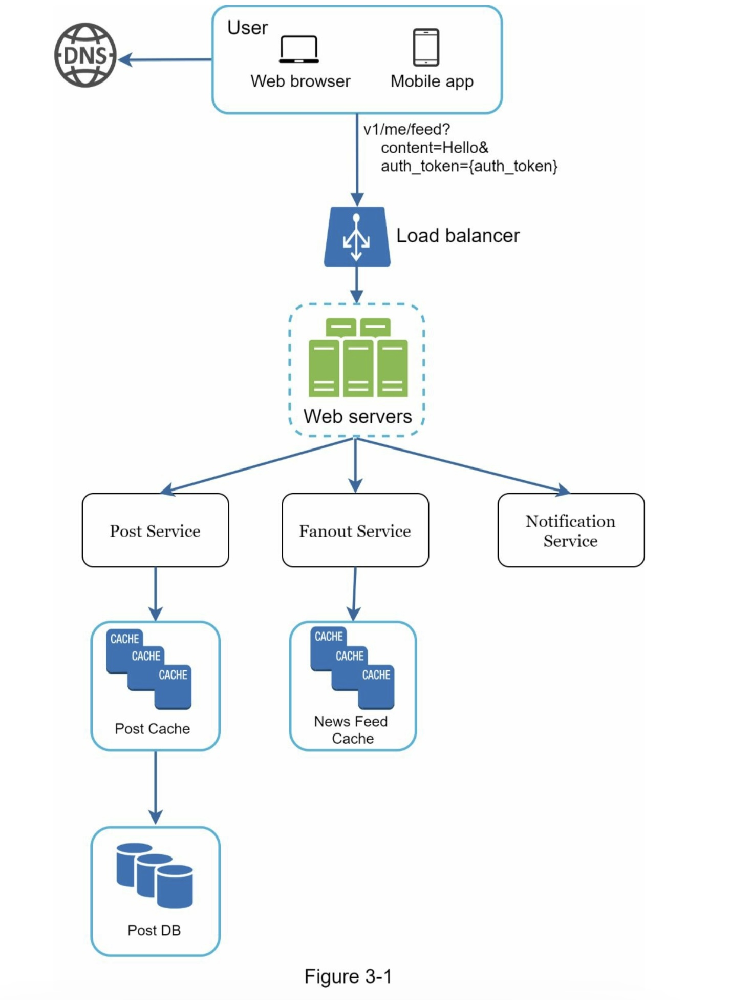
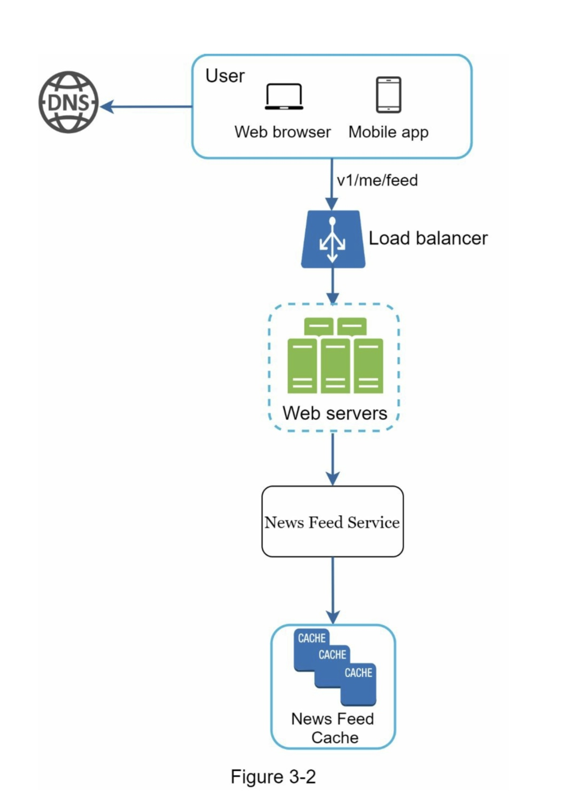
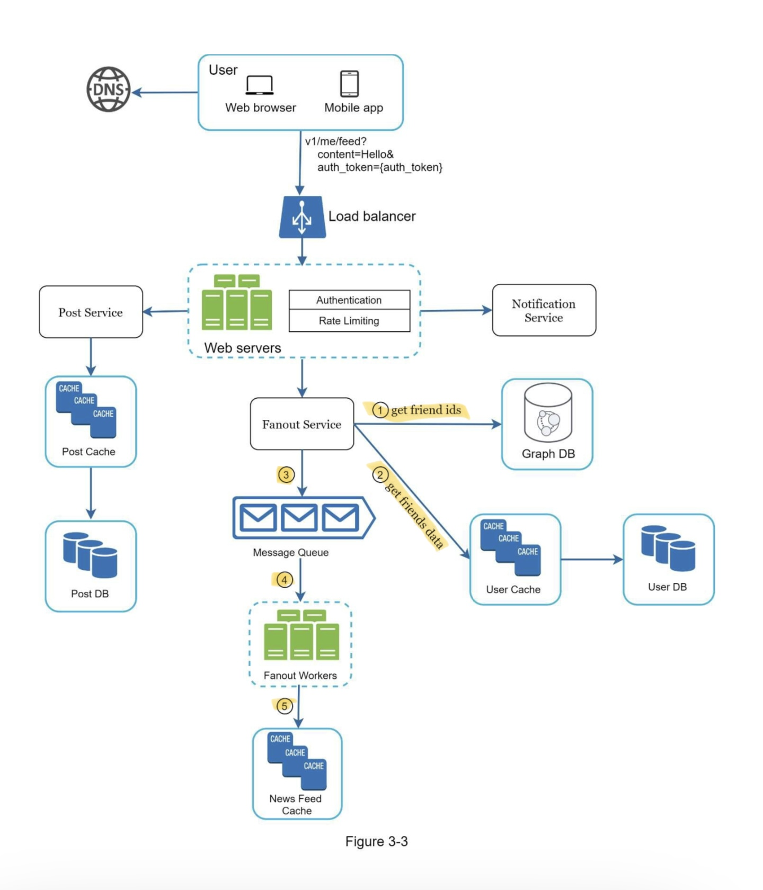
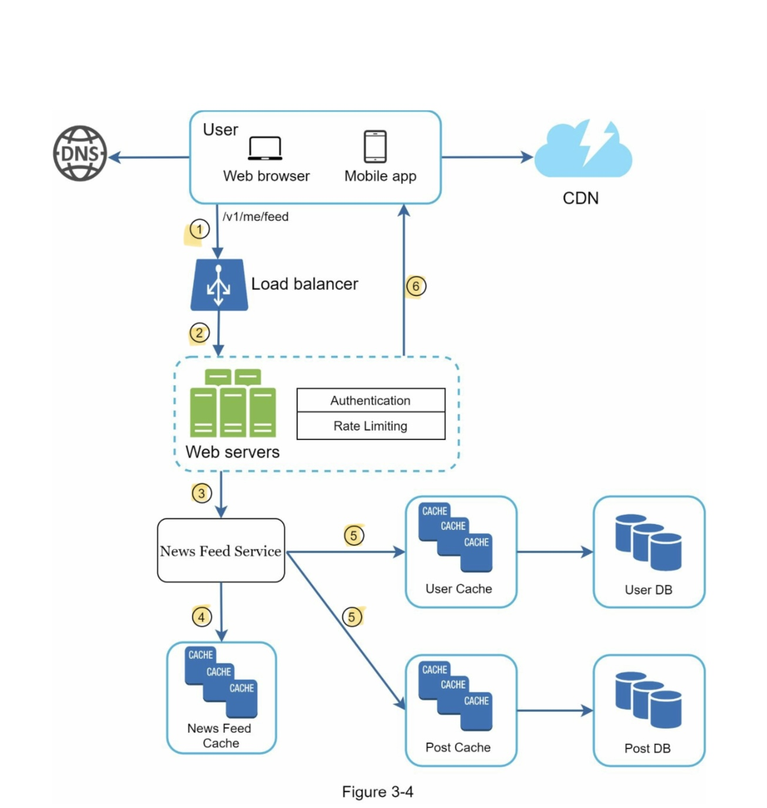

# CHAPTER 3: A FRAMEWORK FOR SYSTEM DESIGN INTERVIEWS

## A 4-step process for effective system design interview

#### Step 1 - Understand the problem and establish design scope

Think deeply and ask questions to clarify requirements and assumptions: make the proper assumptions, and gather all the information needed to build a system.

questions you probably want to ask:
- What specific features are we going to build?
- How many users does the product have?
- How fast does the company anticipate to scale up? What are the anticipated scales in 3 months, 6 months, and a year?
- What is the company’s technology stack? What existing services you might leverage to simplify the design?

#### Step 2 - Propose high-level design and get buy-in

- Come up with an initial blueprint for the design. Ask for feedback.
- Draw box diagrams with key components on the whiteboard or paper. (clients (mobile/web), APIs, web servers, data stores, cache, CDN, message queue, etc)
- Do back-of-the-envelope calculations to evaluate if your blueprint fits the scale constraints.

##### Example

Design a news feed system
High Level:
1. Feed publishing
2. Newsfeed building

#### Step 3 - Design deep dive

<!-- Figure 3-4 -->

#### Step 4 - Wrap up

- discuss potential improvements
- recap to refresh interviewer's memory
- talk about error cases (sever failure, network loss, etc)
- how to monitor operation issues(metrics, error logs, rolling out the system)
- how to handle the next scale curve
- Propose other refinements you need if you had more time

#### Dos
- ask for clarification and understand the requirements 
- communicate with the interviewer
- suggest multiple approaches
- design most critical components first
- Never give up
- ask for a hint if I'm stuck
- ask for feedback early and often

## Time allocation

Step 1 Understand the problem and establish design scope: 3 - 10 minutes 
Step 2 Propose high-level design and get buy-in: 10 - 15 minutes
Step 3 Design deep dive: 10 - 25 minutes
Step 4 Wrap: 3 - 5 minutes
