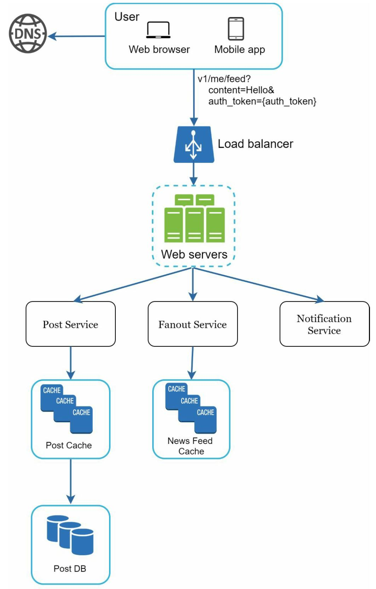
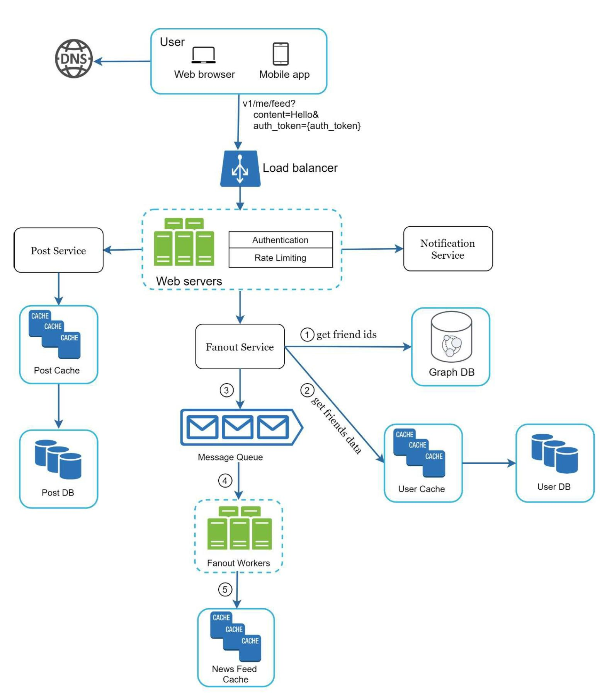
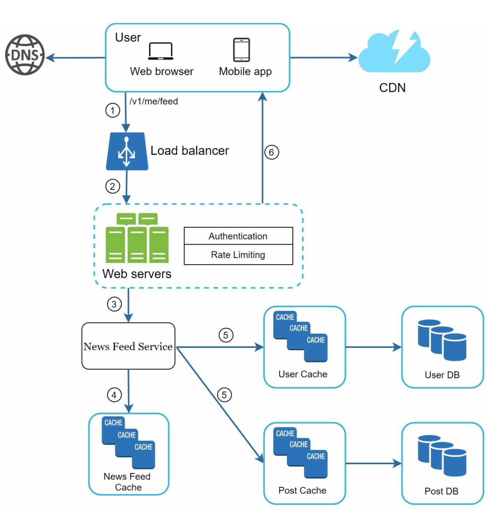

# Chapter 3: A framework for system design interview
- System design interview
  - The questions are ambiguous and seem unreasonably broad
  - The system design interview simulates real-life problem solving where two co-workers collaborate on an ambiguous problem and come up with a solution that meets their goals
  - There is no perfect answer
  - The final design is less important compared to the work you put in the design process
  - Demonstrate your design skill, defend your design choices, and respond to feedback in a constructive manner
- Factors checked in the interview  
  - Person's ability to collaborate, to work under pressure and to resolve ambiguity constructively

## A 4-step process for effective system design interview
- Every system design interview is different 
- A great system design interview is open-ended and there is no one-size-fits-all solution
- However, there are steps and common ground to cover in every system design interview

### Step 1 - Understand the problem and establish design scope
- Do not jump right into a solution, slow down.
  - In a system design interview, giving out an answer quickly without thinking gives you no bonus points.
  - Answering without a thorough understanding of the requirements is a huge red flag as the interview is not a trivia contest
  - Jump into the final design is likely to lead you to design the wrong system
- One of the most important skills as an engineer
  - Ask the right questions
  - Make the proper assumptions
  - Gather all the information needed to build a system
- Questions to help you get started
  - What specific features are we going to build?
  - How many users does the prodct have?
  - How fast done the company anticipate to scale up?  What are the anticipated scales in 3 months, 6 months, and a year?
  - Waht is the compnay's technology stack? What existing services you might leverage to simplify the design?
- Example questions
  - Mobile app? Weeb app? Or both?
  - What are the most important features for the product?
  - Are the contents sorted in reverse chronological order or a particular order?
  - How many friends can a user have?
  - What is the traffic volume?
  - Can feed contain images, videos, or just text?
- It is important to understand the requirements and clarify ambiguities

### Step 2 - Propose high-level design and get buy-in
In this step, we aim to develop a high-level design and reach an agreement with the interviewer on the design. It is great idea to collaborate with the interviewer during the process

- Come up with an initial blueprint for the design.
- Draw box diagrams with key components on the whiteboard or paper
  - Client(mobile/web), APIs, web servers, data stores, cache, CDN, message queue, etc.
- Do back-of-the-envelope calculations to evaluate if your blueprint fits the scale constraints.
  
If possible, go through a few concrete user cases.
- It will help you frame the high-level desigin
- It is also likely that the use cases would help you discover edge cases you have not yet considered.

#### Example
- Design a news feed system
- Not required to understand how the system actually works
- At the high level, the design is divided into two flows
  - feed publihsing : when a user publishes a post, corresponding data is written into cache/database, and the post will be populated into friends' news feed
  - news feed building : the news feed is built by aggregating friends' posts in a reverse chronological order

- High level designs for feed publishing 

- High level designs for news feed building flow

### Step 3 - Design deep dive
- At this step, you and your interviewer should have already achieved the following objectvies
    - Agreed on the overall goals and feature scope
    - Sketched out a high-level blueprint for the overall design
    - Obtained feedback from your interviewer on the high-level design
    - Had some inital ideas about area to focus on in deep dive based on her feedback

- Next questions => Identify and prioritize components in the architecture
    - system performance characteristics - focusing on the bottlenecks and resource estimations
    - Dig into detials of some system component
      - URL shortener: it is interesting to dive into the fash function design that coverts a long URL to a short one
      - Chat system: how to reduce latency and how to support online/offline status 
- Time management
  - Essential as it is easy to get carried away with minute detilas that do not demonstrate your abilities.
  - Try not to get into unnecessary details
    - EdgeRank algorithm is not proper to discuss in time limited interview

#### Example
- Investigate two of the most important use cases (Most will be handled in the Chap 11)
  - Feed publishing
  - News feed retrieval

### Step 4 - Wrap up
- Never say your design is perfect and nothing can be improved.
- It could be useful to give the interviewer a recap of your design
- Error cases are interesting to talk about
- Operation issues are worth mentioning.
- How to handle the next scale curve is also an interesting topic.
- Propose other refinements you need if you had more time 

#### Dos
- Always ask for clarification
- Understand the requirements of the problem
- There is neither the right answer nor the best answer.
- Let the interviewer know what you are thinking
- Sugguest multiple approaches if possible
- Design the most critical components first
- Never give up

#### Don'ts
- Don't be unprepared for typical interview questions.
- Don't jump into a solution without clarifying the requirements and assumptions
- Don't go into too much detail on a single component in the begining.
- If you get stuck, don't hestitate to ask for hints
- Again, communication
- Don't think your interview is done once you give the design