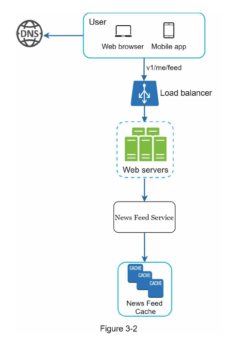
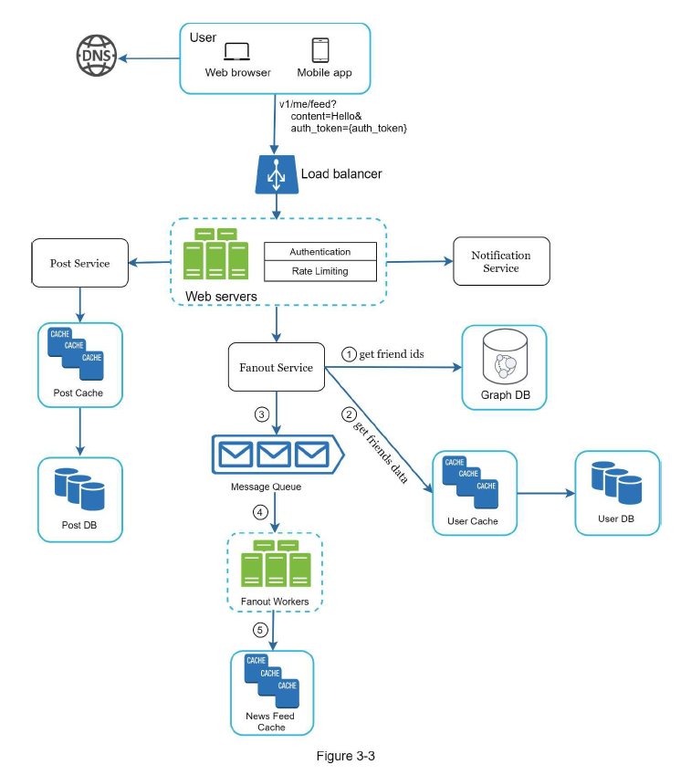
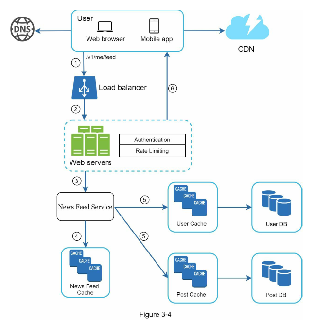

# Chapter 3: A Framework for System Design Interviews

## What should we know?
### 1. **Understanding the Purpose** - ***Why?***
- System design interviews simulate real-world problem-solving scenarios.
- Focus on the design process and decision-making rather than complete solutions.

### 2. **Interviewer's Perspective**
- Assess collaboration, problem-solving under pressure, and ability to resolve ambiguity.
- Valuable skills include asking insightful questions and avoiding red flags like over-engineering.

### 3. **Communication**
- Collaborate effectively and communicate ideas clearly.
- Ask relevant questions, avoid over-engineering, and prioritize simplicity.
- Be open to feedback and adapt design based on input.

  

## A 4-step process for effective system design interview

### 1. Understand the problem and establish design scope(3-10 minutes)
Understand the problem by communicating with stakeholders. Define problem as clear as possible so that we can set design scope better. Never rush on this step and ask interviewers to get more ideas. Here is a list of questions to help you get started:
- What specific features are we going to build?
- How many users does the product have?
- How fast does the company anticipate to scale up? What are the anticipated scales in 3
months, 6 months, and a year?
- What is the company’s technology stack? What existing services you might leverage to
simplify the design?
- Is this a mobile app? Or a web app? Or both?
- What are the most important features for the product?
- Is the news feed sorted in reverse chronological order or a particular order? The
particular order means each post is given a different weight. For instance, posts from your
close friends are more important than posts from a group.
- How many friends can a user have?
- What is the traffic volume?
- Can feed contain images, videos, or just text?

Remember that it would be great if you revisit all the questions you ask in this step and give them the answers for each questions!

  

### 2. Propose high-level design and get buy-in(10-15 minutes)
we aim to develop a high-level design and reach an agreement with the interviewer on the design.
- Blueprint for the design
- High-level design includes clients, APIs, server, database, cache, CDN, message queue etc
- Things should be discussed
  - Use cases, user story
  - API endpoints for light weight application
  - DB design for light weight application
- Things should not be discussed
  - Too much detailed tasks

Remember that give high level design first before diving into all the details!

  

### 3. Design deep dive (10-25 minutes)

- Agreed on the overall goals and feature scope
  - Stay within the scope!
- Sketched out a high-level blueprint for the overall design
  - Better if your design matches what described on the job description!
- Obtained feedback from your interviewer on the high-level design
  - Do not off track from their feedback!
- Had some initial ideas about areas to focus on in deep dive based on their feedback
  - Give the answers what they want to hear!

#### Tech stacks? Why?
- Database
  - SQL / No SQL
  - Back up - when and where?
  - Cache
- Server
  - Cloud / Data center
    - AWS / Google Cloud / Azure
  - Scale out(or up), Service Level Agreements (SLAs)
  - Mornitoring / Logging
- Frontend / Backend
  - Languages
  - Framework(Spring, .NET, Django, React)
  - Error handling
- Network - Traffic handle
  - CDN
  - Load balancer
  - API Gateway, microservice
  - Message queue
- Security
  - Authentication 
  - Authorization
  - SSL
  - CORS policy

Remember that we have so many things to talk in this step. Therefore, Better to allocate right amount of time for each topics!

  

### 4. Wrap up (3-5 minutes)
#### **Dos:**
- Ask for clarification
- Understand requirements
- Communicate effectively
- Suggest multiple approaches
- Seek feedback

#### **Don'ts:**
- Jump into solutions without clarifying requirements
- Think silently
- Focus too much on a single component initially
- Think the interview is done until feedback is received