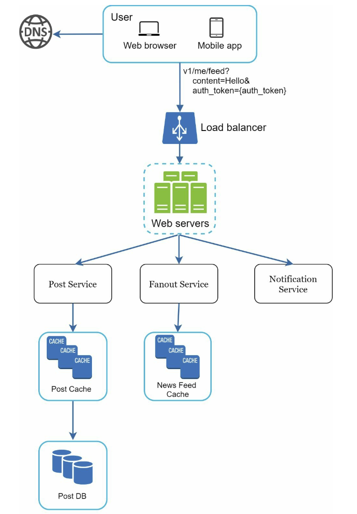
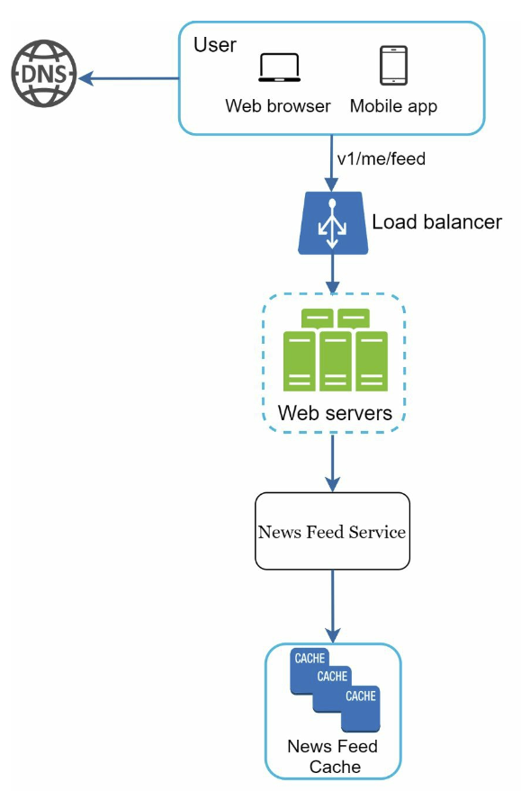
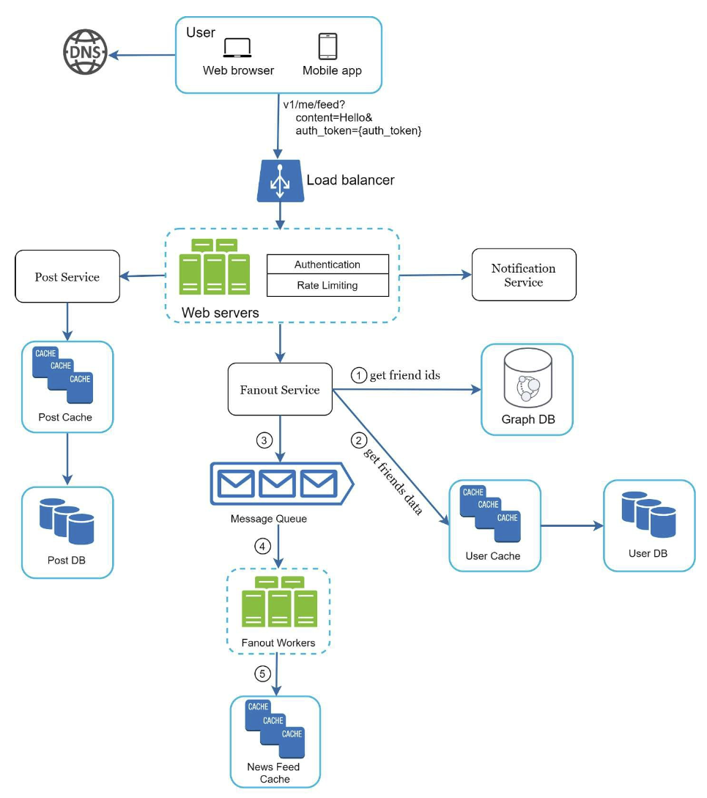
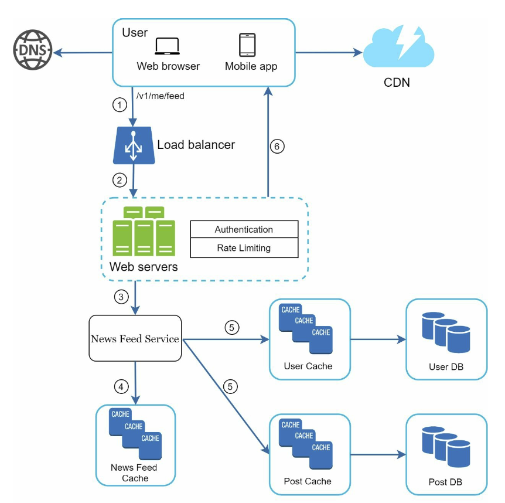

# Chapter 3. A framework for system design interviews

No one expects us to design a popular product, real-world system in an hour. 

The system design interview simulates real-life problem solving where two co-workers collaborate on an ambiguous problem and come up with a solution that meets their goals. The problem is open-ended, and there is no perfect answer. The final design is less important compared to the work we put in the design process. This allows us to demonstrate our design skill, defend our design choices, and respond to feedback in a constructive manner.

An effective system design interview gives strong signals about a person's ability to collaborate, to work under pressure, and to resolve ambiguity constructively. The ability to ask good questions is also an essential skill, and many interviewers specifically look for this skill.

Red flags: Over-engineering is a real disease of many engineers as they delight in design purity and ignore tradeoffs. Other red flags include narrow mindedness, stubbornness, etc.

### 1) A 4-step process for effective system design interview
A great system design interview is open-ended and there is no one-size-fits-all solution. However, there are steps and common ground to cover in every system design interview.

#### Step 1 - Understand the Problem and establish design scope
In a system design interview, answering without a thorough understanding of the requirements is a huge red flag as the interview is not a trivia contest, there is no right answer.

**Slow down, think deeply and ask questions to clarify requirements and assumptions.**

Jumping into the final design without asking questions is likely to lead us to design wrong system. **Ask the right questions, make the proper assumptions, and gather all the information needed to build a system.**

**If interviewer asks us to make our assumptions as an answer to our question, write down our assumptions since it might be needed later**

List of questions to help us to get started:
- What specific features are we going to build?
- How many users does the product have?
- How fast does the company anticipate to scale up? What are the anticipated scales in 3 months, 6 months, and a year?
- What is the company's technology stack? What existing services you might leverage to simplify the design?

>Example

We are asked to design a news feed system.

**Candidate:** Is this a mobile app? Or a web app? Or both?
**Interviewer:**: Both.
**C:** What are the most important features for the product?
**I:** Ability to make a post and see friends' news feed
**C:** Is the news fee sorted in reverse chronological order or a particular order? The particular order means each post is given a different weight. For instance, posts from your clos friends are more important than posts from a gropu.
**I:** To keep things simple, let us assume the feed is sorted by reverse chronological order.
**C:** How many friends can a user have?
**I:** 5000
**C:** What is the traffic volume?
**I:** 10 million daily active users(DAU)
**C:** Can feed contain images, videos, or just text?
**I:** It can contain media files, including both images and videos

#### Step 2 - Propose high-level design and get buy-in

Aim to develop a high-level design and reach an agreement with the interviewer on the design by collaborating with the interviewer.
- Come up with an initial blueprint for the design. Ask for feedback. Treat interviewer as a teammate and work together
- Draw box diagrams with key components on the whiteboard or paper. (e.g. clients, APIs, web servers, data stores, cache, CDN, message queue, etc)
- Do back-of-the-envelope calculations to evaluate if the blueprint fits the scale constraints. Communicate with interviewer if back-of-the-envelope is necessary before diving into it
- Go through a few concrete use cases. It will help us frame the high-level design and discover edge cases we have not yet considered
- Including API endpoints and DB schema here depends on the problem. For large design problems like "Design Google search engine", it's too low level. For a problem like designing the backend for multi-player poker game, this is a fair game. **Communicate with interviewer!**

> Example

*Design a news feed system*

At the high level, the design is divided into two flows; ¹feed publishing and ²news feed building
- ¹Feed publishing: when a user publishes a post, corresponding data is written into cache/database, and the post will be populated into friends' news feed
- ²News feed building: the news feed is build by aggregating friends' posts in a reverse chronological order

> Feed publishing

> News feed building

#### Step 3 - Design deep dive

At this step, we should have already achieved the followings with our interviewer:
- Agree on the overall goals and feature scope
- Sketched out a high-level blueprint for the overall design
- Obtained feedback from our interviewer on the high-level design
- Had some initial ideas about areas to focus on in deep dive based on her feedback

**We should work with the interviewer to identify and prioritize components in the architecture.** Sometimes, the interviewer may give off hints that she likes focusing on high-level design. Sometimes, for a senior candidate interview, the discussion could be on the system performance characteristics, likely focusing on the bottlenecks and resource components. In most cases, the interviewer may want us to dig into details of some system components. 
e.g. 
- URL shortener -> hash function design that converts a long URL to a short one
- Chat system -> how to reduce latency and how to support online/offline status are two interesting topics

Time management is essential as it is to get carried away with minute details that do not demonstrate our abilities. **Try not to get into unnecessary details.**
e.g.
- Talking about EdgeRank algorithm of Facebook feed raking in detail is not ideal during a system design interview as this takes much precious time and does not prove your ability in designing a scalable system

> Example

At this point, we have discussed the high-level design for a news feed system, and the interviewer is happy with our proposal. Next two important use cases we investigate are:
1. Feed publishing
2. News feed retrieval

> Feed publishing

> News feed retrieval

#### Step 4 - Wrap up

The interviewer might ask us a few follow-up questions or to discuss other additional points. A few directions to follow:
- The interviewer might want us to identify the system bottlenecks and discuss potential improvements. **Never say our design is perfect and nothing can be improved.** This is a great opportunity to show our critical thinking and leave a good final impression
- Give the interviewer a **recap of our design**. This is particularly important if we suggested a few solutions. Refreshing the interviewer's memory can be helpful after a long session
- **Error cases**(server failure, network loss, etc) are interesting to talk about
- **Operation issues** are worth mentioning. How do we monitor metrics and error logs?
- How to handle **the next scale curve**? (e.g. 1 million users -> 10 million users)
- **Propose other refinements** we need if we had more time

> A list of the Dos and Don'ts

##### Dos
- Always ask for clarification. Do not assume our assumption is correct
- Understand the requirements of the problem
- There is neither the right answer nor the best answer
- Communicate with interviewer. Let them know what we are thinking
- Suggest multiple approaches if possible
- Once we agree with our interviewer on the blueprint, go into details on each components. Design the most critical components first
- Bounce ideas off the interviewer
- Never give up

##### Don'ts
- Don't be unprepared for typical interview questions
- Don't jump into a solution without clarifying the requirements and assumptions
- DOn't go into too much detail on a single component in the beginning. Give the high-level design first then drills down
- If you get stuck, don't hesitate to ask for hints
- Don't think in silence. Communicate!
- Don't think our interview is done once we give design. Ask for feedback early and often

##### Time allocation on each step
A very rough guide on distributing our time in a 45-minute interview session:
- Step 1. Understand the problem and establish design scope: 3 - 10 minutes
- Step 2. Propose high-level design and get buy-in: 10 - 15 minutes
- Step 3. Design deep dive: 10 - 25 minutes
- Step 4. Wrap: 3 - 5 minutes
