# CHAPTER 4: Design a rate limiter
>  If the API request count exceeds the threshold defined by the rate limiter, all the excess calls are blocked. 
- Here are a few examples:
  - A user can write no more than 2 posts per second.
  - You can create a maximum of 10 accounts per day from the same IP address.
  - You can claim rewards no more than 5 times per week from the same device.

> The benefits of using an API rate limiter
- Prevent resource starvation caused by Denial of Service (DoS) attack
- Reduce cost
- Prevent servers from being overloaded

## Step 1 - Understand the problem and establish design scope
### Questions
- A client-side rate limiter or a server-side API rate limiter?
- Based on IP, the user ID, or other properties?
- What is the scale of the system? A startup or a big company with a large user base?
- Will the system work in a distributed environment? 
- A separate service or should it be implemented in application code?
- Do we need to inform users who are throttled? 

### Requirements
- Accurately limit excessive requests.
- Low latency. The rate limiter should not slow down HTTP response time.
- Use as little memory as possible.
- Distributed rate limiting. The rate limiter can be shared across multiple servers or processes.
- Exception handling. Show clear exceptions to users when their requests are throttled.
- High fault tolerance. If there are any problems with the rate limiter (for example, a cache server goes offline), it does not affect the entire system.

## Step 2 - Propose high-level design and get buy-in 
### Where to put the rate limiter? Client or Server-side?
- Client-side implementation. -> An unreliable place to enforce rate limiting. 
- Server-side implementation.
  - Option 1
  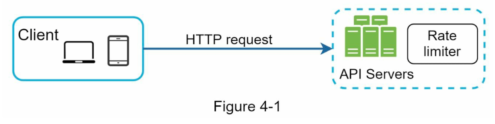
  - Option 2 (API gateway in microservice architecture)
  
    - API gateway is a fully managed service that supports 
      - rate limiting, SSL termination, authentication, IP whitelisting, servicing static content, etc.
        - SSL(Secure Sockets Layer) VS TSL(Transport Layer Security)
          - TLS is the upgraded version of SSL that fixes existing SSL vulnerabilities. 


- Where should be it be implemented?
  - It depends on your company’s current technology stack, engineering resources, priorities, goals, etc

  1. Evaluate your current technology stack, such as programming language, cache service, etc.
  2. Identify the rate limiting algorithm that fits your business needs. 
     - Implement everything on the server-side or a third-party gateway.
  3.  Already used microservice architecture and included an API gateway?
     - Add a rate limiter to the API gateway.
  4. If you do not have enough engineering resources to implement a rate limiter? 
     - a commercial API gateway is a better option.

### Algorithms for rate limiting
1. Token bucket algorithm
   - The token bucket size is 3 and the refill rate is 3 per a minute
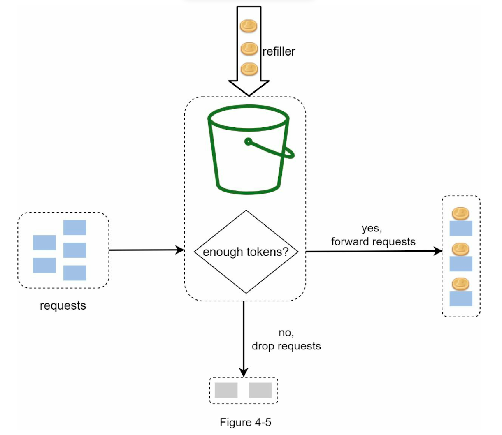
   - Pro
     - The algorithm is easy to implement.
     - Memory efficient.
     - Token bucket allows a burst of traffic for short periods. A request can go through as long as there are tokens left.
   - Cons
     - Two parameters in the algorithm are bucket size and token refill rate. 
       - However, it might be challenging to tune them properly. 

2. Leaking bucket algorithm
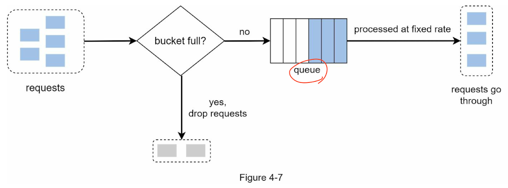
  - Pros:
    - Memory efficient given the limited queue size.
    - Requests are processed at a fixed rate therefore it is suitable for use cases that a stable outflow rate is needed.
  - Cons:
    - A burst of traffic fills up the queue with old requests, and if they are not processed in time, recent requests will be rate limited.
    - There are two parameters in the algorithm. It might not be easy to tune them properly.

3. Fixed window counter algorithm
   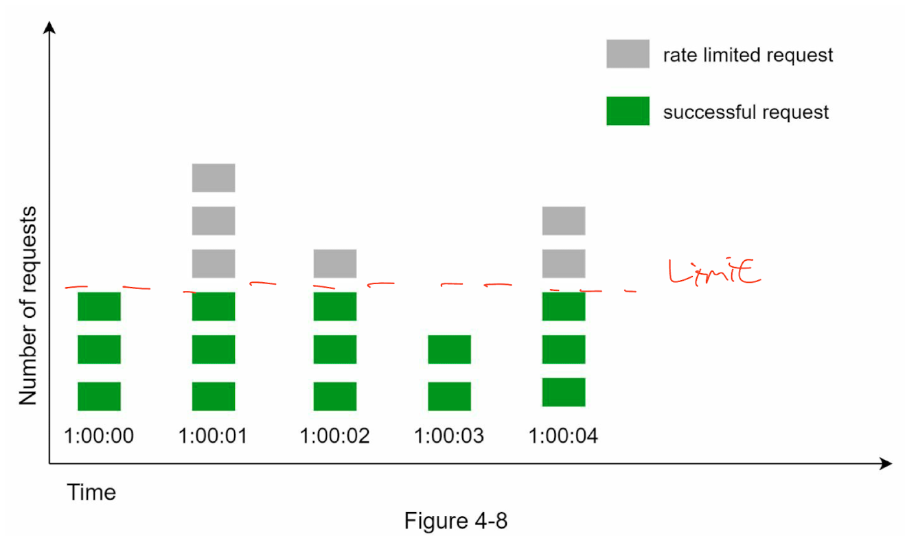
   - A major problem
   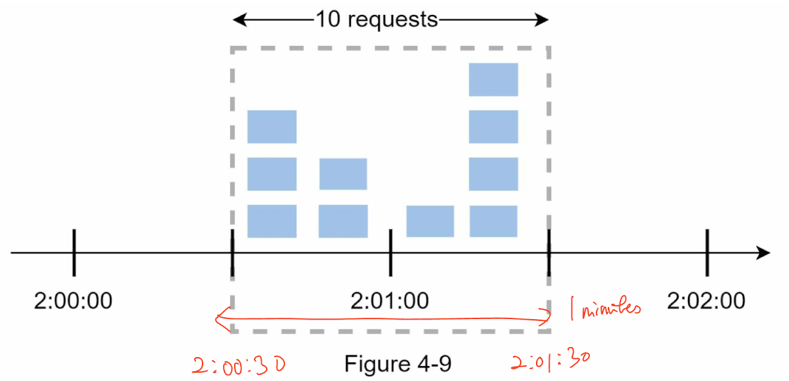
     - Pros:
        - Memory efficient.
        - Easy to understand. 
        - Resetting available quota at the end of a unit time window fits certain use cases.
     - Cons:
        - Spike in traffic at the edges of a window could cause more requests than the allowed quota to go through.

4. Sliding window log algorithm (logs keep in cache)
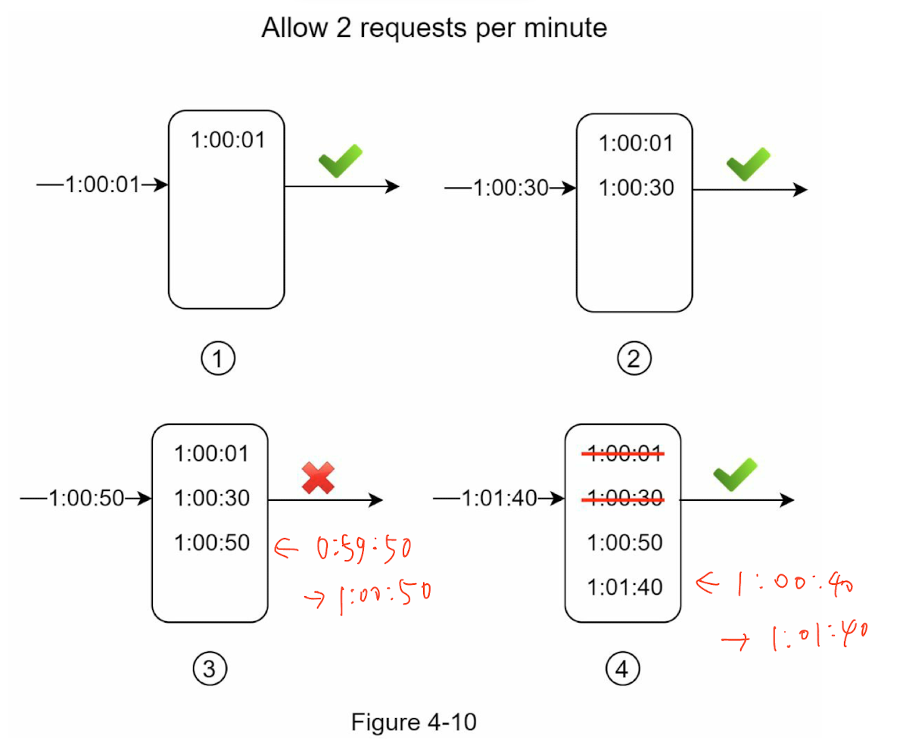
   - Pros:
     - Rate limiting implemented by this algorithm is very accurate. In any rolling window, requests will not exceed the rate limit.
   - Cons:
     - The algorithm consumes a lot of memory because even if a request is rejected, its timestamp might still be stored in memory.

5. Sliding window counter algorithm
   - Requests in current window + requests in the previous window * overlap percentage of the rolling window and previous window
   - 3 + 5 * 0.7% = 6.5 request
   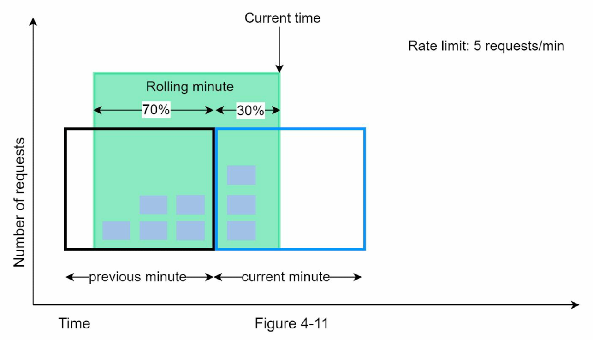
   - Pros
     - It smooths out spikes in traffic because the rate is based on the average rate of the previous window. 
     - Memory efficient.
   - Cons
     - It only works for not-so-strict look back window. 
       - It is an approximation of the actual rate because it assumes requests in the previous window are evenly distributed. 
       - However, this problem may not be as bad as it seems. 
       - According to experiments done by Cloudflare, only 0.003% of requests are wrongly allowed or rate limited among 400 million requests.

### High-level architecture
- DB: In-memory cache is chosen because it is fast and supports time-based expiration strategy
- Commands
  - INCR: It increases the stored counter by 1. 
  - EXPIRE: It sets a timeout for the counter. If the timeout expires, the counter is automatically deleted.
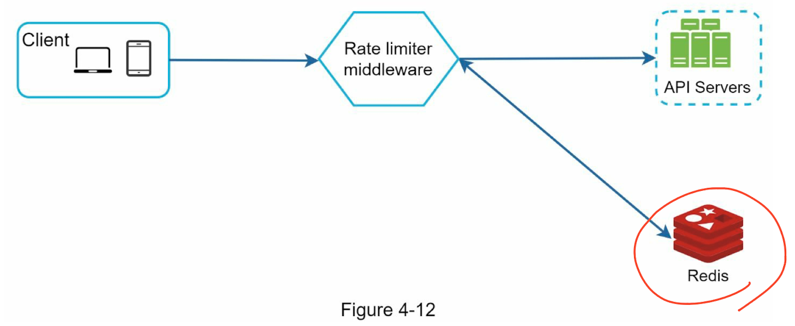

## Step 3 - Design deep dive 
### Questions
  - How are rate limiting rules created? Where are the rules stored? -> on disk
    - Rate Limiting rules
  ```
    domain: messaging 
    descriptors:
        - key: message_type     
          Value: marketing     
          rate_limit:       
            unit: day       
            requests_per_unit: 5
  ```
  ```
    domain: auth 
    descriptors:
        - key: auth_type     
          Value: login     
          rate_limit:       
            unit: minute       
            requests_per_unit: 5
  ```
  - How to handle requests that are rate limited?
    - Exceeding the rate limit -> HTTP response code 429(Too many requests) 
    - Or enqueue the the retelimited requests to be processed later
  - Rate limiter headers
    - X-Ratelimit-Remaining: The remaining number of allowed requests within the window. 
    - X-Ratelimit-Limit: It indicates how many calls the client can make per time window. 
    - X-Ratelimit-Retry-After: The number of seconds to wait until you can make a request again without being throttled.

### Detailed design
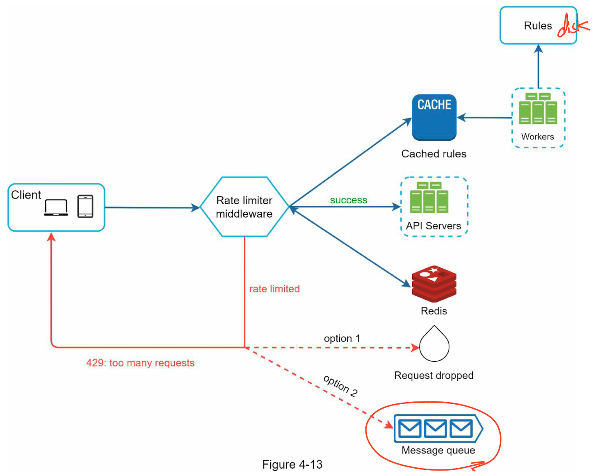

### Rate limiter in a distributed environment
- Race condition
  - Problem
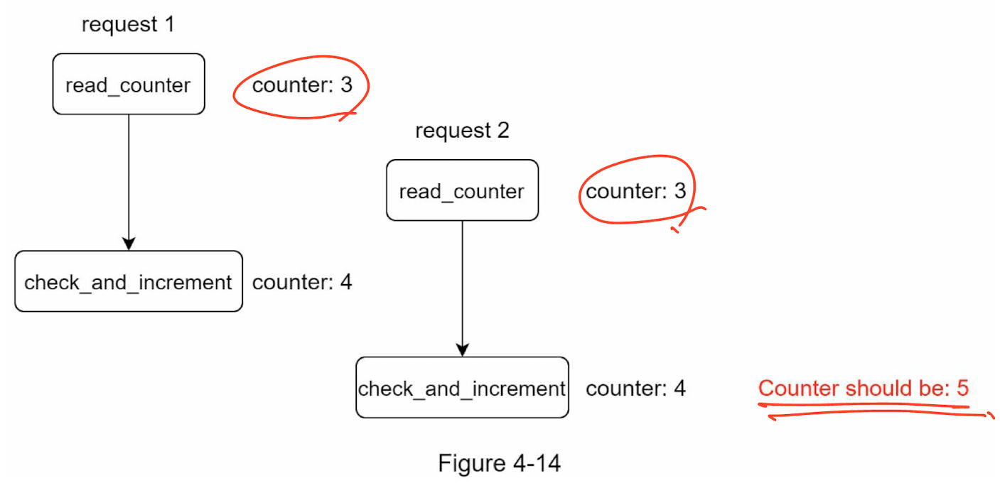
  - Solution
    - Lock? -> Lua script and sorted sets data structure in Redis 
      - https://medium.com/@ramachandrankrish/rate-limiting-in-redis-using-lua-script-61774e74e270#:~:text=Lua%20scripts%20are%20executed%20atomically,Redis%20commands%20INCR%20and%20EXPIRE.
- Synchronization issue
  - Problem
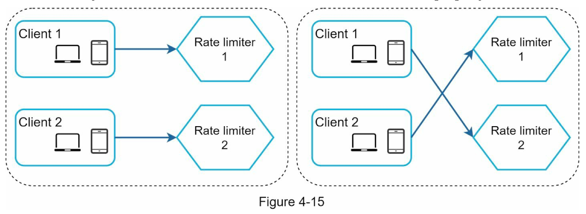
  - Solution
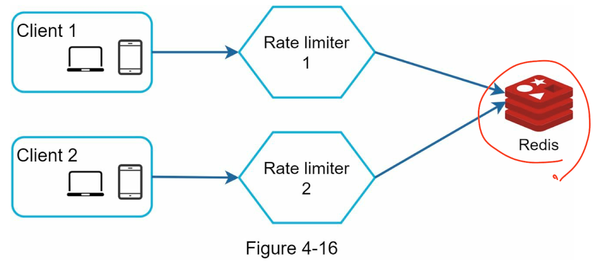

### Performance optimization
1. Multi-data center setup
2. Synchronize data with an eventual consistency model.

### Monitoring
1. The rate limiting algorithm is effective.
2. The rate limiting rules are effective.

## Step 4 - Wrap up
- In this chapter, we discussed different algorithms of rate limiting and their pros/cons. 
- Then, we discussed the system architecture, 
  - rate limiter in a distributed environment, 
  - performance optimization and monitoring. 
- Similar to any system design interview questions, there are additional talking points you can mention if time allows:
  - Hard vs soft rate limiting.
    - Hard: The number of requests cannot exceed the threshold. 
    - Soft:  Requests can exceed the threshold for a short period.
  - Rate limiting at different levels.
    - HTTP: layer 7
    - IP: layer 3
  - Avoid being rate limited. Design your client with best practices:
    - Use client cache to avoid making frequent API calls. 
    - Understand the limit and do not send too many requests in a short time frame. 
    - Include code to catch exceptions or errors so your client can gracefully recover from exceptions. 
    - Add sufficient back off time to retry logic.