# Chapter 4. Design a rate limiter

## What is a rate limiter?
* In a **network system**: Controls the rate of traffic sent by a client or a service.
* In a **HTTP system**: Limits the number of client request allowed to be sent over a specified period
    - Prevent Denial of Service (DoS) attack.
    - Reduce cost.
    - Prevent servers from being overloaded.

## 4-step process for effective system design interview
1. Understand the problem and establish design scope
2. Propose high-level design and get buy-in
3. Design deep dive
4. Wrap up

### 1. Understand the problem and establish design scope
- Questions
1. What kind of rate limiter are we going to design? Is a client-side rate limiter or server-side API rate limiter?
2. Deos ther rate limiter throttle API requests based on IP, the user ID, or other properties?
3. What is the scale of the system?
4. Will the system work in a distibuted environment?
5. Do we need to inform users who are throttled?

### 2. Propose high-level design and get buy-in
1. Where do we need to put a rate limiter given requirments?
2. Which algorithm is suitable for the company given busines requirements?

#### 2-1. Things to consider
A. Evalute your current technology stack: Programming language and cache service
B. Identify the rate limiting algorithm that fits your business needs
    - server side vs middleware (API gateway)
C. Microservice architecture
D. Custom rate limiter

#### 2-2. Where to put a rate limiter
* **A rate limiter at client-side**: Clien is an unreliable place to enforce rate limiter because client requests can essily be forged by malicious actors. Moreover, we might not have control over the client implementation
* **A rate limiter at server-side**\
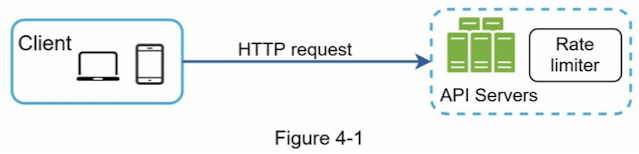
* **A rate limiter between client and server as a middleware**\
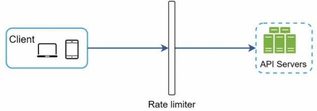

* Example
- Assumption: The API only allows two requests per second.\
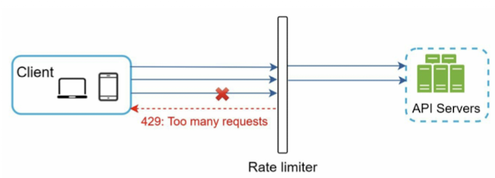

* API gateway
- Fully managed server that supports rate limiting, SSL termination, authenticatio, IP whitelisting, servicing static content.

#### Algorithms for rate limiting
A. Token bucket
B. Leaking bucket
C. Fixed window conunter
D. Sliding window log
E. Sliding window counter


##### Token bucket algorithm
- Characteristics
    * Burst allowance
    * Flexibility
- Parameters:
    * Bucket size: the maximum number of tokens allowed in the bucket
    * Refil rate: number of tokens put into the bucket every second
- Comanies that use this algorithm: Amazon and stripe
- Flow\
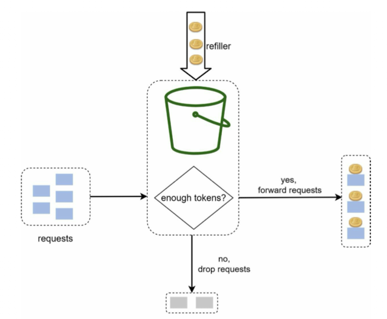\
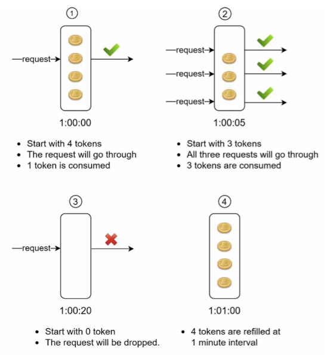

- Example (the token bucket size is 4, and the refill rate is 4 per 1 minute)
    * If a user is allowed to make 1 post per second, add 150 friend per day and like 5 posts per second
    then **3 buckets** are required for each user
    * If we need to throttle requests based on IP addresses, each IP address requrires a bucket.
    * If the system allows a maximum of 10,000 requests per second, it makes sense to have a global bucket shared by all requests.

- Pros:
    * Easy to implement
    * Memory efficient
    * **Token bucket allows a burst of traffic for short periods. A request can go through as long as there are tokens left.**
- Cons:
    * Set a proper configuration for a bucket size and refil rate.

##### Leaking bucket algorithm (Leaky bucket algorithm)
- Characteristics
    * Smooth traffic
    * Overflow
- Parameters:
    * Bucket size: It is equal to the queue size, The queue holds the requests to be process at a fixed rate.
    * Outflow rate: It defines how many requests can be process at a fixed rate, usually in seconds.
- Comanies that use this algorithm: Shopify and ecommerce compnay
- Flow\
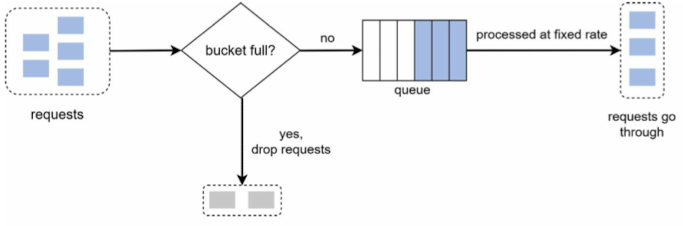\

- Pros:
    * Memory efficient given the limited queue size.
    * Requests are process at a fixed rate therefore it is suitable for use cases that a stable outflow rate is needed.
- Cons:
    * **A burst of traffic fills up the queue with old requests, and if they are not processed in time, recent request will b e rate limited.**
    * Set a proper configuration for a bucket size and Outflow rate.

##### Fixed window counter algorithm
: The fixed window counter divides time into equal intervals, and each interval has its own counter. When the counter reaches a certain threshoold, the request is denied execution and either needs to wait or retry in the next time interval.

- Flow\
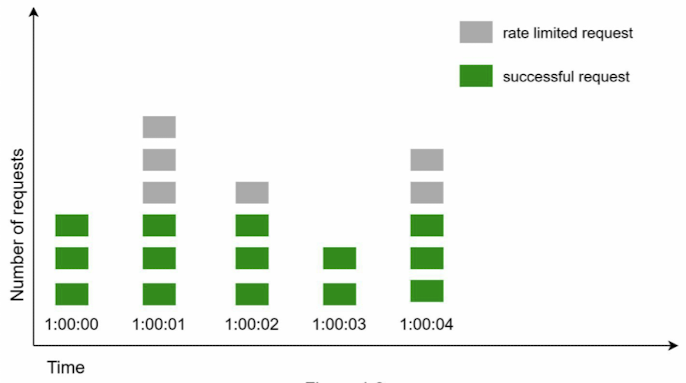\

- Pros:
    * Memory efficient
    * Easy to understand
    * Resetting available quota at the end of a unit time window fits certain use cases.
- Cons:
    * Spike in traffic at the edges of a window could cause more requesets than the allowed quota to go through
    * 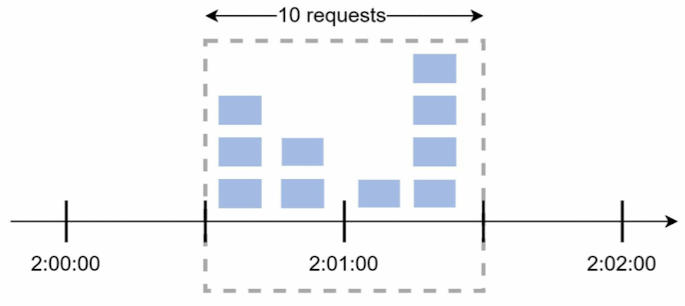\

##### Sliding window log algorithm
: It fixed the issues the major problem from the fixed window counter algorithm.

- Example (Allow two requests per minute)\
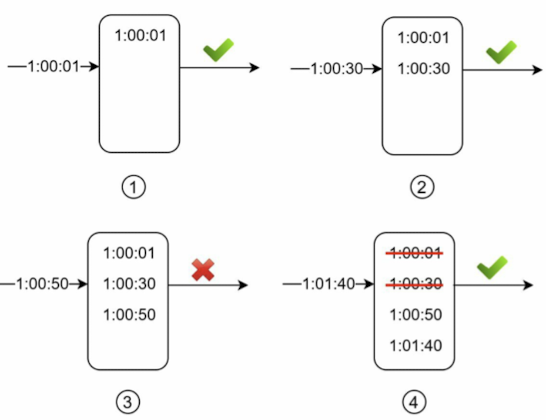\

- Pros:
    * Rate limiting implemented by this algorithm is very accurate. In any rolling window, requests will not exceed the rate limit.
- Cons:
    * Memory inefficient.

##### Sliding window counter algorithm
: The sliding window counter algorithm is a hybrid approache that combines the fixed window counter and sliding window log algorithm.

- Example (Allow maximum of 7 requests per minute)\
    * 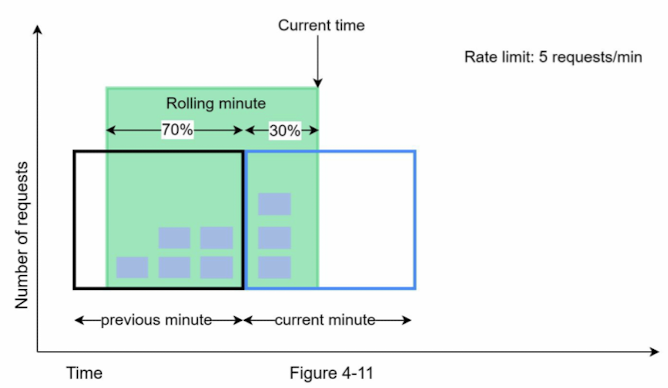\
    * Formula: requests in current window + requests in the previous window * overlap percentage of the rolling window and previous window: 3 + 5 * 0.7% = 6.5 requests (Depending on the use case, the number can either be rounded up or down)

- Pros:
    * It smooths out spikes in traffic because the rate is based on the average rate of the previous window.
    * Memory efficient.
- Cons:
    * It only works for not-so-stric look back window. It is an approximation of the actual rate because it assumes requests in the previous window are evenly distributed. However, this problem may not be as bad as it seems.

#### High-level architecture
- Where shall we store counters? Using the database is not a good idea due to slowness of disk access. In-memory cache is chosen because it is fast and supports time-based expiration strategy. 
- 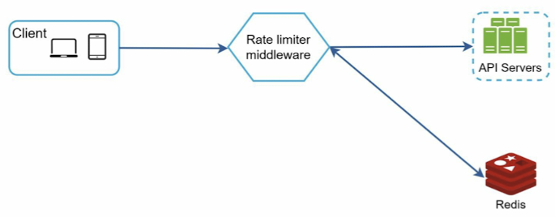\
- Redis: Is is an in-memory store that offecr two commands
    - INCR: It increases the stored counter by 1.
    - EXPIRE: It sets a timeout for the counter. If the timeout expires, the counter is automatically deleted.

### 3. Design deep dive

- Rate limiting rules example
    * Lyft
    ```
    domain: messaging
    desciptors:
        - key: message_type
          Value: marketing
          rate_limit:
            unut: day
            requests_per_unit: 5
    ```

#### Exceeding the rate limit
##### Rate limiter headers
- X-Ratelimit-Remaining: The remaining number of allowed requests within the window.
- X-Ratelimit-Limit: It indicates how many calls the client can make per time window.
- X-Ratelimit-Retry-After: The number of seconds to wait until you can make a request again without being throttled.

#### Detailed design
- \
- Rules are stored on the disk. Workers frequently pulls rules from the disk and store them in the cache.
- When a client sends a request to the server, the request is sent to the rate limiter middleware first.
- Rate limiter middleware loads rules from the cache. It fetches counter and last request timestamp from Redis cache.

#### Rate limiter in a distributed environment
##### Race condition
- Read the counter value from Redis
- Check if (counter + 1) exceeds the threshold.
- If not, increment the counter value by 1 in Redis.
- 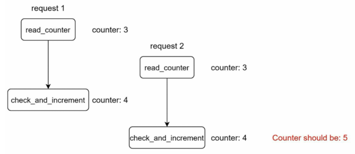
- Using locaks are the most obvious solution for solving race condition. However, locks will slow down the system.
- or Lua script and sorted sets data structure in Redis

##### Synchronization issue
- 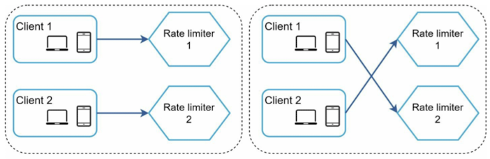

- Solutions:
    * Sticky sessions
    * Centralized data store like Redis
    - 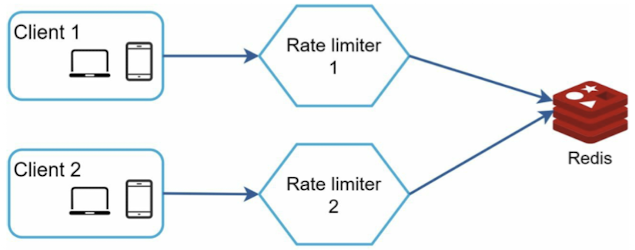

#### Performance optimization
1. Multi-data center setup is crucial for a rate limiter because latency is high for users located far away from the data center. Traffic is automatically routed to the closest edge server to reduce latency.
2. Synchronize data with an eventual consistency model.

#### Monitoring
: To anlayize the rate limiter algorithm and rule is effective.

### 4. Wrap up
#### Extra points
##### Hard vs soft rate limiting
    - Hard: The number of requests cannot exceed the threshold.
    - Soft: Requests can exceed the threshold for a short period.
##### Rate limiting at different levels (OSI models)
##### Avoid being rate limited as a client perspective
* Use client cache to avoid making frequent API calls.
* Understand the limit and do not send too many requests in a short time frame.
* Include code to catch exceptions or erros so your client can gracefully recover from exceptions.
* Add sufficient back off time to retry logic.
