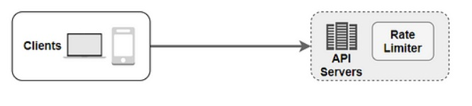
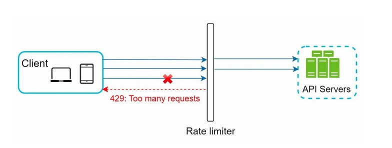
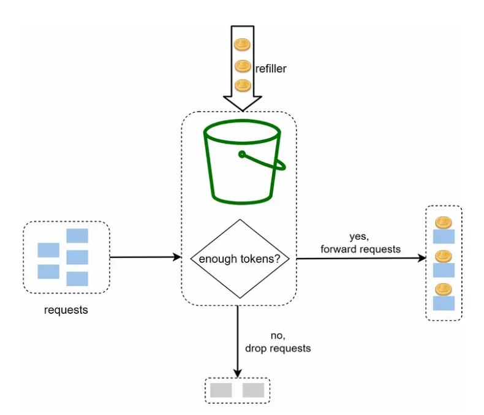
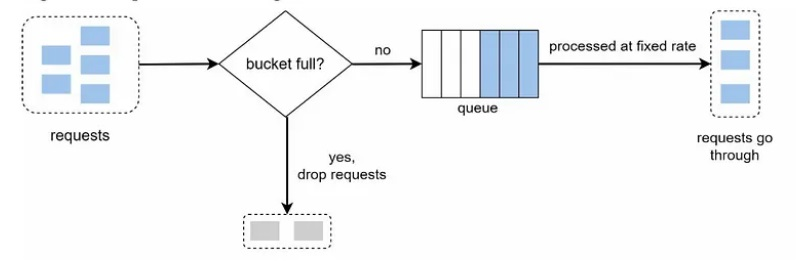
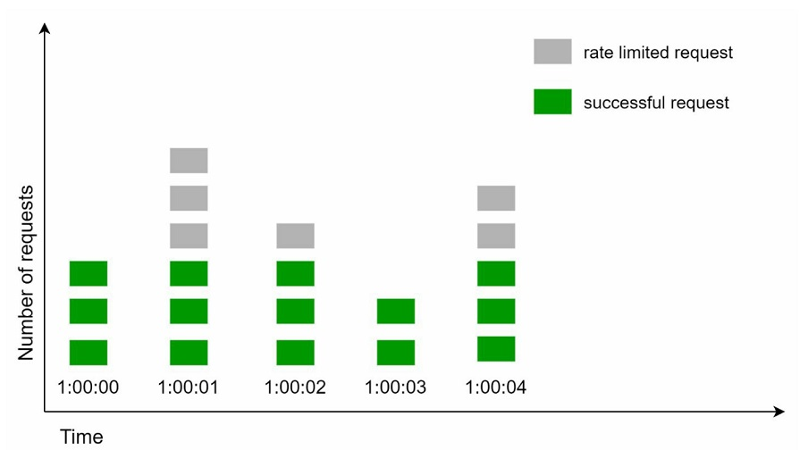
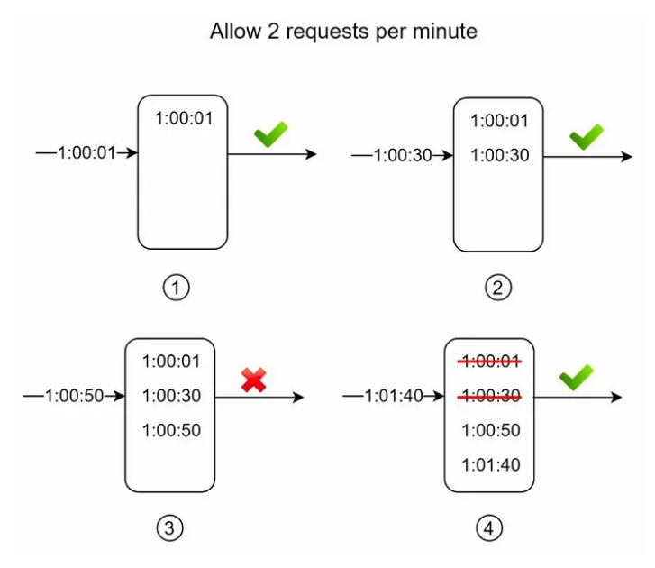
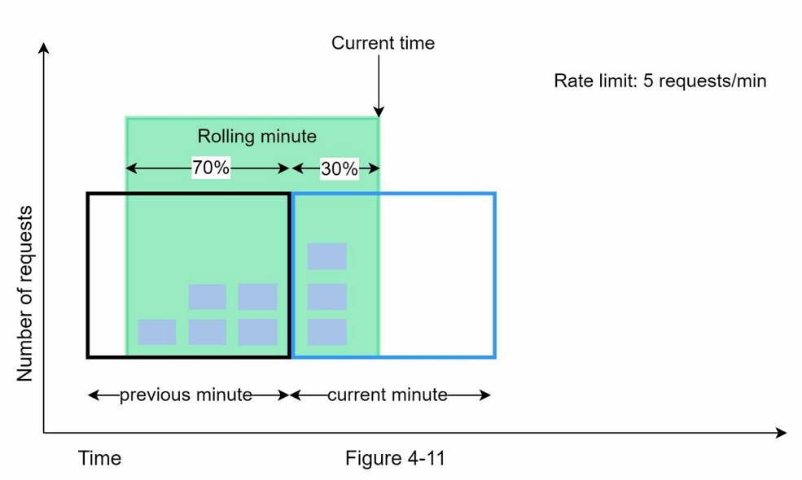
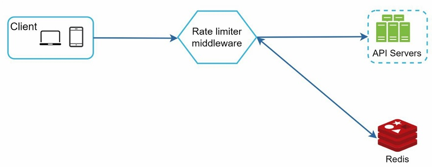
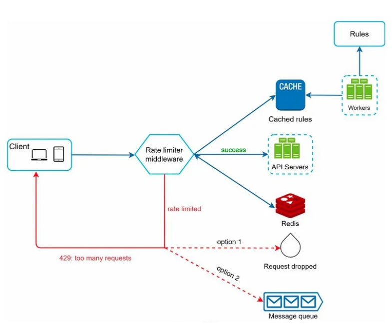
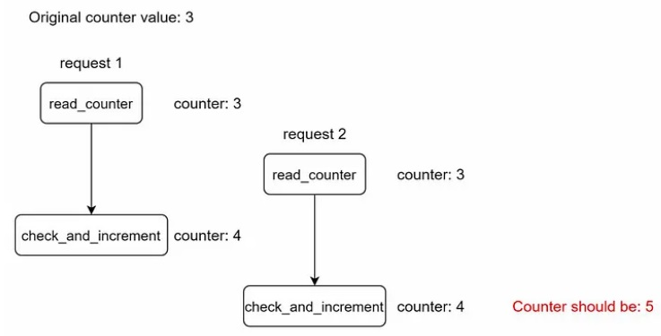

# 04. Design a rate limiter

In a network system, a rate limiter is used to control **the rate of traffic sent by a client or a service**. In the HTTP world, a rate limiter limits **the number of client requests allowed to be sent over a specified period**. If the API request count exceeds the threshold defined by the rate limiter, all the excess calls are blocked.

- The benefits of using an API rate limiter
  - Prevent resource starvation caused by Denial of Service (DoS) attack.
  - Reduce cost : Limiting excess requests means fewer servers and allocating more resources to high priority APIs. Rate limiting is extremely important for companies that use paid third party APIs.
  - Prevent servers from being overloaded. To reduce server load, a rate limiter is used to filter out excess requests caused by bots or users' misbehavior.

## Step 1 - Understand the problem and establish design scope

Rate limiting can be implemented using different algorithms, each with its pros and cons. The interactions between an interviewer and a candidate help to clarify the type of rate limiters we are trying to build.

## Step 2 - Propose high-level design and get buy-in

Let us keep things simple and use a basic client and server model for communication.

#### Where to put the rate limiter?

Intuitively, you can implement a rate limiter at either the client or server-side

- Client-side implementation : Generally speaking, client is an unreliable place to enforce rate limiting.

- Server-side implementation : Figure 4-1 shows a rate limiter that is placed on the server-side.



Instead of putting a rate limiter at the API servers, We create a rate limiter middleware, which throttles requests to your APIs as shown below.



Cloud microservices have become widely popular and rate limiting is usually implemented within a component called API gateway. The API gateway is a middleware that supports rate limiting.

While designing a rate limiter, an important question to ask ourselves is: where should the rater limiter be implemented, on the server-side or in a gateway? **There is no absolute answer.**

## Algorithms for rate limiting

Rate limiting can be implemented using different algorithms, and each of them has distinct pros and cons.

- Token bucket
- Leaking bucket
- Fixed window counter
- Sliding window log
- Sliding window counter

### 1. Token bucket algorithm

It is widely used for rate limiting. Both Amazon and Stripe use this algorithm to throttle their API requests.

- A token bucket is a container that has pre-defined capacity.
- Tokens are put in the bucket at preset rates periodically.
- Once the bucket is full, no more tokens are added.
- In figure 4-5, the refiller puts 2 tokens into the bucket every second. Once the bucket is full, extra tokens will overflow



The token bucket algorithm takes 2 parameters.

- Bucket size: the maximum number of tokens allowed in the bucket
- Refill rate: number of tokens put into the bucket every second

Pros:

- The algorithm is easy to implement.
- Memory efficient
- TOken bucket allows a burst of traffic for short periods.

Cons:

- It might be challenging to tune two parameters ( bucket size and token refill rate) properly.

### 2. Leaking bucket algorithm

It is similar to the token bucket except that requests are processed at a fixed rate. It is usually implemented with a first-in-first-out (FIFO) queue.

How it works

- When a request arrives, the system checks if the queue is full. If it is not full, the request is added to the queue.
- Otherwise, the request is dropped.
- Requests are pulled from the queue and processed at regular intervals.



Two parameters:

- Bucket size: equal to the queue size. The queue holds the requests to be processed at a fixed rate.
- Outflow rate: it defines how many requests can be processed at a fixed rate, usually in seconds.

Pros:

- Memory efficient given the limited queue size.
- Requests are processed at a fixed rate therefore it is suitable for use cases that a stable outflow rate is needed.

Cons:

- A burst of traffic fills up the queue with old requests, and if they are not processed in time, recent requests will be rate limited.
- It might not be easy to tune 2 parameters properly.

### 3. Fixed window counter algorithm

Fixed window counter algorithm works as follows:

- The algorithm divides the timeline into fix-sized time windows and assign a counter for each window.
- Each request increments the counter by one.
- Once the counter reaches the pre-defined threshold, new requests are dropped until a new time window starts.



A major problem with this algorithm is that a burst of traffic at the edges of time windows could cause more requests than allowed quota to go through.

Pros:

- Memory efficient.
- Easy to understand.
- Resetting available quota at the end of a unit time window fits certain use cases.

Cons:

- Spike in traffic at the edges of a window could cause more requests than the allowed quota to go through.

### 4. Sliding window log algorithm

The sliding window log algorithm fixes the issue of the fixed window counter algorithm.

- The algorithm keeps track of request timestamps. Timestamp data is usually kept in cache, such as sorted sets of Redis.
- When a new request comes in, remove all the outdated timestamps. Outdated timestamps are defined as those older than the start of the current time window.
- Add timestamp of the new request to the log.
- If the log size is the same or lower than the allowed count, a request is accepted. Otherwise, it is rejected.



Pros:

- Rate limiting implemented by this algorithm is very accurate. In any rolling window, requests will not exceed the rate limit.

Cons:

- The algorithm consumes a lot of memory because even if a request is rejected, its timestamp might still be stored in memory.

### 5. Sliding window counter algorithm

The sliding window counter algorithm is a hybrid approach that combines the fixed window counter and sliding window log. The algorithm can be implemented by 2 different approaches. We will explain on implementation in this section.



Assume the rate limiter allows a maximum of 7 requests per minute, and there are 5 requests in the previous minute and 3 in the current minute. For a new request that arrives at a 30% position in the current minute, the number of requests in the rolling window is calculated using the following formula:

- Requests in current window + requests in the previous window * overlap percentage of the rolling window and previous window.
- Using this formula, we get 3 + 5 * 0.7% = 6.5 request. Depending on the use case, the number can either be rounded up or down.  In our example, it is rounded down to 6.

Since the rate limiter allows a maximum of 7 requests per minute, the current request can go through.

Pros:

- It smooths out spikes in traffic because the rate is based on the average rate of the previous window.
- Memory efficient.

Cons:

- It only works for not-so-strict look back window. It is an approximation of the actual rate because it assumes requests in the previous window are evenly distributed. However, this problem may not be as bad as it seems.
- According to experiments done by Cloudflare, only 0.003% of requests are wrongly allowed or rate limited among 400 million requests.

## High-level architecture

The basic idea of rate limiting algorithms is simple. At the high-level, we need a **counter** to keep track of how many requests are sent from the same user, IP address, etc.

Where shall we store counters?

- Using the database is not a good idea due to slowness of disk access. **In-memory cache** is chosen because it is fast and supports time-based expiration strategy.

It is an in-memory store that offers two commands : **INCR and EXPIRE**.

- INCR: It increases the stored counter by 1
- EXPIRE: It sets a timeout for the counter. If the timeout expires, the counter is automatically deleted.



## Step 3 - Design deep dive

The high-level design does not answer the following questions:

- How are rate limiting rules created? Where are the rules stored?
- How to handle requests that are rate limited?

In this section, we will first answer the questions regarding **rate limiting rules** and then go over **the strategies to handle rate-limited requests**. Finally, we will discuss **rate limiting in distributed environment**, **a detailed design**, **performance optimization** and **monitoring**.

### Rate limiting rules

Some examples of rate limiting rules:

```yaml
domain: messaging
descriptors:
- key: message_type
  Value: marketing
  rate_limit:
    unit: day
    requests_per_unit: 5
```

Here is another example:

```yaml
domain: auth
descriptors:
- key: auth_type
  Value: login
  rate_limit:
    unit: minute
    requests_per_unit: 5
```

### Exceeding the rate limit

Depending on the use cases, we may enqueue the rate-limited requests to be processed later.

#### Rate limiter headers

The rate limiter returns the following HTTP headers to clients:

    X-Ratelimit-Remaining: The remaining number of allowed requests within the window.
    X-Ratelimit-Limit: It indicates how many calls the client can make per time window
    X-Ratelimit-Retry-After: The number of seconds to wait until you can make a request again without being throttled.

### Detailed design



- Rules are stored on the disk.
- When a client sends a request to the server, the request is sent to the rate limiter middleware first.
- Rate limiter middleware loads rules from the cache. It fetches counters and last request timestamp from Redis cache. Based on the response, the rate limiter decides:
  - if the request is not rate limited, it is forwarded to API servers.
  - if the request is rate limited, the rate limiter returns 429 too many requests error to the client.
  - In the meantime, the request is either dropped or forwarded to the queue.

### Rate limiter in a distributed environment

Scaling the system to support multiple servers and concurrent threads is a different story. There are 2 challenges - **Race condition , and Synchronization issue**

1. Race condition


- Locks are the most obvious solution for solving race condition. However, locks will significantly slow down the system.

2. Synchronization issue

To support millions of users, one rate limiter server might not be enough to handle the traffic. When multiple rate limiter servers are used, synchronization is required.  

- One possible solution is to use sticky session that allow a client to send traffic to the same rate limiter. 
- A better approach is to use centralized data stores like Redis. 

### Performance optimization

- First, multi-data center setup is crucial for a rate limiter because latency is high for users located far away from the data center.
- Second, synchronize data with an eventual consistency model.

### Monitoring

We want to make sure:

- The rate limiting algorithm is effective.
- The rate limiting rules are effective.

For example,

- If rate limiting rules are too strict, many valid requests are dropped.
- If rate limiter becomes ineffective, there is a sudden increase in traffic like flash sales. In this scenario, token bucket is a good fit here.

## Step 4- Wrap up

- We discussed 5 algorithms of rate limiting and their pros/cons.
- We discussed the system architecture, rate limiter in a distributed environment, performance optimization and monitoring.
- There are additional talking points:
  - Hard vs soft rate limiting
    - Hard: The number of requests cannot exceed the threshold.
    - Soft: Requests can exceed the threshold for a short period
  - Rate limiting at different levels
    - In this chapter, we only talked about rate limiting a the application level. It is possible to apply rate limiting at other layers.
  - Avoid being rate limited. Design your client with best practices
    - Use client cache
    - Do not send too many request in a short time frame
    - Include code to catch exceptions or errors.
    - Add sufficient back off time to retry logic.