# CHAPTER 4: DESIGN A RATE LIMITER

used to control the rate of traffic sent by a client or a service.
If the API request count exceeds the threshold defined by the rate limiter, all the excess calls are blocked.

- A user can write no more than 2 posts per second.
- You can create a maximum of 10 accounts per day from the same IP address.
- You can claim rewards no more than 5 times per week from the same device.

**benefits:**

- Preventing Denial of Service (DoS) Attack by blocking the excess calls.
- Reduce cost. Limiting excess requests means fewer servers and allocating more resources to high priority APIs.
- Prevent servers from being overloaded. To reduce server load, a rate limiter is used to filter out excess requests caused by bots or users’ misbehavior.

### Step 1 - Understand the problem and establish design scope

Q: what kind of rate limiter (client side rete limiter / server side API rate limiter)?
- server side API rate limiter
Q: Does the rate limiter throttle API requests based on IP, the user ID, or other properties?
- flexible, support different sets of throttle rules.
Q: what is the scale of system (small or large user base)?
- large number of requests
Q: Will the system work in a **distributed environment**?
Q: if the rate limiter a separate service or should it be implemented in application code?
- up to you
Q: Do we need to **inform users who are throttled**?

**Requirements:**

1. **Request Limiting**: Accurately limits excessive requests based on IP, user ID, or other properties.
2. **Low Latency**: Maintains minimal impact on HTTP response times.
3. **Memory Efficiency**: Optimizes memory usage to prevent overhead.
4. **Distributed Capability**: Supports a distributed environment, allowing the rate limiter to operate across multiple servers or processes.
5. **Exception Handling**: Provides clear messages to users when requests are throttled.
6. **High Fault Tolerance**: Ensures system stability even if components, such as cache servers, go offline.

**Design Considerations:**

- **Implementation Flexibility**: Can be a standalone service or integrated within application code.
- **User Feedback**: Notifies users when their requests are throttled, enhancing transparency.

### Step 2 - Propose high-level design and get buy-in

- ~~Client-side implementation~~: <span style="color: red">Not Recommended</span> client requests can easily be forged by malicious actors. Moreover, we might not have control over the client implementation.
- Server-side implementation.
- create it as a middleware. If the request exceed the limit throttles requests to the request and returns a HTTP status code 429.
The HTTP 429 response status code indicates a user has sent too many requests.

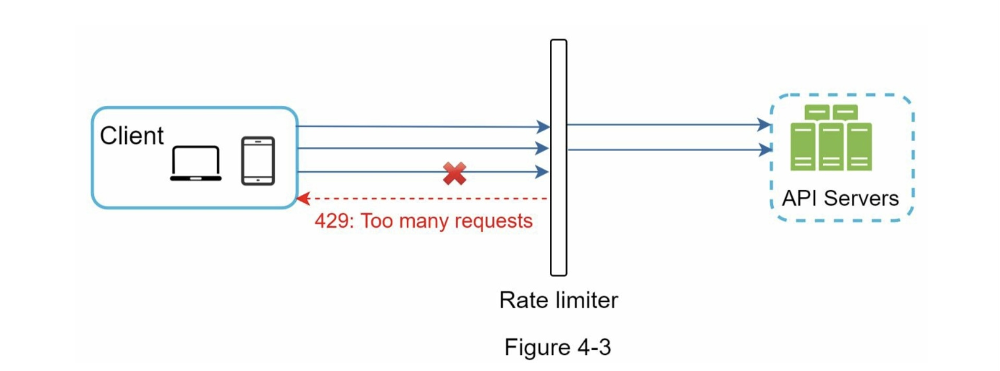

**API gateway** is a middleware that supports **rate limiting** (along with SSL termination, authentication, IP whitelisting, servicing static content, etc).

Guidelines to help **where to implement** rate limiter (on the server-side or in a gateway?):
- Evaluate your current technology stack. Make sure your current programming language is efficient to implement rate limiting on the server-side.
- Identify the rate limiting algorithm that fits your business needs. You have full control of algorithm if you implement it on server side. algorithm is limited on third party gateway
- If you have already used API gateway for other tasks, add a rate limiter to the API gateway
- Implementing a custom rate limiter requires time and engineering resources. If resources are limited, a commercial API gateway with built-in rate limiting may be the best choice.

#### Algorithms for rate limiting

list of popular algorithms:
- [Token bucket](#token-bucket-algorithm)
- [Leaking bucket](#leaking-bucket-algorithm)
- [Fixed window counter](#fixed-window-counter-algorithm)
- [Sliding window log](#sliding-window-log-algorithm)
- [Sliding window counter](#sliding-window-counter-algorithm)

### Token bucket algorithm
commonly used by internet companies. Both Amazon and Stripe

Tokens are put in the bucket
at preset rates periodically. Once the bucket is full, no more tokens are added. 
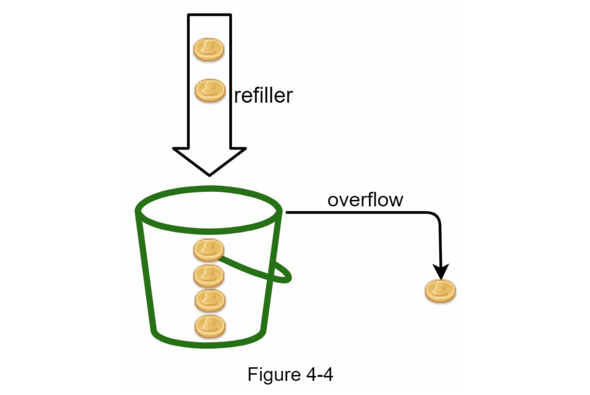
the token bucket capacity is 4. The refiller puts 2 tokens into the bucket every
second. Once the bucket is full, extra tokens will overflow.
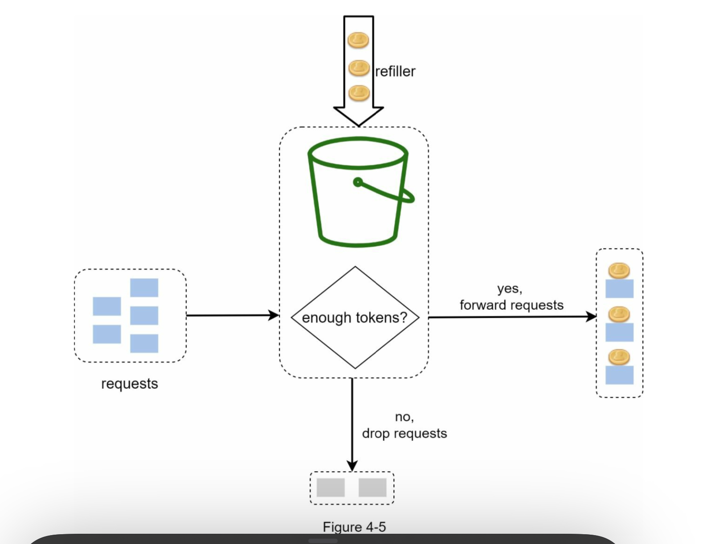
Each request consumes one token. When a request arrives, we check if there are enough
tokens in the bucket
- If there are enough tokens -> we take **one token out for each request**, and the **request goes through**.
- If there are not enough tokens -> the **request is dropped**.

how token consumption, refill, and rate limiting logic work:
int the image below the token bucket size is 4, and the refill rate is 4 per 1 minute.
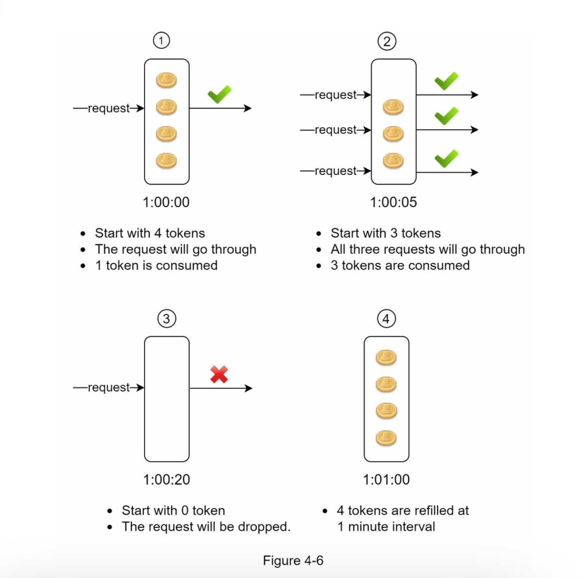

parameters for the token bucket:
1. **Bucket size**: the maximum number of tokens allowed in the bucket (the above example, the Bucket Size was 4)
2. **Refill rate**: number of tokens put into the bucket every second (the above example, the refill rate is 4 per 1 minute)

how many buckets we need?
- It is usually necessary to have different buckets for different API endpoints. 
ex: for each user, 1 bucket for posting, 1 bucket for adding friends, 1 bucket for like the post
- If we need to throttle requests based on IP addresses, each IP address requires a bucket.
- If the system allows a maximum of 10,000 requests per second, it makes sense to have a global bucket shared by all requests.

Pros:
- The algorithm is easy to implement.
- Memory efficient.
- Token bucket allows a burst of traffic for short periods. A request can go through as long as there are tokens left.

Cons:
- <details>
  <summary>It might be challenging to tune the parameters (bucket size, token refill rate) properly.</summary>  
  <br>
  Tuning parameters in a token bucket algorithm can be challenging because it requires balancing between preventing overload and allowing occasional bursts of traffic. Here’s a breakdown of why tuning parameters, like bucket size and token refill rate, can be difficult:
  
  - Bucket Size: The bucket size determines how many requests can be made in a short period. If the bucket is too small, legitimate bursts of traffic may be throttled. For instance, let’s say your bucket size is set to 10 tokens, but your system sometimes receives 15 requests within a few seconds. In this case, 5 requests would be denied, even if the system could handle them, leading to unnecessary throttling.

  - Token Refill Rate: The refill rate sets how frequently tokens are added back to the bucket. If the rate is too slow, users might experience delays or be blocked after small bursts, impacting the user experience. For example, if tokens are added back only once per second but your application sometimes experiences spikes of 20 requests in 2 seconds, users will be rate-limited frequently, even if these spikes are manageable.

  Finding the right balance between these two parameters—bucket size and refill rate—requires understanding traffic patterns and the system’s capacity. Without accurate tuning, the rate limiter might either be too restrictive, causing a poor user experience, or too lenient, risking system overload during high-traffic periods.
</details>


### Leaking bucket algorithm
first in first out queue

1. When a request arrives, the system checks if the queue is full. If it is not full, the **request is added to the queue**.
2. Otherwise, the **request is dropped**.
3. Requests are pulled from the queue and processed at regular intervals.


parameters
1. **Bucket size**: it is equal to the **queue size**. The queue holds the requests to be processed at a fixed rate.
2. **Outflow rate**: it defines how many requests can be processed at a fixed rate, usually in seconds.

Pros:
- Memory efficient given the limited queue size.
- Requests are processed at a fixed rate therefore it is suitable for use cases that a stable outflow rate is needed.

Cons:
- <details>
  <summary>A burst of traffic fills up the queue with old requests, and if they are not processed in time, recent requests will be rate limited.</summary>  
  When a high volume of requests arrives quickly, the bucket can fill with old requests, and newer ones may get blocked if the queue is at capacity. For example, if a queue can hold only 50 requests but receives 100 in a short burst, 50 requests may get dropped or delayed.
</details>

- <details>
  <summary>It might not be easy to tune the parameters properly.</summary>  
  Setting the right bucket size and outflow rate is tricky. A small bucket or low outflow rate could block legitimate traffic, while a large bucket or high rate could allow too many requests through at once, potentially overwhelming the system. Balancing these parameters requires understanding your traffic pattern well, or it may result in unintended throttling or overload.
</details>

<details>
<summary><strong>*Example of differences between Token Bucket and Leaking Bucket</strong></summary>

<br>
Token Bucket: If an API rate limiter using the Token Bucket algorithm has a burst of 20 requests when 20 tokens are available, all 20 requests will be processed immediately. If the bucket then has 0 tokens, additional requests are blocked until tokens refill.

Leaking Bucket: If 20 requests arrive but the outflow rate is 5 requests per second, the algorithm will process only 5 requests per second. The remaining requests will either be queued or discarded if the queue is full, resulting in a smooth, steady rate.
</details>

### Fixed window counter algorithm

1. The algorithm divides the timeline into fix-sized time windows(e.g., 1-minute or 1-second intervals) and assign a counter for each window.
<br>*A **counter** is set for each window to **keep track of the number of requests**.
2. Each request increments the counter by one.
3. Once the counter reaches the **pre-defined threshold**, new requests are dropped until a new time window starts.

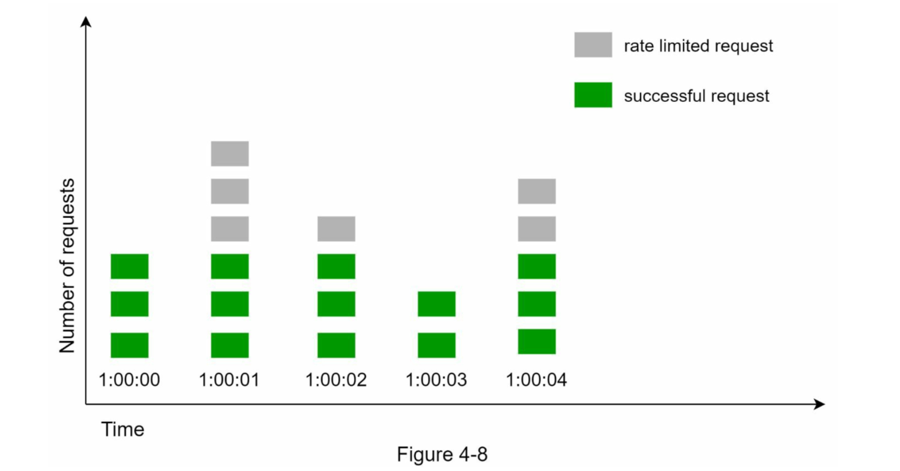
The time unit is 1 second and the system allows a **maximum of 3 requests per second**. In each second window, if more than 3 requests are received, **extra requests are dropped**.

problem case:
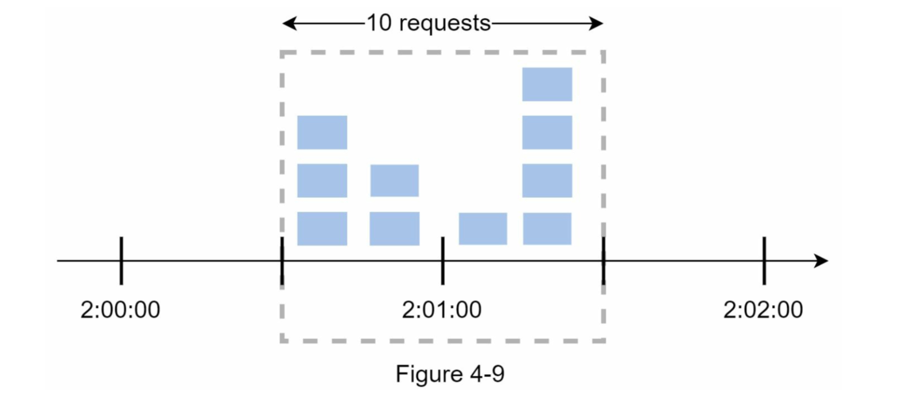
Allowing 5 requests per minute: five requests between 2:00 and 2:01, and 5 requests between 2:01 and 2:02. This means there are 10 requests between 2:00:30 and 2:01:30, making an average of 10 requests per minute.

Pros:
- Memory efficient. 
- Easy to understand.
- Resetting available quota at the end of a unit time window fits certain use cases.

Cons:
- Spike in traffic at the edges of a window could cause more requests than the allowed quota to go through (figure 4-9).

### Sliding window log algorithm
Solution to the Fixed Window Counter Algorithm Issue (figure 4-9).

- The algorithm **keeps track of request timestamps**. Timestamp data is usually kept in cache, such as sorted sets of Redis.
- When a new request comes in, remove all the outdated timestamps. Outdated timestamps are defined as those **older than the start of the current time window**. (e.g., remove any that are older than 60 seconds.)
- Add timestamp of the new request to the log("window" in this algorithm).
- If the log size is the same or lower than the allowed count, a request is accepted. Otherwise, it is rejected.

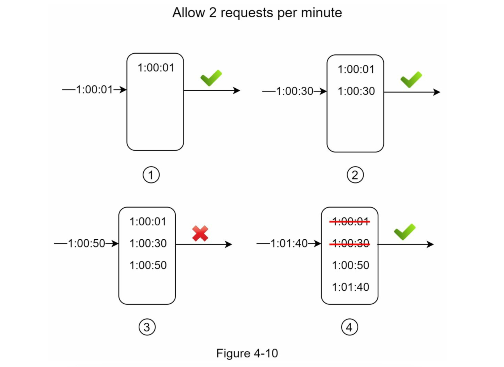

allow 2 request per minute
1. The log is empty when a new request arrives at **1:00:01**. Thus, the request is allowed.
2. A new request arrives at **1:00:30**, the timestamp **1:00:30** is inserted into the log. After the insertion, the log size is 2, not larger than the allowed count. Thus, the request is allowed.
3. A new request arrives at **1:00:50**, and the timestamp is inserted into the log. After the insertion, the log size is 3, larger than the allowed size 2. Therefore, this request is rejected even though the timestamp remains in the log.
4. A new request arrives at **1:01:40**. Requests in the range [1:00:40,1:01:40] are within the latest time frame, but requests sent before 1:00:40 are outdated. Two outdated timestamps, **1:00:01 and 1:00:30**, are removed from the log. After the remove operation, the log size becomes 2; therefore, the request is accepted.

Pros:
- Rate limiting implemented by this algorithm is **very accurate**. In any rolling window, requests will not exceed the rate limit.

Cons:
- The algorithm consumes **a lot of memory** because even if a request is rejected, its timestamp might **still be stored in memory**.

### Sliding window counter algorithm
hybrid approach that combines the fixed window counter and sliding window log

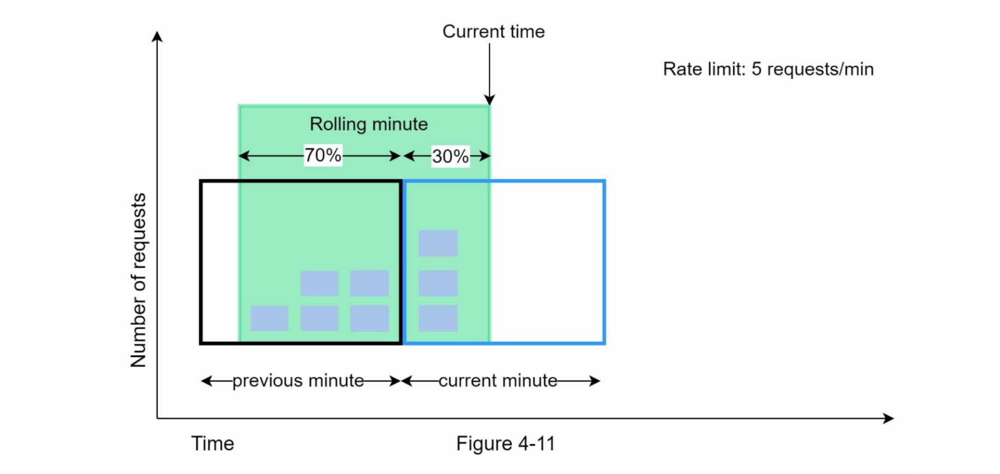
maximum of 7 requests per minute **for a new request that arrives at a 30% position in the current minute**, the number of requests in the rolling window is calculated using the following formula:
- Requests in current window + requests in the previous window * overlap percentage of the rolling window and previous window
- Using this formula, we get 3 + 5 * 0.7% = 6.5 request. Depending on the use case, the
number can either be rounded up or down. In our example, it is rounded down to 6.
<details>
  <summary>Overlap Percentage:</summary>
   Since the rolling window includes 30% of the current minute and 70% of the previous minute, the overlap with the previous minute is 70% (or 0.7 in decimal form).
</details><br>

Since the rate limiter allows a maximum of 7 requests per minute, the current request can go through. However, the limit will be reached after receiving one more request.

Pros
- It smooths out spikes in traffic because the rate is based on the average rate of the previous window.
- Memory efficient.

Cons
- It only works for not-so-strict look back window. It is an approximation of the actual rate because it assumes requests in the previous window are evenly distributed. However, this problem may not be as bad as it seems. According to experiments done by Cloudflare, only 0.003% of requests are wrongly allowed or rate limited among 400 million requests.

#### High-level architecture

At the high-level, we need a **counter to keep track of how many requests are sent** from the **same** user, IP address, etc. If the counter is larger than the limit, the request is disallowed. **It is recommended to store the counter in-memory cache**. 
For instance, Redis is a popular option to implement rate limiting. It is an in-memory store that offers two commands:
- INCR: It increases the stored counter by 1.
- EXPIRE: It sets a timeout for the counter. If the timeout expires, the counter is automatically deleted.

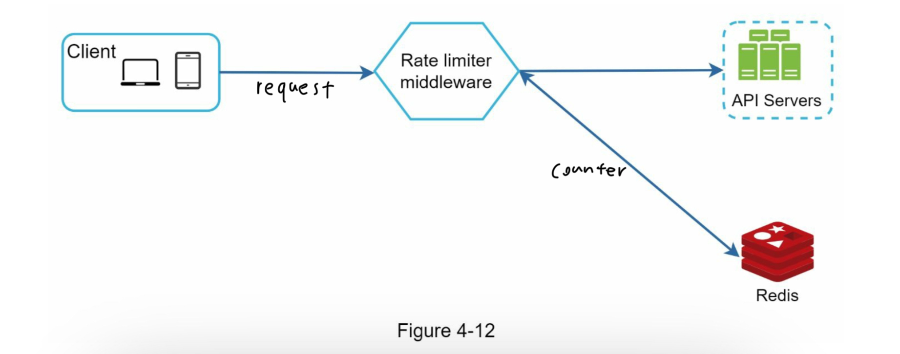

- The client sends a request to rate limiting middleware.
- Rate limiting middleware fetches the counter from the corresponding bucket in Redis and checks if the limit is reached or not.
- If the limit is reached, the request is rejected.
- If the limit is not reached, the request is sent to API servers. Meanwhile, the system increments the counter and saves it back to Redis.

### Step 3 - Design deep dive

#### Rate limiting rules
examples:
```yml
domain: messaging
descriptors:
- key: message_type
  Value: marketing
  rate_limit:
    unit: day
    requests_per_unit: 5
```

In the above example, the system is configured to allow a maximum of 5 marketing messages per day.

```yml
domain: auth
descriptors:
- key: auth_type
  Value: login
  rate_limit:
    unit: minute
    requests_per_unit: 5
```
This rule shows that clients are not allowed to login more than 5 times in 1 minute. Rules are generally written in configuration files and saved on disk.

#### Exceeding the rate limit
APIs return a HTTP response code 429. Depending on the use cases, we may enqueue the rate-limited requests to be processed later.

**Rate limiter headers**
The rate limiter returns the following HTTP headers to clients:
- **X-Ratelimit-Remaining**: The remaining number of allowed requests within the window. 
- **X-Ratelimit-Limit**: It indicates how many calls the client can make per time window.
- **X-Ratelimit-Retry-After**: The number of seconds to wait until you can make a request again without being throttled.
When a user has sent too many requests, a 429 too many requests error and X-Ratelimit-Retry-After header are returned to the client. 

### Detailed design

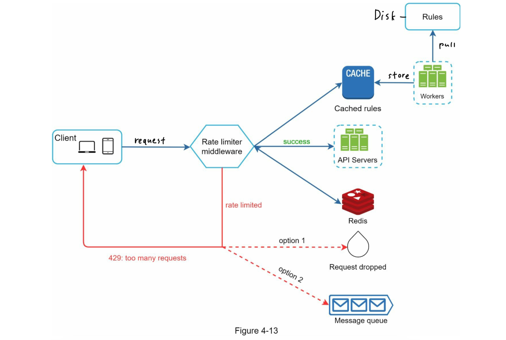

1. Rules are stored on the disk. Workers frequently pull rules from the disk and store them in the cache.
2. When a client sends a request to the server, the request is sent to the rate limiter middleware first.
3. Rate limiter middleware loads rules from the cache. It fetches counters and last request timestamp from Redis cache. Based on the response, the rate limiter decides:  
   - if the request is not rate limited, it is forwarded to API servers.
   - if the request is rate limited, the rate limiter returns 429 too many requests error to the client. In the meantime, the request is either dropped or forwarded to the queue.

#### Rate limiter in a distributed environment

challenges:
- Race condition
- Synchronization issue

**Race condition**

1. Read the counter value from Redis.
2. Check if ( counter + 1 ) exceeds the threshold.
3. If not, increment the counter value by 1 in Redis.

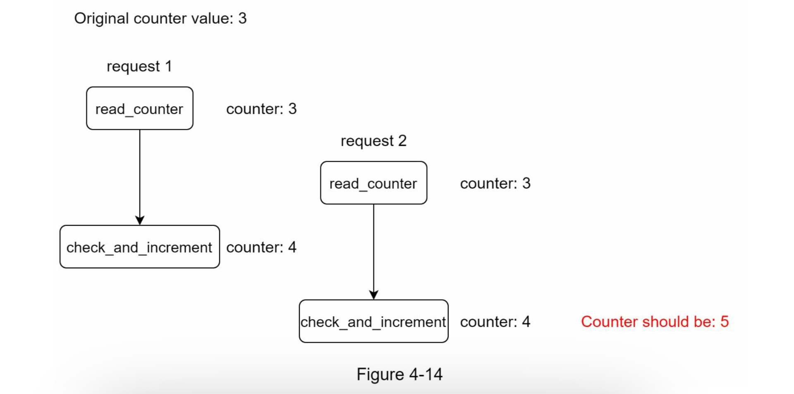

Assume the counter value in Redis is 3. If two requests **concurrently** read the counter value before either of them writes the value back, each will increment the counter by one and write it back without checking the other thread. Both requests (threads) believe they have the correct counter value 4. However, the correct counter value should be 5.

**Synchronization issue**

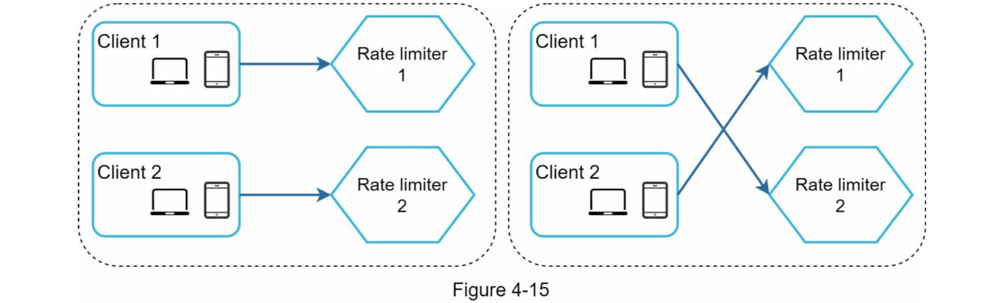
1. Client 1 send request to Rate limiter 1
2. Client 2 send request to Rate limiter 2
3. **ach clients can send to the different limiters**
4. **Without synchronization, rate limiter 1 does not contain any data about client 2**. Thus, the rate limiter cannot work properly.

Possible solution:

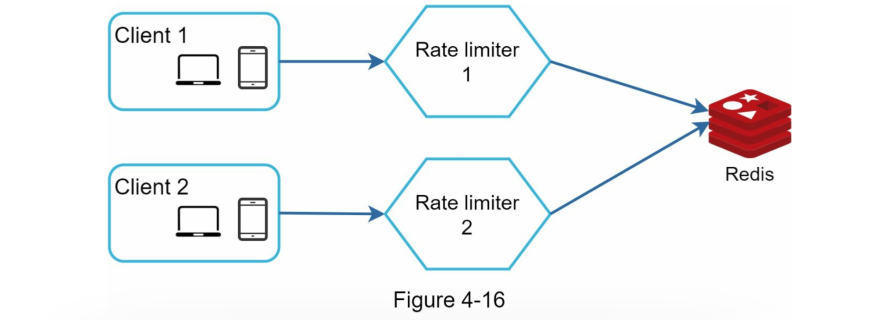
~~Have a centralized data stores(Redis)~~ <span style="color: red">Not Recommended</span>

#### Performance optimization
1. **Setting up multi data center**: latency is high for users located far away from the data center. traffic is automatically routed to the closest edge server to reduce latency.
2. Synchronize data with an eventual consistency model

#### Monitoring
- The rate limiting algorithm is effective.
- The rate limiting rules are effective.

<details>
  <summary>example</summary>
  if rate limiting rules are too strict, many valid requests are dropped. In this case,
  we want to relax the rules a little bit. In another example, we notice our rate limiter becomes ineffective when there is a sudden increase in traffic like flash sales. In this scenario, we may replace the algorithm to support burst traffic. Token bucket is a good fit here.
</details>

### Step 4 - Wrap up
1. [Rate limit algorithms](#algorithms-for-rate-limiting)
   - [Token bucket](#token-bucket-algorithm)
   - [Leaking bucket](#leaking-bucket-algorithm)
   - [Fixed window](#fixed-window-counter-algorithm)
   - [Sliding window log](#sliding-window-log-algorithm)
   - [Sliding window counter](#sliding-window-counter-algorithm)
2. System architecture
- Hard rate limiting: The number of requests cannot exceed the threshold.
- Soft rate limiting: Requests can exceed the threshold for a short period.

- Avoid being rate limited. Design your client with best practices:
  - Use client cache to avoid making frequent API calls.
  - Understand the limit and do not send too many requests in a short time frame.
  - Include code to catch exceptions or errors so your client can gracefully recover from exceptions.
  - Add sufficient back off time to retry logic.
  