# Chapter 4: Design a rate limiter
- What is the rate limiter
    - In a network system
      - A rate limiter is used to control the rate of traffic sent by a client or a service
    - In the HTTP world
      - A rate limiter limits the number of client requests allowed to be sent over a specified period
      - If the API request count excceds the threshold defined by the rate limiter, all the excess calls are blocked. 
- Example of Rate Limiter
  - A user can write no more than 2 posts per second
  - You can create a maximum of 10 accounts per day from the same IP address
  - You can cliam rewards no more than 5 times per week from the same device

- The benefits of using an API rate limiter
  - Prevent resource starvation caused by Denial of Service(DoS) attack
  - Reduce cost
  - Prevent servers from being overloaded

## step1 - Understand the problem and establish design scope
- Questions
  - What kind of rate limiter?
    - client-side rate limiter / server-side API rate limiter
  - What kind of rate limiter throttle API requests based on?
    - IP / User ID / or other property
  - What is the scale of the system?
    - Startup / big company with large user base
  - Work in distributed environment?
  - Rate limiter is a separate service or should it be implemented in application code
  - Do we need to inform users who are throttled?
- Requirements
  - Accurately limit excessive requests
  - Low latency - Should not slow down HTTP response time
  - Use as little memory as possible
  - Distributed rate limiting
  - Exception handling
  - High fault tolerance - Any issues on rate limiter, does not affect the entire system

## step2 - Propose high-level design and get buy-in

### Where to put the rate limiter?
- client-side implemenation
  - Unreliable place to enforce rate limiting because client requests can easily be forged by malicious actors. 

- Server-side implementation
  - Rate limiter is placed on the server-side 
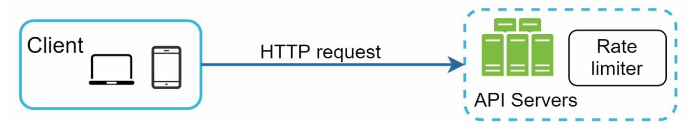

- Rate limiter middleware
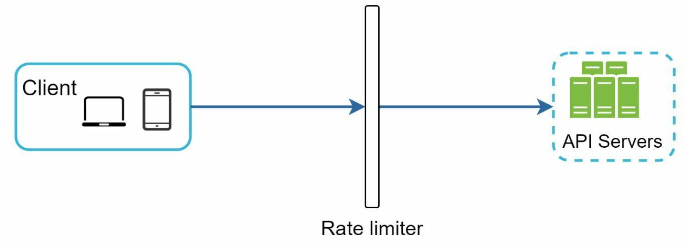

- How rate limiter in middleware works
  - Last third request is blocked, with HTTP status code 429, which means too many requests
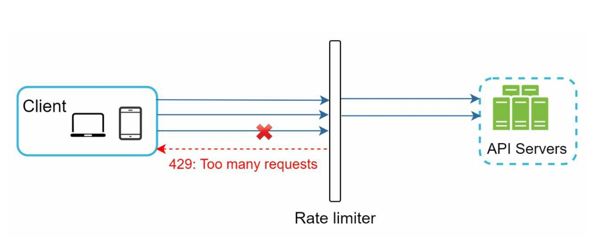

- API Gateway
  - Fully managed service that supports rate limiting, SSL termination, authentication, IP whitelisting, service static contents, etc.
  - Middleware that supports rate limiting
  
- 
### Algorithms for rate limiting
- Token bucket
- Leaking bucket
- Fixed window counter
- Sliding window log
- Sliding window counter

#### Token bucket algorithm
- Widely used for rate limiting
- Well understood and commonly used by internet companies.
- Amazon and Stripe use this algorithm to throttle their API requests
- How it works
  - Preset a bucket
    - A token bucket is a container that pre-defined capacity
    - Token are put in the bucket at preset rates periodically
    - Once the bucket is full, no more token are added.
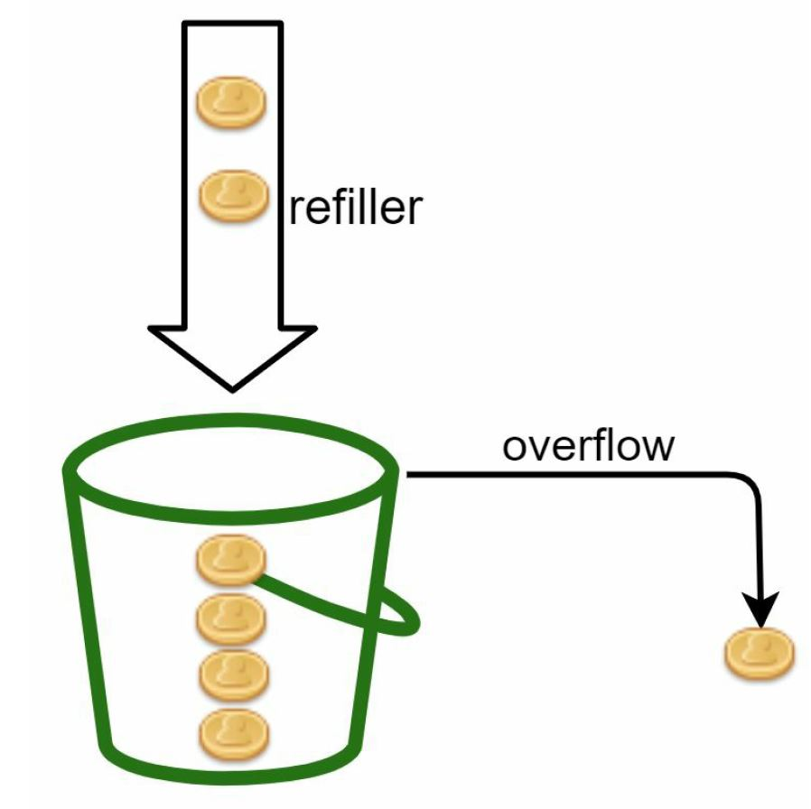
  - Request comes
    - Each reqeust consumes one token
    - When a request arrives, we check if there are enough token in the bucket
    - If there are enough tokens
      - we take one token out for each request and the request goes through
    - If there no tokens
      - the request is dropped

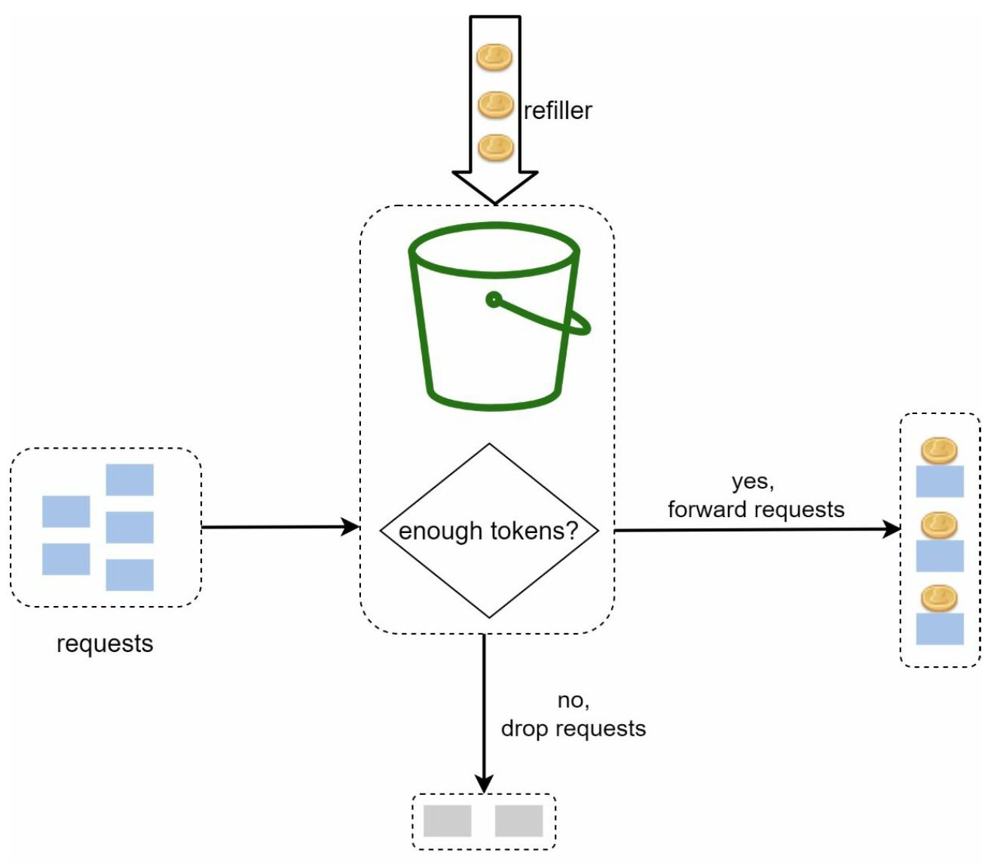
  - Example how token comsumption, refill and rate limiting logic work
    - The token bucket size is 4, and the refill rate is 4 per 1 minutes.
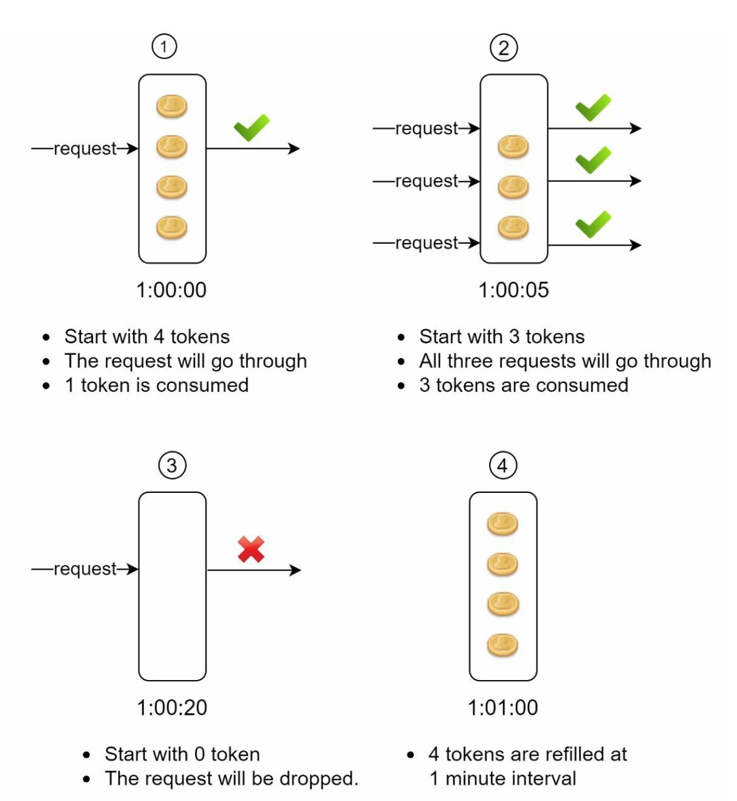

- Two parameter for bucket algorithm
  - Bucket size
  - Refill rate
- Pros & Cons
  - Pros
    - The algorithm is easy to implement
    - Memory efficient
    - Token bucket allows a burst of traffic for short periods. A request can go through as long as there are tokens left
  - Cons
    - Two parameters in the algorithm are bucket size and token refill rate. However it might be challenging to rune them properly

#### Leaking bucket algorithm
- Similar to the token bucket except that requests are processed at a fixed rate
- It is usually implemented with a first-in-first-out(FIFO) queue
- How it works  
  - When a request arrives, the system check if the queue is full. If it is not full, the request is added to the queue
  - Otherwise, the request is dropped
  - Requests are pulled from the queue and processed at regular intervals.
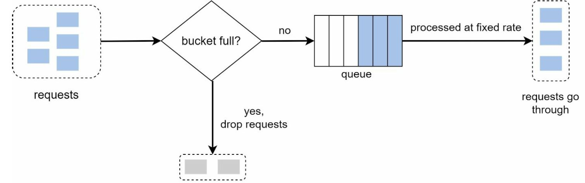

- Two parameters
  - Bucket size : equal to the queue size. 
  - Outflow rate : it defines how many requests can be processed at a fixed rate. 

- Pros & Cons
  - Pros
    - Memory efficient given the limited queue size
    - Requests are processed at a fixed rate therefore it is suitable for use caes that a stable outflow rate is needed
  - Cons
    - A burst of traffic fills up the queue with old requests and if there are not processed in time, recnet request will be rate limited. 
    - Thre are two parameters in the algorithm. It might not be easy to tune them properly.

#### Fixed window counter algorithm
- The algorithm devides the timeline into fix-sized time windows and assign a counter for each window
- Each request increments the counter by one
- Once the counter reaches the pre-defined threshold, new requests are dropped until a new time window starts
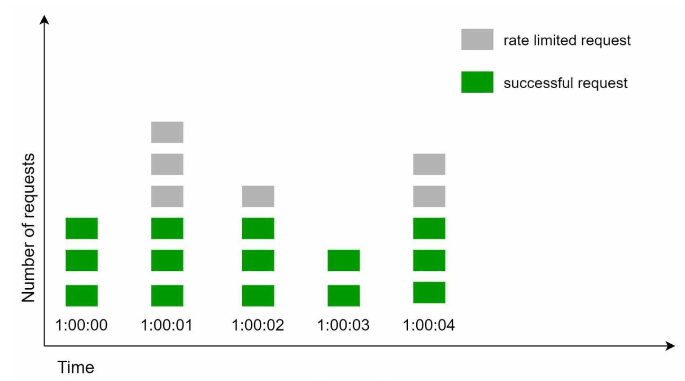
- In this figure, the system allows a maximum of 3 requests per second. 
- In each second indow, if more than 3 requests are received, extra requests are dropped

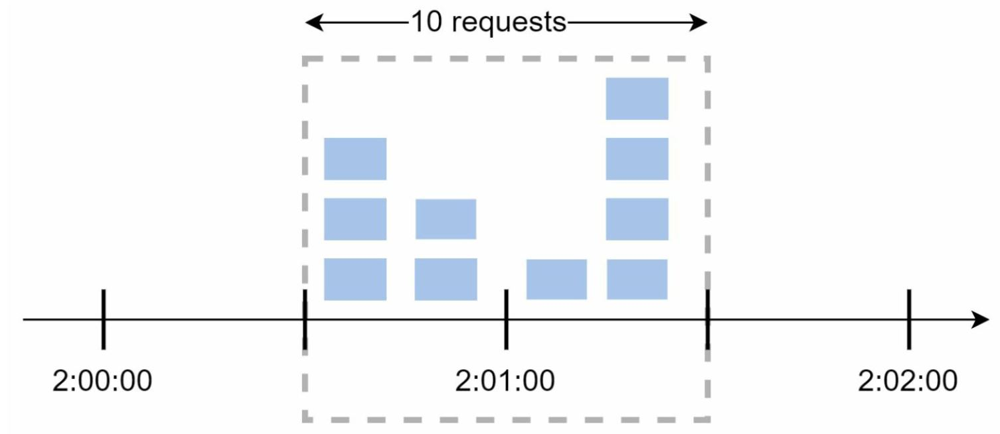
- A major problem
  - burst of traffic at the edges of time windows could cause more requests than allowed quota to go through
  - In the figure, 2:00:00 ~ 2:01:00, 2:01:00 ~ 2:02:00 each period have five requests, between 2:00:30 ~ 2:01:30 for one-minute window, 10 requests go through. This is twice as many as allowed request
  
- Pros & Cons
  - Pros 
    - Memory efficient
    - Easy to understand
    - Resetting available quota at the end of a unit time window fits certain use cases
  - Cons
    - Spike in traffic at the edges of a window could cause more requests than the allowed quota to go through


#### Sliding window log algorithm
- Fixed window counter algorithm's issue
  - It allows more requests to go through at the edges of a window
  - The sliding window log algorithm fixes the issue
- How it works
  - Keep track of request timestamps (in cache like Redis)
  - When a new request comes in, remove all the outdated timestamps
  - Outdated timestamps are defined as those older than the start of the currnet time window
  - Add timestamp of the new request to the log
  - If the size is the same or lower than the allowed count, a request is accepted, otherwise, it is rejected
- Pros & Cons
  - Pros
    - Rate limiting implemented by this algorithm is very accurate
  - Cons
    - The algorithm consumes a lot of memory because even if a request is rejected, its timestamp might still be stored in memory
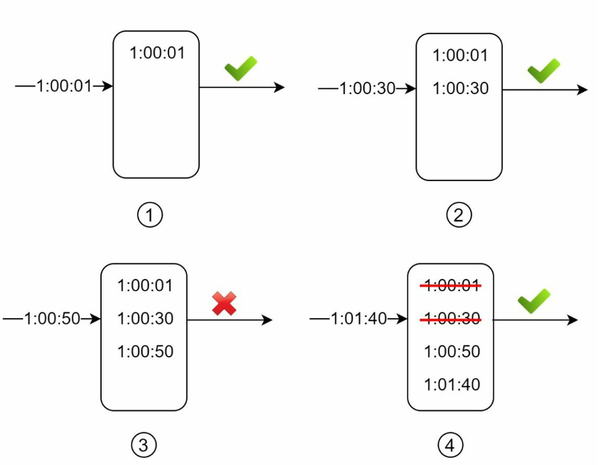

#### Sliding window counter algorithm
- Hybrid approach that combines the fixed window counter and sliding window log
- Pros & Cons
  - Pros
    - It smooths out spikes in traffic because the rate is based on the average rate of previous window
    - Memory efficient
  - Cons
    - It only works for not-so-strict look back window
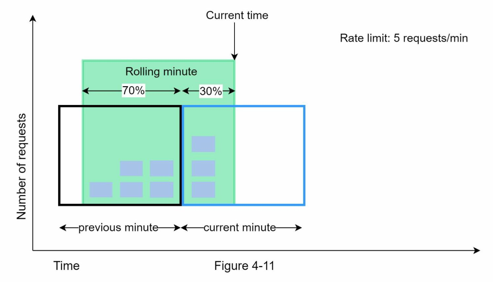

### High-level architecture
- The basic idea of rate limiting algorithms is simple
- At the high-level, we need a counter to keep track of how many requests are sent from the same user, IP address, etc.
- If the counter is larger than limit, the request is disallowed.

#### Where shall we store counters?
- Using the database is not a good idea
- In-memory cache is chosen because it is fast and supports time-based expiration strategy
  - INCR: increase the stored counter by 1
  - EXPIRE: It sets a timeout for the counter. If the timeout expires, the counter is automatically deleted
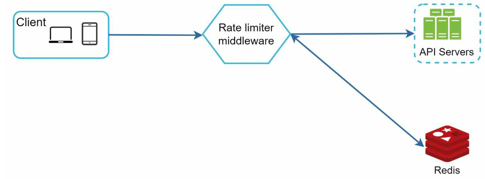


## Step3 - Design deep dive
- Two questions for high level design
  - How are rate limiting rules created? Where are the rules stored?
  - How to handle requests that are rate limited?

### Rate limiting rules
- Example for Lyft open-source, rate-limiting component
```
domain: messaging
descriptor:
  - key: message_type
    Value: marketing
    rate_limit:
      unit:day
      requests_per_unit: 5
```

### Exceeding the rate limit
- In case a request is rate limited, APIs return a HTTP response code 429
- Depending on the use cases, we may enqueue the rate-limited requests to be processed later

#### rate limiter headers
- How does a client know where it is being throuttled? 
- HTTP response header
  - X-Ratelimit-Remaining
  - X-Ratelimit-Limit
  - X-Reatelimit-Retry-After

### Detailed design
- Rules are stored on the disk
- When a client sends a request to the server, the request is sent to the rate limiter middleware first
- Rate limiter middleware loads rules from the cache
  - if the request is not rate limited, it is forwarded to API servers
  - if the request is rate limited, the rate limiter returns 429 too many requests error to the client
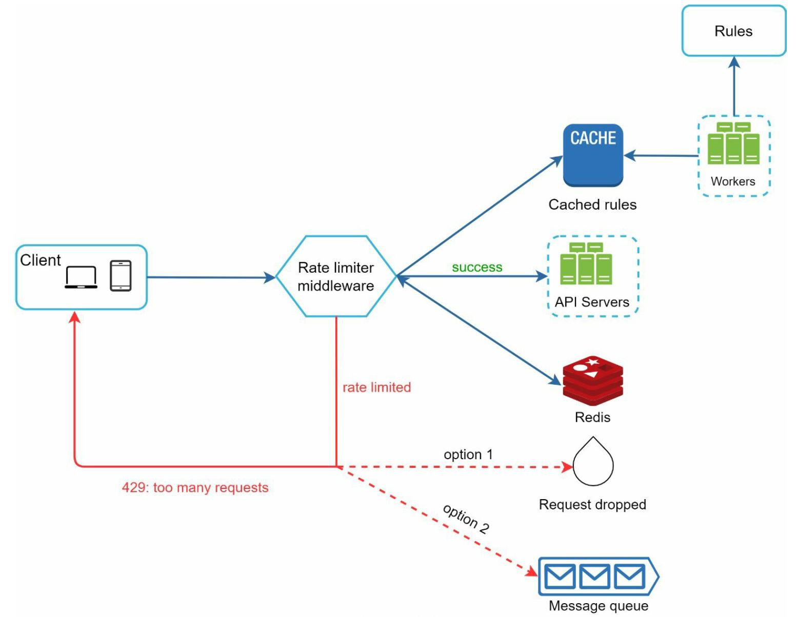

### Rate limiter in a distribute environment
- Scaling the system to support multiple servers and concurrent threads is difficulty
- There are two challenges
  - Race condition
  - Synchronization issue

#### Race condition
- Workflow for rate limiter
  - Read the counter value from Redis
  - Check if (counter +1) exceeds the threshold
  - If not, increment the counter value by 1 in Redis
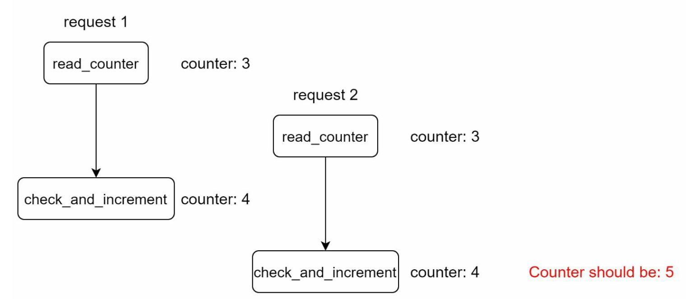
- Counter should be 5 , but 4
- Locks are the most obivous colution for solving reace condition. But it make system slow


#### Synchronization issue
- Synchronization is another important factor to consider in a distributed environment
- The web tier is stateless, client can send requests to a different rate limiter.
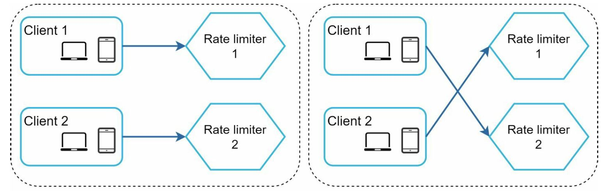
- One possible solution is to use sticky sessionsthat allowa client to send traffic to the same rate limiter -> Not advisable, not scalable and flexible
- A better approach is to use centralized data stored like Redis
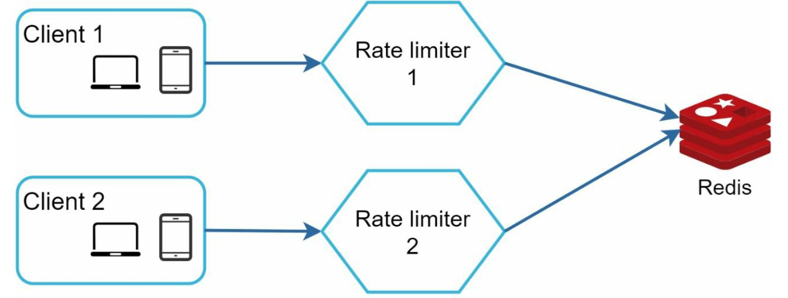

### Performance optimization


### Monitoring
- The rate limiting algorithm is effective
- The rate limiting rules are effective

## Step 4 - Wrap up


