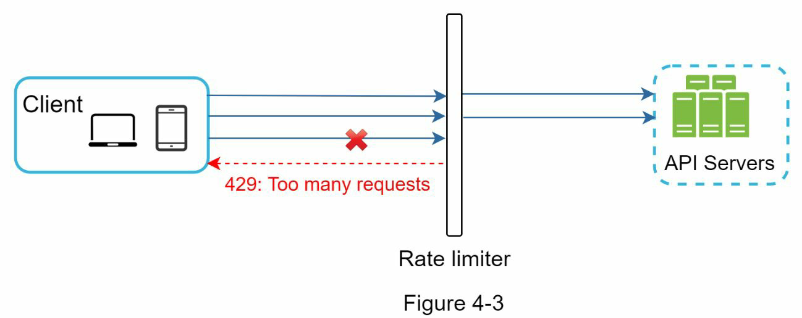
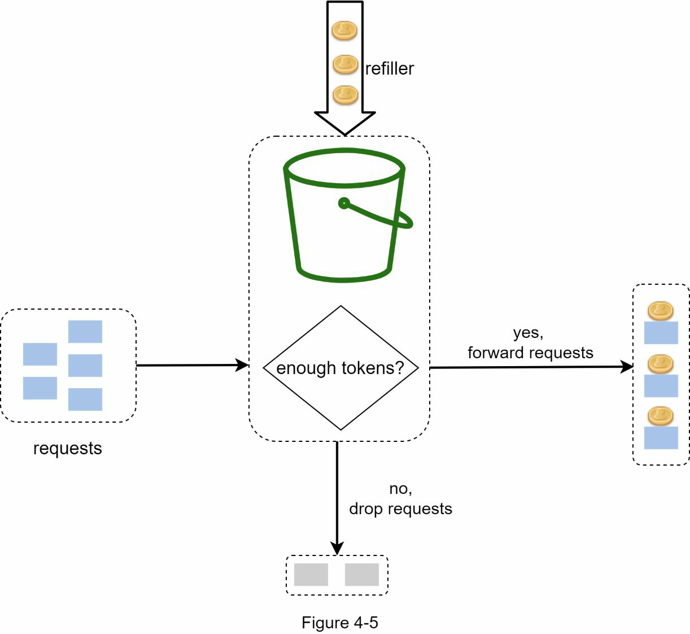
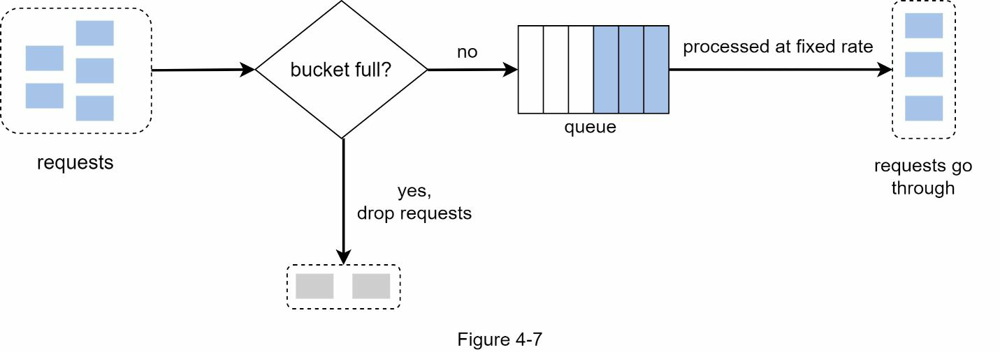
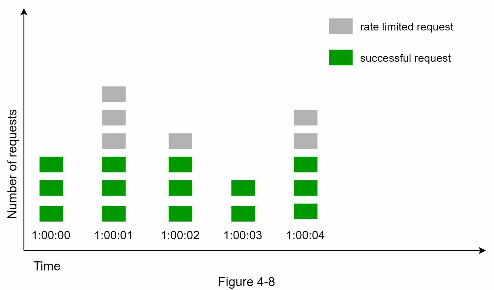
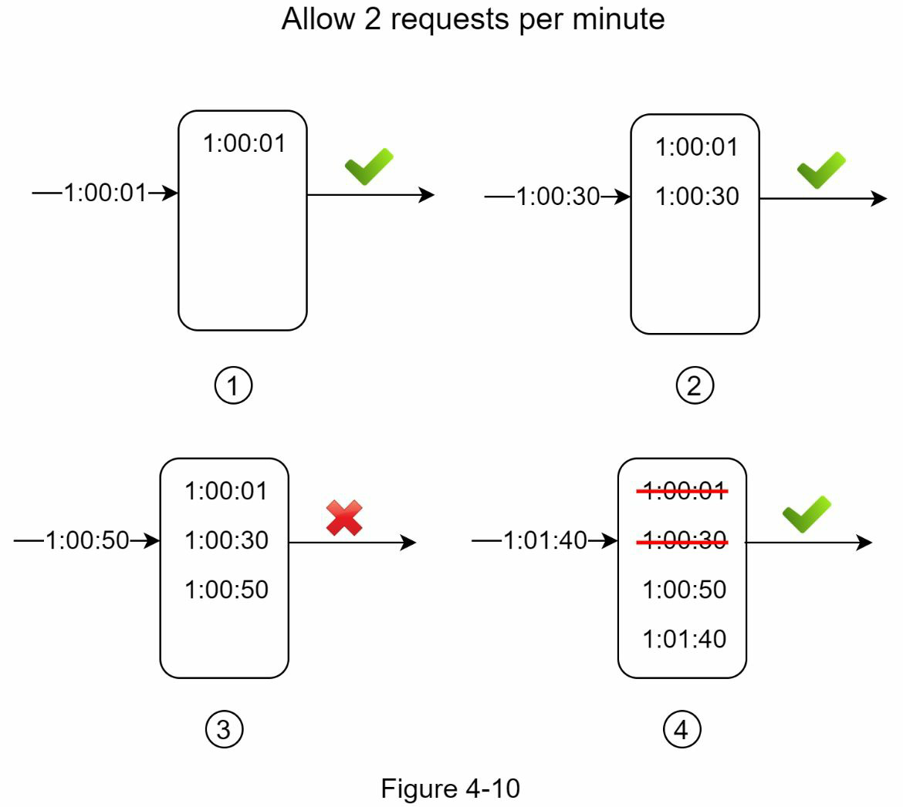
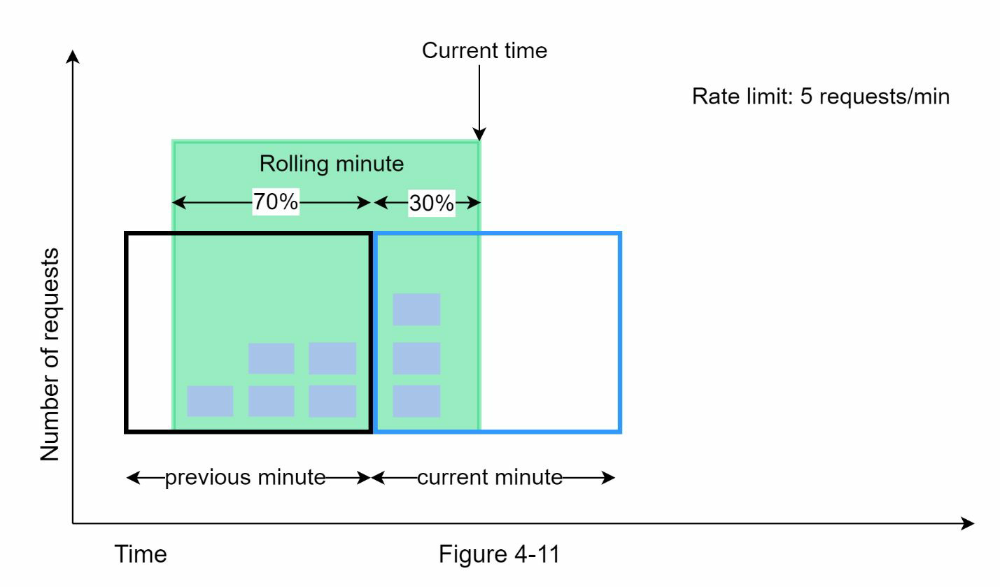
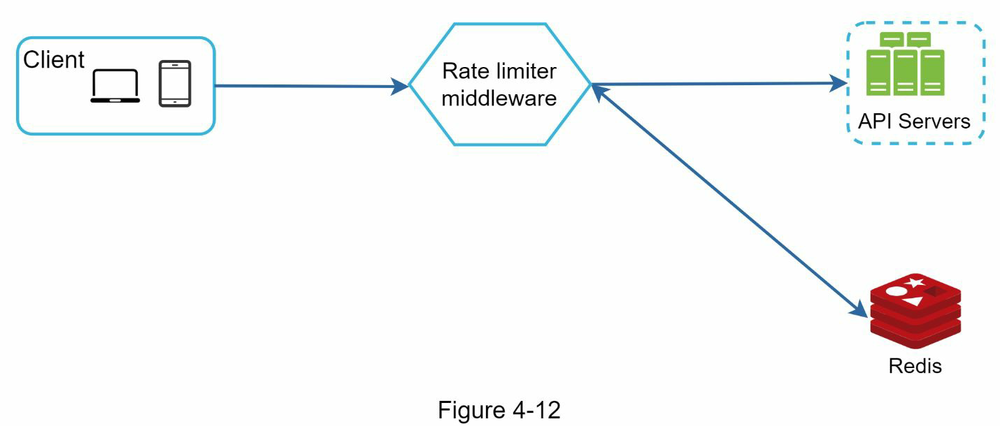
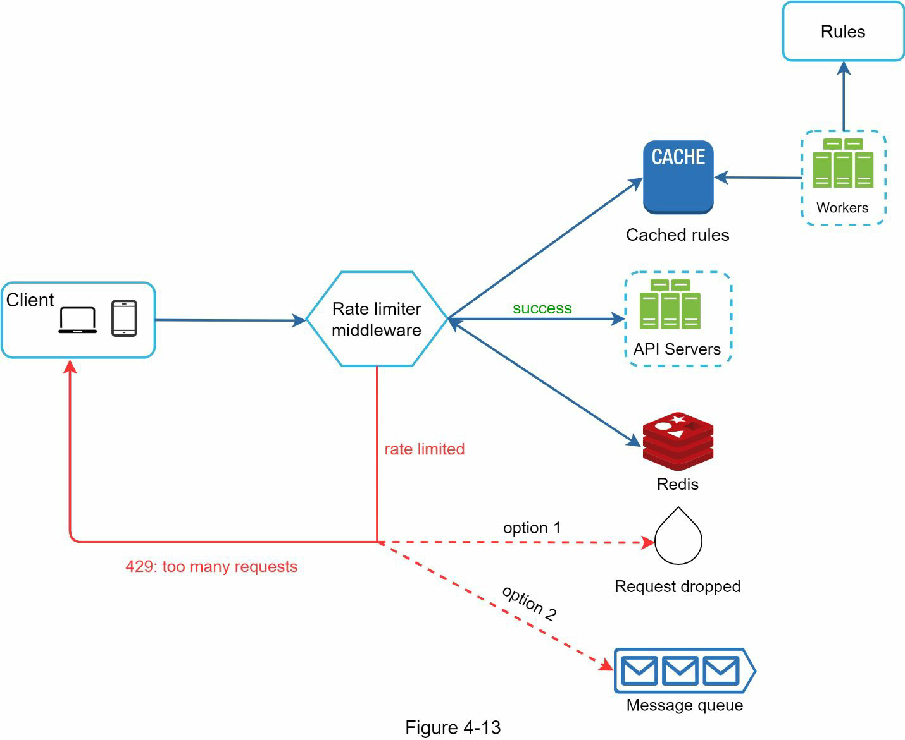
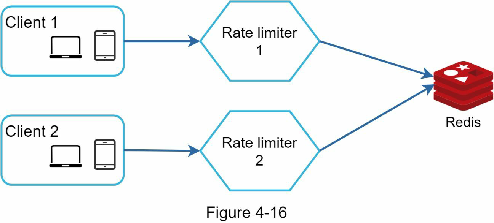

### CHAPTER 4: DESIGN A RATE LIMITER

Rate limiter limits the number of client requests allowed to be
sent over a specified period.

#### benefits of using an API rate limiter
- Prevent resource starvation caused by Denial of Service (DoS) attack.
- Reduce cost. Limiting excess requests means fewer servers and allocating more
resources to high priority APIs
- Prevent servers from being overloaded

1. Understand the problem and establish design scope
client vs server side, limit based on API, ID, or other, scale, size distributed, feedback, and other requirement etc

2.  Propose high-level design and get buy-in
###### Where do I put the rate limiter
- API gateway is a fully managed
service that supports rate limiting, SSL termination, authentication, IP whitelisting, servicing
static content, etc.

###### Algorithms for rate limiting
• Token bucket
- Pros:
• The algorithm is easy to implement.
• Memory efficient.
• Token bucket allows a burst of traffic for short periods. A request can go through as long
as there are tokens left.
- Cons:
• Two parameters in the algorithm are bucket size and token refill rate. However, it might
be challenging to tune them properly.


• Leaking bucket
- Pros:
• Memory efficient given the limited queue size.
• Requests are processed at a fixed rate therefore it is suitable for use cases that a stable
outflow rate is needed.
- Cons:
• A burst of traffic fills up the queue with old requests, and if they are not processed in
time, recent requests will be rate limited.
• There are two parameters in the algorithm. It might not be easy to tune them properly.


• Fixed window counter
- Pros:
• Memory efficient.
• Easy to understand.
• Resetting available quota at the end of a unit time window fits certain use cases.
- Cons:
• Spike in traffic at the edges of a window could cause more requests than the allowed quota to go through.



• Sliding window log
- Pros:
• Rate limiting implemented by this algorithm is very accurate. In any rolling window,
requests will not exceed the rate limit.
- Cons:
• The algorithm consumes a lot of memory because even if a request is rejected, its
timestamp might still be stored in memory.


• Sliding window counter
- Pros
• It smooths out spikes in traffic because the rate is based on the average rate of the
previous window.
• Memory efficient.
- Cons
• It only works for not-so-strict look back window. It is an approximation of the actual rate
because it assumes requests in the previous window are evenly distributed. However, this
problem may not be as bad as it seems. According to experiments done by Cloudflare [10],
only 0.003% of requests are wrongly allowed or rate limited among 400 million requests.



##### High-level architecture


### Step 3 - Design deep dive
#### Rate limiting rules
```json
domain: messaging
descriptors:
- key: message_type
Value: marketing
rate_limit:
unit: day
requests_per_unit: 5
```
#### Exceeding the rate limit
In case a request is rate limited, APIs return a HTTP response code 429 (too many requests)
to the client

##### Rate limiter headers
X-Ratelimit-Remaining: The remaining number of allowed requests within the window.
X-Ratelimit-Limit: It indicates how many calls the client can make per time window.
X-Ratelimit-Retry-After: The number of seconds to wait until you can make a request again
without being throttled.

##### Detailed design


#### Rate limiter in a distributed environment

##### Race Condition

Locks are the most obvious solution for solving race condition. However, locks will
significantly slow down the system. Two strategies are commonly used to solve the problem:
Lua script [13] and sorted sets data structure in Redis [8].

##### Synchronization issue
Better approach is to use centralized data stores like Redis


#### Performance optimization
- First, multi-data center setup is crucial for a rate limiter because latency is high for users
located far away from the data center
- Second, synchronize data with an eventual consistency model

#### Monitoring
- The rate limiting algorithm is effective.
- The rate limiting rules are effective.
