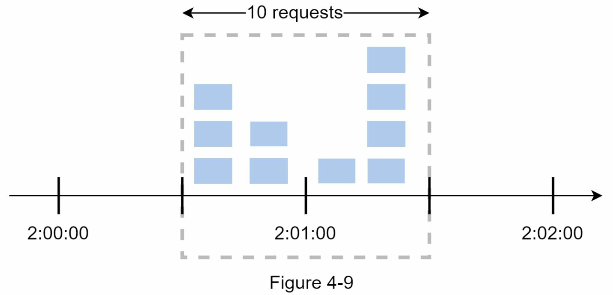
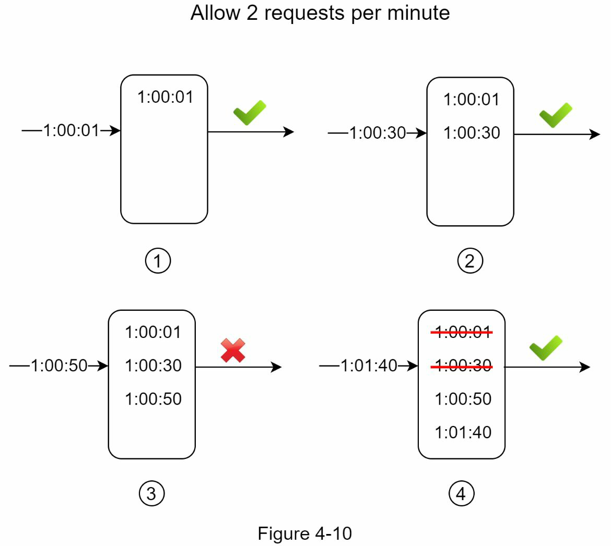
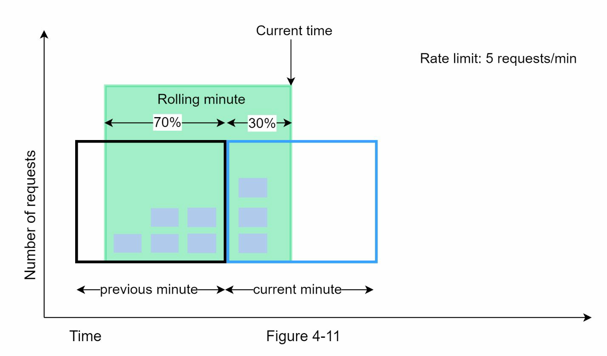

# Rate limiter
- Rate limiter limits the number of client requests allowed to be sent over a specified period.
- A few examples
  - A user can write no more than 2 posts per second
  - A user can create a max of 10 accounts per day from the same IP
  - A user can claim rewards no more than 5 times per week from the same device.
- Benefits of an API rate limiter
  - Prevent resource starvation caused by DDOS
  - Reduce cost
  - prevent servers from being overloaded

# Step 1
- Questions from candidate
  - What kind of rate limiter? server side or client side?
    - server side
  - Throttle API requests based on what? IP? user id? or others? configurable?
    - should be flexible
  - Scale of the system?
    - should handle large number of requests
  - Distributed environment?
    - yes
  - Is it a separate service or a part of application code?
    - Up to candidate
  - Should inform users when they are throttled?
    - Yes

- Summary of requirements
  - Accurately limit excessive requests
  - Low latency
  - Minimize memory usage
  - Distributed rate limiting - should be shared by multiple servers
  - Exception handling - inform users
  - High fault tolerance

# Step 2
## Where to put the rate limiter?
- server side or middle ware!
- API gateway is good place to put it
  - Supports rate limiting, SSL termination, authentication, IP whitelisting, servicing
    static content, etc
- Things to consider
  - tech stack, limiting algorithm
  - your current architecture
  - cost of building own rate limit service
## Algorithm for rate limiting
- Token bucket
- Leaking bucket
- Fixed window counter
- Sliding window log
- Sliding window counter

### Token bucket algorithm
- Algorithm summary
  - A token bucket is a container that has pre-defined capacity.
  - Each request consumes one token. Request is dropped if there is not enough token.
- Takes two parameters
  - Bucket size
  - REfill rate
- How many buckets do we need? It depends on rate limiting rules
  - Per endpoint
  - Based on ip address
  - Global bucket
- Pros
  - Simple
  - Memory efficient
  - Allows a burst of traffic
- Cons
  - Might be challenging to tune the parameters

### Leaking bucket algorithm
- Algorithm summary
  - Similar to token bucket except that requests are processed at a fixed rate.
- Parameters
  - Bucket size == queue size
  - Outflow rate: how many requests can be processed at a fixed rate.
- Pros
  - Memory efficient
  - stable outflow rate
- Cons
  - A burst of traffic fills up the queue with old requests, and if they are not processed in time, recent requests will be rate limited.
  - Might not be easy to tune them properly.

### Fixed window counter algorithm
- Algorithm summary
  - Divides the timeline into fix-sized time windows and assign a counter for each window
  - Each request increments the counter by one.
  - Once the counter reaches the pre-defined threshold, new requests are dropped until a new time window starts.
- Drawback

- Pros
  - Memory efficient
  - Easy to understand
  - Resetting available quota at the end of a unit time window fits certain use cases
- Cons
  - a burst of traffic at the edges of time windows could cause more requests than allowed quota to go through

### Sliding Window log algorithm

- Algorithm summary
  - Keeps track of request timestamps
  - When a new request comes in, remove all the outdated timestamps. 
    - Outdated timestamps: older than the start of the current window
  - Add timestamp of the new request to the log
  - Accept or reject based on the log size
- Question
  - In the picture, why do we count 1:00:50? This is dropped request..
    - traffic 을 고르게 분산 시키는 효과?

### Sliding window counter algorithm
- Algorithm summary
  - Hybrid approach between fixed sliding window counter and sliding window log
  - Requests in current window + requests in the previous window * overlap percentage of the rolling window and previous window

- Pros
  - Smooths out spikes in traffic because the rate is based on the average rate of the previous window
  - Memory efficient
- Cons
  - Only works for not so strict look back window.

## High level architecture
- The client sends a request to rate limiting middleware
- Rate limiting middleware fetches the counter from the corresponding bucket in Redis
- Checks if the limit is reached or not
  - If the limit is reached, the request is rejected.
  - If the limit is not reached, the request is sent to API servers. Meanwhile, the system increments the counter and saves it back to Redis.

# Step 3 - Design deep dive

Two questions unanswered from high level design
- How are rate limiting rules created? Where are the rules stored?
  - Generally, saved on disk
- How to handle requests that are rate limited?
  - API returns 429(too many requests)
- How does a client know whether it is being throttled? How does a client know the number of allowed remaining requests?
  - HTTP response header
    - X-Ratelimit-Remaining
    - X-Ratelimit-Limit
    - X-Ratelimit-Retry-After

## Detailed design
- Rules are stored on the disk and cached.
- Rate limiter middleware loads rules from the cache. If fetches counters and last request timestamp from Redis cache.

### Rate limiter in a distributed environment
- Race condiiton
- Sync issue

#### Race condition
- Lock, lus script, sorted set

#### Sync issue
- Using in memory DB

#### Performance optimization
- Multi data center
- Eventual consistency

### Monitoring
- Effectiveness of the algorithm
- Effectiveness of the rules

# Step 4 - Wrap up
- Hard vs soft rate limiting
- Rate limiting at different levels
  - HTTP, IP, etc
- Avoid being rate limited
  - Client cache
  - Client not sending too many requests
  - Catch exceptions and handel well
  - Back off