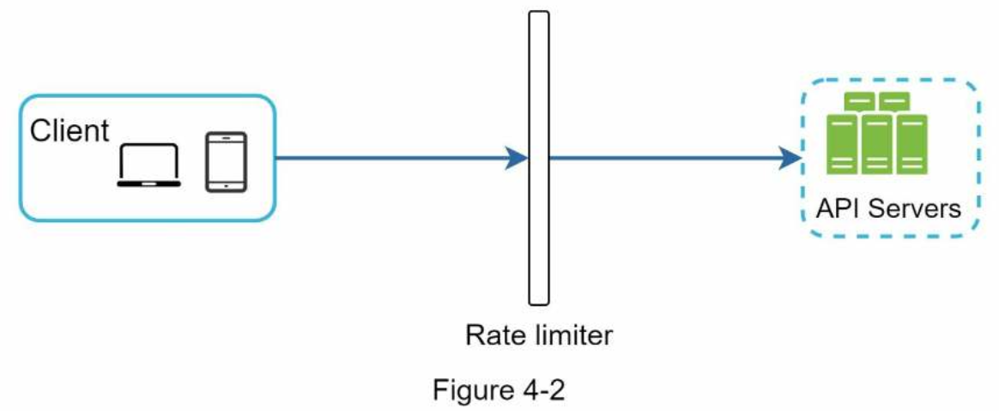
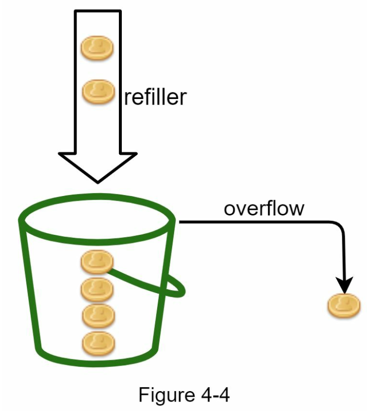
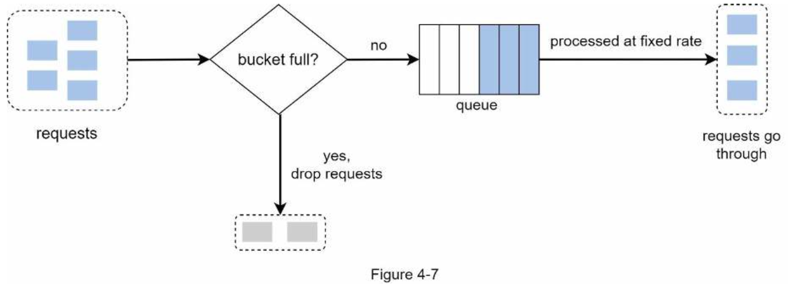
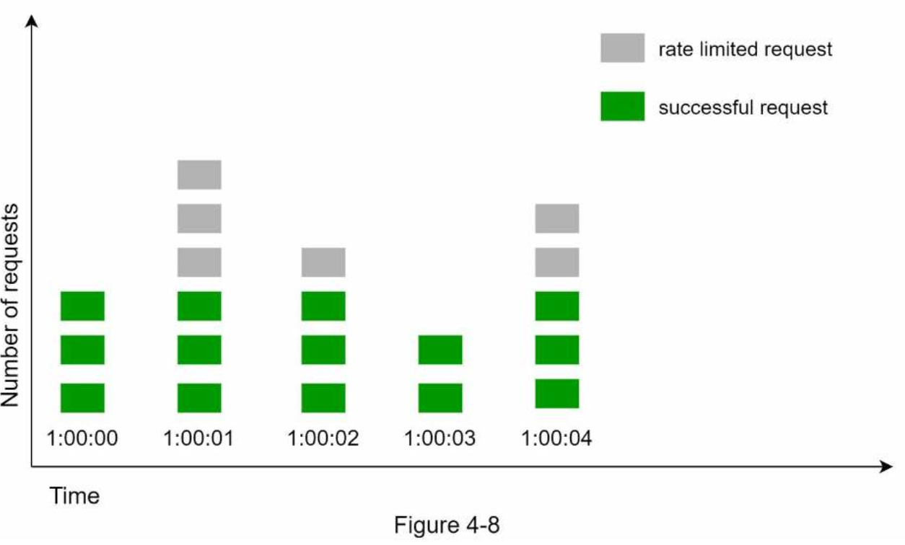
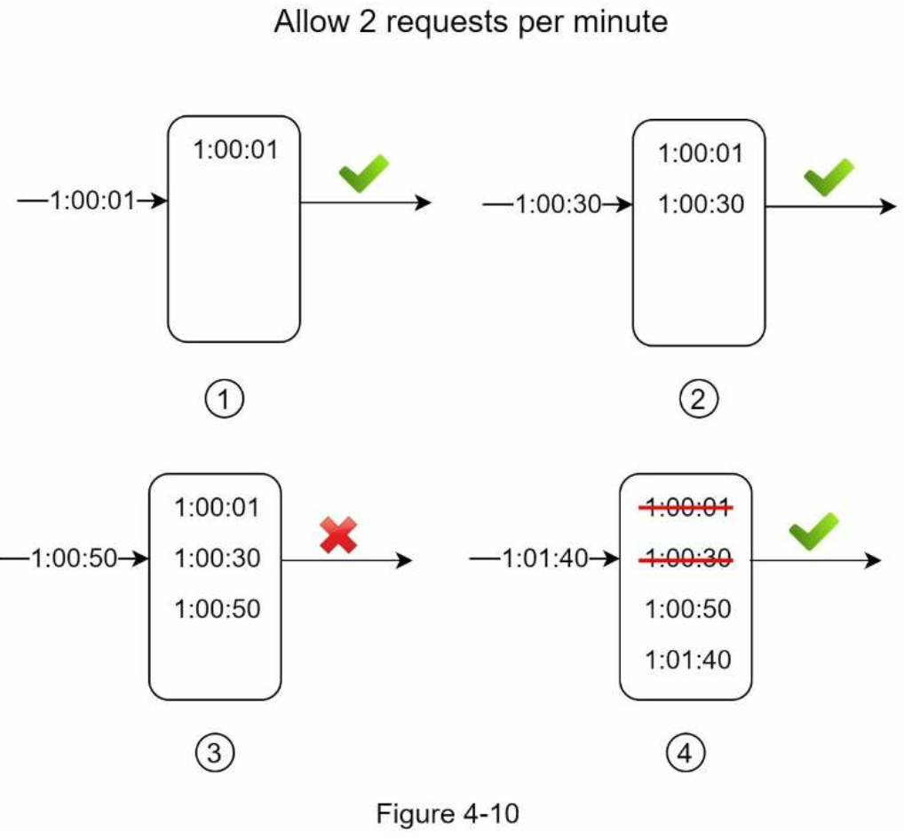
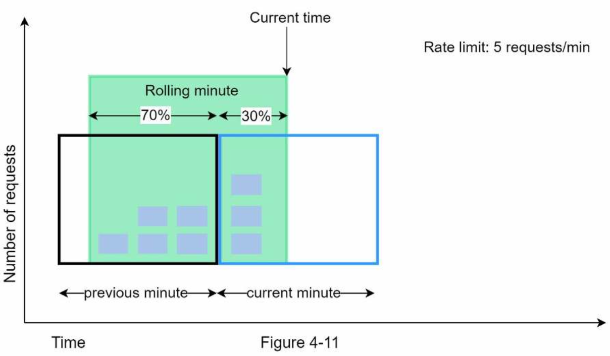
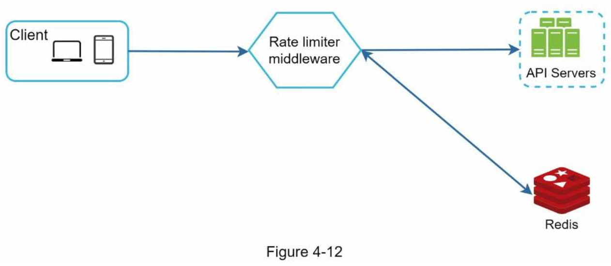
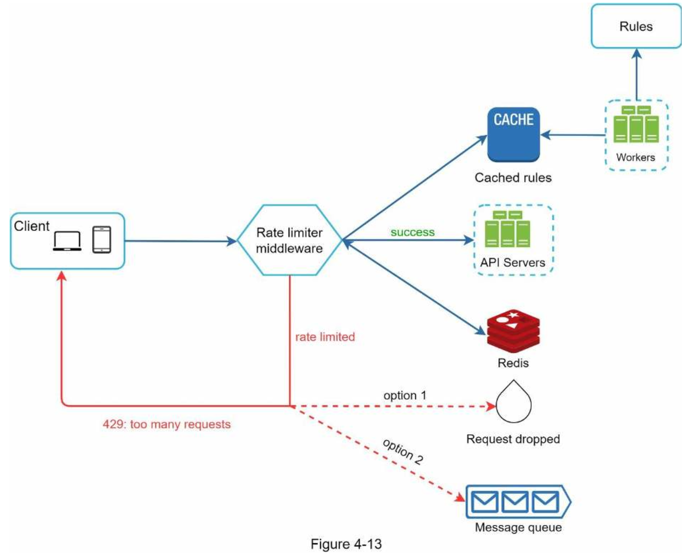

# 4. DESIGN A RATE LIMITER
##### The benefits of using an API rate limiter
1. Prevent resource starvation caused by Denial of Service (DoS) attack
2. Reduce cost.
3. Prevent servers from being overloaded.

### Step 1 - Understand the problem and establish design scope
##### The requirements for the system
- Accurately limit excessive requests.
- Low latency.
- Use as little memory as possible.
- Distributed rate limiting.
- Exception handling.
- High fault tolerance.

### Step 2 - Propose high-level design and get buy-in
### Where to put the rate limiter?
- Client-side implementation.
    - An unreliable place to enforce rate limiting because client requests can easily be forged by malicious actors.
    - We might not have control over the client implementation.
- Server-side implementation.


- Evaluate your **current technology stack**, such as programming language, cache service, etc.
- Identify the rate limiting algorithm that fits your business needs.
- If you have already used microservice architecture, you may **add a rate limiter** to the API gateway.
- If you do not have enough engineering resources to implement a rate limiter, **a commercial API gateway** is a better option.

### Algorithms for rate limiting
##### Token bucket algorithm

- Widely used for rate limiting.
- Both Amazon and Stripe use this algorithm to throttle their API requests.

- Bucket size: the maximum number of tokens allowed in the bucket.
- Refill rate: number of tokens put into the bucket every second.
- Pros:
    - The algorithm is easy to implement.
    - Memory efficient.
    - Token bucket allows a burst of traffic for short periods. A request can go through as long as there are tokens left.
- Cons:
    - It might be challenging to tune them properly.

##### Leaking bucket algorithm

- Bucket size: it is equal to the queue size. The queue holds the requests to be processed at a fixed rate.
- Outflow rate: it defines how many requests can be processed at a fixed rate, usually in seconds.
- Pros:
    - Memory efficient given the limited queue size.
    - Requests are processed at a fixed rate therefore it is suitable for use cases that a stable outflow rate is needed.
- Cons:
    - A burst of traffic fills up the queue with old requests, and if they are not processed in time, recent requests will be rate limited.
    - There are two parameters in the algorithm. It might not be easy to tune them properly.

##### Fixed window counter algorithm

- Pros:
    - Memory efficient.
    - Easy to understand.
    - Resetting available quota at the end of a unit time window fits certain use cases.
- Cons:
    - Spike in traffic at the edges of a window could cause more requests than the allowed quota to go through.

##### Sliding window log algorithm

- Pros:
    - Rate limiting implemented by this algorithm is very accurate. In any rolling window, requests will not exceed the rate limit.
- Cons:
    - The algorithm consumes a lot of memory because even if a request is rejected, its timestamp might still be stored in memory.

##### Sliding window counter algorithm

- Pros
    - It smooths out spikes in traffic because the rate is based on the average rate of the previous window.
    - Memory efficient.
- Cons
    - It only works for not-so-strict look back window.

### High-level architecture

- Two commands
    - INCR: It increases the stored counter by 1.
    - EXPIRE: It sets a timeout for the counter. If the timeout expires, the counter is automatically deleted.

### Step 3 - Design deep dive
- How are rate limiting rules created? Where are the rules stored?
- How to handle requests that are rate limited?

### Rate limiting rules
```
domain: messaging
descriptors:
    - key: message_type
    Value: marketing
    rate_limit:
        unit: day
        requests_per_unit: 5
```
- Rules are generally written in configuration files and saved on disk.

### Exceeding the rate limit
- APIs return a HTTP response code 429 (too many requests) to the client.

##### Rate limiter headers
- *X-Ratelimit-Remaining*: The remaining number of allowed requests within the window.
- *X-Ratelimit-Limit*: It indicates how many calls the client can make per time window.
- *X-Ratelimit-Retry-After*: The number of seconds to wait until you can make a request again without being throttled.

### Detailed design


### Rate limiter in a distributed environment
##### Race condition
- Race conditions can happen in a highly concurrent environment.
- Locks are the most obvious solution for solving race condition. However, locks will significantly slow down the system. 
- Two strategies such as Lua script and sorted sets data structure in Redis are commonly used to solve the problem.

##### Synchronization issue
- To support millions of users, one rate limiter server might not be enough to handle the traffic. When multiple rate limiter servers are used, synchronization is required.
- A better approach is to use centralized data stores like Redis.

### Performance optimization
- Multi-data center setup is crucial for a rate limiter because latency is high for users located far away from the data center.
- Synchronize data with an eventual consistency model.

### Monitoring
- Primarily, we want to make sure:
    - The rate limiting algorithm is effective.
    - The rate limiting rules are effective.

### Step 4 - Wrap up
- Avoid being rate limited. Design your client with best practices:
    - Use client cache to avoid making frequent API calls.
    - Understand the limit and do not send too many requests in a short time frame.
    - Include code to catch exceptions or errors so your client can gracefully recover from exceptions.
    - Add sufficient back off time to retry logic.