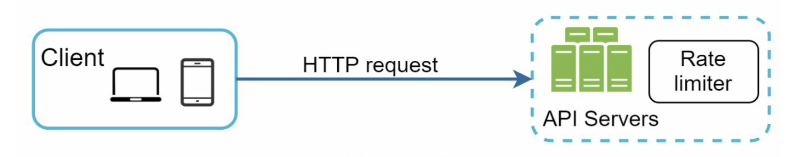
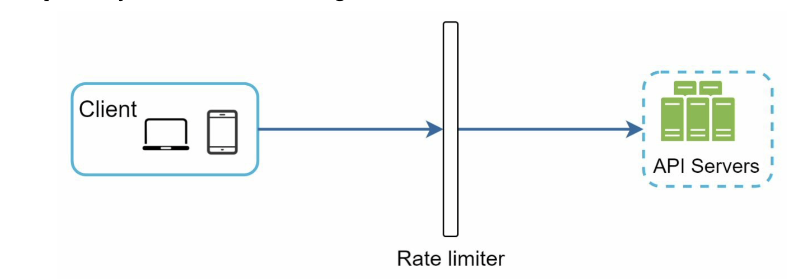
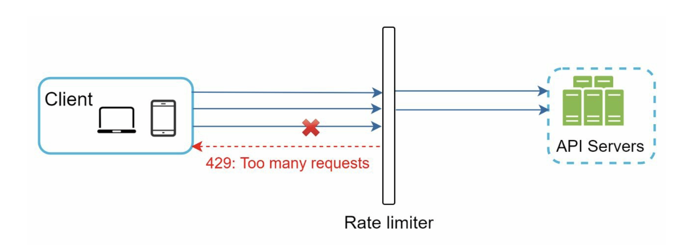
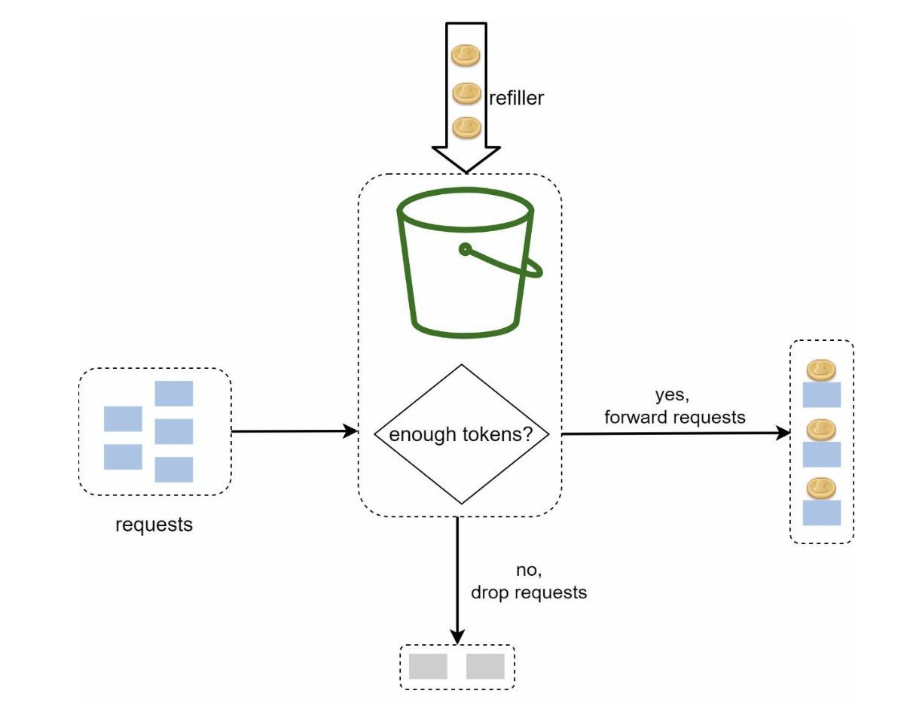
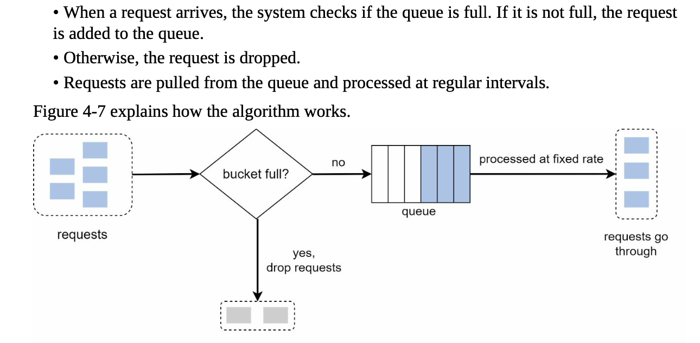
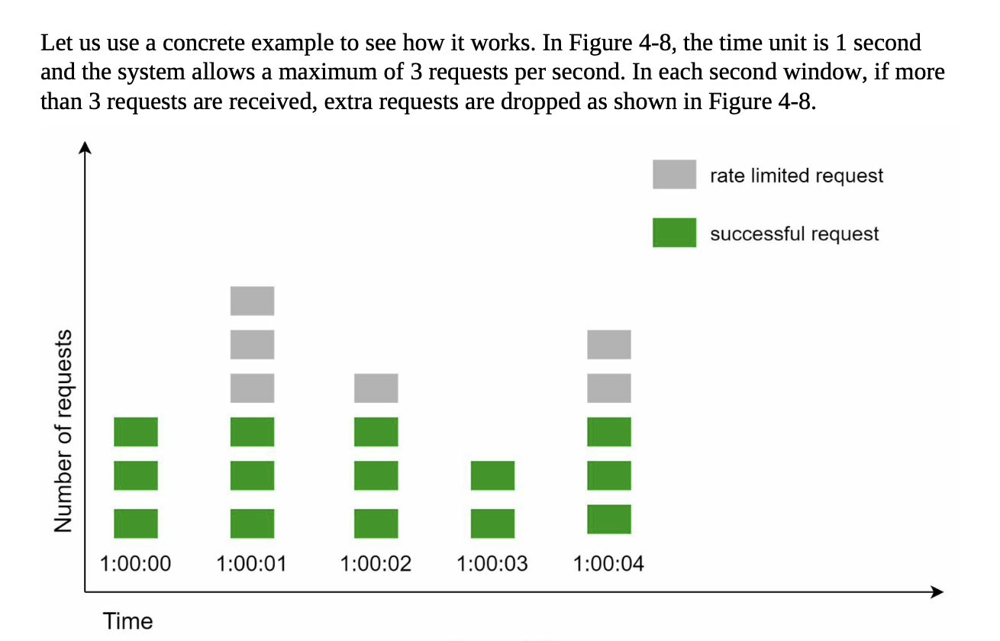
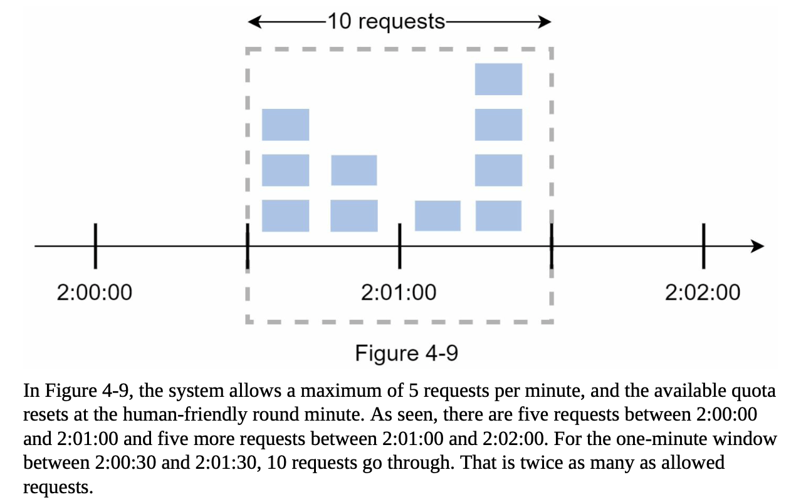
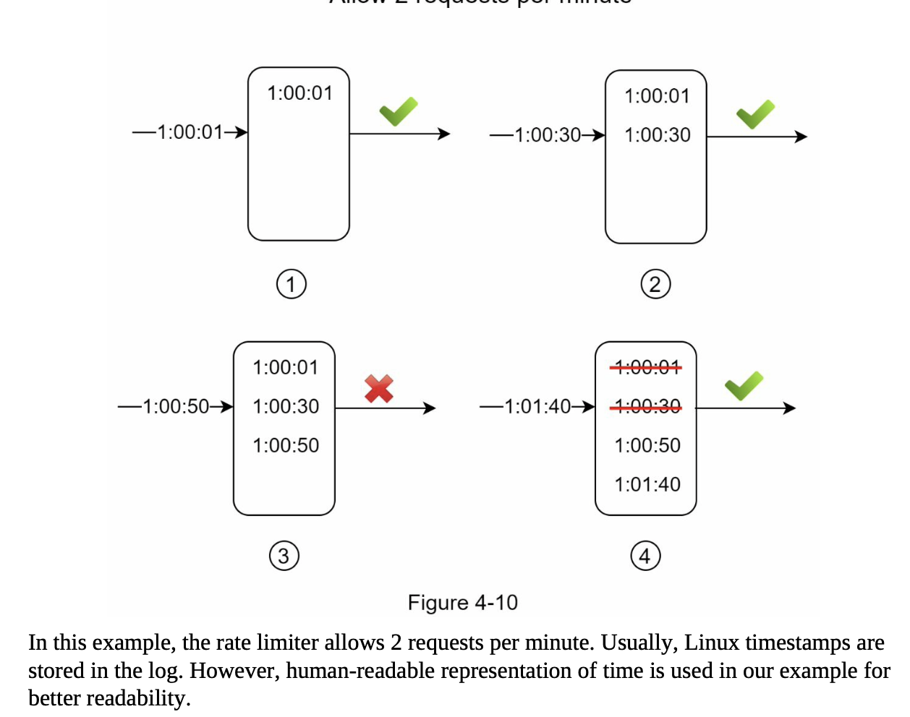
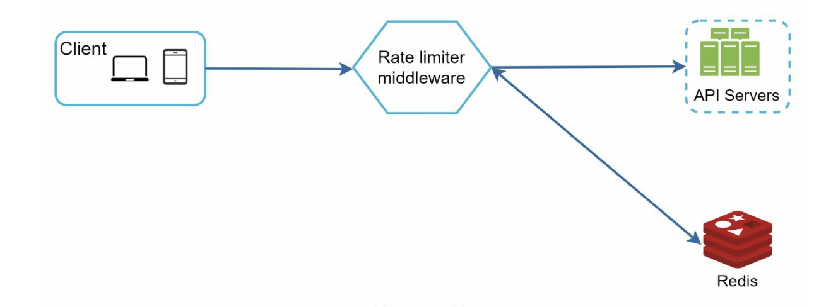

# Chapter 4: Design a Rate Limiter
- In a network system, a rate limiter is used to control the rate of traffic sent by client or a service. 
- In the HTTP world, a rate limiter limits the number of client requests allowed to be sent over a specified period. If the API request count exceeds the threshold defined by the rate limiter, all the excess calls are blocked.
    - ex1: user can write no more than 2 posts / sec
    - ex2: you can create a max of 10 accounts / day from the same IP address
    - ex3: you can claim rewards no more than 5 times / week from the same device.

- The benefits of using a rate limiter:
    - Prevent resource starvation caused by DoS (Denial of Service) attack 
    - Recude cost. Limiting excess requests means fewer servers and allocating more resources to high priority APIs. 
        - Important for companies that use paid third party APIs. 
    - Prevent servers from being overloaded.
        - Filter out excess requests caused by bots or users' misbehaviour
    
## Step 1: Understand the Problem and Establish Design Scope
- Can be implemented using different algorithms.
- Interact with the interviewer to clarify the type of rate limiters we are trying to build
    - Client-side rate limiter vs server-side API rate limiter
    - throttling API requests based on IP, the userID, or other properties?
    - Scale of the system? Startup vs larger user base?
    - Will system work in a distributed environment?
    - Is rate limiter a separate service or implemented in application code?
    - Need to inform users who are throttled?

### General requirements for the system (example):
- Accurately limit excessive requests
- Low latency. The rate limiter should not slow down HTTP response time
- Use as little memory as possible
- Distributed rate limiting. The rate limiter can be shared across multiple servers or processes.
- Exception handling. Show clear exceptions to users when their requests are throttled
- High fault tolerance. If there are any problems with the rate limiter (ex. cache server goes offline), it does not affect the entire system

## Step 2: Propose High-level Design and get Buy-in
(Below example uses a basic client and server model for communication)

### Where to put the rate limiter?
- Client-side implementation: generally an unreliable place to enforce rate limiting because client requests can easily be forged by malicious actors. We also might not have control over the client implementation
- Server-side implementation: 

- Rate limiter middleware (instead of putting at the API servers). Throttles requests to your APIs :

- For example, API allows 2 requets/s and client sends 3 requests. The first two requests are routed to API servers. The rate limiter middleware throttles the thrid request and returns a HTTP status code 429 (indicates user has sent too many requests)

- Cloud microservices usually implements rate limiting withing API gateway component. API gateway is a fully managed service that supports rate limiting, SSL termination, authentication, IP whitelisting, servicing static content, etc (think of it as a middleware that supports rate limiting)

- Where should the rate limiter be implemented, on server-side or in a gateway? (no absolute answer)
    - depends on: tech stack. engineering resources, priorities, goals, etc

### Algorithms for rate limiting
- Token bucket
- Leaking bucket
- Fixed window counter
- Sliding window log
- Sliding window counter

### Token Bucket Algorithm
- Widely used, simple, well understood. 
    - Amazon and Stripe use this algorithm to throttle their API requests

- two params:
    - Bucket size: the max number of tokens allowed in the bucket
    - Refill rate: number of tokens put into the bucket every second

- Usually necessary to have different buckets for different API endpoints
- If we need to throttle requests based on IP addresses, each IP address needs a bucket
- If the system allows max 10,000 requests per second, makes sense to have a global bucket shared by all requests

- Pros:
    - easy to implement
    - memory efficient
    - allows a burst of traffic for short periods. A request can go through as long as there are tokens left
- Cons:
    - two params might be challenging to tune them properly

### Leaking Bucket Algorithm
- Similar to token bucket, except requests are processed at a fixed rate. (usually implemented with a FIFO queue)

- Two params:
    - Bucket size: equal to the queue size. The queue holds the requests to be processed at a fixed rate
    - Outflow rate: defines how many requests can be processed at a fixed rate, usually in seconds
- Shopify

- Pros:
    - memory efficient (limited queue size)
    - requests are processed at a fixed rate. thus suitable for use cases that a stable outflow rate is needed
- Cons:
    - if a burst of traffic fills up the queue with old requests and if they are not processed in time, recent requests will be rate limited
    - two param challenging to tune properly

### Fixed Window Counter Algorithm
- Divide the timeline into fixed-sized time windows and assign a counter for each window
- Each request increments the counter by one
- Once counter reaches the pre-defined threshold, new requests are dropped until a new time window starts

- Major problem: burst of traffic at the edges of time windows could cause more requests than allowed quota to go through

- Pros:
    - memory efficient
    - easy to understand
    - resetting available quota at the end of a unit time window fits certain use cases

- Cons:
    - spike in traffic at edges of a window could cause more requests than the allowed quota to go through

### Sliding Window Log Algorithm
- Fixes fixed window counter algorithm issue
- Keeps track of request timestamps (usually kept in cahce, such as sorted sets of Redis)
- When a new request comes in, remove all the outdated timestamps. Outdated timestamps are defined as those older than the start of the current time window.
- Add timestamp of the new request to the log
- If the log size is the same or lower than the allowed count, a request is accepted. Otherwise, rejected

- Pros:
    - Rate limiting implemented by this algorithm is very accurate. In any rolling window, requests will not exceed the rate limit
- Cons:
    - The algorithm consumes a lot of memory because even if a request is rejected, its timestamp might still be stored in memory.

### Sliding Window Counter Algorithm
- Hybrid approach: fixed window counter + sliding window log

### High-Level Architecture

- Basic idea of rate limiting: we need a counter to keep track of how many requests are sent from the same user, IP address, etc. If counter is larger than the limit, the request is disallowed.
- Where to store counters?
    - DB is not a good idea (slowness of disk access)
    - In-memory cache is better because it is fast and supports time-based expiration strategy (i.e. Redis with two commands: INCR and EXPIRE)
        - INCR: increases the stored counter by 1
        - EXPIRE: sets a timeout for the counter. If the timeout expires, the counter is automatically deleted

## Step 3: Design Deep Dive
- How are rate limiting rules created? Where are the rules stored?
- How to handle requests that are rate limited?

- Hard vs soft rate limiting
    - Hard: the number of requests cannot exceed the threshold
    - Soft: requests can exceed the threshold for a short period
- Rate limiting at different levels. 
    - Rate limiting at the application level (HTTP: layer 7)
    - possible to apply rate limiting at other layers:
        - by IP addresses using Iptables (IP: layer 3)

- OSI model (Open Systems Interconnection model) has 7 layers
    - Layer 1: Physical layer
    - Layer 2: Data link layer
    - Layer 3: Network layer
    - Layer 4: Transport layer
    - Layer 5: Session layer
    - Layer 6: Presentation layer
    - Layer 7: Application layer

- Avoid being rate limited. Design your client with best practices:
    - Use client cache to avoid making frequent API calls
    - Understand the limit and do not send too many requests in a short time frame
    - Include code to catch exceptions or errors so your client can gracefully recover from exceptions
    - Add sufficient back off time to retry logic
    