# Chapter 4. Design a rate limiter

Rate limiter is used to control the rate of traffic sent by a client or a service. 
A few examples:
- A user can write no more than 2 posts per second
- You can create a maximum of 10 accounts per day from the same IP address
- You can claim rewards no more than 5 times per week from the same device

> Benefits of using an API rate limiter
- Prevent resource starvation caused by Denial of Service (DoS) attack, either intentional or unintentional, by blocking the excess calls
- Reduce cost (especially essential for companies using paid third party APIs)
- Prevent servers from being overloaded

### Step 1 - Understand the problem and establish design scope
Because rate limiting can be implemented using different algorithms, it's important to interact with interviewers.

> An example of interacting with interviewers and requirements figured out from the conversation

**Candidate(C):** What kind of rate limiter are we going to design? Is it a client-side rate limiter or server-side API rate limiter?
**Interviewer(I):** Great question. We focus on the server-side API rate limiter.
**C:** Does the rate limiter throttle API requests based on IP, the user ID, or other properties?
**I:** The rate limiter should be flexible enough to support different sets of throttle rules.
**C:** WHat is the scale of the system? Is it build for a startup or a big company with a large user base?
**I:** The system must be able to handle a large number of requests.
**C:** Will the system work in a distributed environment?
**I:** Yes.
**C:** Is the rate limiter a separate service or should it be implemented in application code?
**I:** It is a design decision up to you.
**C:** Do we need to inform users who are throttled?
**I:** Yes.

**The requirements we figured out from the interaction**
- Accurately limit excessive requests
- Low latency. The rate limiter should now slow down HTTP response time
- Use a little memory as possible
- Distributed rate limiting. The rate limiter can be shared across multiple servers or processes
- Exception handling. Show clear exceptions to users when their requests are throttled
- High fault tolerance. If there are any problems with the rate limiter (for example, a cache server goes offline), it doesn't affect the entire system

### Step 2 - Propose high-level design and get buy-in
#### Where to put the rate limiter?
We have two options; client-side or server-side.
> Client-side implementation

Client is an unreliable place to enforce rate limiting because client requests can easily be forged by malicious actors. Also we might not have control over the client implementation.
> Server-side implementation  

A rate limiter implemented on the server-side
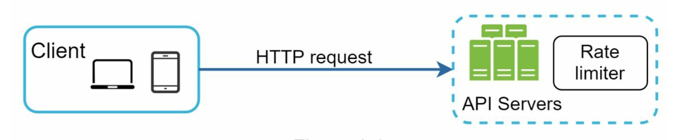

A rate limiter as a middleware
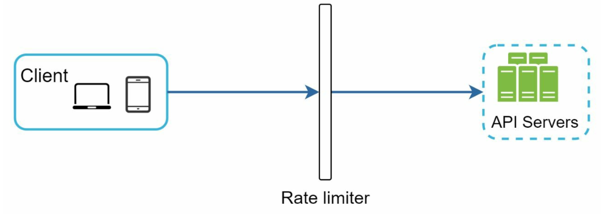

Let's assume our API allows 2 requests per second, and a client sends 3 request to the server within a second. The first two request will be routed to API servers, but the last request will be throttled by the rate limiter and it will return HTTP status code 429, which means too many requests.
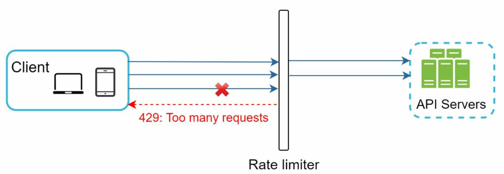

*In a cloud microservices world, rate limiting is usually implemented within a component called API gateway. For now, we only need to know that the API gateway is a middleware that supports rate limiting.*

An important question we need to ask is that where should the rate limiter be implemented, on the server-side or in a gateway? While itt depends on company's current tech stack, engineering resources, priorities, goals, etc, these are a few general guidelines:
- Evaluate the current tech stack. Make sure the current programming language is efficient to implement rate limiting on the server-side
- Identify the rate limiting algorithm that fits our business needs. We will have full control if we implement everything on the server-side, but it will be limited if we choose a third-party gateway
- We may add a rate limiter to the API gateway **if** we have already used microservice architecture and included an API gateway in the design to perform authentication, IP whitelisting, etc
- If we do not have enough engineering resources to implement a rate limiter, a commercial API gateway is a better option

#### Algorithms for rate limiting
##### 1. Token bucket algorithm
It's simple, well understood and commonly used by internet companies like Amazon and Stripe.

> How it works

A token bucket is a container that has pre-defined capacity. Tokens are put it the bucket at preset rates periodically. Once the bucket is full, extra tokens will overflow


Each request consumes one token. When a request arrives, we check if there are enough tokens in the bucket.
- If there are enough tokens, we take one token out for each request and the request goes through
- If there are not enough tokens, the request is dropped (***Q. do we consume it again later?***)
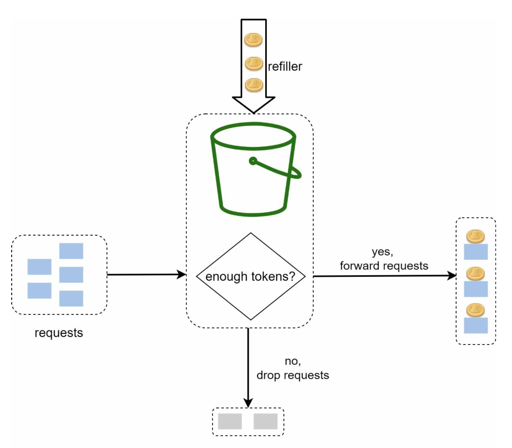

An example that token bucket size is 4, and the refill rate is 4 per minute.
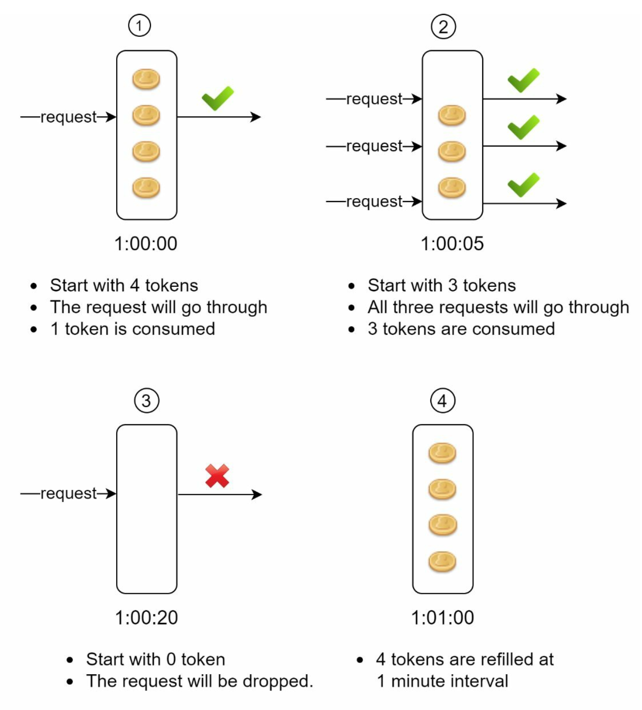

> The token bucket algorithm takes two parameters
- Bucket size: the maximum number of tokens allowed every second
- Refill rate: number of tokens put into the bucket every second

>How to decide bucket size?

- It is usually necessary to have different buckets for different API endpoints
- If we need to throttle requests based on IP addresses, each IP address requires a bucket
- If the system allows a maximum of 10,000 requests per second, it makes sense to have a global bucket shared by all requests

> Pros and Cons

Pros: 
- Easy to implement
- Memory efficient
- Allows a burst of traffic for short periods. A request can go through as long as there are tokens left

Cons:
- It might be challenging to tune the bucket size and token refill rate 

##### 2. Leaking bucket algorithm
It's similar to the token bucket algorithm but except that requests are processed at a fixed rate and implemented with a first-in-first-out(FIFO) queue.
- When a request arrives, the system checks if the queue is full
- If it's not full, the request is added to the queue
- If it's full, the request is dropped
- Requests are pulled from the queue and processed at regular intervals

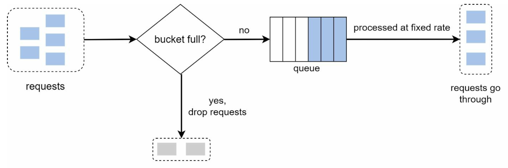

> Leaking bucket algorithm takes two parameters
- Bucket size: it is equal to the queue size. The queue holds the requests to be processed at a fixed rate
- Outflow rate: it defines how many requests can be processed at a fixed rate, usually in seconds

> Pros and Cons

Pros:
- Memory efficient given the limited queue size
- It is suitable for use cases that a stable outflow rate is needed because requests are processed at a fixed rate

Cons:
- If the queue is filled up with old requests, and if they are not processed in time, recent requests will be rate limited
- It might be challenging to tune the two parameters

##### 3. Fixed window counter algorithm
- The algorithm divides the timeline into fix-sized time windows and assign a counter for each window
- Each request increments the counter by one
- Once the counter reaches the pre-defined threshold, new request are dropped until a new time window starts

> An example that the time unit is 1 second and the system allows maximum 3 requests per second

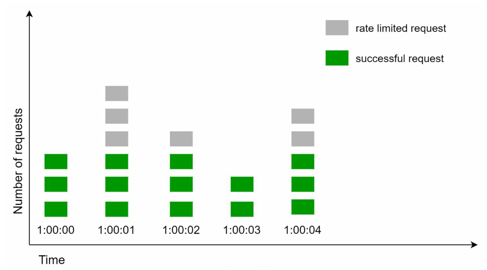

A major problem of this algorithm is that a burst of traffic **at the edges of time windows could cause more requests than allowed quota to go through.**
In the below example, between 2:00:30 and 2:01:30, 10 requests go through. It's because the available quota resets at the human-friendly round minute.

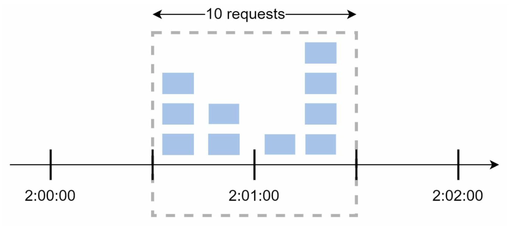

> Pros and Cons

Pros:
- Memory efficient
- Easy to understand
- Resetting available quota at the end of unit time window fits certain use cases. (**Q. is it really pros?**)

Cons:
- Spike in traffic at the edges of a window could cause more requests than the allowed quota to go through

##### 4. Sliding window log algorithm
Sliding window log algorithm fixes fixed window counter algorithm's major issue which allows more requests to go through at the edges of a window.
- The algorithm keeps track of request timestamps. Timestamp data is usually kept in cache, such as sorted sets of Redis
- When a new request comes in, remove all the outdated timestamps. Outdated timestamps are defined as those older than the start of the current time window
- Add timestamp of the new request to the log
- If the log size is the same or lower than the allowed count, a request is accepted. Otherwise, it is rejected

In the below example, the rate limiter allows 2 requests per minute. 
① The log is empty when a new request arrives at 1:00:01, so the request is allowed
② A new request arrives at 1:00:30, the timestamp 1:00:30 is inserted into the log. The log size is 2, so the request is allowed
③ A new request arrives at 1:00:50, the timestamp is inserted into the log. The log size is 3, so this request is rejected **even though th timestamp remains in the log**
④ A new request arrives at 1:01:40. Requests in the range [1:00:40, 1:01:40) are within the latest time frame, but the requests sent before 1:00:40 are outdated. Two outdated timestamps, 1:00:01 and 1:00:30, are removed from the log. The log size becomes 2, so the request is accepted 

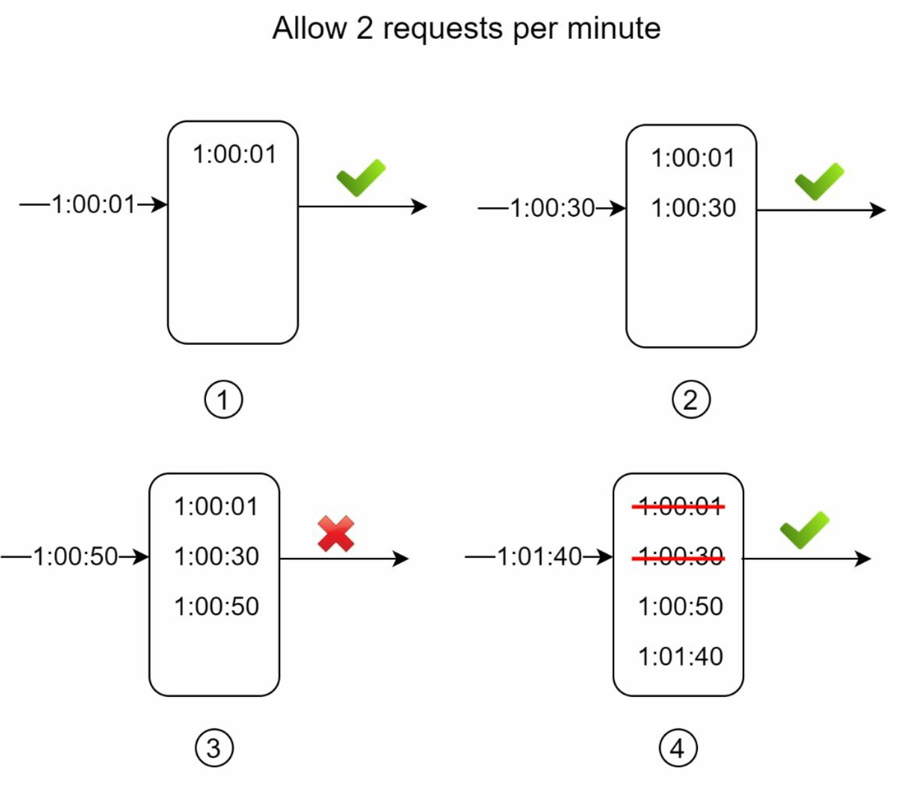

> Pros and cons

Pros:
- It's very accurate. In any rolling window, requests will not exceed the rate limit

Cons:
- It consumes a lot of memory because even if a request is rejected, its timestamp might still be stored in memory

##### 5. Sliding window counter algorithm
Hybrid approach that combines the fixed window counter and sliding window log. This algorithm can be implemented by two different approaches, but we explain only one of them for now.

In the below example, the rate limiter allows a maximum of 7 request per minute, and there are 5 requests in the previous minute and 3 in the current minute. 
The number of request in the rolling window is calculated using this formula:
- **Requests in current window + requests in the previous window * overlap percentage of the rolling window and previous window**

Using this formula, we get 3 + 5 * 0.7% = 6.5 requests. Depending on the use case, the number can be either be rounded up or down. 
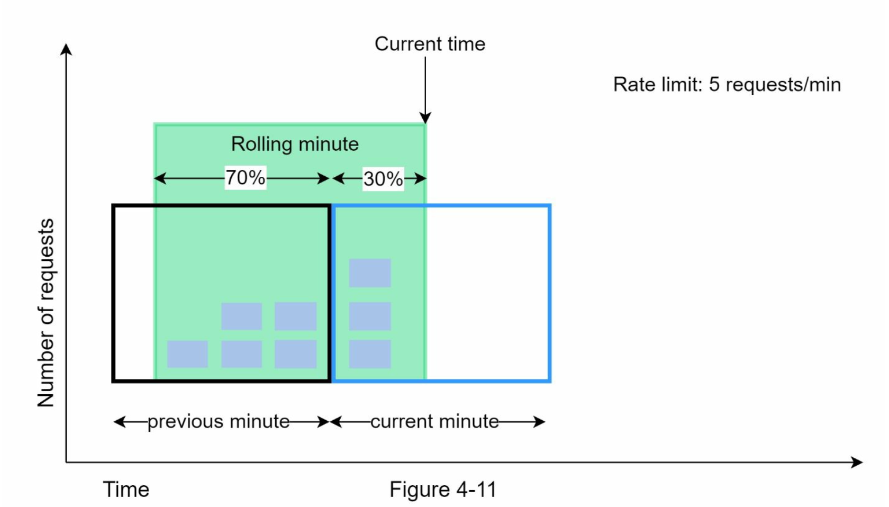

> Pros and Cons

Pros:
- It smooths out spikes in traffic because the rate is based on the average rate of the previous window
- Memory efficient

Cons:
- It only works for no-so-strict look back window. It is an approximation of the actual rate because it assumes requests in the previous window are evenly distributed. 
*But according to experiments done by Cloudflare, only 0.003% of requests are wrongly allowed or rate limited among 400 million requests*

#### High-level architecture
We need a counter to keep track of how many requests are sent from the same user, IP address, etc. IF the counter is larger than the limit, the request is disallowed.

In-memory cache is chosen to store the counters because it is fast and supports time-based expiration strategy. 

> An example of rate limiting implemented with Redis

Redis is an in-memory store that offers two commands: INCR and EXPIRE.
- INCR: It increases the stored counter by 1
- EXPIRE: It sets a timeout for the counter. If the timeout expires, the counter is automatically deleted

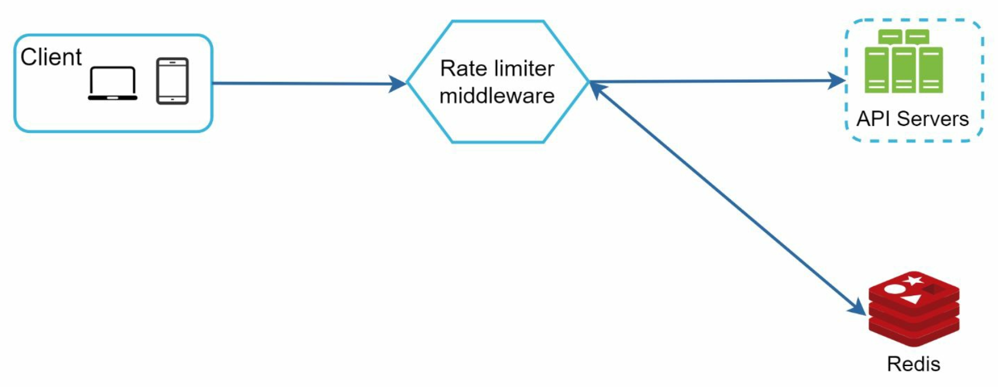
- The client sends a request to rate limiting middleware
- Rate limiting middleware fetches the counter from the corresponding bucket in Redis and checks if the limit is reached or not. 
    - If the limit is reached, the request is rejected
    - If the limit is not reached, the request is sent to API servers. Meanwhile, the system increments the counter and saves it back to Redis

### Step 3 - Design deep dive
- How are rate limiting rules created? Where are the rules stored?
- How to handle requests that are rate limited?

#### Rate limiting rules
Below is Lyft's open-sourced rate limiting component
```yaml
domain: messaging
descriptors:
    - key: message_type
      Value: marketing
      rate_limit:
        unit: day
        requests_per_unit: 5
```
Another example:
```yaml
domain: auth
descriptors: 
    - key: auth_type
      Value: login
      rate_limit:
        unit: minute
        requests_per_unit: 5
```
These kinds of rules are generally written in configuration files and saved on disk.

#### Exceeding the rate limit
If a request is rate limited, APIs return a HTTP response 429(too many requests) to the client. We may enqueue the rate-limited requests to be processed later.

##### Rate limiter headers
Clients will know whether it's being throttled or the number of allowed remaining request before being throttled by looking into HTTP response headers.

*X-Ratelimit-Remaining*: THe remaining number of allowed requests within the window
*X-Ratelimit-Limit*: It indicates how many calls the client can make per time window
*X-Ratelimit-Retry-After*: The number of seconds to wait until you can make a request again without being throttled

When a user has sent too many requests(when the request is rate limited), the user will get 429 error and *X-Ratelimit-Retry-After* header.

#### Detailed design

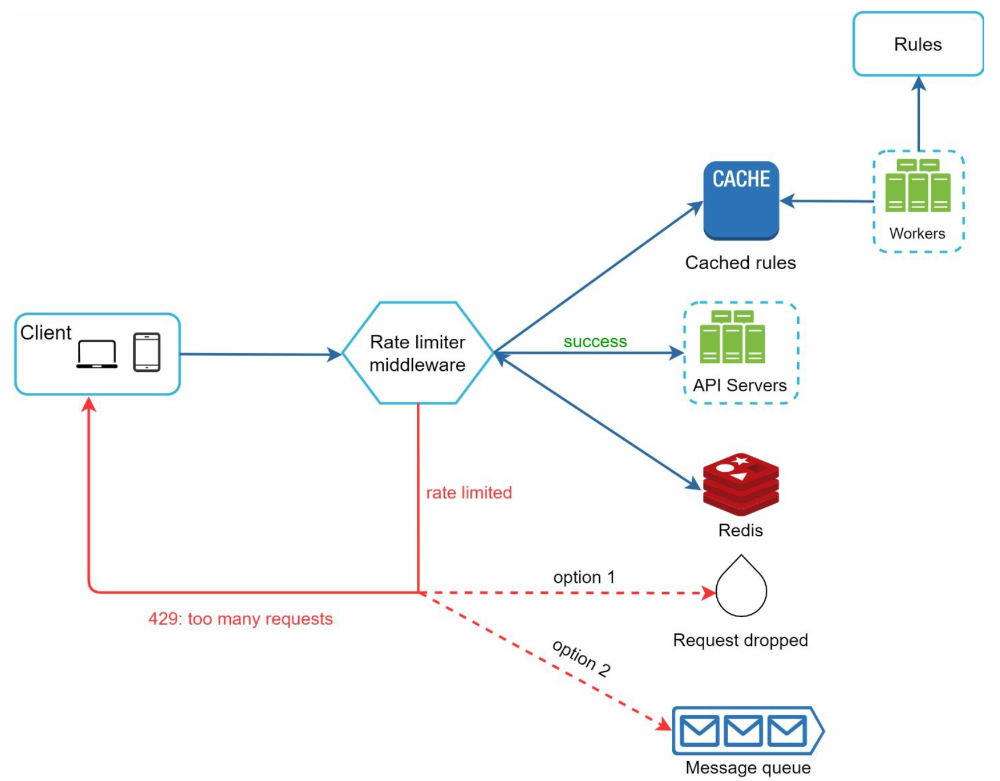
- Rules are stored on the disk. Workers frequently pull rules from the disk and store them in the cache
- When a client sends a request to the server, the request is sent to the rate limiter middleware first
- Rate limiter middleware loads rules from the cache. It fetches counters and last request timestamp from Redis cache. Based on the response, the rate limiter decides:
    - if the request is not rate limited, it is forwarded to API servers
    - if the request is rate limited, the rate limiter returns 429 requests error to the client. In the meantime, the request is either dropped or forwarded to the queue

#### Rate limiter in a distributed environment
Building a rate limiter in a single server environment is not difficult. But scaling the system to support multiple servers and concurrent threads is a different story.
Two challenges we will encounter:
- Race condition
- Synchronization issue

##### Race condition
Rate limiter
- reads the counter value from Redis
- check if (counter + 1) exceeds the threshold
- if not, increment the counter value by 1 in Redis

Below example shows the race condition can happen in a highly concurrent environment.
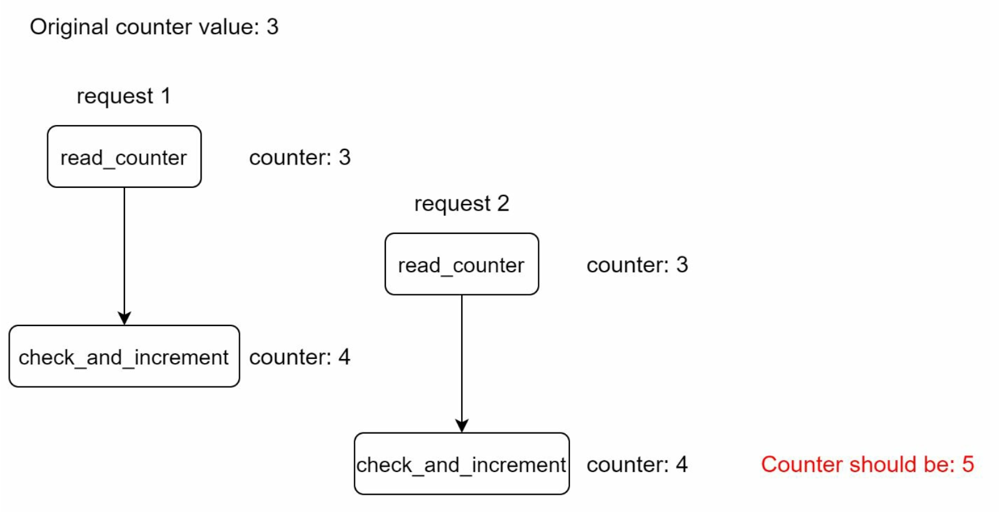
Locks are the most obvious solution for solving race condition. However, locks will significantly slow down the system. Two common strategies to solve this problem are:
- Lua script 
- Sorted sets data structure in Redis

#### Synchronization issue
To support millions of users, one rate limiter server might not be enough to handle the traffic. When multiple rate limiter servers are used, synchronization is required.

In the below example, because web tier is stateless, clients can send requests to a different rate limiter even when its first request sent to the another one. If no synchronization happens, rate limiter 1 does not contain any data about client 2.
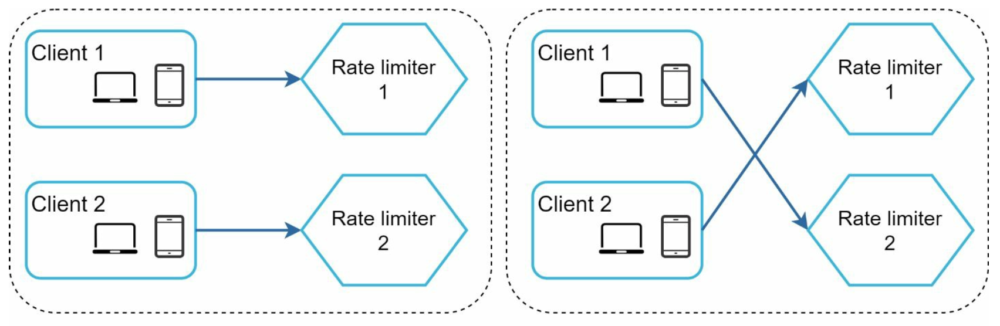

One possible solution is to use sticky sessions that allow a client to send traffic to the same rate limiter. But this is not scalable or flexible. A better approach is to use centralized data stores like below.
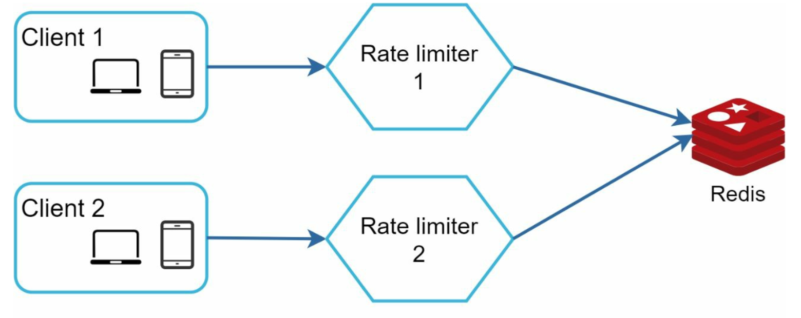

#### Performance optimization
Two areas to improve:
- **Multi-data setup**: it's crucial for a rate limiter because latency is high for users located far away from the data center
- **Synchronization of data with an eventual consistency model**

#### Monitoring
By monitoring rate limiter's performance, we want to make sure:
- The rate limiting algorithm is effective
    - It could be ineffective when there is a sudden increase in traffic
- The rate limiting rules are effective
    - If the rules are too strict, many valid requests are dropped

### Step 4 - Wrap up
We discussed 
- different algorithms and its pros/cons
- system architecture
- rate limiter in a distributed environment
- performance optimization and monitoring

There are more talking points we can mention if time allows:
- Hard vs soft rate limiting
    - **Hard**: The number of requests cannot exceed the threshold
    - **Soft**: Requests can exceed the threshold for a short period
- Rate limiting at different levels
    - Rate limiting can be applied at other layers rather than HTTP(layer 7)
        - IP address(layer 3)
- Avoid being rate limited. Design our client with best practices:
    - Use client cache to avoid making frequent API calls
    - Understand the limit and do not send too many requests in a short time frame
    - Include code to catch exceptions or errors so our client can gracefully recover from exceptions
    - Add sufficient back off time to retry logic