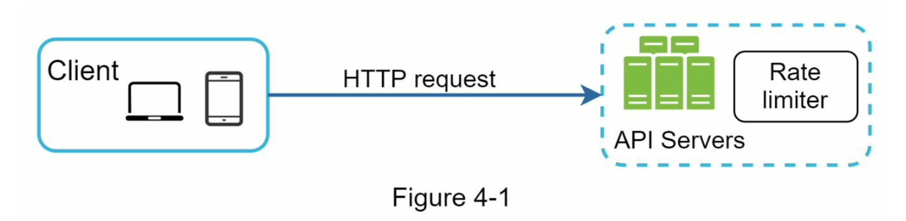
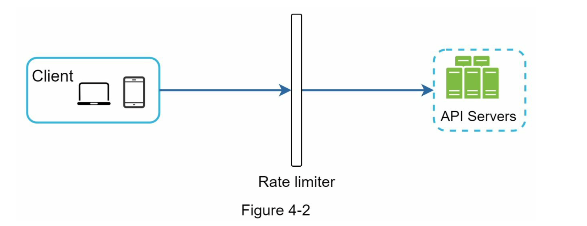
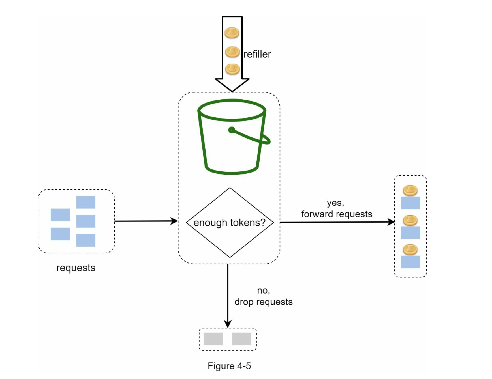
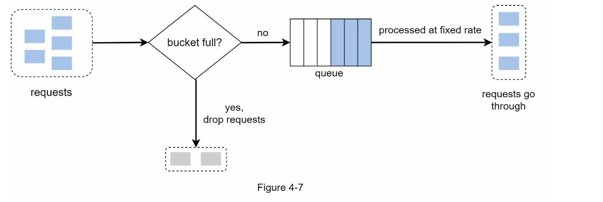

# Ch 4. Design a Rate Limiter

- In a network system, a rate limiter is used to control the rate of traffic sent by client or a service.
- In the HTTP world, a rate limiter limits the number of client requests allowed to be sent over a specified period. If the API request count exceeds the threshold defined by the rate limiter, all the excess calls are blocked.

**Benefits of using an API rate limiter:**

1. Prevent resource starvation caused by DoS (Denial of Service) attack

- Almost all tech companies enforce some form of rate limiting.

2. Reduce cost.

- Limiting excess requests means fewer servers and allocating more resources to high priority APIs.
- Important for companies that use paid third party APIs.

3. Prevent servers from being overloaded.

- Filter out excess requests caused by bots or users' misbehaviour

## Step 1. Understand the problem and establish design scope

**Requirements:**

1. Accurately limit excessive requests.

2. Low latency. The rate limiter should not slow down HTTP response time

3. Use as little memory as possible

4. Distributed rate limiting. The rate limiter can be shared across multiple servers or processes.

5. Exception handling. Show clear exceptions to users when their requests are throttled

6. High fault tolerance. If there are any problems with the rate limiter (e.g. cache server goes offline), it does not affect the entire system

## Step 2. Propose high-level design and get buy-in

### **1. Where to put a rate limiter**

You can implement a rate limiter at either client or server-side.

1. Client-side implementation: Client is an unreliable place to enforce rate limiting because client requests can easily be forged by malicious actors.

2. Server-side implementation

- A rate limiter placed on the server-side

- Instead of putting a rate limiter at the API servers, we create a rate limiter **middleware**, which throttles requests to your APIs. (Status code 429). Cloud microservices have become widely popular and rate limiting is usually implemented within a component called **API gateway.** API gateway is a fully managed service that supports rate limiting, SSL termination, authentication, IP whitelisting, servicing static content, etc. For now, we only need to know that the API gateway is a middleware that supports rate limiting.

**Things to consider when designing a rate limiter:**

- Evaluate your current technology stack, such as programming language, cache service, etc. Make sure your current programming language is efficient to implement rate limiting on the server-side.
- Identify the rate limiting algorithm that fits your business needs. When you implement everything on the server-side, you have full control of the algorithm. However, your choice might be limited if you use a third-party gateway.
- If you have already used microservice architecture and included an API gateway in the design to perform authentication, IP whitelisting, etc., you may add a rate limiter to the API gateway.
- Building your own rate limiting service takes time. If you do not have enough engineering resources to implement a rate limiter, a commercial API gateway is a better option.

### **2. Algorithms for rate limiting**

Rate limiting can be implemented using different algorithms, and each of them has distinct pros and cons.

- Token bucket
- Leaking bucket
- Fixed window counter
- Sliding window log
- Sliding window counter

**1) Token Bucket**

**Pros:**

- The algorithm is easy to implement.
- Memory efficient.
- Token bucket allows a burst of traffic for short periods. A request can go through as long
  as there are tokens left.

**Cons:**

- Two parameters in the algorithm are bucket size and token refill rate. However, it might

be challenging to tune them properly.

**2) Leaking bucket**

Leaking bucket algorithm takes the following two parameters:

- **Bucket size**: it is equal to the queue size. The queue holds the requests to be processed at
  a fixed rate.
- **Outflow rate**: it defines how many requests can be processed at a fixed rate, usually in
  seconds.

Shopify, an ecommerce company, uses leaky buckets for rate-limiting

**Pros:**

- Memory efficient given the limited queue size.
- Requests are processed at a fixed rate therefore it is suitable for use cases that a stable
  outflow rate is needed.

**Cons:**

- A burst of traffic fills up the queue with old requests, and if they are not processed in
  time, recent requests will be rate limited.
- There are two parameters in the algorithm. It might not be easy to tune them properly.

**3) Fixed window counter algorithm**

**Pros:**

- Memory efficient.
- Easy to understand.
- Resetting available quota at the end of a unit time window fits certain use cases.

**Cons:**

- Spike in traffic at the edges of a window could cause more requests than the allowed
  quota to go through.

**4) Sliding window log algorithm**

- The algorithm keeps track of request timestamps. Timestamp data is usually kept in cache, such as sorted sets of Redis.
- When a new request comes in, remove all the outdated timestamps. Outdated timestamps are defined as those older than the start of the current time window.
- Add timestamp of the new request to the log.
- If the log size is the same or lower than the allowed count, a request is accepted. Otherwise, it is rejected.

**Pros:**

- Rate limiting implemented by this algorithm is very accurate. In any rolling window, requests will not exceed the rate limit.

**Cons:**

- The algorithm consumes a lot of memory because even if a request is rejected, its timestamp might still be stored in memory.

**5) Sliding window counter algorithm**

a hybrid approach that combines the fixed window counter and sliding window log.

Pros

- It smooths out spikes in traffic because the rate is based on the average rate of the previous window.
- Memory efficient.

Cons

- It only works for not-so-strict look back window. It is an approximation of the actual rate because it assumes requests in the previous window are evenly distributed. However, this problem may not be as bad as it seems. According to experiments done by Cloudflare, only 0.003% of requests are wrongly allowed or rate limited among 400 million requests.

## Step 3. Design deep dive

Two questions unanswered from high level design

- How are rate limiting rules created? Where are the rules stored?
- How to handle requests that are rate limited?

## Detailed design

- Rules are stored on the disk and cached.
- Rate limiter middleware loads rules from the cache. If fetches counters and last request timestamp from Redis cache.

### Rate limiter in a distributed environment

- Race condition
- Sync issue

### Race condition

- Lock, lus script, sorted set

### Sync issue

- Using in memory DB

### Performance optimization

- Multi-data center setup
- Eventual consistency

### Monitoring

- Effectiveness of the algorithm
- Effectiveness of the rules

# Step 4 - Wrap up

- Hard vs soft rate limiting
- Rate limiting at different levels
  - HTTP, IP, etc
- Avoid being rate limited
  - Client cache
  - Client not sending too many requests
  - Catch exceptions and handel well
  - Back off
