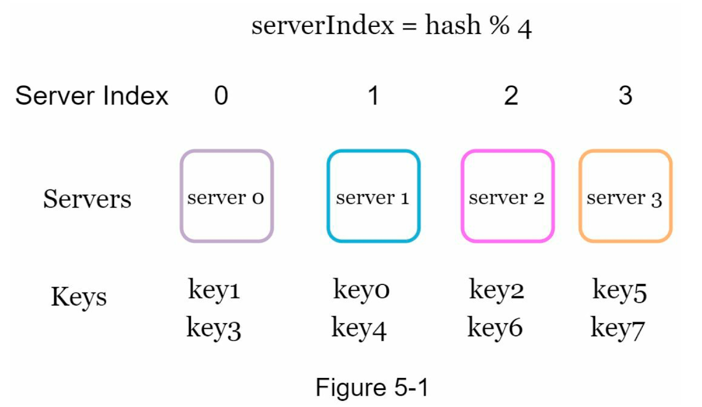
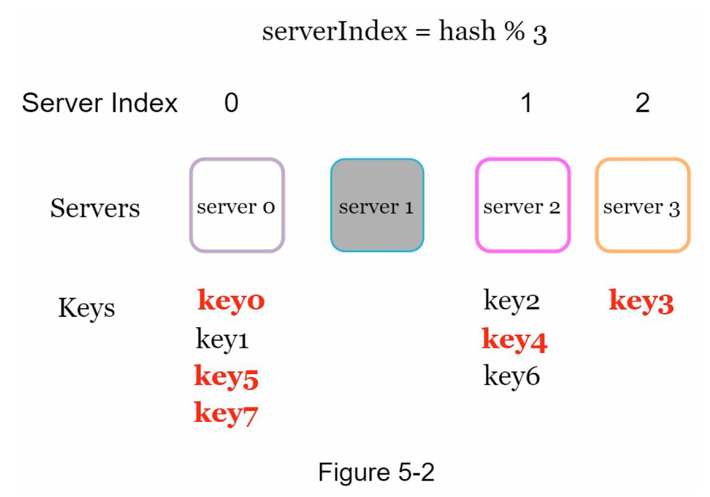
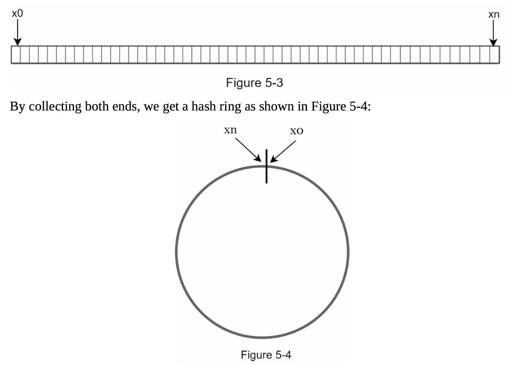
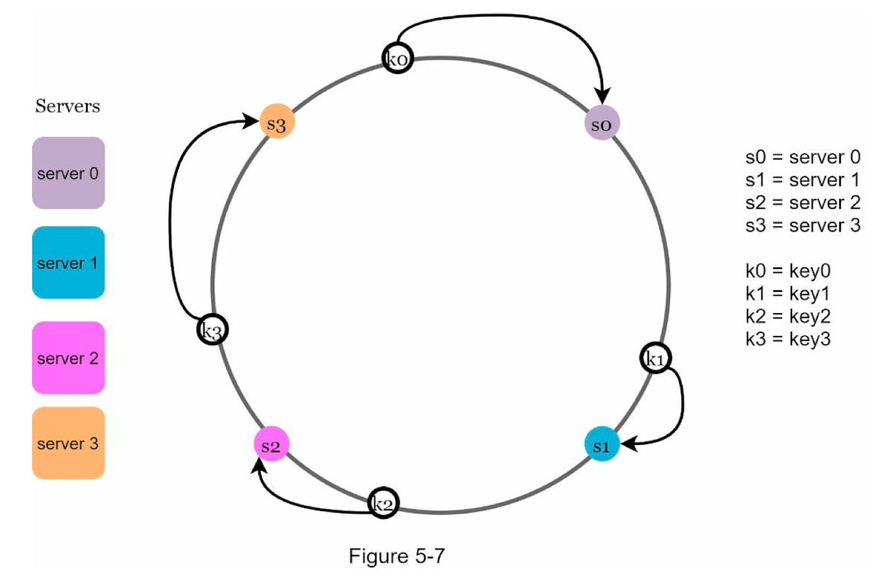
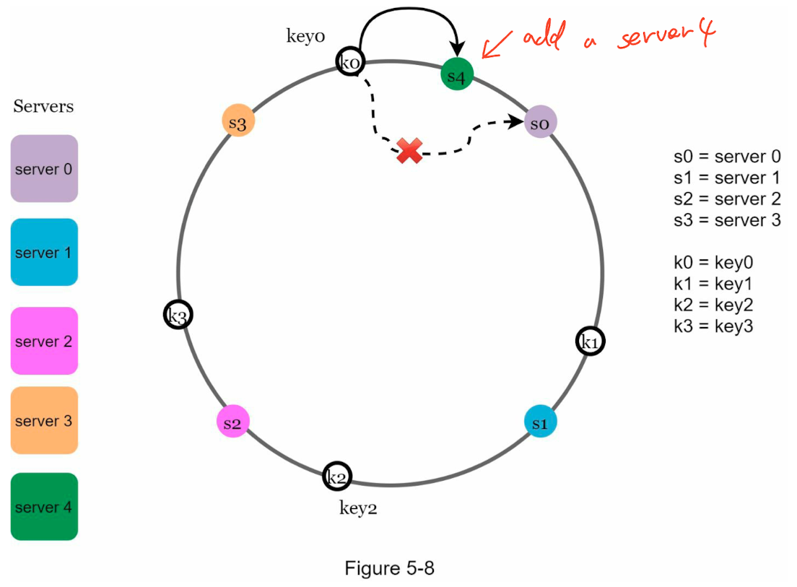
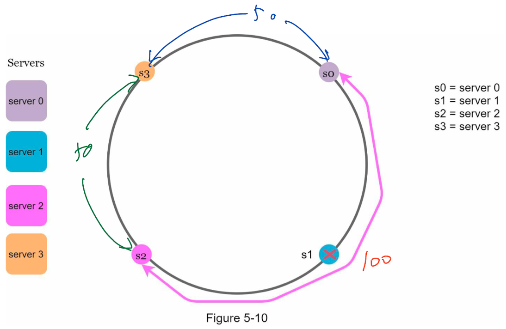
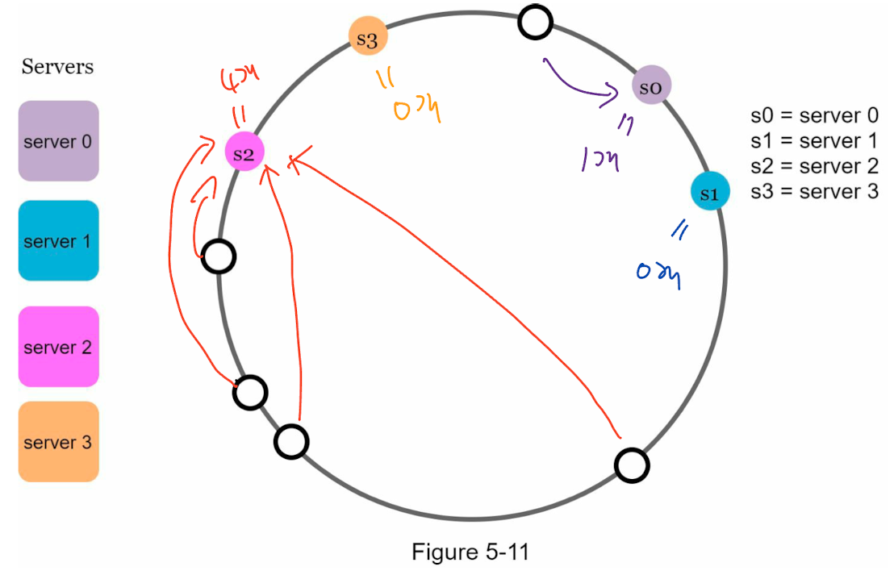
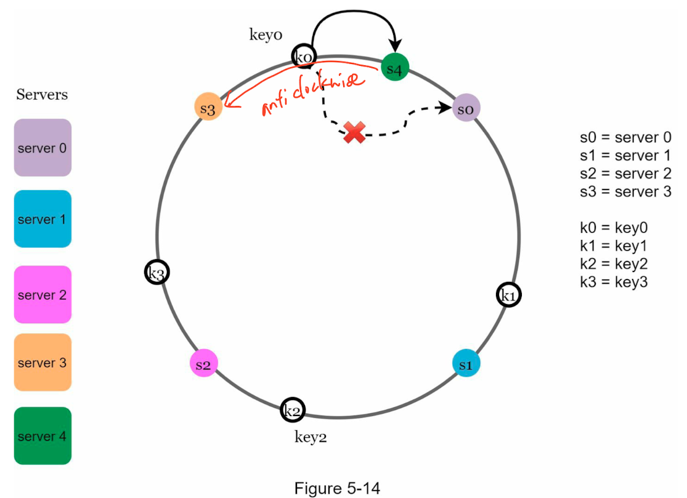

# CHAPTER 5: DESIGN CONSISTENT HASHING
## The rehashing problem 
- serverIndex = hash(key) % N, where N is the size of the server pool. 

- However, problems arise when new servers are added, or existing servers are removed.
- 

## Consistent hashing

### Server lookup

### Add a server

### Remove a server

### Two issues in the basic approach
1. It is impossible to keep the same size of partitions on the ring for all servers considering a server can be added or removed.

2. It is possible to have a non-uniform key distribution on the ring.

### Virtual nodes

### Find affected keys
- Add a server

- Remove a server

Wrap up
-  The benefits of consistent hashing include:
  - Minimized keys are redistributed when servers are added or removed.
  - It is easy to scale horizontally because data are more evenly distributed.
  - Mitigate hotspot key problem.