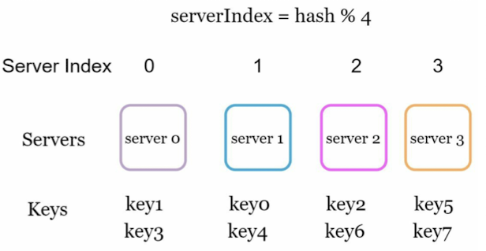
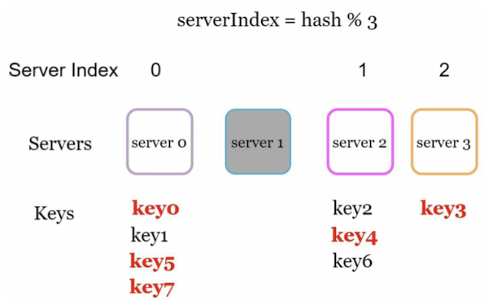
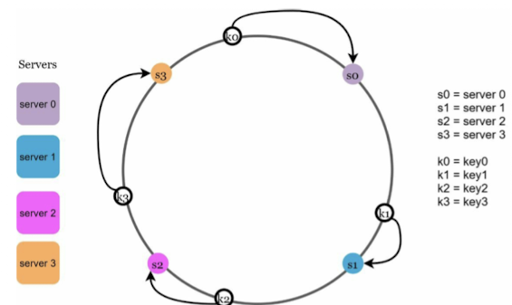
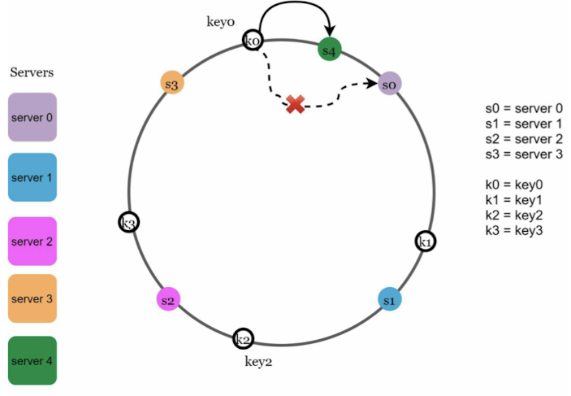
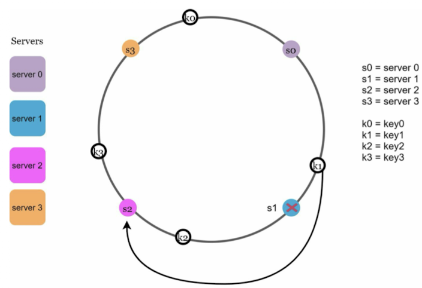
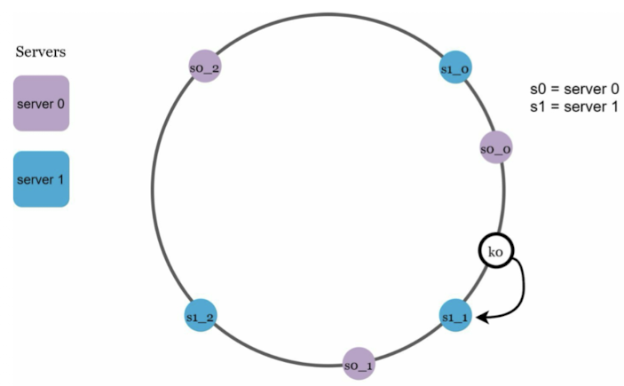

# Chapter 5. Design consistent hasing

## The rehasing problem
- serverIndex = hash(key) % N, where N is the size of the server pool
1. Example
    - 
    - This approache works weel when the size of the server pool is fixed
    - However, problems arise when new servers are added, or existing servers are removed. (distributed system)
    - 
    - Consistent hashing is an effective technique to mitigate this problem.

## Consistent hashing
- Wikipedia:
```
Consistent hashing is a special kind of hashing such that when a hash table is re-sized and consistent hashing is used, only k/n keys need to be remapped on average, where k is the number of keys, and n is the number of slots.
```
- Map servers and keys on to thre ring using a uniformly distributed hash function.
- To find out which server a key is mapped to, go clockwise from the key position until the first server on the ring is found.

### Hash space and hash ring
- Assumption: SHA-1 is used a the hash function f, and the output rage of the hash function is: x0, x1, ..., xn.

### Hash servers
- Assumption: Using the same hash function f, we map servers based on server IP or name onto the ring.

### Hash keys
- There is no modular operation. Cache keys are hashed onto the hash ring.

### Server lookup
- To determine which server a key is stored on, we go clockwise from the ky position on the ring until a server is found.
    - 

#### Scenario
##### Add a server
- 
- After a new server 4 is added, only key0 needs to be redistributed, k1, k2, and k3 remain on the same server.

##### Remove a server
- 
- When a server is removed, only a small fraction of keys require redistribution which consistent hashing. When server 1 is added. only key1 must be remapped to server 2. The rest of the keys are unaffected.

### Issues in the basic approach
1. It is impossible to keep the same size of partitions on the ring for all servers considering a server can be added or removed. It is possible that the size of the partitions on the ring assigned to each server is very small or firly large.
2. It is possible to have a non-uniform key distribution on the ring.\

#### Virtual nodes
- 
- As the number of virtual nodes increase, the distibution of keys becomes more balanced. This is because the standar deviation gets smaller with more virtual nodes, leading to balanced data distribution. (Standard deviation measures how data are spread out.)


#### Find affected keys
- Move anticlockwise around the ring until a server is found.

### 4. Wrap up
- The benefits of consistent hashing include:
    * Minimized keys are redistributed when servers are added or removed.
    * It is easy to scale horizontally because data are more evenly distributed.
    * Mitigate hotspot key problem. Excessive access to a specific shard could cause server overload.
- Real world examples:
    * Partitioning component of Amazon's Dynamo database.
    * Data partitioning across the cluster in Apache Cassandra.
    * Discord chat application.
    * Akamai content delivery network.
    * Maglev network load balancer.