# 05. Design Consistent Hashing

To achieve horizontal scaling, it is important to distribute requests/data efficiently and evenly across servers. Consistent hashing is a commonly used technique to achieve this goal.

## The rehashing problem

> serverIndex = hash(key) % N, where N is the size of the server pool.

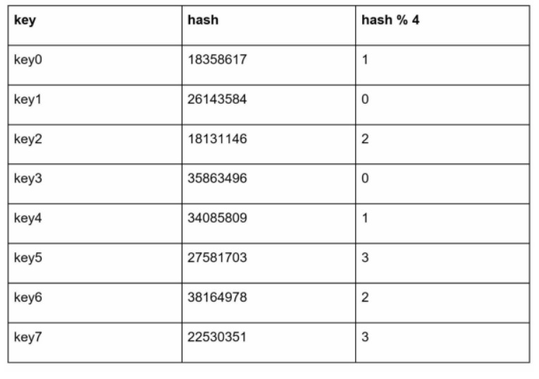

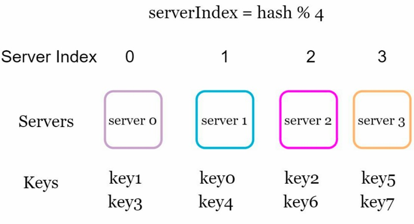

This approach works well. However, problems arise when new servers are added.

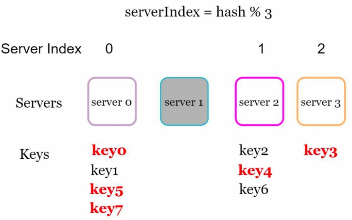

Most keys are redistributed, not just the ones originally stored in the offline server. Consistent hashing is an effective technique to mitigate this problem.

## Consistent hashing

Consistent hashing is a special kind of hashing such that when a hash table is re-sized and consistent hashing is used, only k/n keys need to be remapped on average, where k is the number of keys, and n is the number of slots.

### Hash space and hash ring

 Assume SHA-1 is used as the hash function f, and the output range of the hash function is: x0, x1, x2, x3, …, xn. In cryptography, SHA-1’s hash space goes from 0 to 2^160 - 1. 

- Hash space

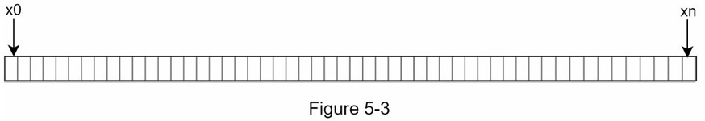

- By connecting both ends, we get a hash ring.

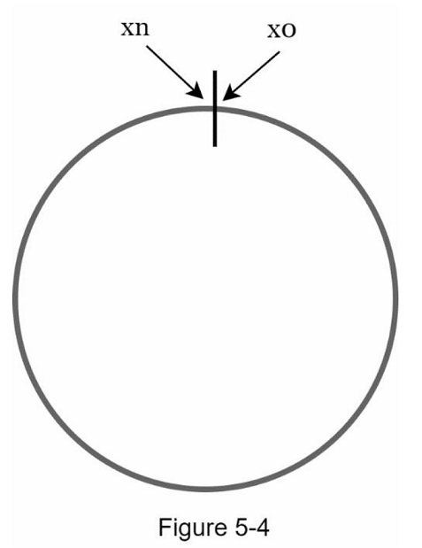

### Hash servers

Using the same hash function f, we map servers based on server IP or name onto the ring.

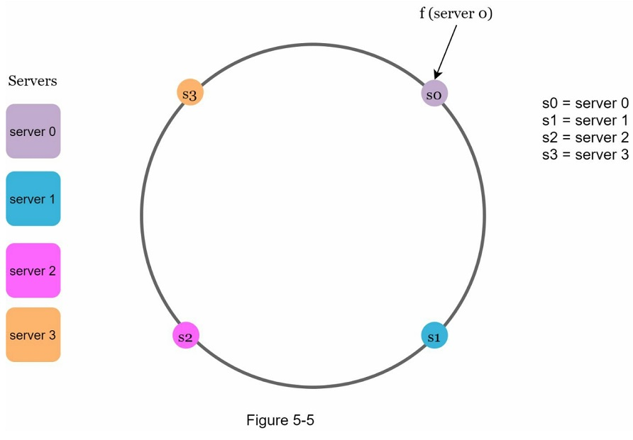

### Hash keys

One thing worth mentioning is that hash function used here is different from the one in “the rehashing problem,” and there is no modular operation.

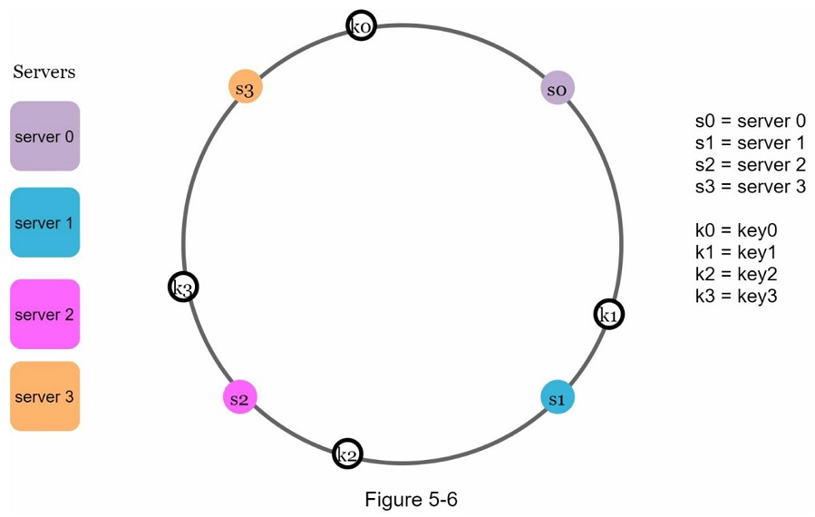

### Server lookup

To determine which server a key is stored on, we go clockwise from the key position on the ring until a server is found.

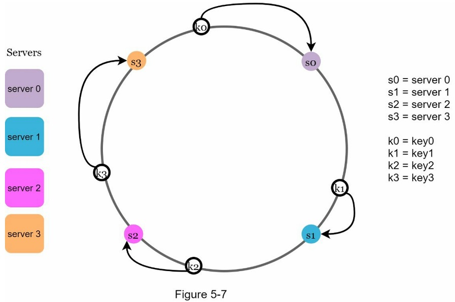

### Add a server

Adding a new server will only require redistribution of a fraction of keys.

### Remove a server

When a server is removed, only a small fraction of keys require redistribution with consistent hashing.

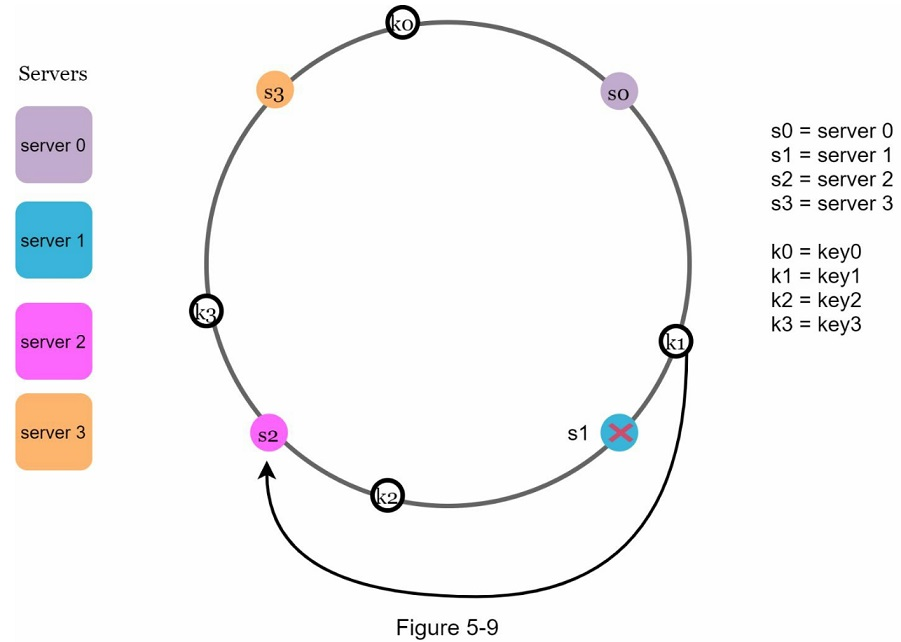

### Two issues in the basic approach

There are 2 problems.

- First, it is impossible to keep the same size of partitions on the ring for all servers considering a server can be added or removed.

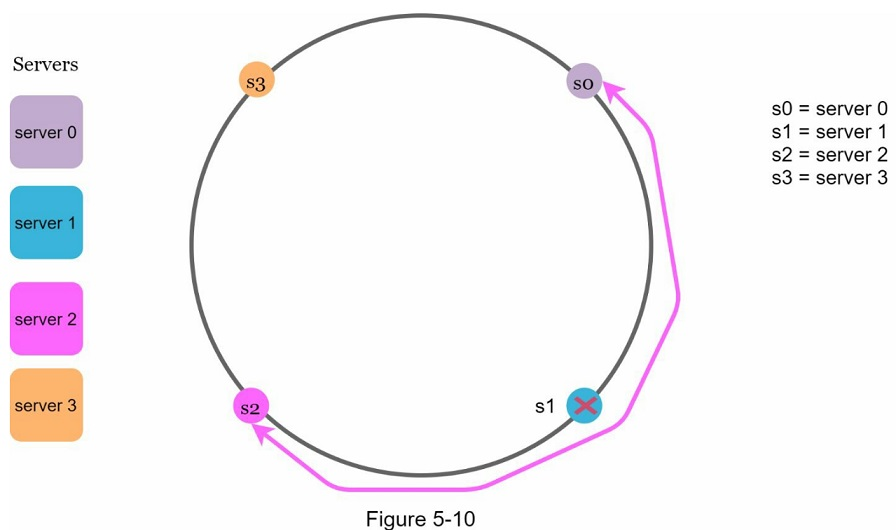

- Second, it is impossible to have a non-uniform key distribution on the ring. 

### Virtual nodes

A virtual node refers to the real node, and each server is represented by multiple virtual nodes on the ring.

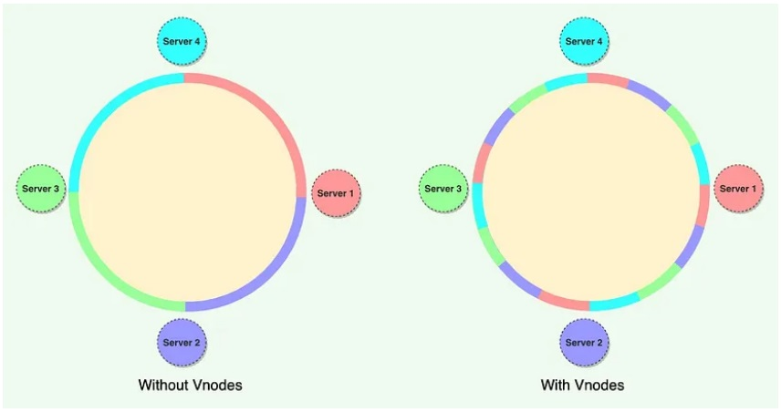

To find which server a key is stored on, we go clockwise from the key's location and find the first virtual node encountered on the ring.

- As the number of virtual nodes increase, the distribution of keys becomes more balanced.

### Find affected keys

When a server is added or removed, a fraction of data needs to be redistributed. 

- When a new server is added onto the ring, the affected range starts from newly added node and anticlockwise around the ring until a server is found.
- When a server is removed, the affected range starts from removed node and moves anticlockwise around the ring until a server is found.

## Wrap up

The benefits of consistent hashing

- Minimized keys are redistributed when servers are added or removed.
- It is easy to scale horizontally because data are more evenly distributed.
- Mitigate hotspot key problem.

Consistent hashing is widely used in real-world systems.

- Partitioning component of Amazon's Dynamo database
- Data partitioning across the cluster in Apache Cassandra
- Discord chat application
- Akamai content delivery network
- Maglev network load balancer