# Chapter 5: Design Consistent Hashing
- Horizaontal scaling
  - It is important to distribute request/data efficiently and evenly across servers
  - Consistent hasing is a commonly used technique to achieve

## The rehasing problem
- N cache servers, a common way to balance the load is to use the following hash method
```
serverIndex = hash(key) % N, where N is the size of the server pool
```

- Example
  - 4 servers, 8 string keys with their hashes.
  - To fetch the server where a key is stored => f(key) % 4
  - For instance, hash(key0) % 4 = 1, means a client must contact server 1 to fetch the cacehed data.


- Distribution of keys based on the Table 5-1
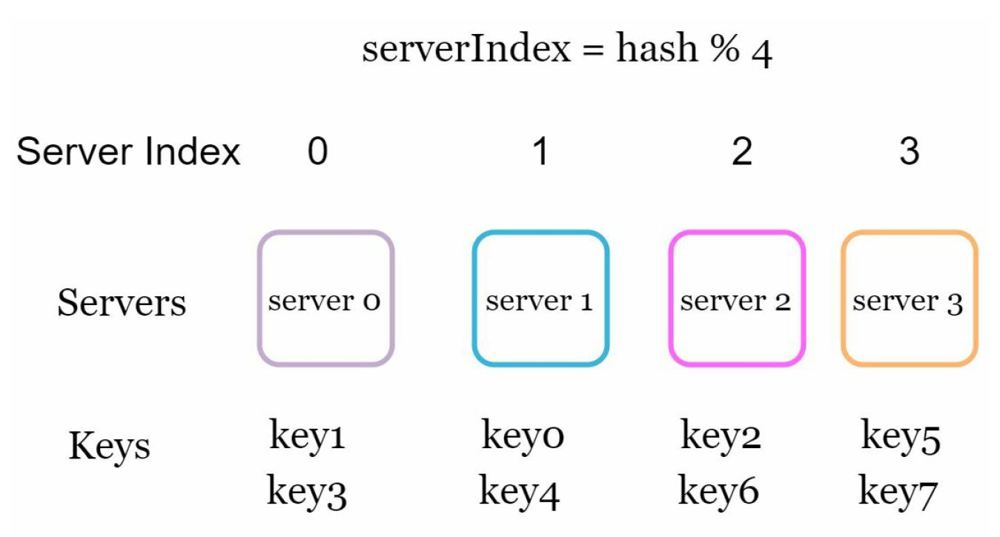

- It works well when the size of the server pool is fixed, and the data distribution is even
- Problems
  - When new servers are added
  - Existing servers are removed
  - Example
    - If sever 1 goes offline, the size of the server pool becomes 3
    - Index number is changed since the number of servers is reduces by 1

- Result Table after applying hash % 3
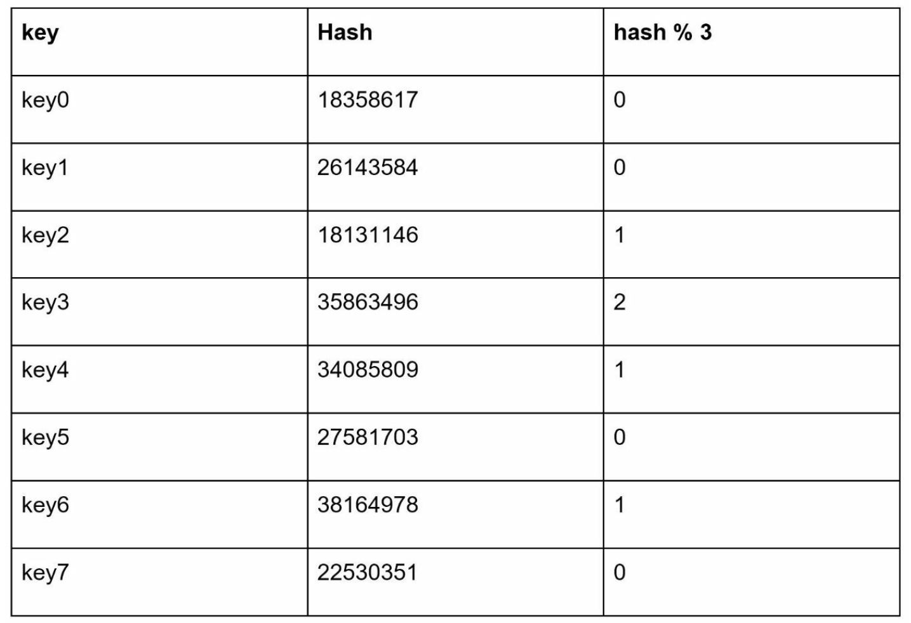

- Result of new distribution of keys
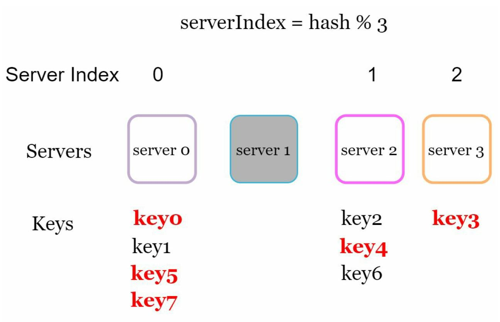

- Most keys are redistributed, not just the ones originally stored in the offline server. 
### Consistent hashing
- Quoted from Wikipedia: Consistent hashing is a special kind of hashing such that when a hash table is re-sized and consistent hashing is used, only k/n keys need to be remapped on average, where k is the number of keys, and n is the number of slots. In contrast, in most traditional hash tables, a change in the number of array slots causes nearly all keys to be remapped

## Hash space and hash ring
- Assume SHA-1 is used as the hash function f
- The output range of the hash function is : x0, x1, x2, ... xn
- In crytography, SHA-1's hash scope : 0 to 2^160 - 1
  - x0 -> 0
  - xn -> 2^160 - 1
  - All the other hash values in the middle fall between 0 to 2^160

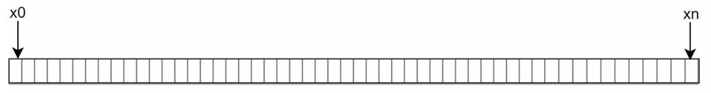
- By collecting both ends, we get a hash ring
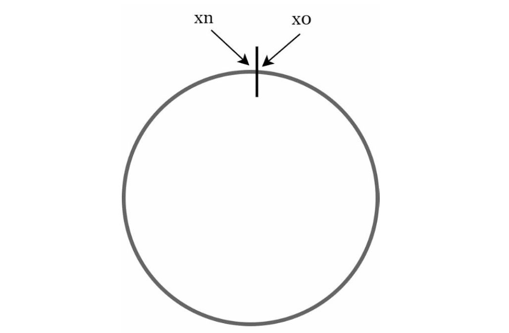


### Hash servers
- Using the same hahs function f, we map servers based on the IP or name onto the ring
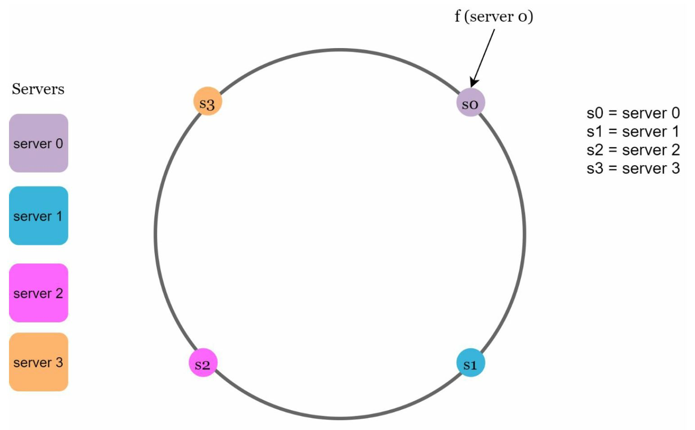

### Hash kyes
- The hash function used here is different from the one in  "the rehasing problem"
- No modular operation.
- Cache keys (key0, key1, key2, key3) are hashed onto the hash ring
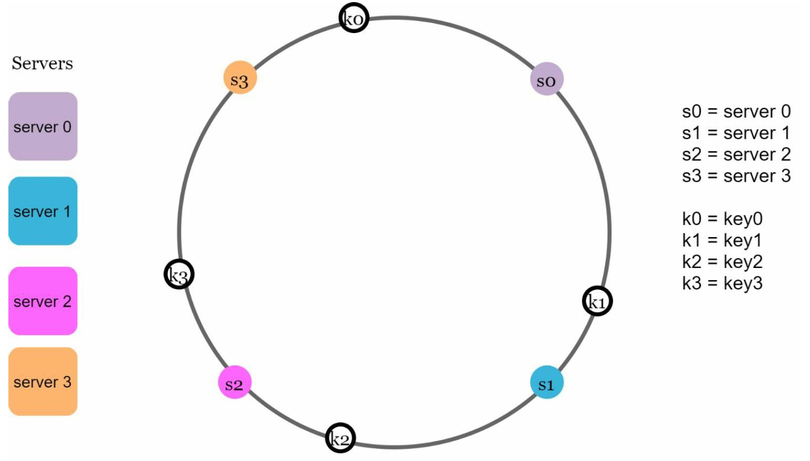

### Sever lookup
- To determine which server a key is stored on
  - We go clockwise from the key position on the ring until a server is found
- Example 
  - Going clockwise, key0 is stored on server0
  - key1 is stored on server1
  - key2 is stored on server2
  - key3 is stored on server3
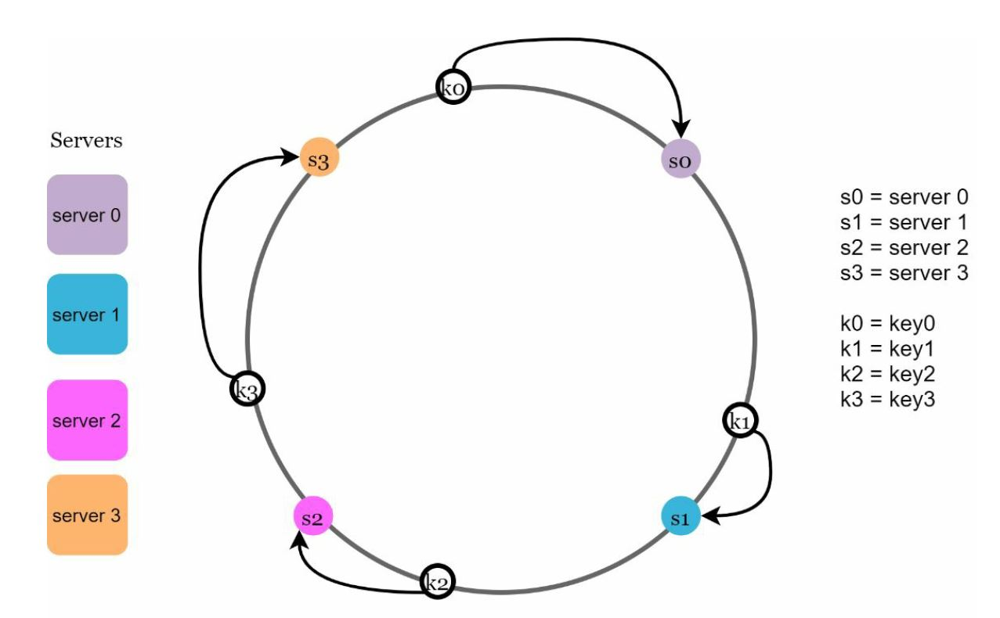

### Add a server
- Adding a new server will only require redistirubtion of a fraction of keys
- A new server4 is added
  - Only key0 needs to be redistributed. 
  - k1, k2 and k3 remain on the same server
- Explain of this logic
  - Before server4 is added, key0 is stored on server0
  - Now, key0 will be stored on server4 because server4 is the first server it encounters by going clockwise from key0's position on the ping.
  - The other keys are not distributed based on consistent hashing algorithm
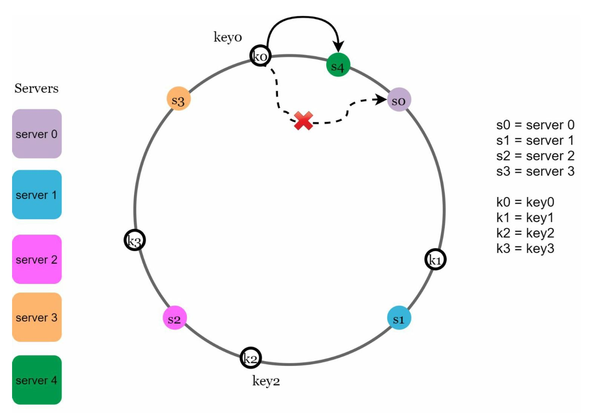

### Remove a server
- When a server is removed, only a small fraction of keys require redistribution with consistent hashing
- When server1 is removed, only key1 must be remapped to server2
- The rest of the keys are unaffected.
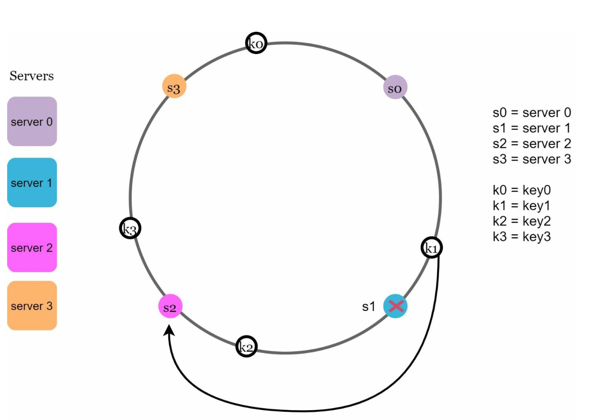


### Two issues in the basic approach
- The consistent hashing algorithm was introduced by Karger et al. at MIT. 
- The basic steps
  - Map servers and keys on the ring using a uniformly distributed hash function.
  - To find out which server a key is mapped to, go clockwise from the key position until the first server on the ring is found

- Two problems
  - Impossible to keep the same size of partitions on the ring for all servers considering a server can be added ore removed. 
    - A partition is the hash space between adjacent servers
    - Possible the size of the partitions on the ring assigned to each server is very small or faily large
    - In the figure, if s1 is removed, s2's partitoin is twice as large as s0 and s3's parition
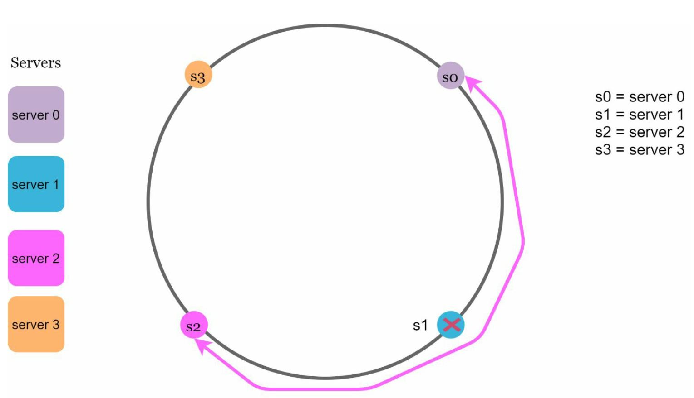

  - Possible to have a non-uniform key distribution on the ring
    - If servers are mapped to position like in figure, most of the keys are stored on server2
    - server1 and server3 have no data.
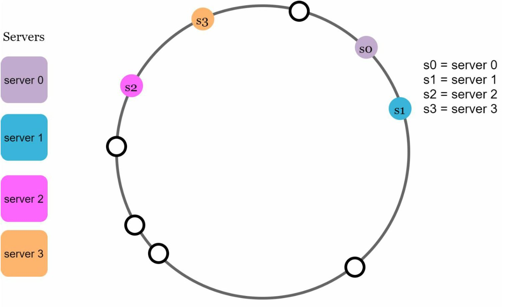

- A technique called virtual nodes or replicas is used to solve these problems


### Virtual nodes
- A virtual node refers to the real node
- Each server is represented by multiple virtual nodes on the ring
- In the figure, both server0 and server1 have 3 virtual nodes. 
  - The 3 is arbitrarily chosen
  - In real-world system, the number of virtual nodes is much larger
  - s0_0, s0_1, s0_2 represent server0 on the ring
  - s1_0, s1_1, s1_2 represent server1 on the ring
- With virtual nodes, each server is responsible for multiple partitions.
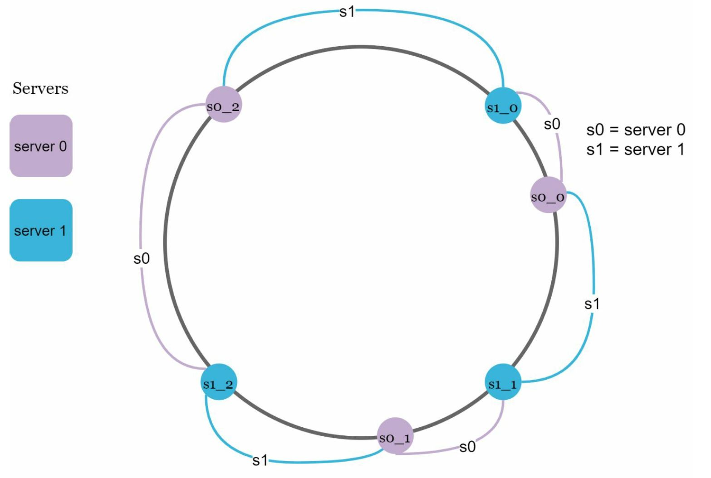

#### Find which server a key is stored on
- We go clockwise from the key's location and find the first virtual node encountered on the ring
- To find out which server k0 is stored on, we go clockwise from k0's location and find virtual node s1_1, which refers to server1
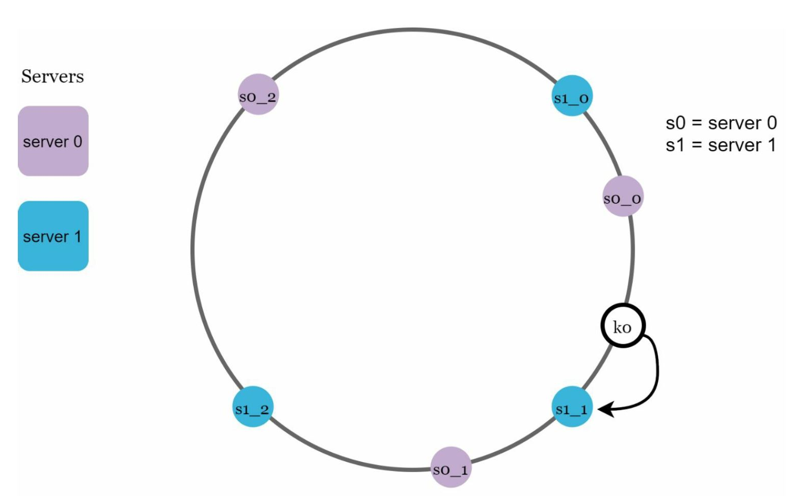
- As the number of virtual node increases, the distribution of keys becomes more balanced.
- This is because the standard deviation gets smaller with more virtual nodes, leading to balanced data distribution
  - Standard deviation measures how data are spread out
- The outcome of an experiment carried out by online research shows that with one or two hundred virtual nodes, the standard deviation is between 5% (200 virtual nodes) and 10% (100 virtual nodes) of the mean
- However, more spaces are needed to store data about virtual nodes
- Tradeoff 

### Find affected keys
- When a server is added or removed, a fraction of data needs to be redistributed. 
- How can we find the affected range to redistributed the keys?
#### A Server is added
- server4 is added onto the ring
- The affected range start from s4 and moves anticlockwise around the ring a server is found (s3)
- Thus, keys located between s3 and s4 need to be redistributed to s4
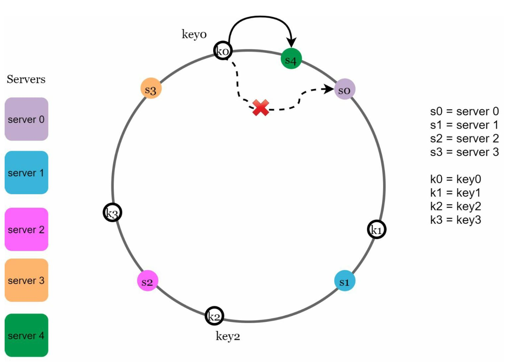

#### A Server is removed
- When a server(s1) is removed in the figure, the affected ranges starts from s1 (removed node) and moves anticlockwise around the ring until a server is found(s0)
- Keys located between s0 and s1 must be redistributed to s2
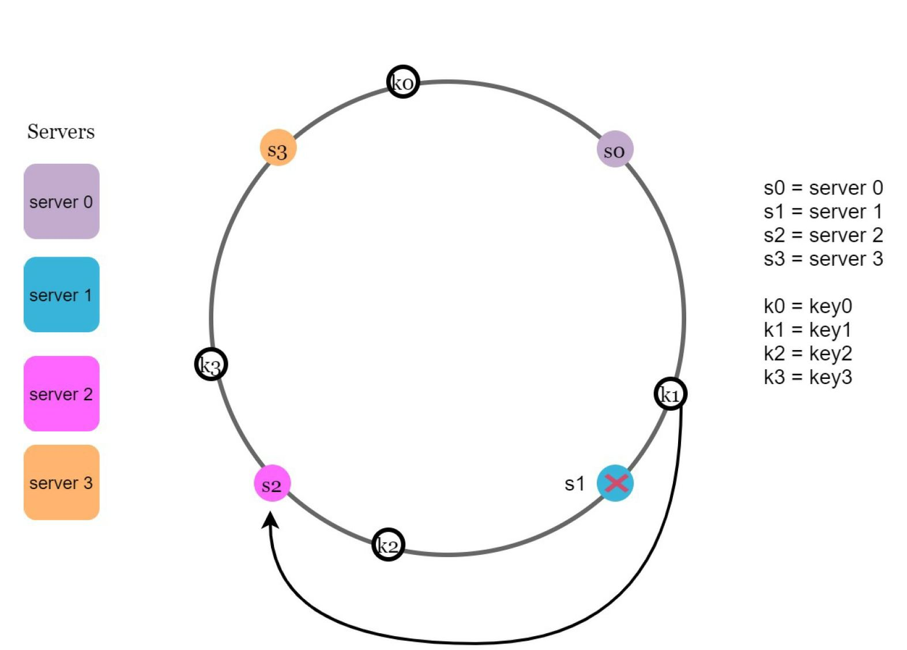


## Wrap up
- The benefits of consistent hashing include
  - Minimized keys are redistributed when servers are added or removed
  - It's easy to scale horizontally because data are more evenly distributed
  - Mitigate hotsopt key problem
- Consistent hashing in Real-world systems
  - Partitioning component of Amazon's Dynamo database
  - Data partitioning across the cluster in Apache Cassandra
  - Discord data application
  - Akamai content delivery network
  - Maglev network load balancer


