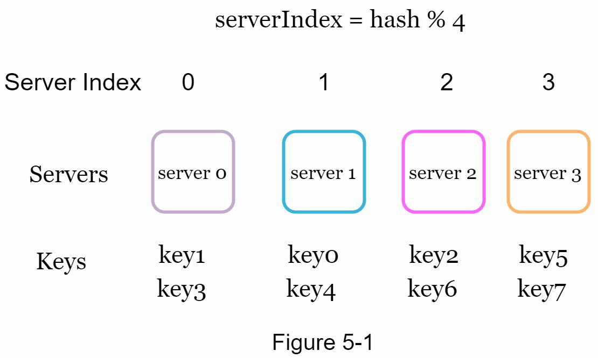
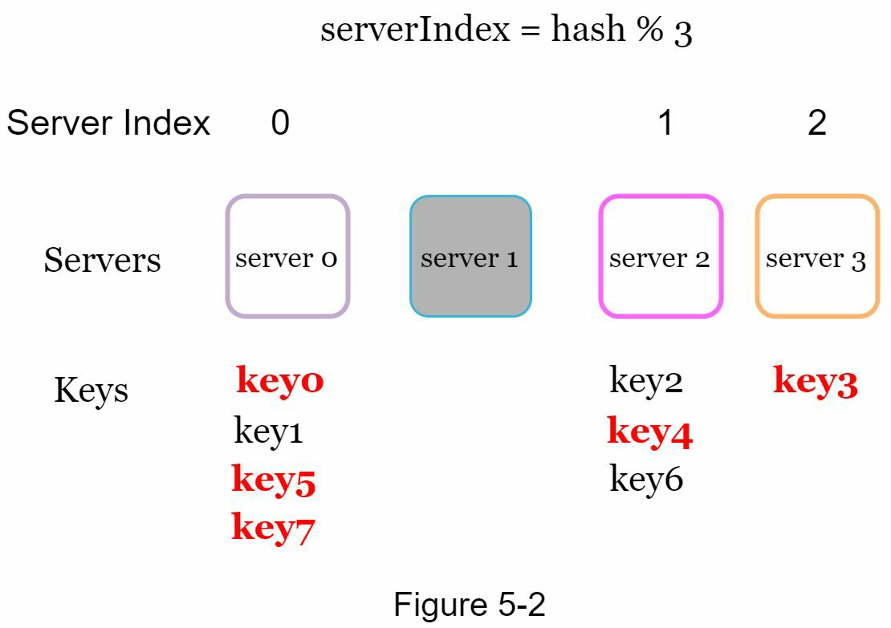
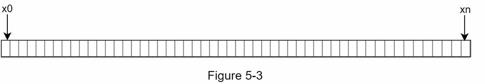
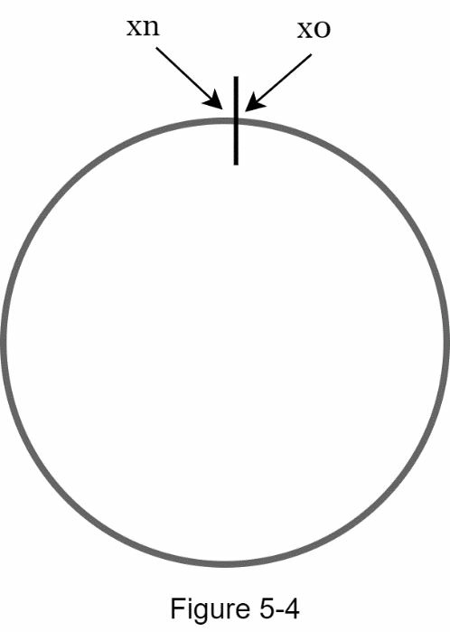
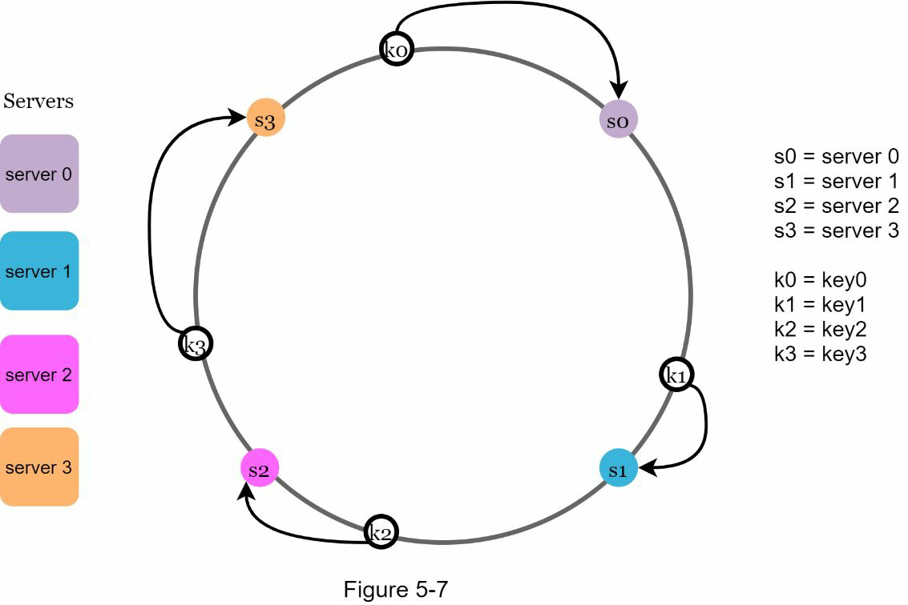
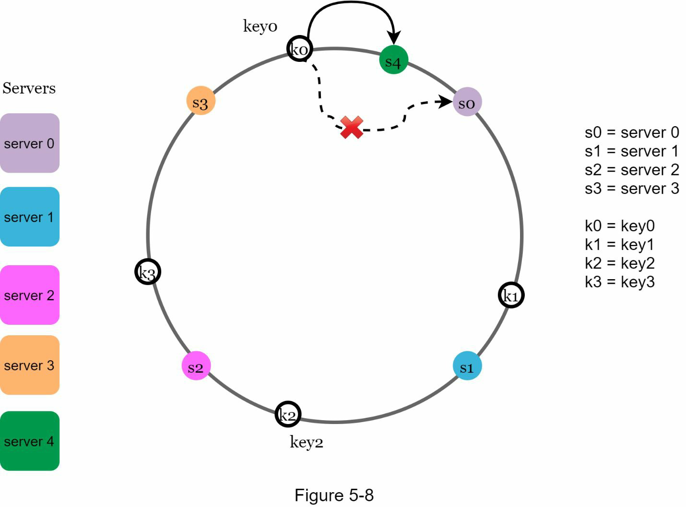
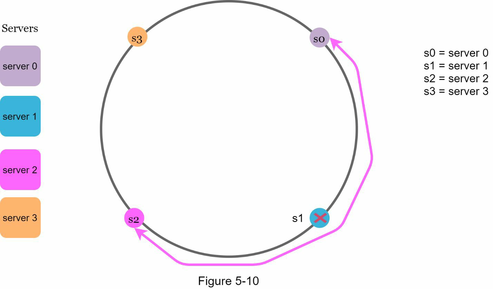
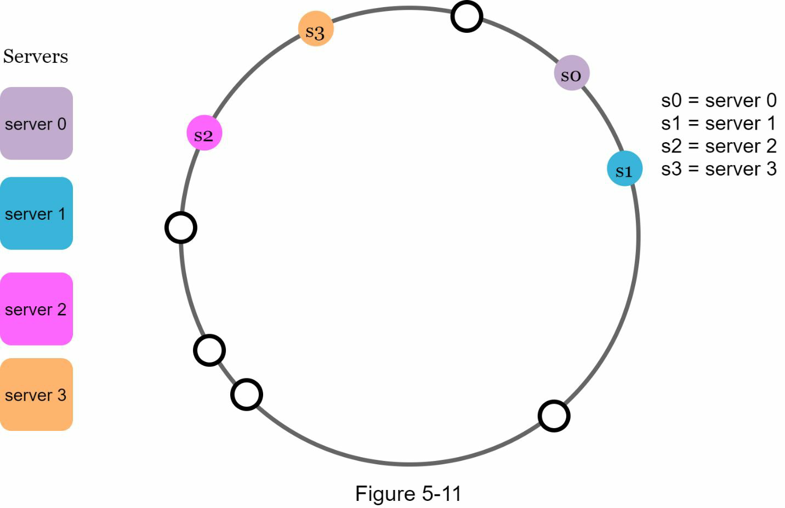
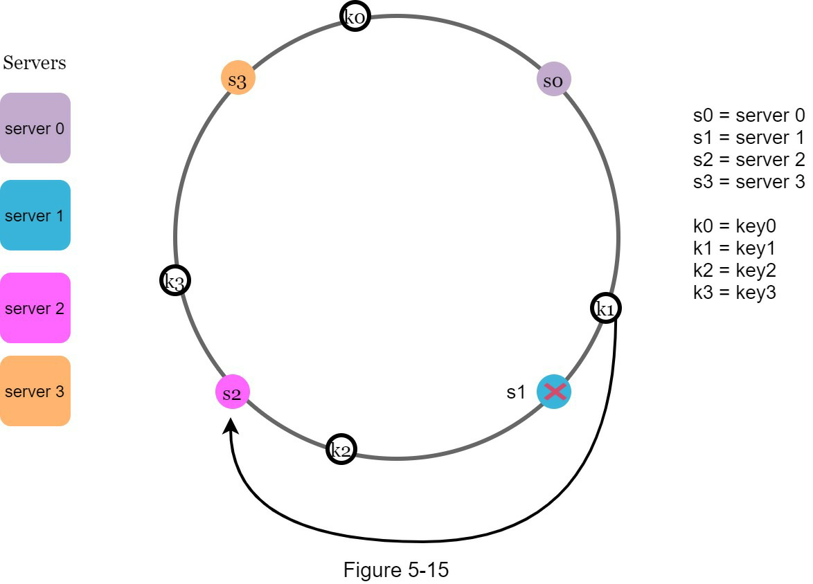

##CHAPTER 5: DESIGN CONSISTENT HASHING
To achieve horizontal scaling, it is important to distribute requests/data efficiently and evenly
across servers. Consistent hashing is a commonly used technique to achieve this goal. But
first, let us take an in-depth look at the problem.

#### The rehashing Problem

#### Consistent Hashing
Consistent hashing is a special kind of hashing such that when a hash table is re-sized and consistent hashing is used, only k/n keys need to be remapped on average, where k is the number of keys, and n is the number of slots. In contrast, in most traditional hash tables, a change in the number of array slots causes nearly all keys to be
remapped

#### Hash space and hash ring

To determine which server a key is stored on, we go clockwise from the key position on the ring until a server is found.

##### Add a server

##### Remove a server

#####  Two issues in the basic approach
- First, it is impossible to keep the same size of partitions on the ring for all servers considering a server can be added or removed.

Second, it is possible to have a non-uniform key distribution on the ring. For instance, if servers are mapped to positions listed in Figure 5-11, most of the keys are stored on server 2. However, server 1 and server 3 have no data.

#### Virtual nodes

As the number of virtual nodes increases, the distribution of keys becomes more balanced.
The standard deviation will be smaller when we increase the
number of virtual nodes. However, more spaces are needed to store data about virtual nodes.
This is a tradeoff, and we can tune the number of virtual nodes to fit our system requirements.

#### Find affected keys
server 4 is added onto the ring. The affected range starts from s4 (newly
added node) and moves anticlockwise around the ring until a server is found (s3). Thus, keys located between s3 and s4 need to be redistributed to s4.

When a server (s1) is removed as shown in Figure 5-15, the affected range starts from s1 (removed node) and moves anticlockwise around the ring until a server is found (s0). Thus, keys located between s0 and s1 must be redistributed to s2.

Wrap up
In this chapter, we had an in-depth discussion about consistent hashing, including why it is needed and how it works. The benefits of consistent hashing include:
• Minimized keys are redistributed when servers are added or removed.
• It is easy to scale horizontally because data are more evenly distributed.
• Mitigate hotspot key problem. Excessive access to a specific shard could cause server overload. Imagine data for Katy Perry, Justin Bieber, and Lady Gaga all end up on the same shard. Consistent hashing helps to mitigate the problem by distributing the data more evenly.
Consistent hashing is widely used in real-world systems, including some notable ones:
• Partitioning component of Amazon’s Dynamo database [3]
• Data partitioning across the cluster in Apache Cassandra [4]
• Discord chat application [5]
• Akamai content delivery network [6]
• Maglev network load balancer [7]
Congratulations on getting this far! Now give yourself a pat on the back. Good job!