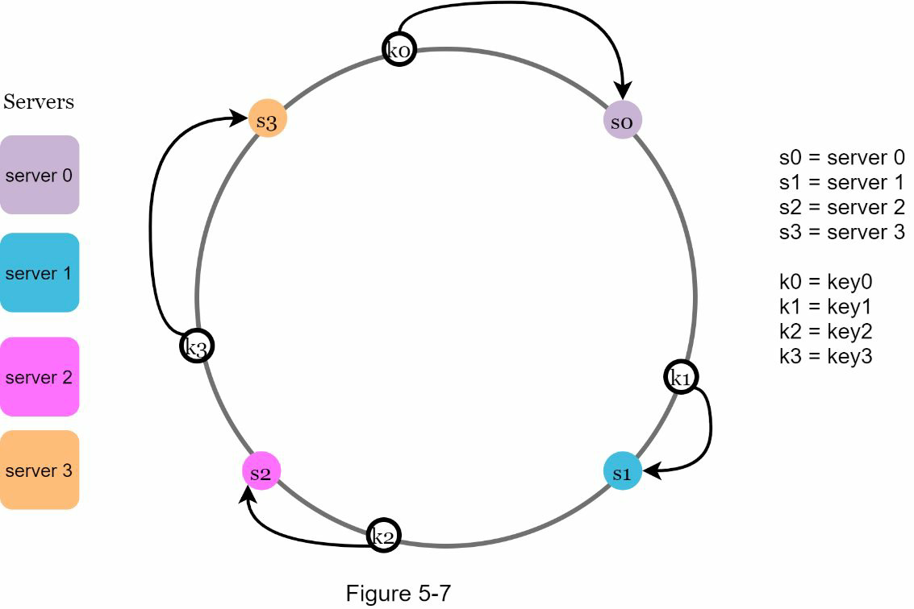
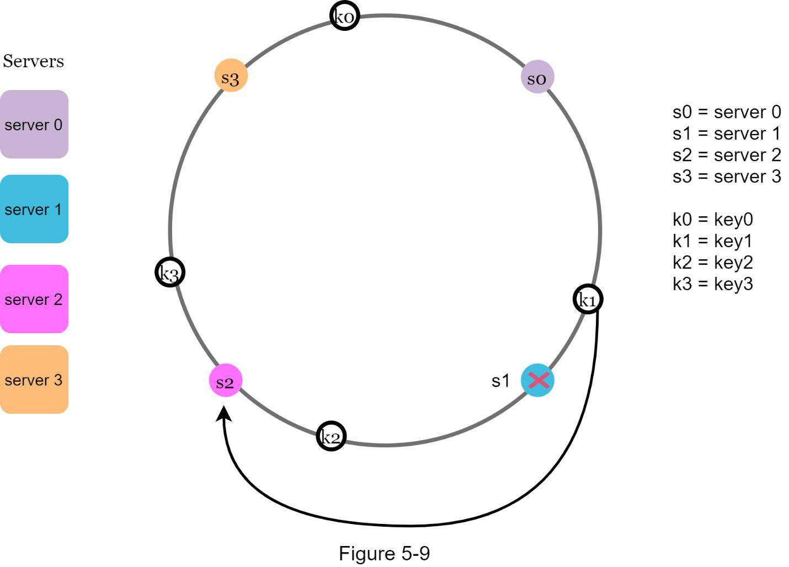
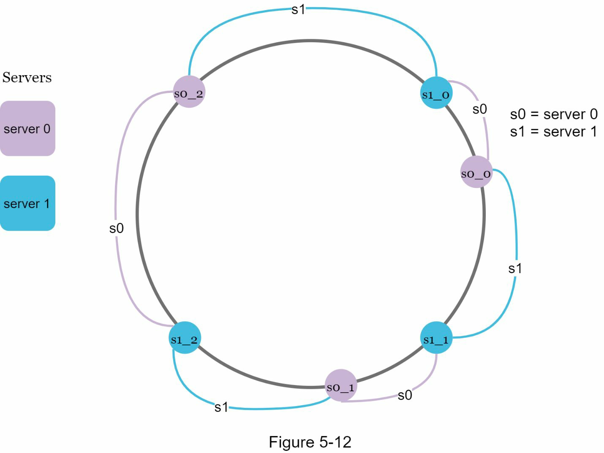
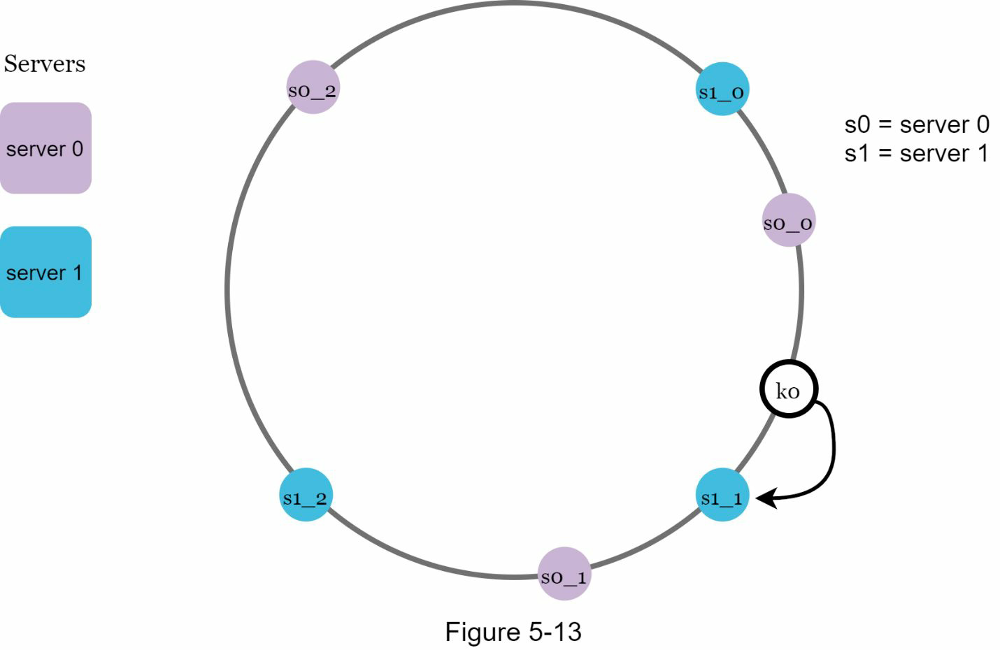
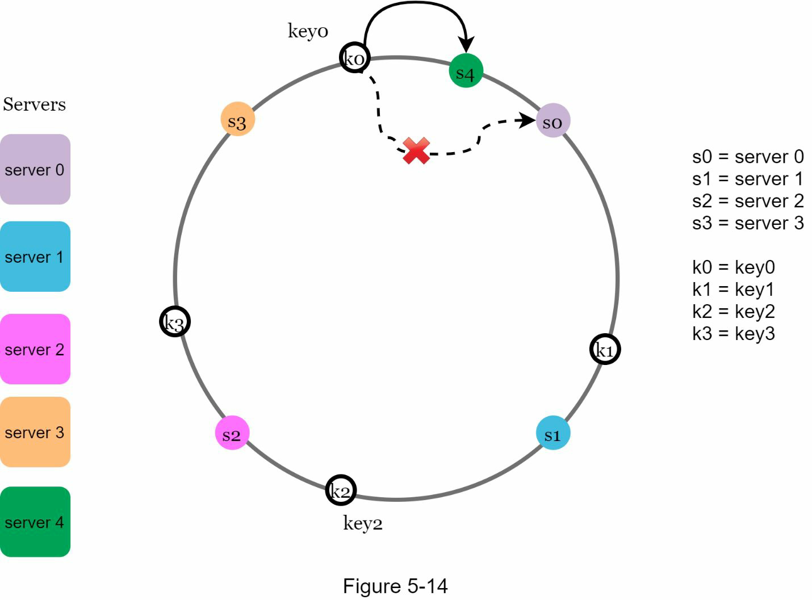

# Problem
- Hash keys are not evenly distributed when
  - Servers are added
  - Servers are removed
- which causes too many cache misses due to key redistribution

# Consistent hashing
- When hash table is resized, only k/n keys need to be remapped on average
  - k: The number of keys
  - n: The number of slots

## Hash space and hash ring

- Going clockwise, key0 is stored on server 0; key1 is stored on server 1; key2 is stored on server 2 and key3 is stored on server 3.

## Add a server

- After a new server 4 is added, only key0 needs to be redistributed.

- when server 1 is removed, only key1 must be remapped to server 2.

# Two issues in the basic approach

- Basic steps
  - Map servers and keys on to the ring using a uniformly distributed hash function
  - To find out which server a key is mapped to, go clockwise from the key position until the first server on the ring is found

- Two problems
  - Impossible to keep the same size of partitions(= hash spaces) on the ring for all servers considering a server can be added or removed.
  - Possible to have a non-uniform key distribution on the ring

# Solution - Virtual nodes
- A virtual node refers to the real node.

- Go clockwise from the key’s location and find the first virtual node encountered on the ring.

## Find affected keys

- Keys located between s3 and s4 need to be redistributed to s4

- Keys located between s0 and s1 must be redistributed to s2

# Wrap up

- Benefits of consistent hashing
  - Minimized keys are redistributed
  - Easy to scale horizontally
  - Mitigate hotspot key problem