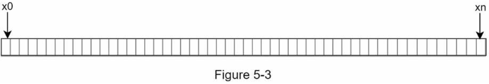
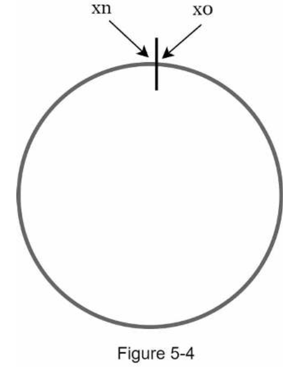
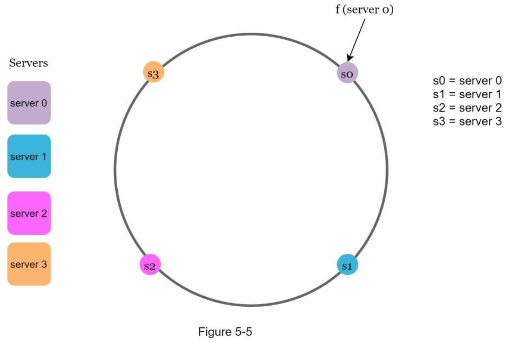
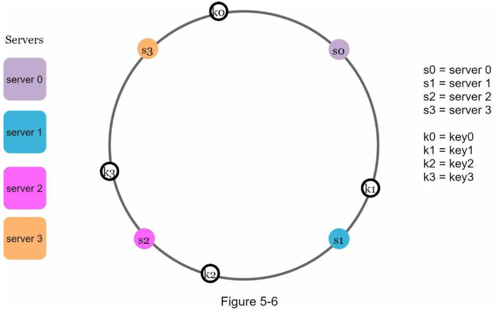
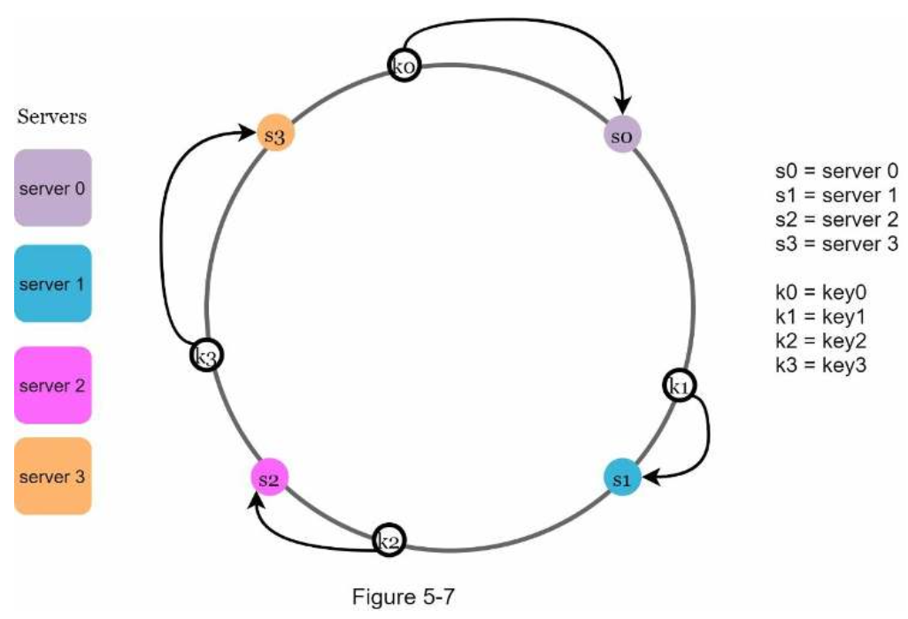
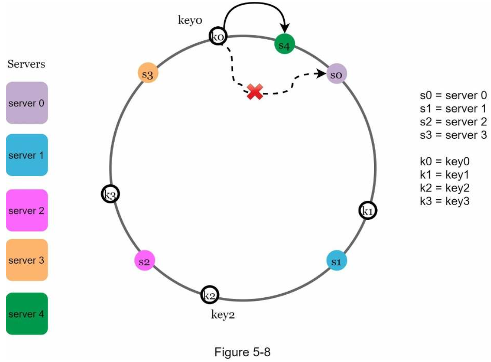
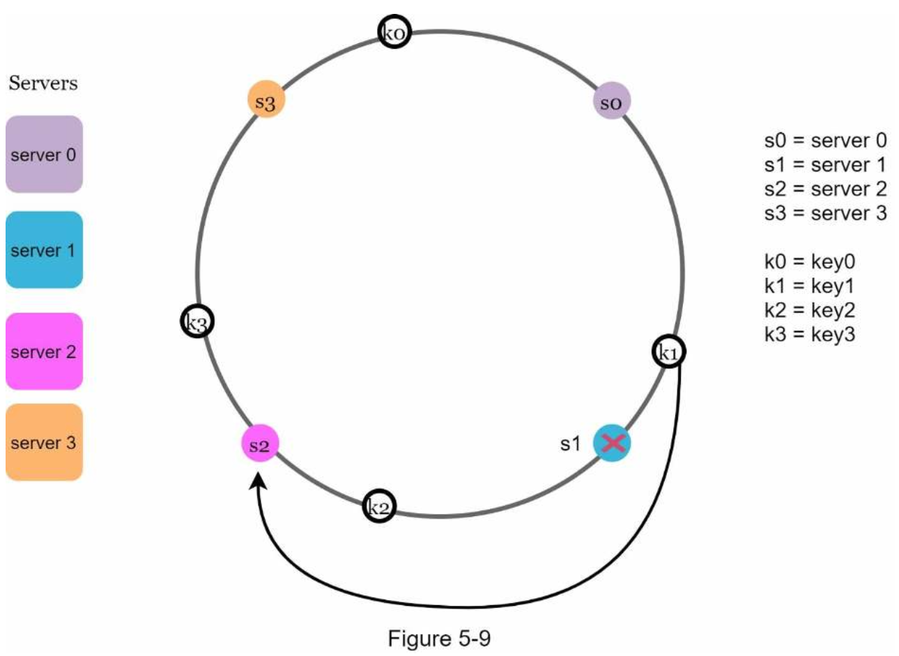
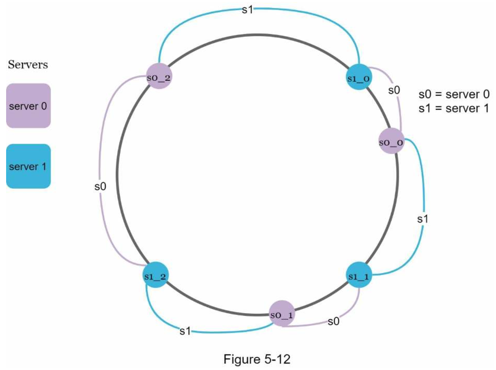

# 5. DESIGN CONSISTENT HASHING
- To achieve horizontal scaling, it is important to distribute requests/data efficiently and evenly across servers.
- Consistent hashing is a commonly used technique to achieve this goal.
### The rehashing problem
- serverIndex = hash(key) % N, where N is the size of the server pool.
- However, problems arise when new servers are added, or existing servers are removed.
- Consistent hashing is an effective technique to mitigate cache misses.

### Consistent hashing
- A special kind of hashing such that when a hash table is re-sized and consistent hashing is used, only k/n keys need to be remapped on average, where k is the number of keys, and n is the number of slots.

### Hash space and hash ring

- By collecting both ends, we get a hash ring.

### Hash servers

- We map servers based on server IP or name onto the ring.

### Hash keys

### Server lookup

### Add a server

### Remove a server

### Two issues in the basic approach
- It is impossible to keep the same size of partitions on the ring for all servers considering a server can be added or removed.
- It is possible to have a non-uniform key distribution on the ring.
- A technique called virtual nodes or replicas is used to solve these problems.

### Virtual nodes

- To find which server a key is stored on, we go clockwise from the key’s location and find the first virtual node encountered on the ring.
- As the number of virtual nodes increases, the distribution of keys becomes more balanced.
- The standard deviation will be smaller when we increase the number of virtual nodes. However, more spaces are needed to store data about virtual nodes. This is a tradeoff, and we can tune the number of virtual nodes to fit our system requirements.

### Find affected keys
- When a server 4 is **added**,
    - The affected range starts from s4 (newly added node) and moves anticlockwise around the ring until a server is found (s3). Thus, keys located between s3 and s4 need to be redistributed to s4.
- When a server 1 is **removed**,
    - The affected range starts from s1 (removed node) and moves anticlockwise around the ring until a server is found (s0). Thus, keys located between s0 and s1 must be redistributed to s2.

### Wrap up
- The benefits of consistent hashing include:
    - Minimized keys are redistributed when servers are added or removed.
    - It is easy to scale horizontally because data are more evenly distributed.
    - Mitigate hotspot key problem.
- Some notable ones:
    - Partitioning component of Amazon’s Dynamo database
    - Data partitioning across the cluster in Apache Cassandra
    - Discord chat application
    - Akamai content delivery network
    - Maglev network load balancer