# Chapter 5. Design consistent hashing

### The rehashing problem
If we have *n* cache servers, a common way to balance the load is to use the following hash method:

*serverIndex = hash(key) % N*, where N is the size of the server pool.

Below table shows when we have 4 servers and 8 string keys with their hashes.
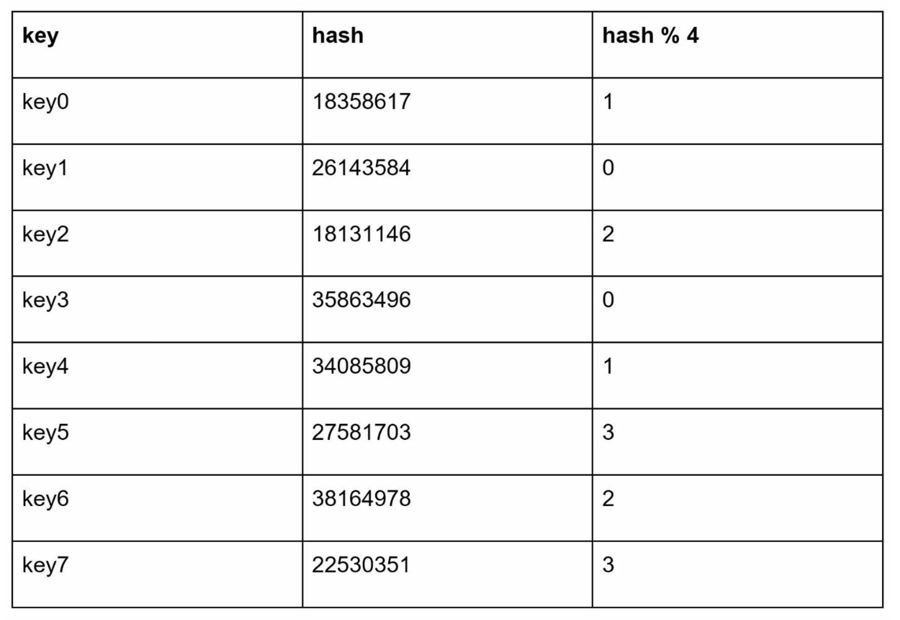

To fetch the server where a key is stored, we perform the modular operation *f(key) % 4*. Below is the distribution of keys based on the above table.
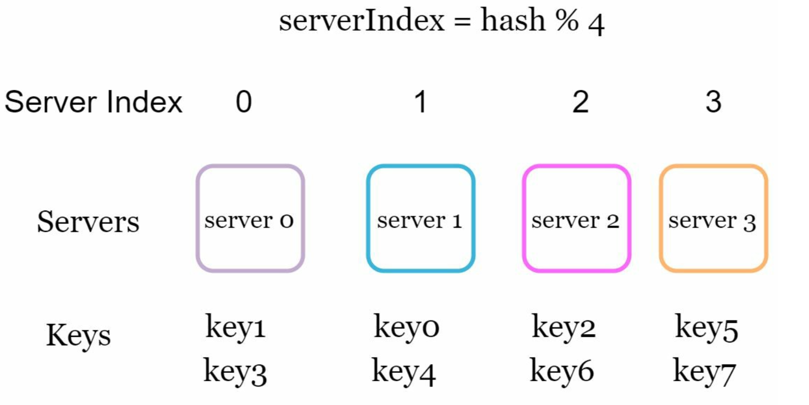

This approach has problems when new servers ar added, or existing servers are removed. The below table shows when server 1 goes offline, so the size of the server pool becomes 3.
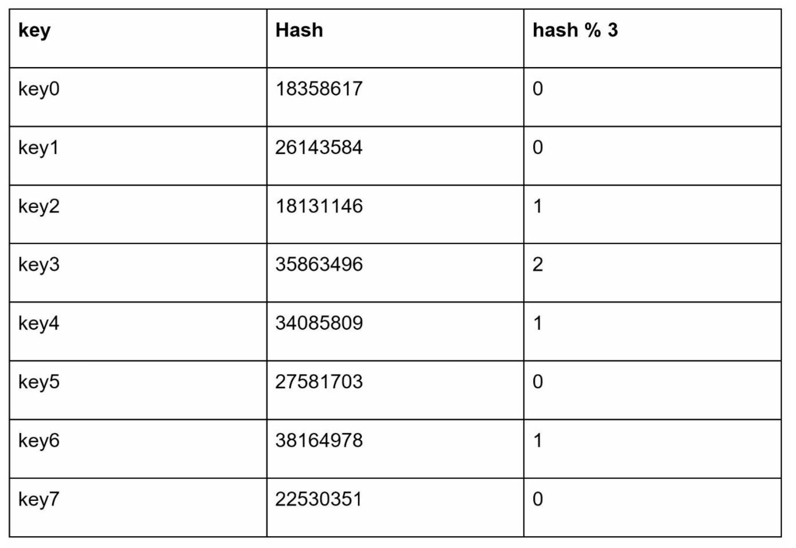

If we see the below distribution, most keys are redistributed, not just the ones originally stored in the offline server(server 1). This means that when server 1 goes offline, most cache clients will connect to the wrong servers to fetch data. This causes cache misses. **Consistent hashing** is an effective technique to mitigate this problem.
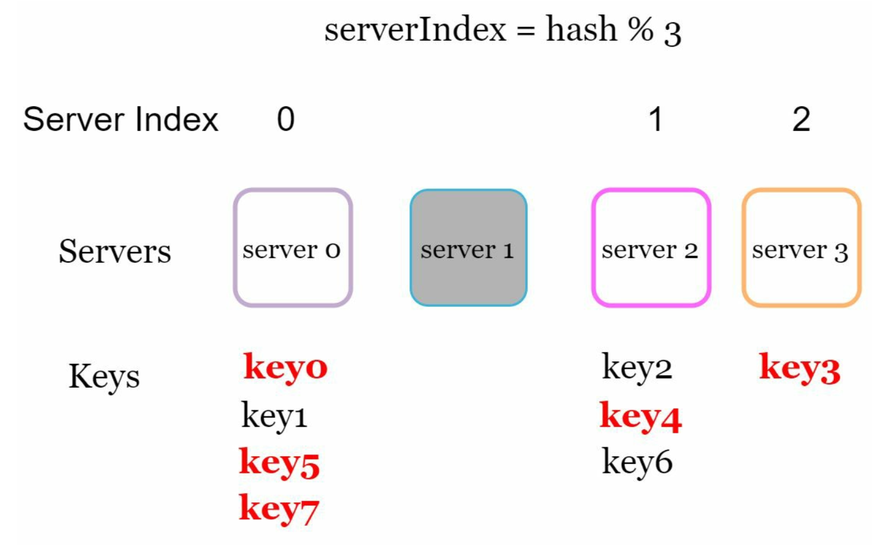

#### Consistent hashing
Consistent hashing is a special kind of hashing such that when a hash table is re-sized and consistent hashing is used, only **k/n keys need to be remapped on average, where k is the number of keys, and n is the number of slots**. In contrast, in most traditional hash tables, a change in the number of array slots causes nearly all keys to be remapped - Wikipedia

#### Hash space and hash ring
Let's assume SHA-1 is used as the hash function f, and the output range of the hash function is: *x0, x1, x2, ..., xn*. 
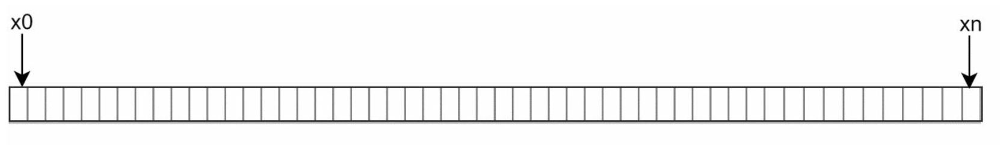

By collecting both ends, we get this hash ring:
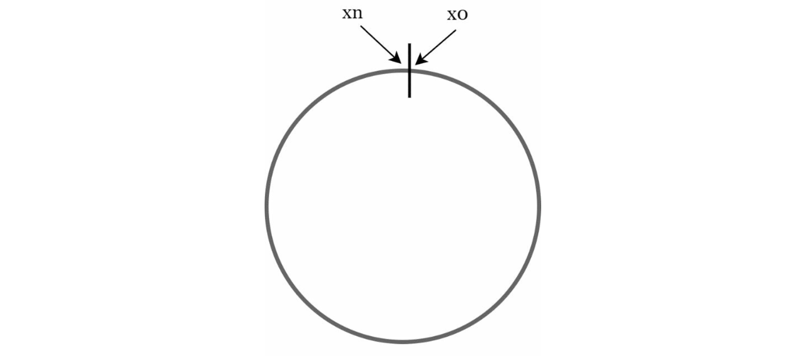

#### Hash servers
Using the same hash function f, we map servers based on server IP or name onto the ring.
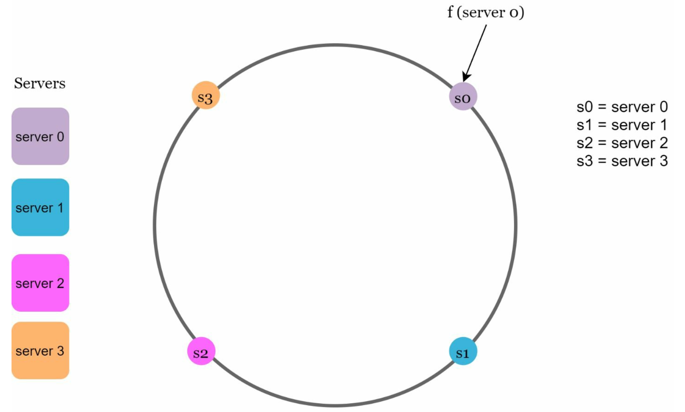

#### Hash keys
> The hash function,f, used here is different from the one in "the rehashing problem" and there is no modular operation

In below figure, cache keys are hashed onto the hash ring.
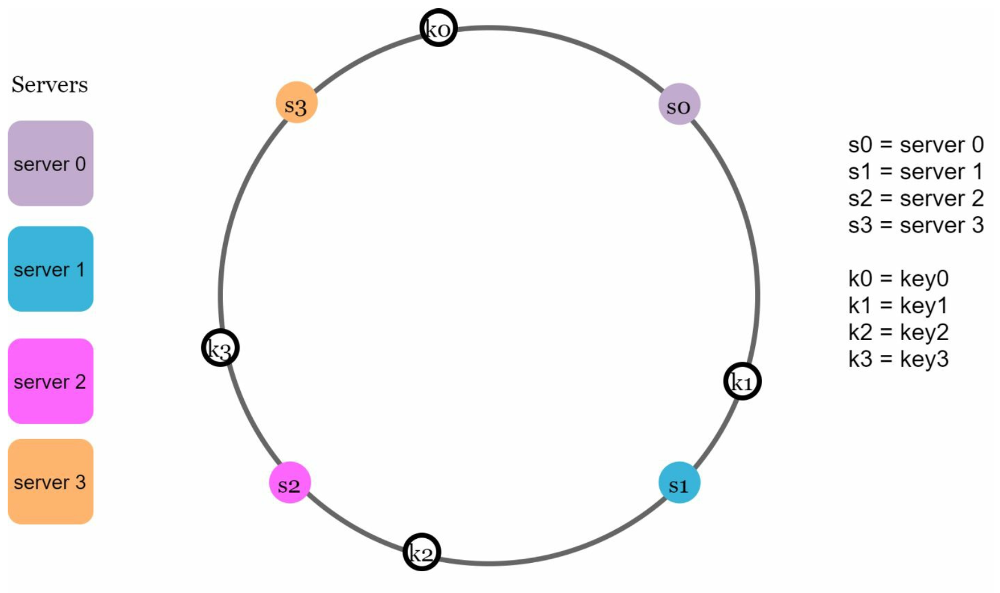

#### Server lookup
To determine which server a key is stored on, we go clockwise from the key position on the ring until a server is found. In the below figure, going clockwise, *key0* is stored on *server 0*; *key1* is stored on *server 1*; go on.
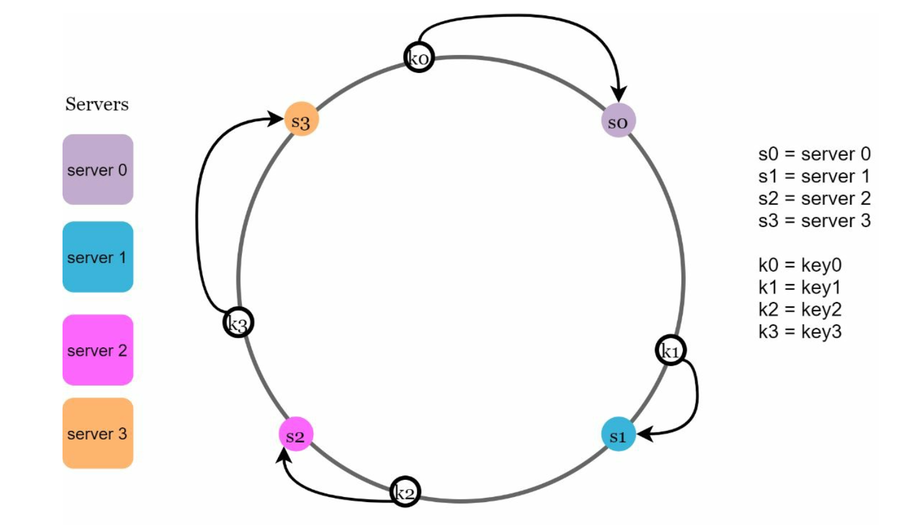

#### Add a server
Using the logic described above, adding a new server will only require redistribution of a fraction of keys.
In the below figure, it shows that after a new *server 4*, only *key0* needs to be redistributed. The other keys are not redistributed based on consistent hashing algorithm.
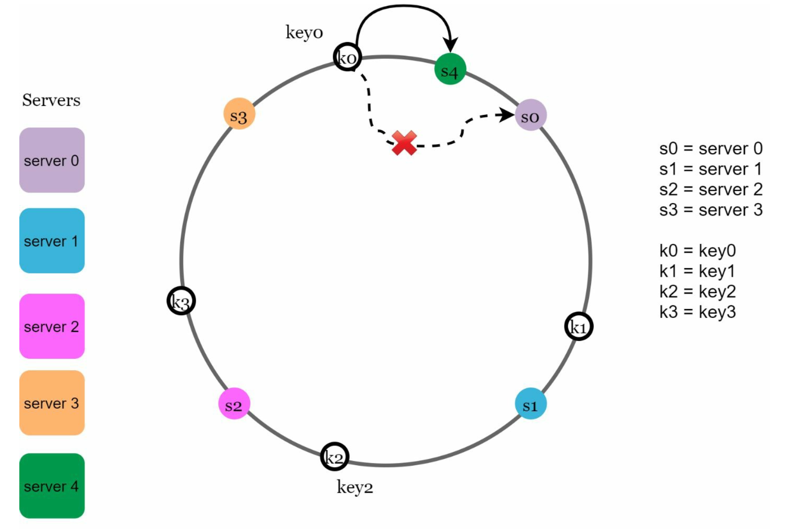

#### Remove a server
Similar to adding a server, when a server(*server 1*) is removed, only one key(*key1*) must be remapped to *server 2*. The rest of the keys are unaffected.
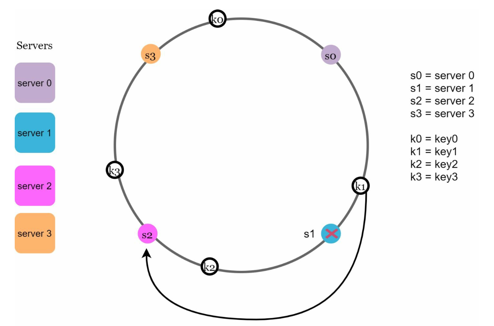

#### Two issues in the basic approach
Basic steps of consistent hashing algorithm:
- Map servers and keys on to the ring using a uniformly distributed hash function
- To find out which server a key is mapped to, go clockwise from the key position until the first server on the ring is found

Two issues with this approach:
1.  It is impossible to keep the same size of partitions on the ring for all servers considering a server can be added or removed

For example, in the below figure, if *s1* is removed, *s2*'s partition is twice as large as *s0* and *s3*'s partition.
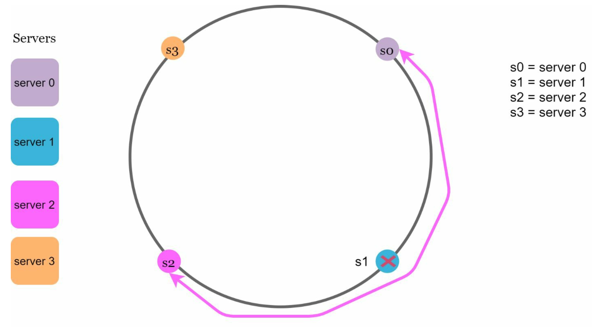

2. It is possible to have a non-uniform key distribution on the ring

For example, if servers are mapped to positions like below figure, most of the keys are stored on *server 2*, but *server 1* and *server 3* have no data.
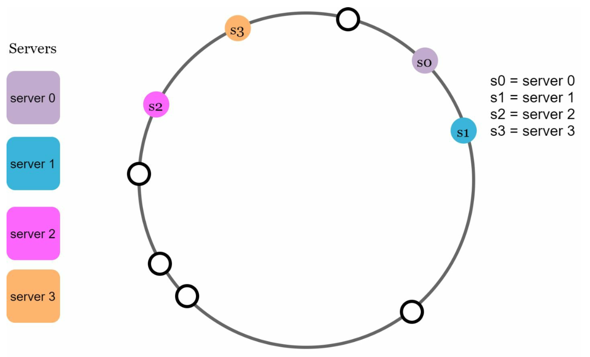

We use **virtual nodes** or **replicas** to solve these problems.
#### Virtual nodes
A virtual node refers to the real node, and each server is represented by multiple virtual nodes on the ring.

In the below figure, *s0* and *s1* has 3 virtual nodes each. Instead of *s0*, we have *s0_0*, *s0_1*, and *s0_2* to represent *server 0* on the ring and similar to *server 1*. With virtual nodes, each server is responsible for multiple partitions. Partitions(edges) with label *s0* are managed by server 0.
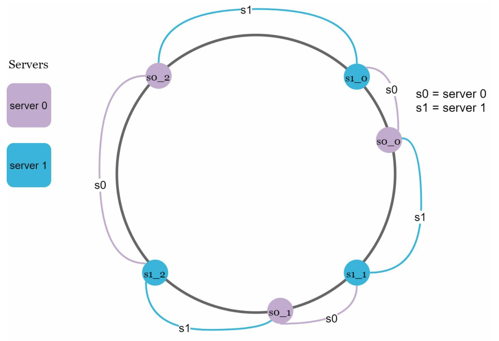
To find which server a key is stored on, we go clockwise from the key's location and find the **first virtual node encountered** on the ring.

I the below figure, to find out which server *k0* is stored on, we go clockwise from *k0*'s location and find virtual node *s1_1*, which refers to server 1.
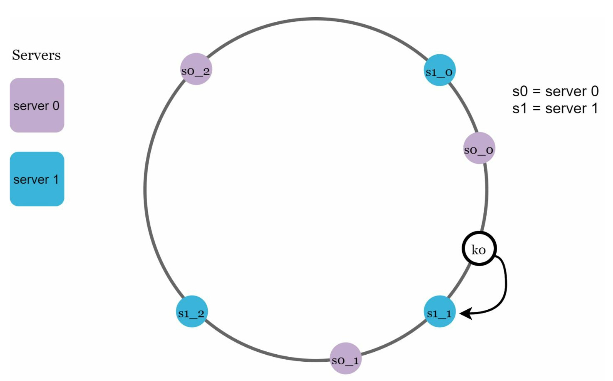

As the number of virtual nodes increases, the distribution of keys becomes more balanced because the standard deviation gets smaller with more virtual nodes, leading to balanced data distribution. **Standard deviation** measures how data are spread out. 
However, more spaces are needed to store data about virtual nodes. This is a tradeoff, and we can tune the number of virtual nodes to fit our system requirements.

#### Find affected keys
When a server is added or removed, how can we find the affected range to redistribute the keys?

In the below figure, *server 4* is added onto the ring. The affected range starts from *s4*(newly added node) and moves anticlockwise around the ring until a server is found(*s3*). Thus, keys located between *s3* and *s4* need to be redistributed to *s4*.
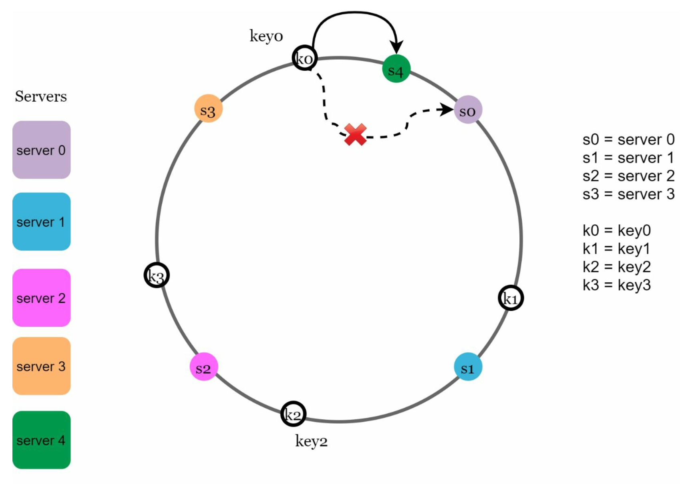

In the below figure, *server 1* is removed from the ring. The affected range starts from *s1*(removed node) and moves anticlockwise around the ring until a server is found(*s0*). Thus keys located between *s0* and *s1* must be redistributed to *s2*.

### Wrap up
The benefits of consistent hashing:
- Minimized keys are redistributed when servers are added or removed
- Easy to scale horizontally because data are more evenly distributed
- Mitigate hotspot key problem by distributing data more evenly; excessive access to a specific shard could cause server overload

Use cases in real-world systems:
- Partitioning components of Amazon's DynamoDB
- Data partitioning across the cluster in Apache Cassandra
- Discord chat application
- Akamai content delivery network
- Maglev network load balancer
