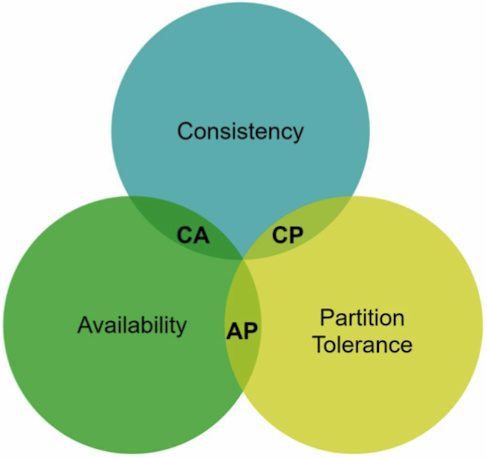
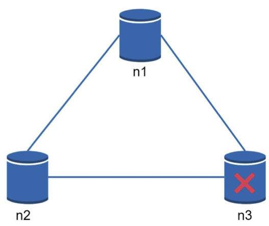
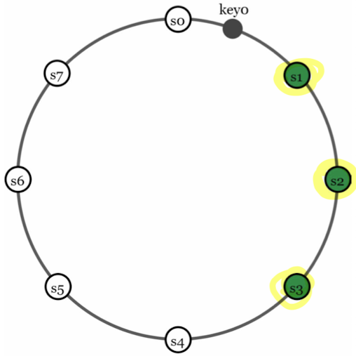
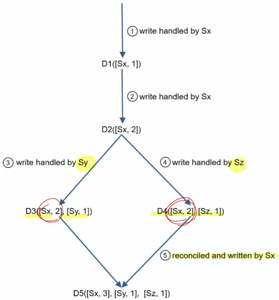
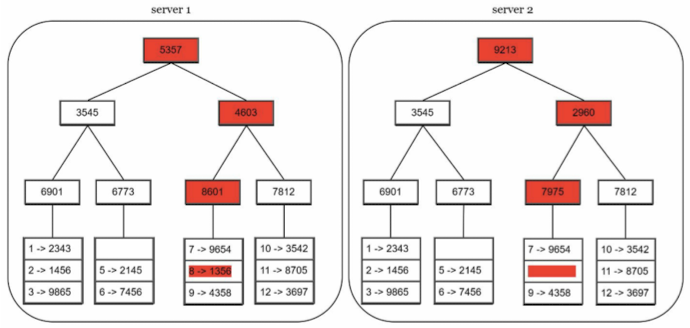
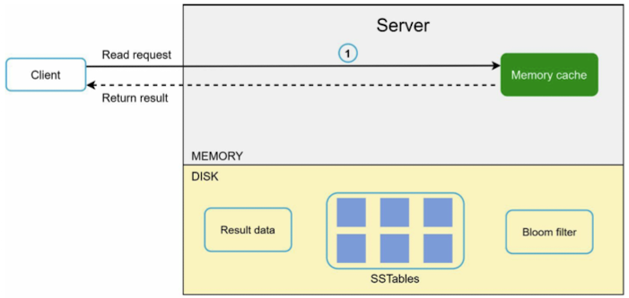
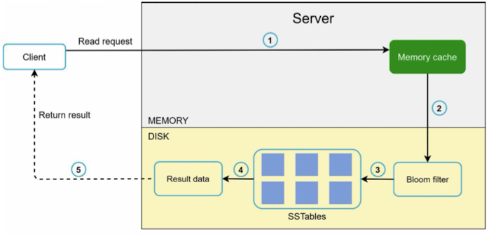
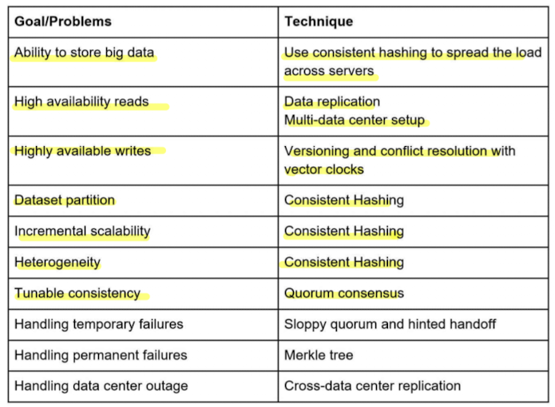

# Chapter 6. Design a key-value store
: Each unique identifer is stored as a key with its associated value. This data pairing is known as a "key-value" pari. And the key must be unique.

## Single server key-value store
- A single server can reach its capacity very quickly. A distributed key-value sotre is required to support big data.

## Distributed key-value store
- A distributed key-value store is also called a distributed hash table.

### CAP theorem

- CAP theorem states is is impossible for a distributed system to simulaneously provide more than two of these three guarantees: **consisteny, availability, and partiion tolerance**.
- CP (consisteny and partiion tolerance)
- AP (availability and partiion tolerance)
- CA (consisteny and availability)

#### Example (Real-world distributed systems)

- CP system: We must block all write operations to n1 and n2 to avoid data inconsistency among these three servers, which makes the system unavailable (Bank systems)
- AP system: The system keeps accepting reads, even though it might return stale data. For writes, n1 and n2 will keep accepting writes, and data will be synced to n3 when the network partition is resolved.

### Data partition
- There are challenges while partitioning the data
    1. Distibute data across multiple servers evenly.
    2. Minimize data movement when nodes are added or removed.
- Using consisten hashing to parition data has the below advantages.
    1. Automatic scailing
    2. Heterogeneity

### Data replication

- To achieve high availability and reliability, data must be replicated asynchronously over N servers.
- With virtual nodes, the first N nodes on the ring may be owned by fewer than N pyysical servers. To avoid issue, we only choose unique servers while performing the clockwise walk logic.

### Consistency
- Quorum consensus can guarantee consistency for both read and write operations.
- Senarios:
    - If R = 1 and W = N, the system is optimized for a fast read.
    - If W= 1 and R = N, the system is optimized for a fast write.
    - If W + R > N, Strong consistency is guaranteed (Usualy N=3, W=R=2)
    - If W + R <= N, Strong consistency is not guaranteed

#### Consistency models
- Strong consistency: Any read operation returns a value corresponding to the result of the most updated write data item. A client never sees out-of-date data.
- Week consistency: Subsequent read operations may not see the most updated value.
- Eventual consistency: This is a specific form of weak consistency. Given enough time, all updates are propagted, and all replicas are consistent, i.e. Dynamo and Cassandra.

#### Inconsistency resolution (Versioing)
- Replication gives high availability but causes inconsistencies among replicas.
- Versioning and vector locks are used to solve inconsistency problems.
- Versioning
    - Treats each data modifications as a new immutable version of data
    - A vector clock is a [server, version] pair associated with a data item.
    - Increment vi if [Si, vi] exists, otherwise create a new entry [Si, 1]
    
    - Downsides:
        - Vector clocks add complexity to the client because it needs to implement conflict resolution logic.
        - The [server: version] pairs in the vector clock colud grow rapidly. To fix this problem, we set a threshold for the length and if it exceeds the limit, the oldest pairs are removed.

#### Handlingg permanent failures
- Hinted handoff is used to handle temporary failures.
- With Merkle tree: To detect inconsistency data and minimize the amount of data transferred.

#### Handlingg data center outage
- Replicates data across multiple data centers.

#### Architecture (Write path)

- The write request is persisted on a commit log file.

#### Architecture (Read path)
- When data is in the memory cache.

- When data is not in the memory cache.

### Summary

