# 06. Design A Key-Value Store

A key-value store = a key-value database (a non-relational database. ex. Amazon dynamo, Memcached, Redis).

The key must be unique and the value associated with the key can be accessed through the key.
Keys can be plain text or hashed values.
In this chapter, what we want to design is a key-value store that supports the following operations:

- put(key, value) //insert 'key' and 'value'
- get(key)  // get 'value' associated with 'key'

## Understand the problem and establish design scope

There is the tradeoff of the read, write, and memory usage, and another tradeoff is between consistency and availability.

In this chapter, assume we want:

- The size of a key-value pair is small : less than 10 KB
- Ability to store big data
- High availability : The system responds quickly, even during failures.
- High scalability: The system can be scaled to support large data set.
- Automatic scaling: The addition/ deletion of servers should be automatic based on traffic.
- Tunable consistency
- Low latency

## Single server key-value store

- Keeps everything in memory - very fast
  - However, fitting everything in memory maybe impossible due to the space constraint
  - Two optimizations can be done
    - Data compression
    - Store only frequently used data in memory and the rest on disk
  - Still single server can reach its capacity very quickly
    - a distribution key-value store is required to support big data

## Distributed key-value store

A distributed key-value store = A distributed hash table which distributes key-value pairs across many servers.

It is important to understand CAP (Consistency, Availability, Partition Tolerance).

### CAP theorem

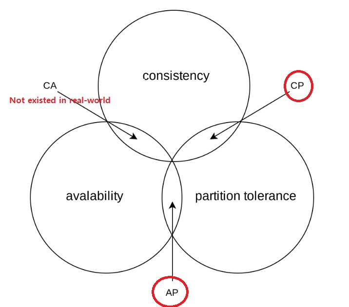
<!--  -->

- Consistency
  - All clients see the same data at the same time no matter which node they connect to
- Availability
  - Any client which requests data gets a response even if some of the nodes are down
- Partition Tolerance
  - A partition indicates a communication break between 2 nodes
  - System continues to operate despite network partitions

CAP theorem states it is **impossible** for a distributed system to simultaneously provide more than two of these three guarantees.

- CP (consistency and partition tolerance) systems : sacrifice availability
- AP (availability and partition tolerance) systems : sacrifice consistency
- CA (consistency and availability) systems : sacrifice partition tolerance
  - Since network failure is unavoidable, a distributed system must tolerate network partition.
  - This system cannot exist in real world application

#### 1. ideal situation

In the ideal world, network partition never occurs. Data written to n1 is automatically replicated to n2 and n3.

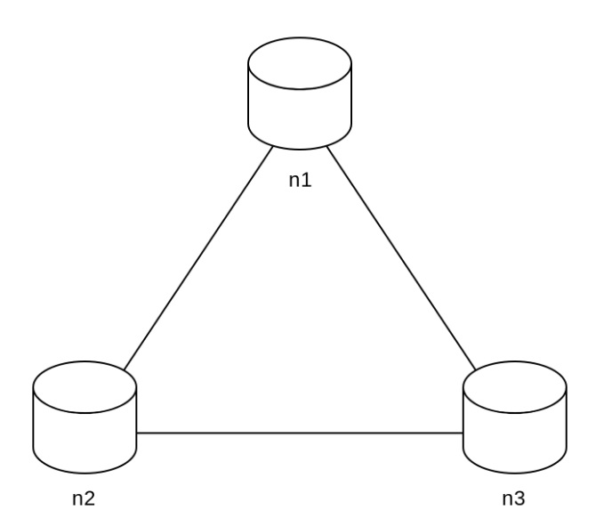

#### 2. Real-world distributed systems

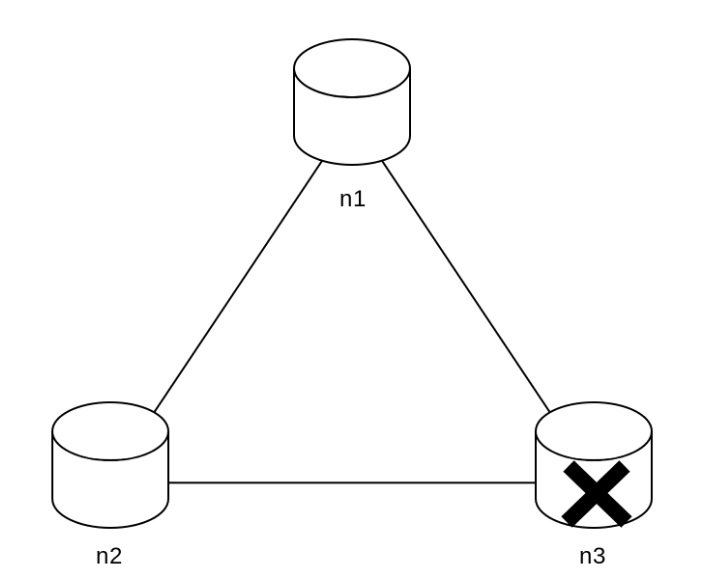

- CP system (ex.bank systems)
  - we must block all write operations to n1 and n2 to avoid data inconsistency among these 3 servers.
- AP system
  - The system keeps accepting reads, even though it might return stale data
  - For writes, nn1 and n2 will keep accepting writes and data will be synced to n3 when the network partition is resolved.

### System components

- Data partition
- Data replication
- Consistency
- Inconsistency resolution
- Handling failures
- System architecture diagram
- Write path
- Read path

The content below is largely based on 3 popular key-value store systems: Dynamo, Cassandra, and BigTable.

### 1. Data partition

For large applications, it is infeasible to fit the complete data set in a single server. The simplest way to accomplish this is to split the data into smaller partitions and store them in multiple servers.

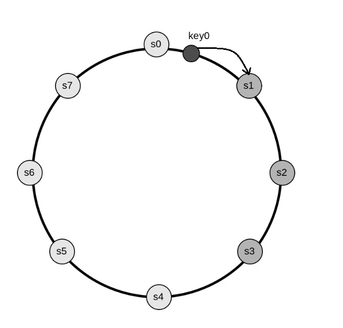

We use consistent hashing for this.

- Automatic scaling:
  - Servers could be added and removed automatically depending on the load
- Heterogeneity:
  - The number of virtual nodes for a server is proportional to the server capacity

### 2. Data replication

To achieve high availability and reliability, data must be replicated asynchronously over N servers, where N is a configurable parameter.

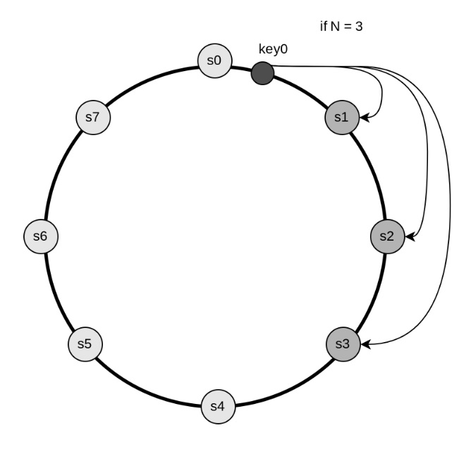

- With virtual nodes, we choose N unique servers ( not N virtual nodes because they can belong to fewer servers)
- For better reliability, replicas are placed in different data centers, connected through high-speed networks.

### 3. Consistency

Quorum consensus can guarantee consistency for both read and write operations

- N = The number of replicas
- W = A write quorum of size W ( Write operation must be acknowledged from W replicas)
- R = A read quorum of size R (Read operation must wait for responses from a least R replicas)

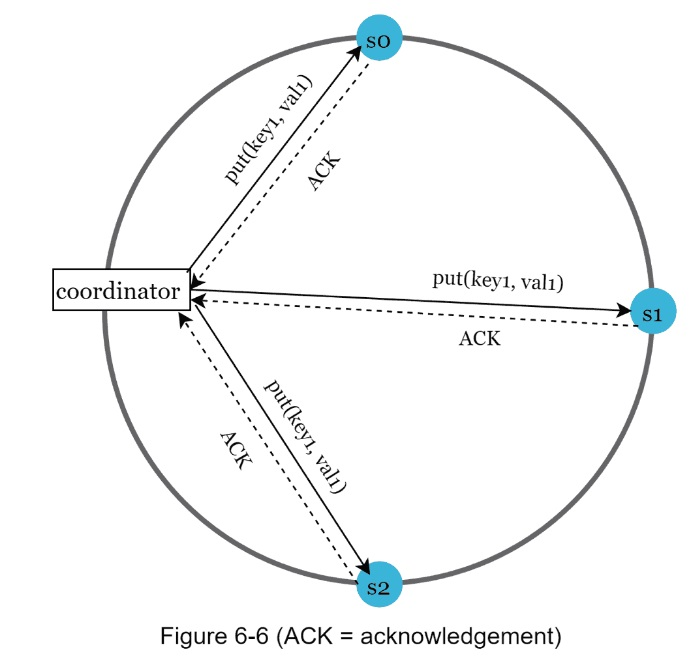

Some of the possible setups

- If R = 1 and W = N,
  - The system is optimized for a fast read
- If W = 1 and R = N,
  - The system is optimized for fast write
- If W + R > N,
  - Strong consistency is guaranteed ( Usually N = 3, W = R = 2)
- If W + R <= N,
  - String consistency is not guaranteed

#### 3.1. Consistency models

- String consistency
  - Any read operation returns a value corresponding to the result of the most updated write data item
  - Not ideal for highly available systems because it could block new operations
- Weak consistency
  - Subsequent read operations may not see the most updated value
- Eventual consistency
  - Given enough time, all updates are propagated, and all replicas are consistent.
  - Our recommended consistency model ( Dynamo and Cassandra adopt this)

### 4. Inconsistency resolution: versioning

Versioning and vector clocks are used to solve inconsistency.

- Versioning : treating each data modification as a new immutable version of data

Example of conflict

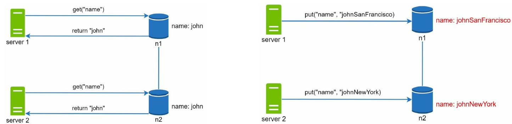

A vector clock is a common technique to solve this problem.

- A vector clock : [server, version] pair

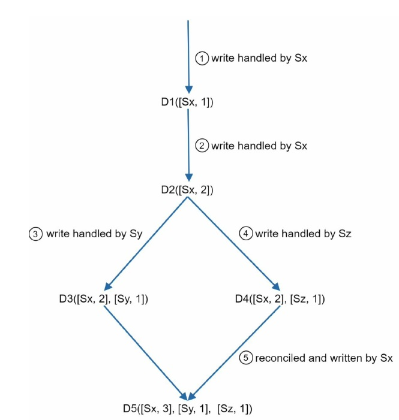

Two notable downsides

- First, vector clocks add complexity to the client because it needs to implement conflict resolution logic
- Second, the [server: version] pairs in the vector clock could grow rapidly
  - To fix this problem, we set a threshold for the length, and if it exceeds the limit, the oldest pairs are removed. ( ex. Amazon Dynamo)

### 5. Handling failures

As with any large system at scale, failures are not only inevitable but common.

#### 5.1. Failure detection

Usually, it requires at least 2 independent sources of information to mark a server down.

All-to-all multicasting is a straightforward solution, but it is inefficient when many servers are in the system.

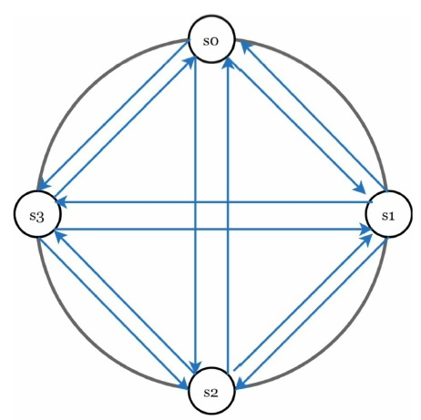

A better solution is **Gossip Protocol** ( decentralized failure detection method)

How to work:

- Each node maintains a node membership list, which contains **member IDs** and **heartbeat counters**
- Each node periodically increments its **heartbeat counter**
- Each node periodically sends **heartbeat** to a set of random nodes, which in turn propagate to another set of nodes
- Once nodes receive heartbeats, membership list is updated to the latest info
- If the heartbeat has not increased for more than predefined periods, the member is considered as offline

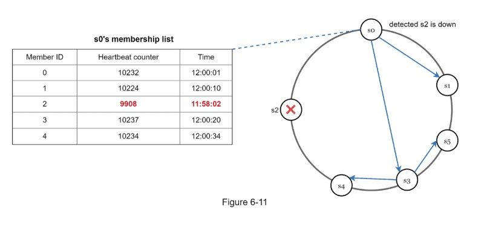

#### 5.2. Handling temporary failures

- In the strict quorum approach, read and write operations could be blocked
- **Sloppy quorum** is used to improve availability
  - Instead of enforcing the quorum requirement, the system chooses the first W healthy servers for writes and first R healthy servers for reads on the hash ring. Offline servers are ignored.
- **hinted handoff**
  - If a server is unavailable due to network or server failures, another server will process requests temporarily
  - In figure 6-12, reads and writes will be handled by s3 temporarily. When s2 comes back online, s3 will hand the data back to s2

#### 5.3. Handling permanent failures

What if a replica is permanently unavailable? -> To handle such a situation, implement an **anti-entropy protocol**.

- A MERKLE TREE is used for inconsistency detection and minimizing the amount of data transferred.
  - Step 1: Divide key space into buckets. A bucket is used as the root level node to maintain a limited depth of the tree.
  - Step 2: Hash each key in a bucket using a uniform hashing method.
  - Step 3: Create a single hash node per bucket.
  - Step 4: Build the tree upwards till root by calculating hashes of children.

- If root hashes match, both servers have the same data.

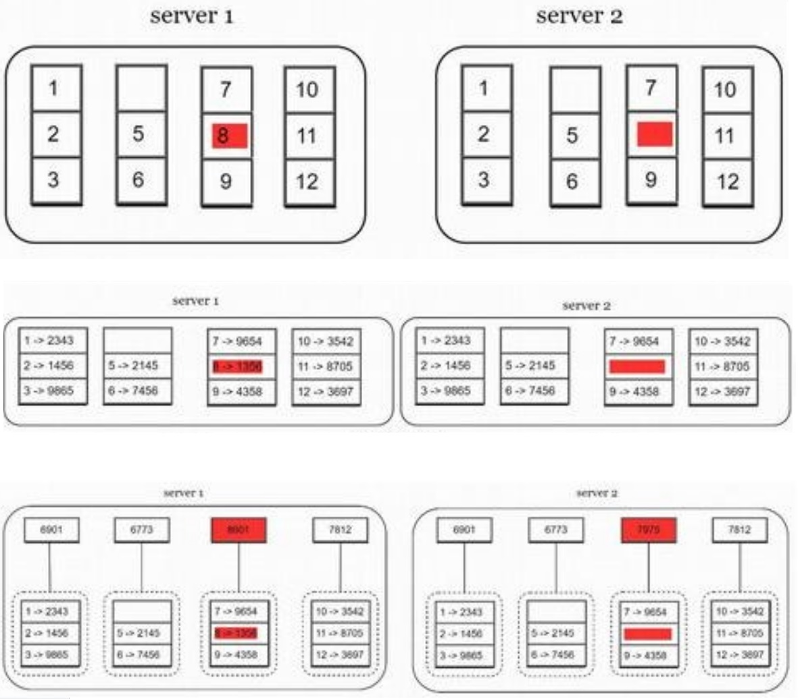

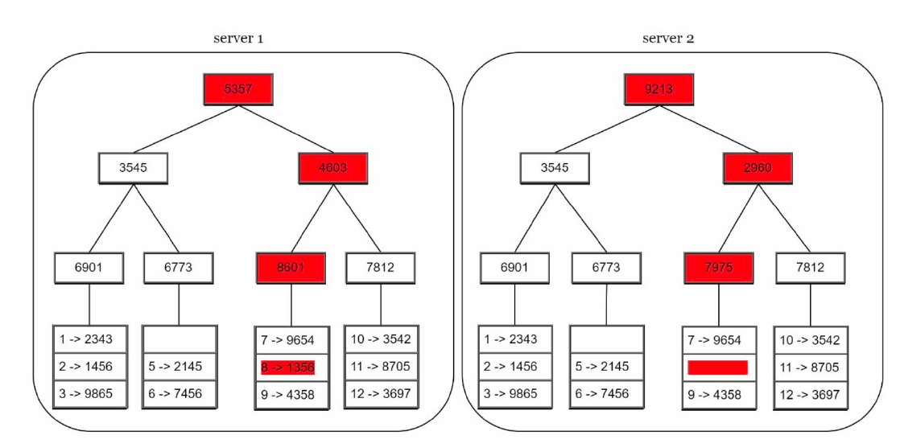

The amount of data needed to be synchronized is proportional to the differences between the two replicas, and not the amount of data they contain.

#### 5.4. Handling data center outage

It is important to replicate data across multiple data centers.

### 6. System architecture diagram

We can shift our focus on the architecture diagram.

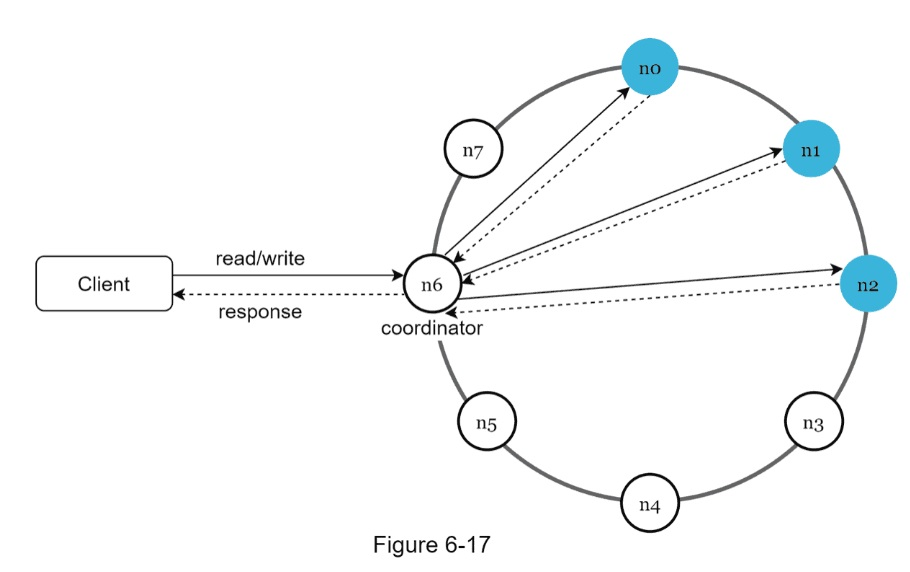

- Main features
  - Clients communicate with the key-value store with simple APIs : get(key), put(key,value)
  - A coordinator is a node that acts as a proxy between client and the key-value store
  - Nodes are distributed on a ring using consistent hashing
  - The system is completely decentralized so adding and moving nodes can be automatic.
  - Data is replicated at multiple nodes
  - There is no single point of failure as every node has the same set of responsibilities.
    - 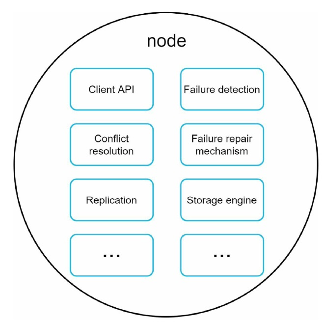

### 7. Write path

The proposed designs for write/read paths are primary based on the architecture of Cassandra.

- The write request is persisted on a commit log file
- Data is saved in the memory cache
- When the memory cache is full or reaches a predefined threshold, data is flushed to SSTable.
- 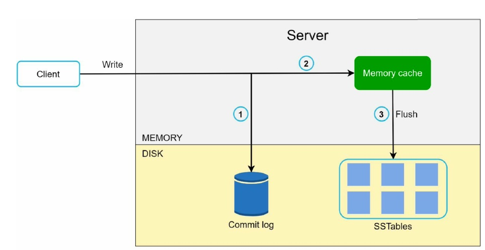

### 8. Read path

- If data is in the memory
  - 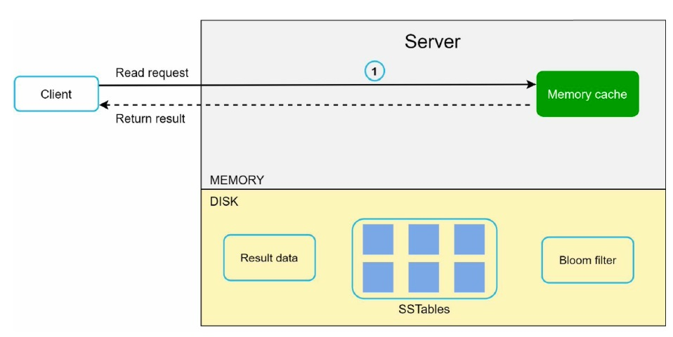
- If data is not in the memory
  - 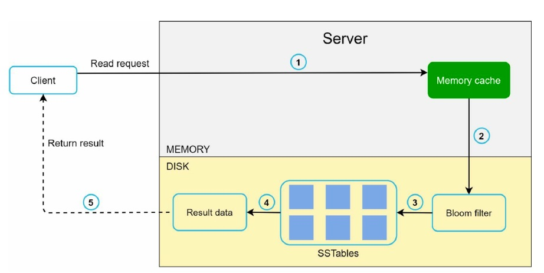

## Summary

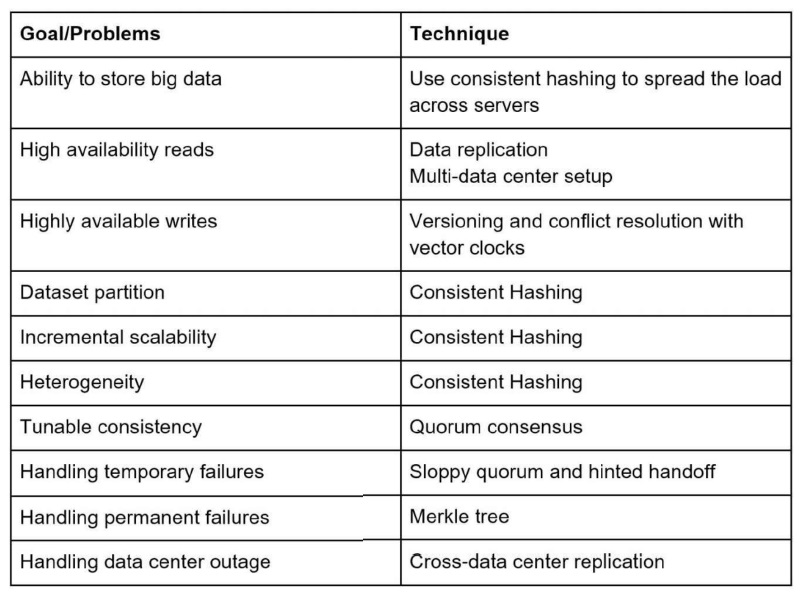
