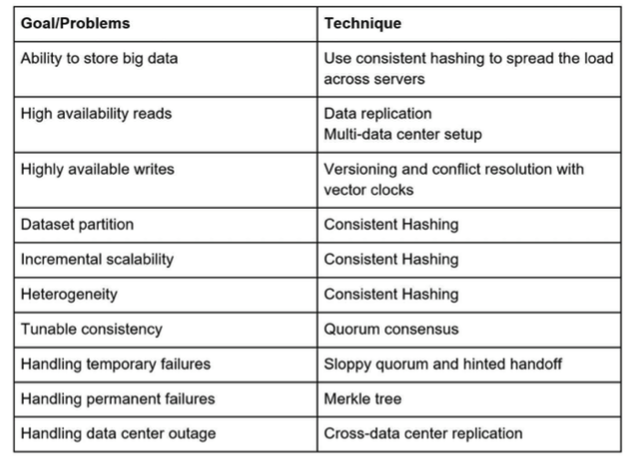

# CHAPTER 6: DESIGN A KEY-VALUE STORE

- value is stored with a uniquely identified key
- value can be of any type

## Understand the problem and establish design scope

- tradeoffs between read, write and memory usage
- tradeoffs between consistency and availability
- characteristics of key value store
  - each pair is small less than 10 kb
  - can store big data
  - high availability (respond fast)
  - high scalability (easy to support big data set)
  - automatic scaling base on the size of the traffic
  - low latency

## Single server key-value store

- store in hash table in memory
- memory access is fast
- but space constaint
  - data compression
  - selectively store frequently accessed data in memory and rest in disk

## Distributed key-value store

- store key-value pairs across many servers

### CAP theorem

- Consistency: all clients see the same data from different servers
- Availability: all requests are responded with data even if some nodes are down
- Partition Tolerance: system continues to operate desplite nextwork partitions
  - network partition means one server cannot replicate date to other servers
- CAP theorem states one of three is scacrificed

- CP(Consistency and partition tolerance)
- AP
- CA: impossible because network failure is unavoidable

### Examples

- n1, n2, n3
- if n3 is down, writes to n1 cannot be propagated to n1, n2 and viceversa

#### CP strategy

- block writes to n1 and n2
- means availability is sacrificed since requests are not responded
- used when stale data is critical such as bank system (balance info)

#### AP strategy

- keep reads open
- keep writes open to n1 and n2
- sync data to n3 afterwards when partition is resolved
- as clients requests are all responded even tho stale data are returned
- examples? social media? news?

## System components for key-value store

- Data partition

  - split large data set into smaller partitions stored in multiple servers evenly
  - minimize data movement when noded are added/removed
  - use consistent hashing technique
    - Austomatic scaling
    - Heterogeneity
  - Data sharding?

- Data replication

  - During data partition, data should be replicated
  - N is a number of nodes to replicate data
  - with virtual nodes, use N as a count of actual servers because one server may own more than one nodes
  - For better reliability, replicas could also be placed on servers that are of unique data center

## Consistency

- Quorum consensus
- N: number of replicas
- W: number of replicas that need to acknowledge writes so it is considered successful
- R: number of replicas that need to acknowledge reads so it is considered succssful
- A coordiantor is a proxy server between client and server that coordinates the quorum concensus
- ex) W = 1, cooridanator ensures at least one write acknowledgement, before a request is considered successful
- Configuration of N, W, R is a trade-off between latency and consistency
- Strong consistency is usually achieved by forcing a replica not to accept new reads/writes until every replica has agreed on current write
- not good for highly available system

## Inconsistency resolution

- Versioning
- Verctor clock: checks one version precedes others. ([server, version]) if handled by multiple servers, ([s1, v1], [s2, v1])

## Downsides of versioning & vector clock

- adds complexity to the client since it needs to implement the conflict resolution logic.
- the [server, version] pair can grow rapidly (isn't the max length the count of servers??)
- this can be resolved by limiting the max length (remove the oldest pair)
- this can lead to inefficiency since it descendent relationship can be inaccurate but mostly okay

## Handling failures

### failure detection

- at least two servers need to indicate the server is down (can be inefficient when there many servers) why is this inefficient??
- decentralized failure detection (gossip protocol)
- each node maintains node membership list (memberId, heart beat counters)
- each node periodically increment heartbeat counter
- each node periodically sends heartbeats to a set of random nodes which propagate to another set of nodes
- once nodes receive heartbeats, membership list is updated to the latest info
- if the heartbeat has not increased for predefined periods, it is offline

### handling temporary failures

- once a failure is detected through gossip protocol, use quorum approach (W=1, R=2, N =3) to block read and write
- a strict quorum approach sacrifices availability

#### sloppy quorum to improve availability

- choose first W healthy servers and first R healthy servers on the hash ring offline servers can be ignored
- when a server is down next healthy server will process it and push back the changes later called "handoff"

### handling permanent failures

#### anti-entropy

- compares each replica to newest version
- Merkle tree for inconsistency detection and minimized data transfer
- efficient and secure verification of the contents of large data structures
- step 1) divide keys into buckets to limit depth of the tree
- step 2) hash each key
- step 3) create a single hash node per bucket
- step 4) build the tree upwards till root by calculating hashes of children
- now do that for each server
- compare trees from root, since it is built child to root, if root is matched, both servers match
- if disagrees, go to next left and find until a hash that match
- the buckets of unmatched hashes indicate inconsistent data

## Handling data centre outage

- replicate data across multiple data centres

## Sytem architecture diagram

- clients communicate with key-value store through simple api (get and put)
- coordinator is a proxy between client and store
- nodes are distributed on a ring using consistent hashing
- decentralized system so adding/removing nodes can be automatic
- data is replicated at multiple nodes
- no single point of failure

## write path

- write request is persisted on a commit log file in disk
- data is saved in the memory cache
- when memory cache is full, data is flushed to SStable on disk
- SStable is a sorted list of key value pairs

## read path

- read is first directed to memory cache
- if not in it, retrieve from disk
- bloom filter is used find out which SStable has the key

