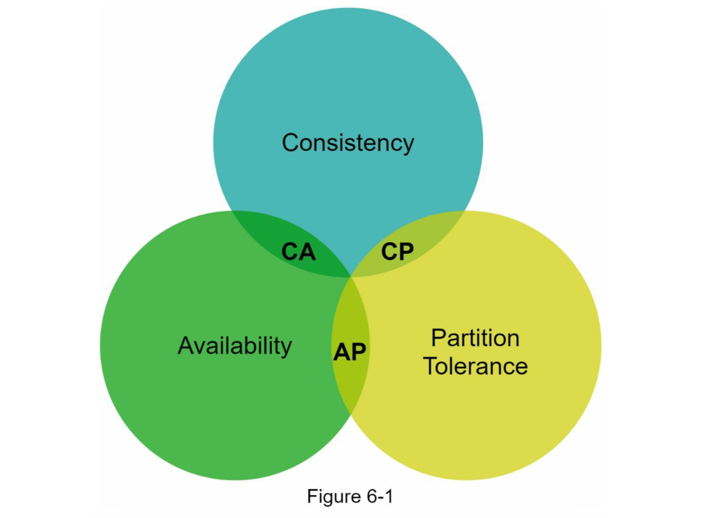
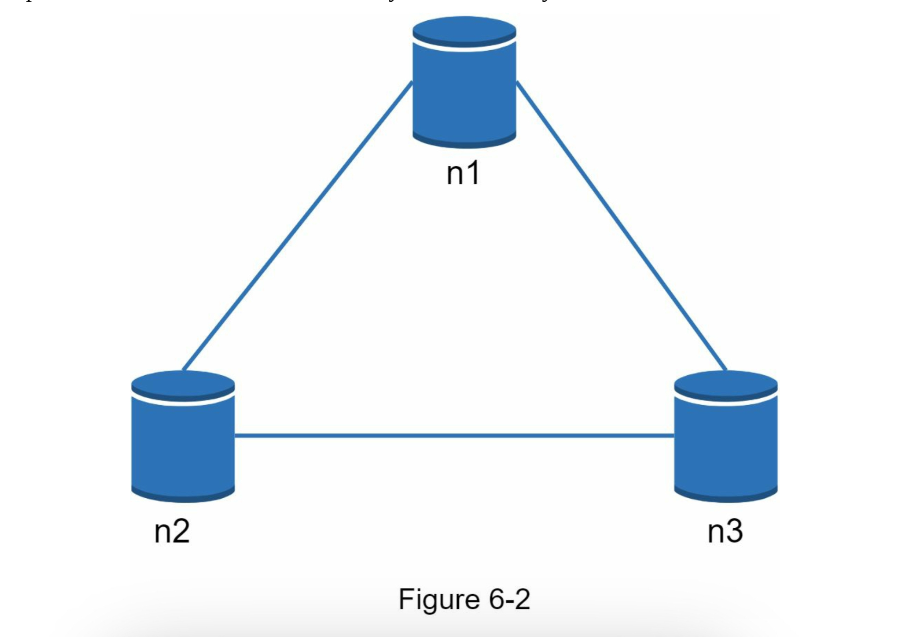
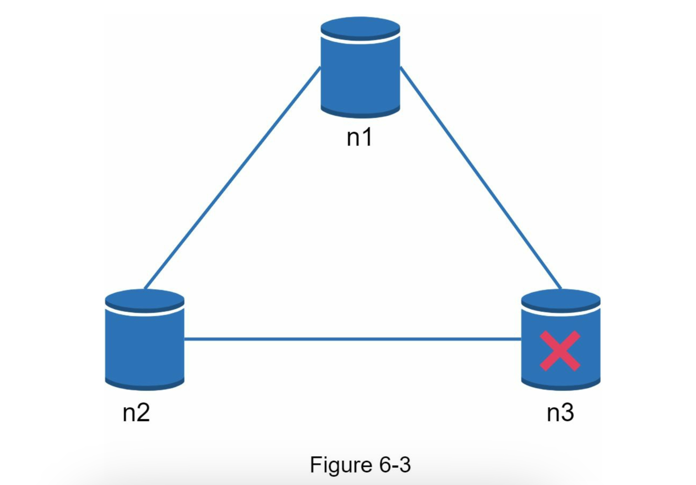
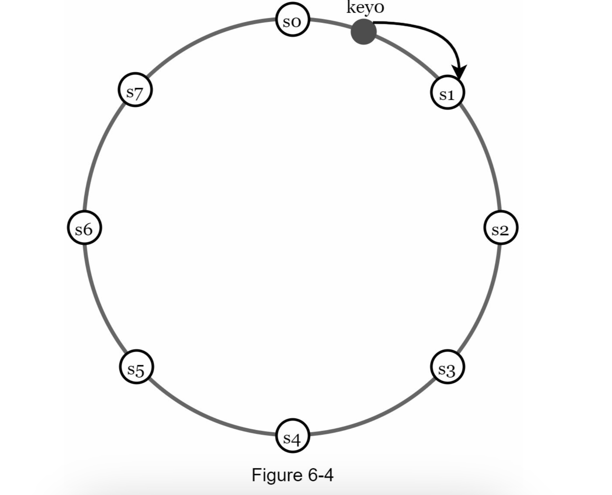
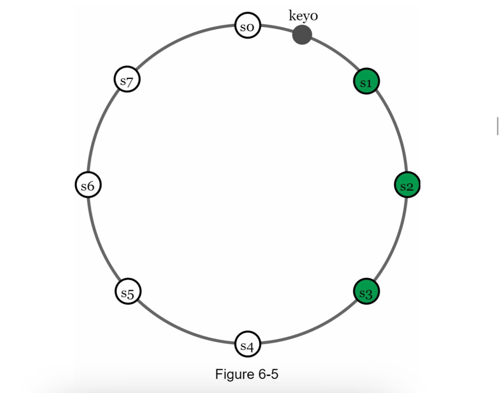
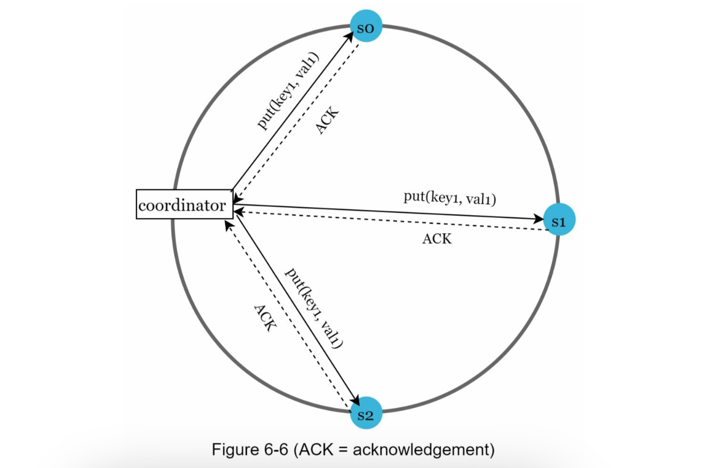

# CHAPTER 6: DESIGN A KEY-VALUE STORE
a non-relational database. Each unique identifier is stored as a key with its associated value: **key-value** pair.
the key must be unique, and the value associated with the key can be accessed through the key. A short key works better.
- Plain text key: “last_logged_in_at”
- Hashed key: 253DDEC4

| Key   |  value  | 
|:------|:-------:|
| 145   | john    |
| 147   | bob     |
| 160   | Julia   |

- put(key, value) // insert “value” associated with “key” 
- get(key) // get “value” associated with “key”

## Understand the problem and establish design scope
- The size of a key-value pair is small: less than 10 KB.
- Ability to store big data.
- High availability: The system responds quickly, even during failures.
- High scalability: The system can be scaled to support large data set.
- Automatic scaling: The addition/deletion of servers should be automatic based on traffic. • Tunable consistency.
- Low latency.

## Single server key-value store
To store key-value pairs in a hash table, which keeps everything in memory. Fitting everything in memory may be impossible due to the space constraint.
- Data compression
- Store only frequently used data in memory and the rest on disk
A distributed key-value store is required to support big data.

## Distributed key-value store
A distributed hash table, which distributes key- value pairs across many servers. When designing a distributed system, it is important to understand CAP (Consistency, Availability, Partition Tolerance) theorem.

###  CAP theorem
CAP theorem states that one of the three properties must be sacrificed to support 2 of the 3 properties:

**Consistency:** consistency means all clients see the same data at the same time no matter which node they connect to.

**Availability:** availability means any client which requests data gets a response even if some of the nodes are down.

**Partition Tolerance:** a partition indicates a communication break between two nodes. Partition tolerance means the system continues to operate despite network partitions.

- **CP (consistency and partition tolerance) systems**

- **AP (availability and partition tolerance) systems**

- **CA (consistency and availability) systems:**
Since network failure is unavoidable, a distributed system must tolerate network partition. Thus, a CA system cannot exist in real- world applications.

Assume data are replicated on three replica nodes, n1, n2 and n3:

### Ideal situation
Network partition never occurs. Data written to n1 is automatically replicated to n2 and n3. Both **consistency and availability** are achieved (CA).

### Real-world distributed systems
Partitions cannot be avoided, and when a partition occurs, we must choose between consistency and availability.

n3 goes down and cannot communicate with n1 and n2. If clients write data to n1 or n2, data cannot be propagated to n3. If data is written to n3 but not propagated to n1 and n2 yet, n1 and n2 would have stale data.

If we choose consistency over availability (CP system), we must block all write operations to n1 and n2 to avoid data inconsistency among these three servers, which makes the system unavailable. Bank systems usually have extremely high consistent requirements: it is crucial for a bank system to display the most up-to-date balance info. If inconsistency occurs due to a network partition, the bank system returns an error before the inconsistency is resolved.

However, if we choose availability over consistency (AP system), the system keeps accepting reads, even though it might return stale data. For writes, n1 and n2 will keep accepting writes, and data will be synced to n3 when the network partition is resolved.

Choosing the right CAP guarantees that fit your use case is an important step in building a distributed key-value store.

## System components
core components and techniques used to build a key-value store:
- Data partition
- Data replication
- Consistency
- Inconsistency resolution
- Handling failures
- System architecture diagram • Write path
- Read path

### Data partition
it is infeasible data partitioning for large applications. \
Challenges while partitioning the data:
1. Distribute data across multiple servers evenly.
2. Minimize data movement when nodes are added or removed.

**Consistent hashing** is a great technique to solve these problems (Chapter 5). how consistent hashing works at a high-level:

1. Servers are placed on a hash ring.
2. A key is hashed onto the same ring, and it is stored on the first server encountered while moving in the clockwise direction. For instance, key0 is stored in s1 using this logic.

Advantages: \
**Automatic scaling:** servers could be added and removed automatically depending on the load. \
**Heterogeneity:** the number of virtual nodes for a server is proportional to the server capacity. For example, if a server can handle a lot(higher capacity), it gets more virtual nodes to do more work.

## Data replication
To achieve high availability and reliability, data must be replicated asynchronously over N servers, where N is a configurable parameter. These N servers are chosen using the following logic: after a key is mapped to a position on the hash ring, walk clockwise from that position and choose the first N servers on the ring to store data copies.

N = 3, key0 is replicated at s1, s2, and s3.

With virtual nodes, the first N nodes on the ring may be owned by fewer than N physical servers. To avoid this issue, we only choose unique servers while performing the clockwise walk logic.

For better reliability, replicas are placed in distinct data centers, and data centers are connected through high-speed networks.
 
### Consistency
Since data is replicated at multiple nodes, it must be synchronized across replicas. Quorum consensus can guarantee consistency for both read and write operations. \
N = The number of replicas\
W = A write quorum of size W. For a write operation to be considered as successful, write
operation must be acknowledged from W replicas.\
R = A read quorum of size R. For a read operation to be considered as successful, read operation must wait for responses from at least R replicas. 

If N = 3, Say you have data to write to servers S1, S2, and S3. With W=1, once any of these servers (S1, S2, or S3) confirms receiving the data, the system considers the write operation a success. You don't have to wait for all three servers to acknowledge.

The configuration of W, R and N is a typical tradeoff between latency and consistency. 

- If W = 1 or R = 1, an operation is returned **quickly** (Fast updates and reads) because a coordinator only needs to wait for a response from any of the replicas. 

- If W or R > 1: (multiple confirmations are required) the system offers **better consistency**; however, the query will be slower because the The coordinator needs to wait for multiple responses, potentially including the slowest person to reply. 

- If W + R > N: **strong consistency is guaranteed** because there must be at least one overlapping node that has the latest data to ensure consistency.

Possible configures N, W, and R to fit our use cases:
- If R = 1 and W = N, the system is optimized for a fast read.
- If W = 1 and R = N, the system is optimized for fast write.
- If W + R > N, strong consistency is guaranteed (Usually N = 3, W = R = 2).
- If W + R <= N, strong consistency is not guaranteed.

Depending on the requirement, we can tune the values of W, R, N to achieve the desired level of consistency.

### Consistency models
Consistency model is other important factor to consider when designing a key-value store. A consistency model defines the degree of data consistency, and a wide spectrum of possible consistency models exist:
- Strong consistency: any read operation returns a value corresponding to the result of the most updated write data item. A client never sees out-of-date data.
- Weak consistency: subsequent read operations may not see the most updated value.
- Eventual consistency: this is a specific form of weak consistency. Given enough time, all updates are propagated, and all replicas are consistent.

Strong consistency is usually achieved by forcing a replica not to accept new reads/writes until every replica has agreed on current write. This approach is not ideal for highly available systems because it could block new operations. Dynamo and Cassandra adopt eventual consistency, which is our recommended consistency model for our key-value store. From concurrent writes, eventual consistency allows inconsistent values to enter the system and force the client to read the values to reconcile. The next section explains how reconciliation works with versioning.