# CHAPTER 6: DESIGN A KEY-VALUE STORE
a non-relational database. Each unique identifier is stored as a key with its associated value: **key-value** pair.
the key must be unique, and the value associated with the key can be accessed through the key. A short key works better.
- Plain text key: “last_logged_in_at”
- Hashed key: 253DDEC4

| Key   |  value  | 
|:------|:-------:|
| 145   | john    |
| 147   | bob     |
| 160   | Julia   |

In this chapter, you are asked to design a key-value store that supports the following
operations:

- put(key, value) // insert “value” associated with “key” 
- get(key) // get “value” associated with “key”

## Understand the problem and establish design scope
- The size of a key-value pair is small: less than 10 KB.
- Ability to store big data.
- High availability: The system responds quickly, even during failures.
- High scalability: The system can be scaled to support large data set.
- Automatic scaling: The addition/deletion of servers should be automatic based on traffic. 
- Tunable consistency.
- Low latency.

## Single server key-value store
To store key-value pairs in a hash table, which keeps everything in memory. Fitting everything in memory may be impossible due to the space constraint.
- Data compression
- Store only frequently used data in memory and the rest on disk
A distributed key-value store is required to support big data.

## Distributed key-value store
A distributed hash table, which distributes key- value pairs across many servers. When designing a distributed system, it is important to understand CAP (Consistency, Availability, Partition Tolerance) theorem.

###  CAP theorem
CAP theorem states that one of the three properties must be sacrificed to support 2 of the 3 properties:

**Consistency:** consistency means all clients see the same data at the same time no matter which node they connect to.

**Availability:** availability means any client which requests data gets a response even if some of the nodes are down.

**Partition Tolerance:** a partition indicates a communication break between two nodes. Partition tolerance means the system continues to operate despite network partitions.

- **CP (consistency and partition tolerance) systems**

- **AP (availability and partition tolerance) systems**

- **CA (consistency and availability) systems:**
Since network failure is unavoidable, a distributed system must tolerate network partition. Thus, a CA system cannot exist in real- world applications.

Assume data are replicated on three replica nodes, n1, n2 and n3:

### Ideal situation
Network partition never occurs. Data written to n1 is automatically replicated to n2 and n3. Both **consistency and availability** are achieved (CA).

### Real-world distributed systems
Partitions cannot be avoided, and when a partition occurs, we must choose between consistency and availability.

n3 goes down and cannot communicate with n1 and n2. If clients write data to n1 or n2, data cannot be propagated to n3. If data is written to n3 but not propagated to n1 and n2 yet, n1 and n2 would have stale data.

If we choose consistency over availability (CP system), we must block all write operations to n1 and n2 to avoid data inconsistency among these three servers, which makes the system unavailable. Bank systems usually have extremely high consistent requirements: it is crucial for a bank system to display the most up-to-date balance info. If inconsistency occurs due to a network partition, the bank system returns an error before the inconsistency is resolved.

However, if we choose availability over consistency (AP system), the system keeps accepting reads, even though it might return stale data. For writes, n1 and n2 will keep accepting writes, and data will be synced to n3 when the network partition is resolved.

Choosing the right CAP guarantees that fit your use case is an important step in building a distributed key-value store.

## System components
core components and techniques used to build a **key-value store**:
- [Data partition](#data-partition)
- [Data replication](#data-replication)
- [Consistency](#consistency)
- [Inconsistency resolution](#inconsistency-resolution-versioning)
- [Handling failures](#handling-failures)
- [System architecture diagram ](#system-architecture-diagram)
- [Write path](#write-path)
- [Read path](#read-path)

### Data partition
it is infeasible data partitioning for large applications. The
simplest way to accomplish this is to **split the data into smaller partitions** and store them in
multiple servers.\
Challenges while partitioning the data:
1. Distribute data across multiple servers evenly.
2. Minimize data movement when nodes are added or removed.

[**Consistent hashing**](../05-design-consistent-hashing/jun-ch05-design-consistent-hashing.md#consistent-hashing) is a great technique to solve these problems. how consistent hashing works at a high-level:

1. Servers are placed on a hash ring.
2. A key is hashed onto the same ring, and it is stored on the first server encountered while moving in the clockwise direction. For instance, key0 is stored in s1 using this logic.

Advantages: \
**Automatic scaling:** servers could be added and removed automatically depending on the load. \
**Heterogeneity:** the number of virtual nodes for a server is proportional to the server capacity. For example, if a server can handle a lot(higher capacity), it gets more virtual nodes to do more work.

## Data replication
To achieve high availability and reliability, data must be replicated asynchronously over N servers, where N is a configurable parameter. These N servers are chosen using the following logic: after a key is mapped to a position on the hash ring, walk clockwise from that position and choose the first N servers on the ring to store data copies.

N = 3, key0 is replicated at s1, s2, and s3.

With virtual nodes, the first N nodes on the ring may be owned by fewer than N physical servers. To avoid this issue, we only choose unique servers while performing the clockwise walk logic.

For better reliability, replicas are placed in distinct data centers, and data centers are connected through high-speed networks.
 
### Consistency
Since data is replicated at multiple nodes, it must be synchronized across replicas. Quorum consensus can guarantee consistency for both read and write operations. \
N = The number of replicas\
W = A write quorum of size W. For a write operation to be considered as successful, write operation must be acknowledged from W replicas.\
R = A read quorum of size R. For a read operation to be considered as successful, read operation must wait for responses from at least R replicas. 

If N = 3, Say you have data to write to servers S1, S2, and S3. With W=1, once any(one) of these servers (S1, S2, or S3) confirms receiving the data, the system considers the write operation a success. You don't have to wait for all three servers to acknowledge.

The configuration of W, R and N is a typical tradeoff between latency and consistency.

- If W = 1 or R = 1, an operation is returned **quickly (Fast updates and reads)** because a coordinator only needs to wait for a response from **any(one)** of the replicas. 

- If W or R > 1: **(multiple confirmations are required)** the system offers **better consistency**; however, the query will be slower because the The coordinator needs to **wait for multiple responses**, potentially including the slowest person to reply. 

- If W + R > N: **strong consistency is guaranteed** because there must be at least one overlapping node that has the latest data to ensure consistency.

Possible configures N, W, and R to fit our use cases:
- If **R = 1** and W = N, the system is optimized for a **fast read**.
- If **W = 1** and R = N, the system is optimized for **fast write**.
- If W + R > N, **strong consistency is guaranteed** (Usually N = 3, W = R = 2).
- If W + R <= N, strong consistency is not guaranteed.

Depending on the requirement, we can tune the values of W, R, N to achieve the desired level of consistency.

### Consistency models
Consistency model is other important factor to consider when designing a key-value store. A consistency model defines the degree of data consistency, and a wide spectrum of possible consistency models exist:
- **Strong consistency**: any read operation returns a value corresponding to the result of the **most updated** write data item. A client never sees out-of-date data.
- Weak consistency: subsequent read operations may not see the most updated value.
- **Eventual consistency**: this is a specific form of weak consistency. updates will sync up eventually, but not immediately.

Strong consistency is usually achieved by forcing a replica not to accept new reads/writes until every replica has agreed on current write (W + R > N).
This approach is not ideal for highly available systems because it could block new operations.

if the system is forced to wait for all replicas to sync up each time, it might end up being unavailable for new requests. 

  

Dynamo and Cassandra adopt eventual consistency, which is our recommended consistency model for our key-value store. 
From concurrent writes, eventual consistency allows inconsistent values to enter the system and force the client to read the values to reconcile. The next section explains **how reconciliation works with versioning**.

  
eventual consistency

  means updates will sync up eventually, but not immediately.
   if multiple copies of data are stored on different servers, those copies might not be exactly the same at any given moment. However, over time, the system will make sure that all copies become the same.

 

### Inconsistency resolution: versioning
Replication gives high availability but causes inconsistencies among replicas. Versioning and vector locks are used to solve inconsistency problems. Versioning means treating each data modification as a new immutable version of data.\
an example to explain how inconsistency happens:\
As shown in Figure 6-7, both replica nodes n1 and n2 have the same value. Let us call this value the original value. Server 1 and server 2 get the same value for get(“name”) operation.

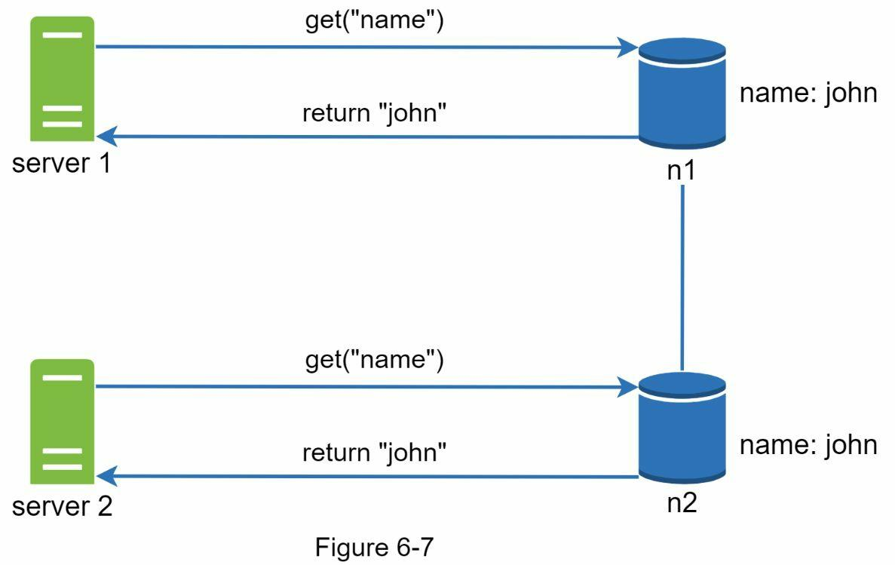
server 1 changes the name to “johnSanFrancisco”, and server 2 changes the name to “johnNewYork” as shown in Figure 6-8. These two changes are performed **simultaneously**.
Now, we have **conflicting values**, called versions v1 and v2.
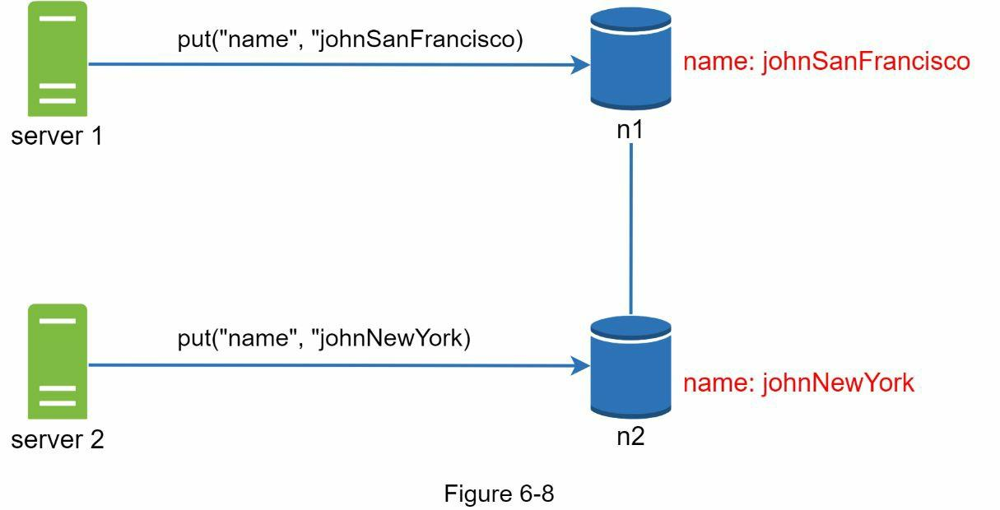
In this example, there is no clear way to resolve the conflict of the last two versions. To resolve this issue, we need a versioning system that can **detect conflicts and reconcile conflicts**. A **vector clock** is a common technique to solve this problem.

A vector clock is a <server, version> pair associated with a data item. It can be used to check if one version precedes, succeeds, or in conflict with others.
Assume a vector clock is represented by `D(<S1, v1>, <S2, v2>, …, <Sn, vn>)`, where D is a data item, v1 is a version counter, and s1 is a server number, etc. 
If data item D is written to server Si, the system must perform one of the following tasks.
- Increment vi if [Si, vi] exists.
- Otherwise, create a new entry [Si, 1].

  1. Initially, D is created on S1 with version [S1, 1]:

    Vector clock: D([S1, 1])

  2. D is then updated on S1 again:
    - Increment S1’s version in the vector clock to [S1, 2].

    Vector clock: D([S1, 2])

  3. D is updated on S2 for the first time:
    - Add a new entry for S2 as [S2, 1].

    Vector clock: D([S1, 2], [S2, 1])

The above abstract logic is explained with a concrete example as shown in Figure 6-9.
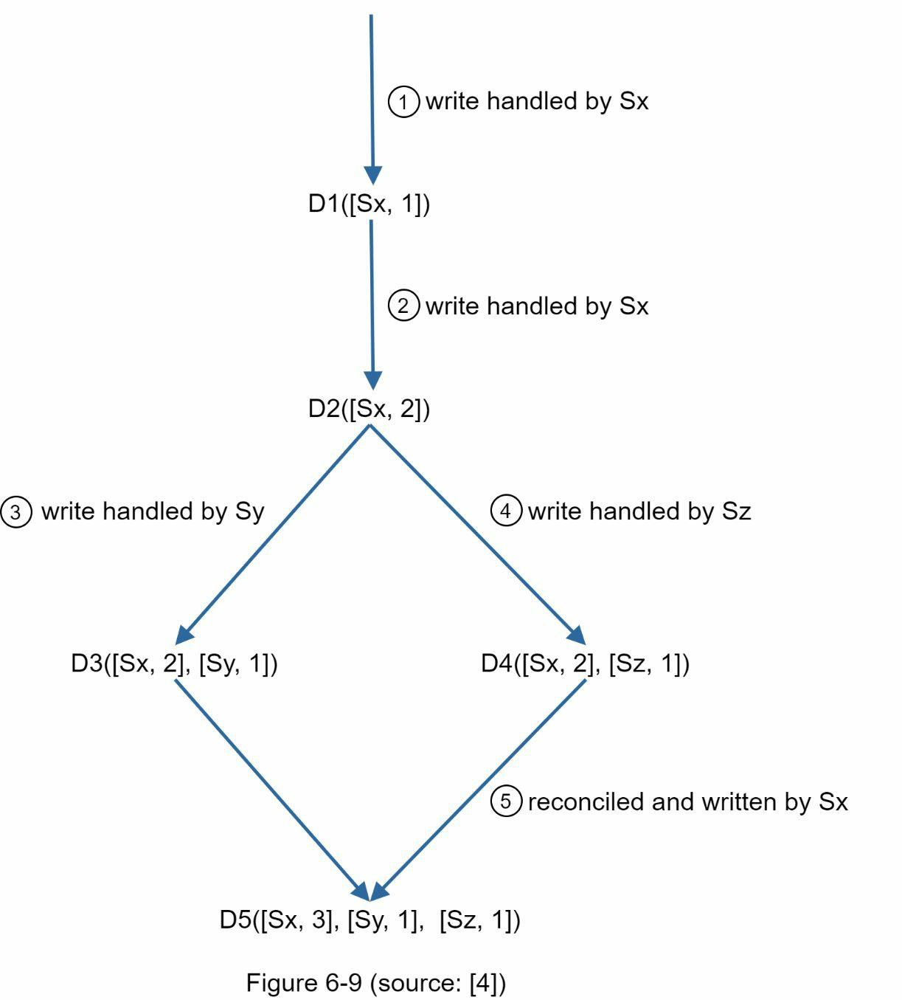

1. A client writes a data item `D1` to the system, and the write is handled by server `Sx`, which now has the vector clock `D1[(Sx, 1)]`.

2. Another client reads the latest `D1`, updates it to `D2`, and writes it back. `D2` descends from `D1` so it overwrites `D1`. Assume the write is handled by the same server Sx, which now has vector clock `D2([Sx, 2])`.

3. Another client reads the latest `D2`, updates it to `D3`, and writes it back. Assume the write is handled by server `Sy`, which now has vector clock `D3([Sx, 2], [Sy, 1])`.

4. Another client reads the latest `D2`, updates it to `D4`, and writes it back. Assume the write is handled by server `Sz`, which now has `D4([Sx, 2], [Sz, 1])`.

5. When another client reads `D3` and `D4`, it discovers a conflict, which is caused by data item `D2` being modified by both `Sy` and `Sz`. The conflict is resolved by the client and updated data is sent to the server. Assume the write is handled by `Sx`, which now has `D5([Sx, 3], [Sy, 1], [Sz, 1])`. We will explain how to detect conflict shortly.

### Initial Setup
- Data item: `D1`
- First write: `D1` is written by server `Sx`.
- Vector clock: `D1([Sx, 1])` – This means `D1` has been updated once by server `Sx`.

### Step-by-Step Breakdown
1. First Update – Creating D2

  - A client reads `D1`, updates it, and writes the updated version as `D2`.
  - Since this update builds on top of `D1`, `D2` "descends" from `D1`.
  - This update is also handled by server `Sx`, so the version counter for `Sx` is incremented.
  - New vector clock: `D2([Sx, 2])` – Now server `Sx` has made two updates to this data.

2. Second Update – Creating `D3`

  - Another client reads `D2`, updates it, and writes this updated version as `D3`.
  - This time, server `Sy` handles the update, so a new entry is added to the vector clock for `Sy`.
  - New vector clock: `D3([Sx, 2], [Sy, 1])` – This means Sx has updated the data twice, and now Sy has updated it once.

3. Third Update – Creating `D4`

  - **Meanwhile**, another client also reads `D2`, updates it separately, and writes this updated version as `D4`.
  - This update is handled by a different server, `Sz`, so `Sz` is added to the vector clock with a count of 1.
  - New vector clock: `D4([Sx, 2], [Sz, 1])` – Now Sx has updated the data twice, and `Sz` has updated it once.

### Detecting the Conflict
Now there are two versions of the data, `D3` and `D4`, both derived from `D2`, but they each have different updates by different servers:

- `D3` has the vector clock `([Sx, 2], [Sy, 1])`
- `D4` has the vector clock `([Sx, 2], [Sz, 1])`

When a client tries to read the latest version, it will notice:

- `D3` and `D4` both reference `D2` (same `[Sx, 2]` part), but they have diverged (different updates by `Sy` and `Sz`).
- This means there’s a conflict because `D3` and `D4` have different changes that haven’t been merged.

### Resolving the Conflict
- The client resolves the conflict by merging D3 and D4 in some way, creating a new data version, `D5`.
- New vector clock for `D5`: `D5([Sx, 3], [Sy, 1], [Sz, 1])`
  - This clock now shows that Sx has made a third update (after resolving the conflict), while the changes from Sy and Sz are both included in `D5`.

**Ancestor (No Conflict)**
- A version `X` is considered an ancestor of `Y` if every version counter in `Y` is equal to or greater than the corresponding counter in `X`.
  - This means `Y` contains all updates of `X`, so there’s no conflict.
- For example:
  - Vector clock of `X`: `D([s0, 1], [s1, 1])`
  - Vector clock of `Y`: `D([s0, 1], [s1, 2])`
  - In `Y`, the counters for both `s0` and `s1` are equal to or greater than those in `X`, so X is an ancestor of Y. This means Y builds on X, so no conflict.

**Conflict (Sibling Versions)**
- Two versions `X` and `Y` conflict if there’s any mismatch where one server's counter in `X` is greater than the corresponding counter in `Y`, and another server's counter in `Y` is greater than that in `X`.
- This means neither version fully contains the updates from the other, so they’re conflicting siblings.
- Example:
  - Vector clock of `X`: `D([s0, 1], [s1, 2])`
  - Vector clock of `Y`: `D([s0, 2], [s1, 1])`
  - Here, `s0` in `Y` has a higher counter than in `X`, but s1 in `X` has a higher counter than in `Y`. This indicates conflict because each version has unique updates.
  
**Downsides of Vector Clocks**

- **Complexity for Clients**: The client must track and manage these vector clocks and resolve any conflicts, which adds complexity.
- **Growing Vector Clocks**: Every time a server updates a data item, it adds an entry (or updates its counter) in the vector clock, making the list longer. To prevent unlimited growth, a system can limit vector clock length, removing older entries if necessary.

By limiting the vector clock size, older entries are removed, which can make it harder to determine the precise history of updates. However, as Amazon noted in their Dynamo system, they didn’t encounter major issues with this approach, so it's likely an acceptable tradeoff for many systems.

## Handling failures
### Failure detection
If only one server reports that another server is down, it might be wrong. For instance, there could be a network issue only between those two servers, not affecting the rest of the system.

To avoid marking a server as down due to a possible false alarm, two or more servers must independently report that they cannot reach the target server. When multiple servers agree that the target server is unresponsive, it's more reliable to conclude that it’s genuinely down.

As shown in Figure 6-10, all-to-all multicasting is a straightforward solution. 

this is <b>inefficient</b> when many servers are in the system.

1. **Message Overload**: As the number of servers increases, the number of messages required grows rapidly. For N servers, each server must communicate with N-1 others, resulting in a total of N * (N-1) messages. This generates a huge volume of network traffic, which increases load and reduces performance.

2. **Network Congestion**: More messages mean higher chances of network congestion. This can lead to slower response times, delays, and even dropped messages, especially if the network is handling a lot of other data at the same time.
    

    
How Congestion Happens

    When multiple devices or systems send a high volume of data, routers, switches, and other network components may struggle to handle all the traffic. For example, in a distributed system, if every server is sending data to every other server (as in all-to-all multicasting), the network can become congested, slowing down communication between servers.
    
 

3. **Scalability Issues**: All-to-all multicasting scales poorly as the system grows. While it may work with a small number of servers, adding more servers increases both the number of messages and the load on each server, making it impractical for large distributed systems.

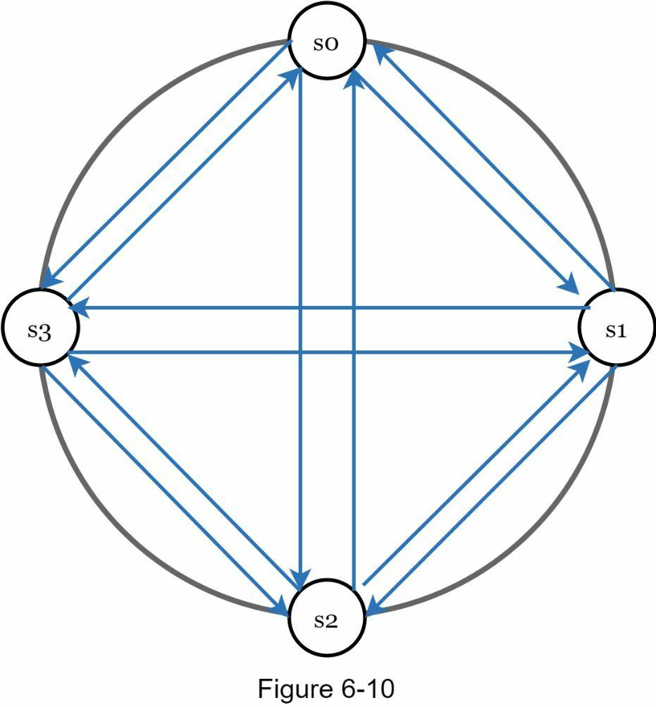

A better solution is to use **decentralized failure detection methods** like **gossip protocol**.
Gossip protocol works as follows:
- Each node maintains a node membership list, which contains member IDs and heartbeat counters.
  

    
node membership list

    Every node in the network has a membership list containing the IDs of other nodes it knows about, along with a heartbeat counter for each node.
  

  

    
heartbeat counters

    like a timestamp that each node increments regularly to show it’s still active.
  
 

- Each node periodically increments its heartbeat counter.
- Each node periodically sends heartbeats to a set of random nodes, which in turn propagate to another set of nodes.
- Once nodes receive heartbeats, membership list is updated to the latest info.
- If the heartbeat has not increased for more than predefined periods, the member is
considered as offline.

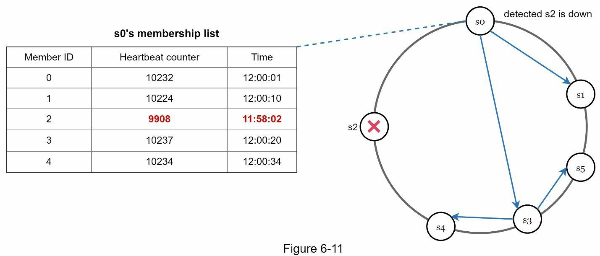
- Node `s0` maintains a node membership list shown on the left side.
- Node `s0` notices that node `s2`’s (member ID = 2) heartbeat counter has not increased for a long time.
- Node `s0` sends heartbeats that include `s2`’s info to a set of random nodes. Once other nodes confirm that `s2`’s heartbeat counter has not been updated for a long time, node `s2` is marked down, and this information is propagated to other nodes.

### Handling temporary failures
After failures have been detected through the gossip protocol, the system needs to deploy certain mechanisms to ensure availability. In the **strict quorum approach**, read and write operations could be blocked as illustrated in the quorum consensus section.

A technique called “**sloppy quorum**” is used to improve availability. Instead of enforcing the quorum requirement, the system chooses the first `W` healthy servers for writes and first `R` healthy servers for reads on the hash ring. Offline servers are ignored.

If a server is unavailable due to network or server failures, another server will process requests temporarily. When the down server is up, changes will be pushed back to achieve data consistency. This process is called **hinted handoff**. Since `s2` is unavailable in Figure 6- 12, reads and writes will be handled by s3 temporarily. When `s2` comes back online, `s3` will hand the data back to `s2`.

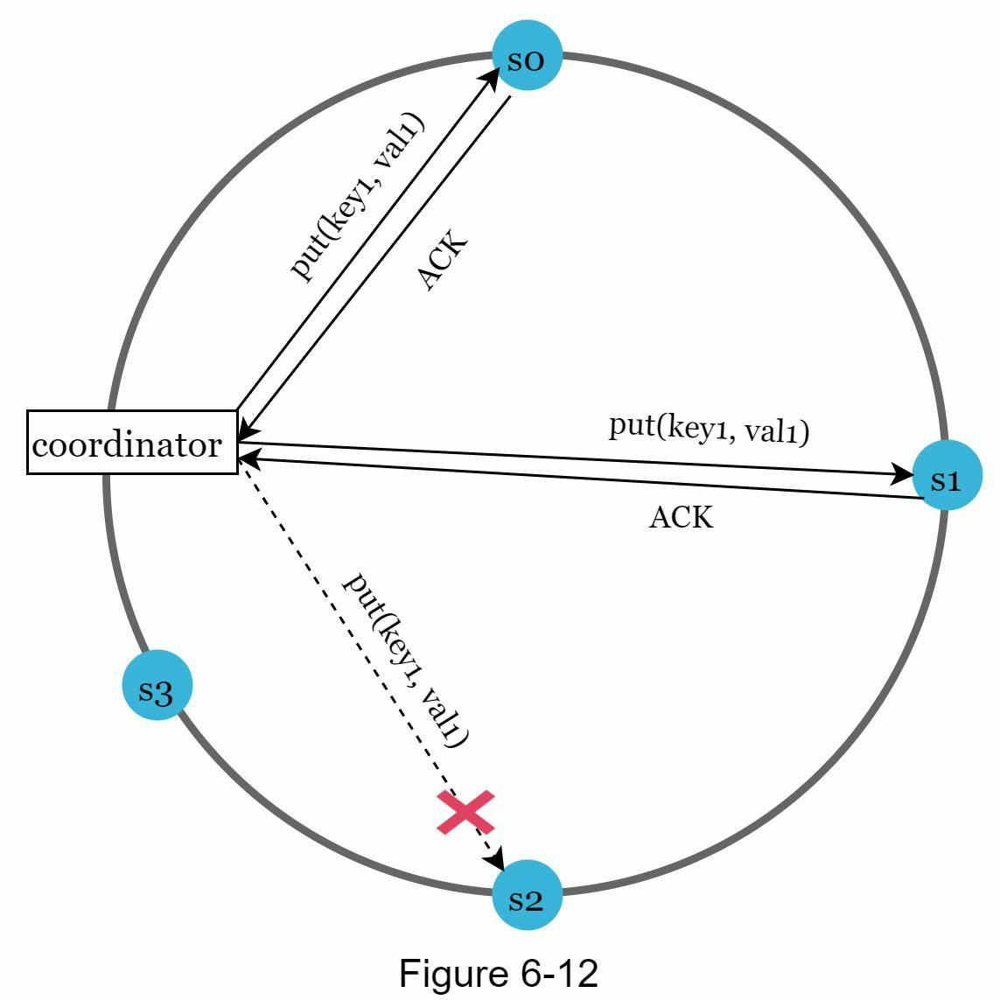

### Handling permanent failures

When a replica is permanently unavailable, the **anti-entropy** protocol keeps replicas in sync by comparing data and updating to the newest version. A **Merkle tree** is used within this process to efficiently detect differences between replicas.

how to implement Merkle tree: 

Step 1: Divide key space into buckets (4 in our example) as shown in Figure 6-13. A bucket is used as the root level node to maintain a limited depth of the tree.
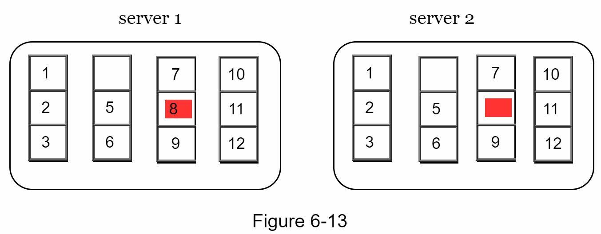

Step 2: Once the buckets are created, hash each key in a bucket using a uniform hashing method (Figure 6-14).
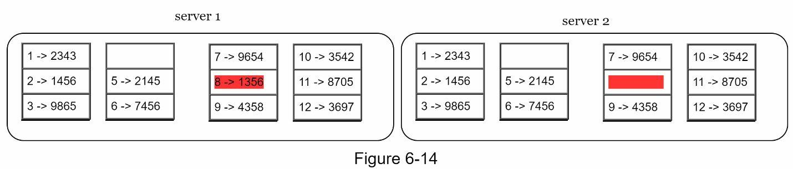

Step 3: Create a single hash node per bucket (Figure 6-15).

Step 4: Build the tree upwards till root by calculating hashes of children (Figure 6-16).
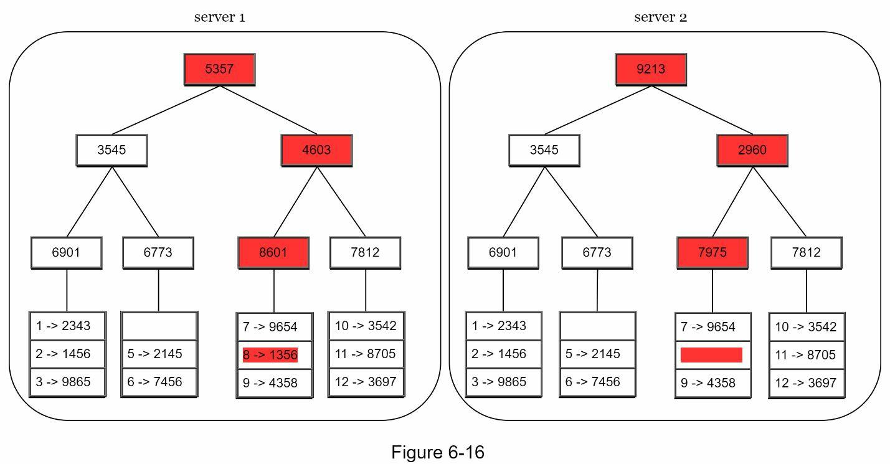

To compare two Merkle trees, start by comparing the root hashes. If root hashes match, both servers have the same data. If root hashes disagree, then the left child hashes are compared followed by right child hashes. You can traverse the tree to find which buckets are not synchronized and synchronize those buckets only.

### Handling data center outage
replicate data across multiple data centers -> Even if a data center is completely offline, users can still access data through the other data centers.

### System architecture diagram
Now that we have discussed different technical considerations in designing a key-value store, we can shift our focus on the architecture diagram, shown in Figure 6-17.
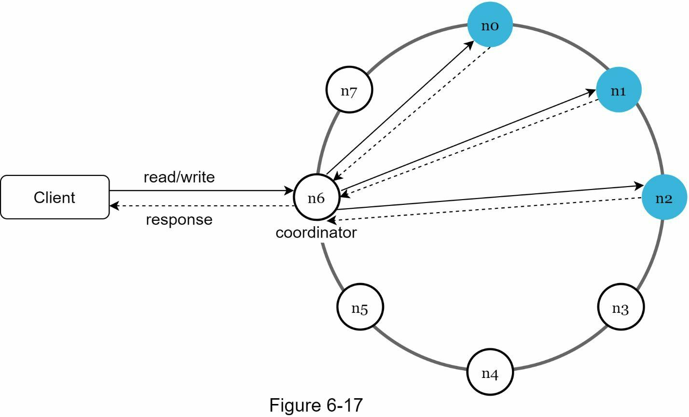

Main features of the architecture are listed as follows:
- Clients communicate with the key-value store through simple APIs: get(key) and put(key, value).
- A coordinator is a node that acts **as a proxy** between the client and the key-value store.
- Nodes are distributed on a ring using **consistent hashing**.
- The system is completely decentralized so adding and moving nodes can be automatic.
- Data is replicated at multiple nodes.
- There is no single point of failure as every node has the same set of responsibilities.

As the design is decentralized, each node performs many tasks as presented in Figure 6-18.

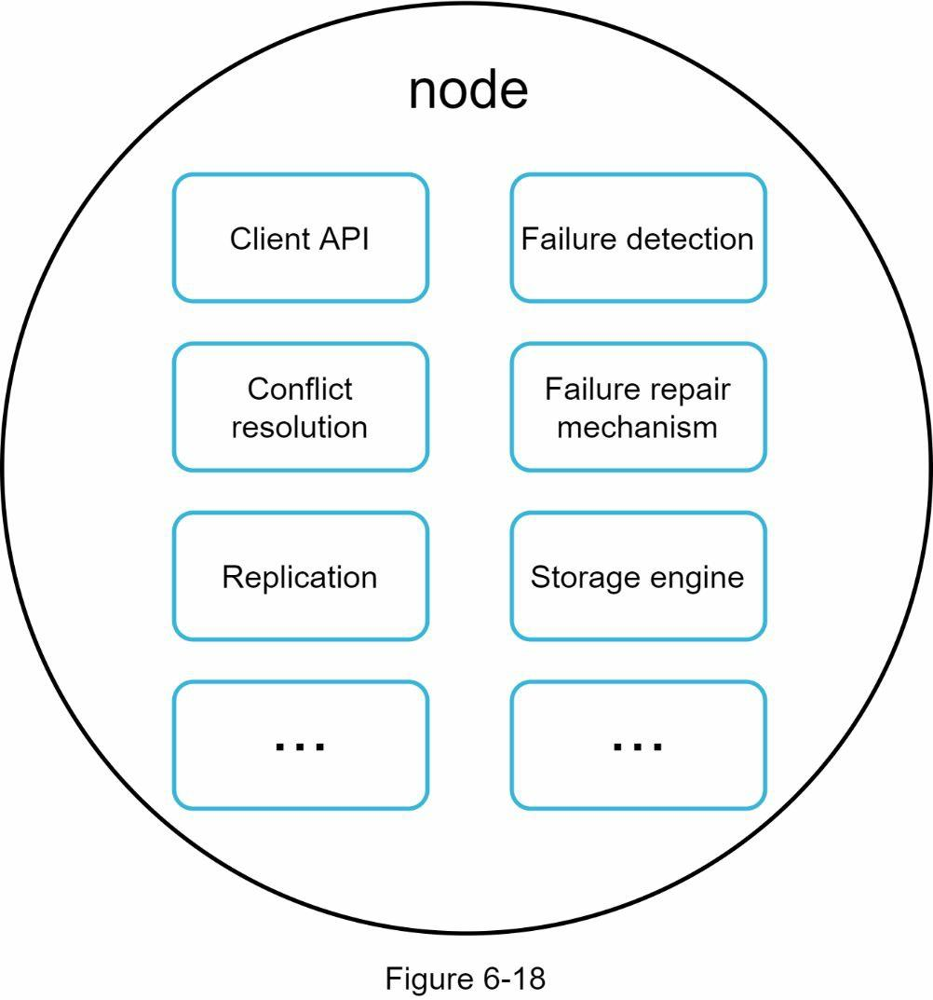

### Write path
Figure 6-19 explains what happens after a write request is directed to a specific node. Please note the proposed designs for write/read paths are primary based on the architecture of Cassandra.
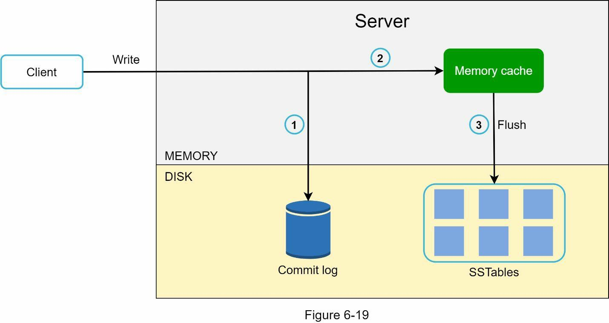

1. The write request is persisted on a commit log file.
2. Data is saved in the memory cache.3. When the memory cache is full or reaches a predefined threshold, data is flushed to SSTable on disk. Note: A sorted-string table (SSTable) is a sorted list of `<key, value>` pairs. For readers interested in learning more about SStable, refer to the reference material.

### Read path
After a read request is directed to a specific node, it first checks if data is in the memory
cache. If so, the data is returned to the client as shown in Figure 6-20.
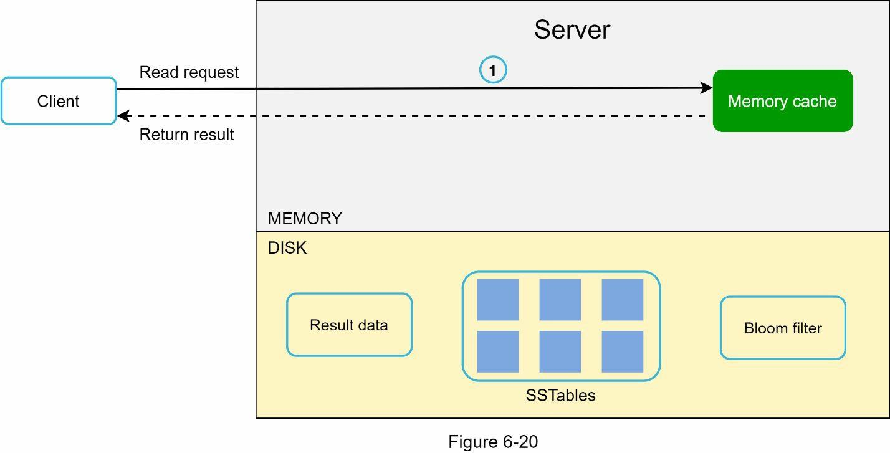

If the data is not in memory, it will be retrieved from the disk instead. We need an efficient way to find out which SSTable contains the key. **Bloom filter** is commonly used to solve this problem.

The read path when data is not in memory:
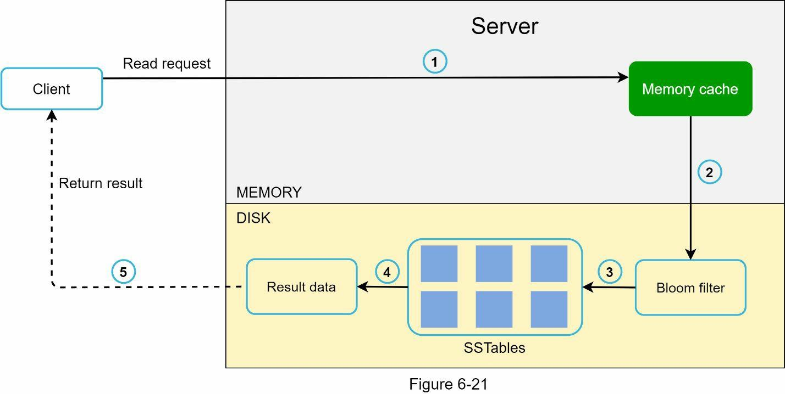

1. The system first checks if data is in memory. If not, go to step 2.
2. If data is not in memory, the system checks the bloom filter.
3. The bloom filter is used to figure out which SSTables might contain the key.
4. SSTables return the result of the data set.
5. The result of the data set is returned to the client.

### Summary
| Goal/Problems                  | Technique                                                    |
|--------------------------------|--------------------------------------------------------------|
| Ability to store big data      | Use consistent hashing to spread the load across servers     |
| High availability reads        | Data replication   Multi-data center setup               |
| Highly available writes        | Versioning and conflict resolution with vector clocks        |
| [Dataset partition](#data-partition)              | Consistent Hashing                                           |
| Incremental scalability        | Consistent Hashing                                           |
| Heterogeneity                  | Consistent Hashing                                           |
| Tunable consistency            | Quorum consensus                                             |
| [Handling temporary failures](#handling-temporary-failures)    | Sloppy quorum and hinted handoff                             |
| [Handling permanent failures](#handling-permanent-failures)    | Merkle tree                                                  |
| [Handling data center outage](#handling-data-center-outage)    | Cross-data center replication         