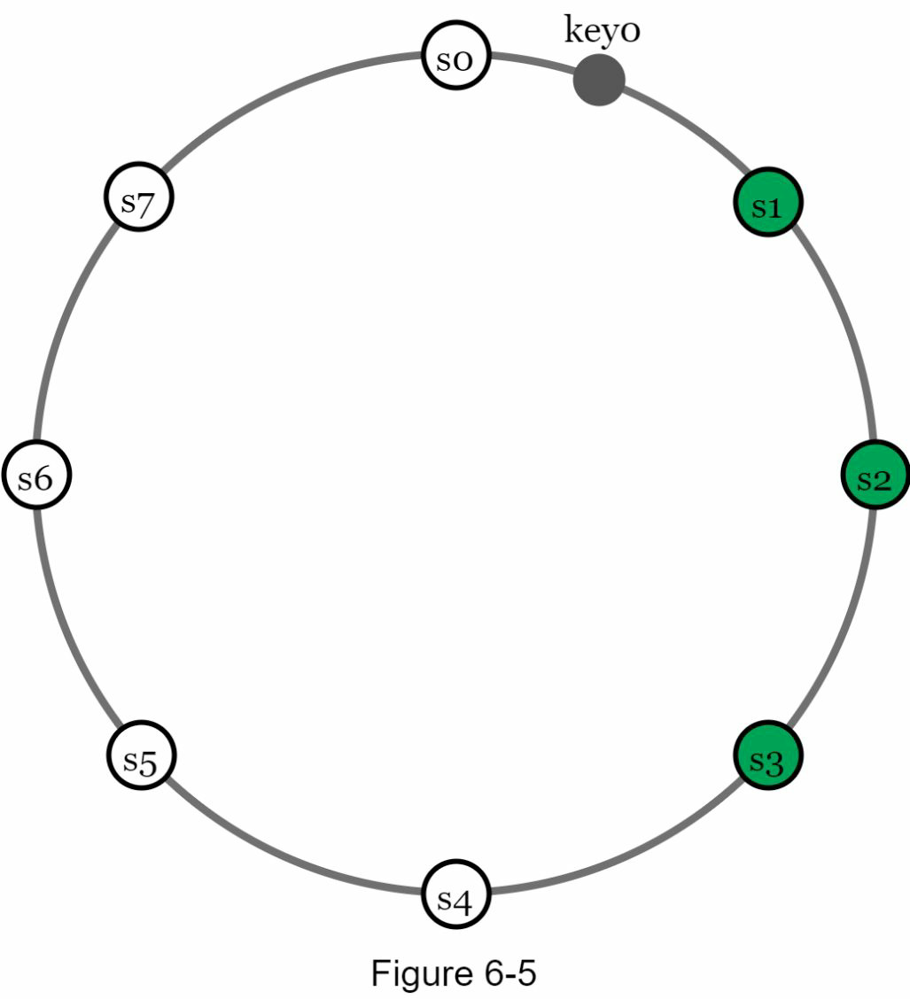
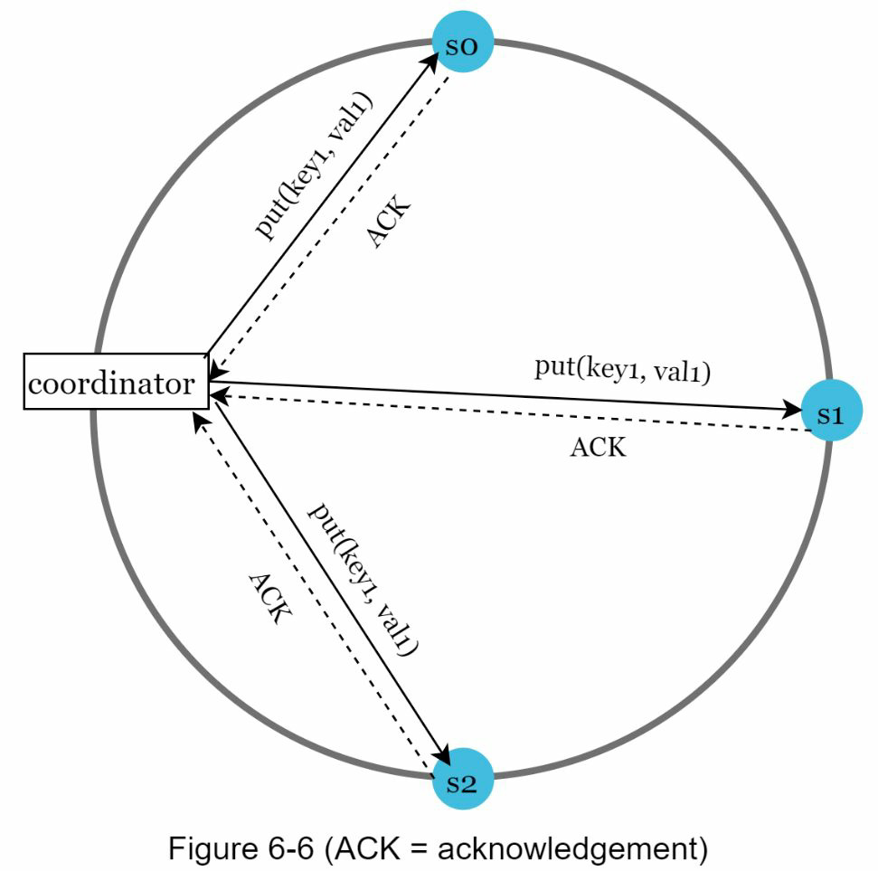
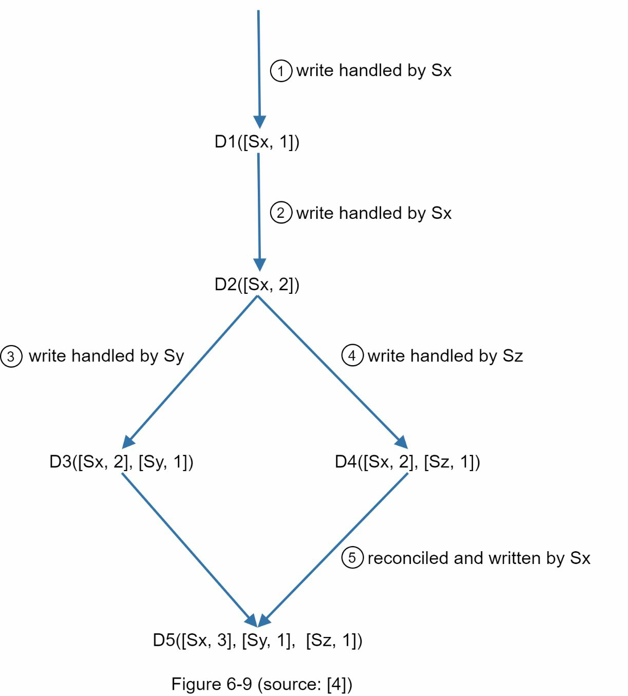
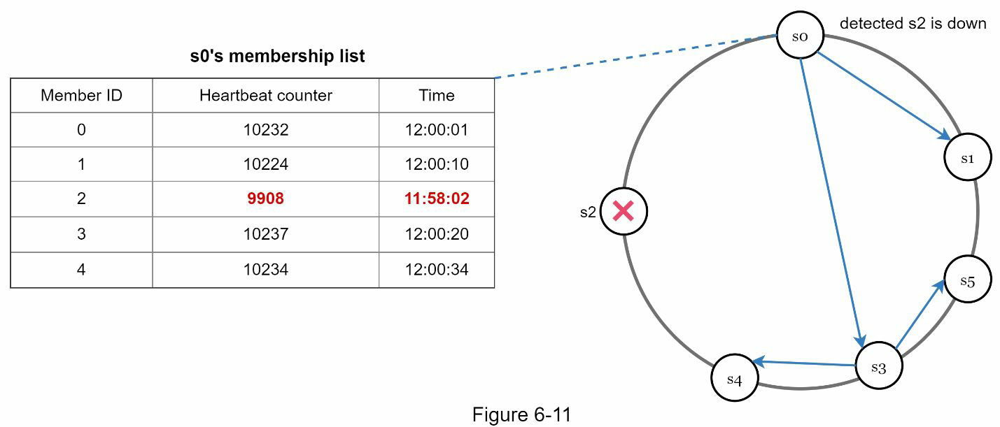
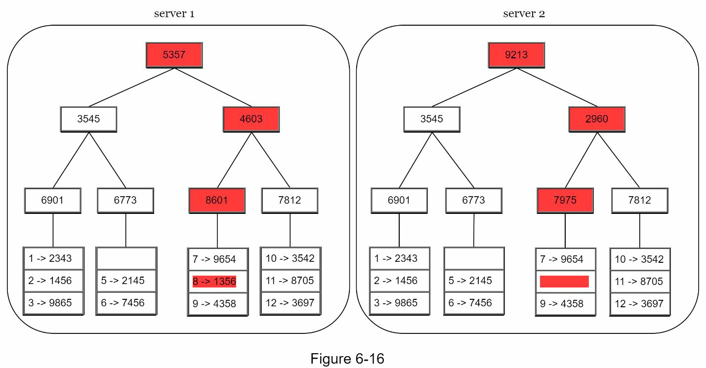
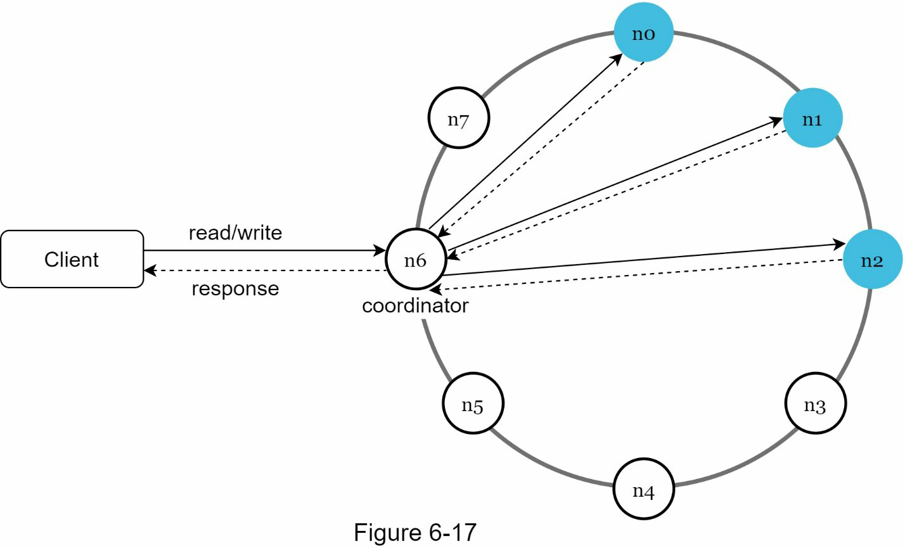
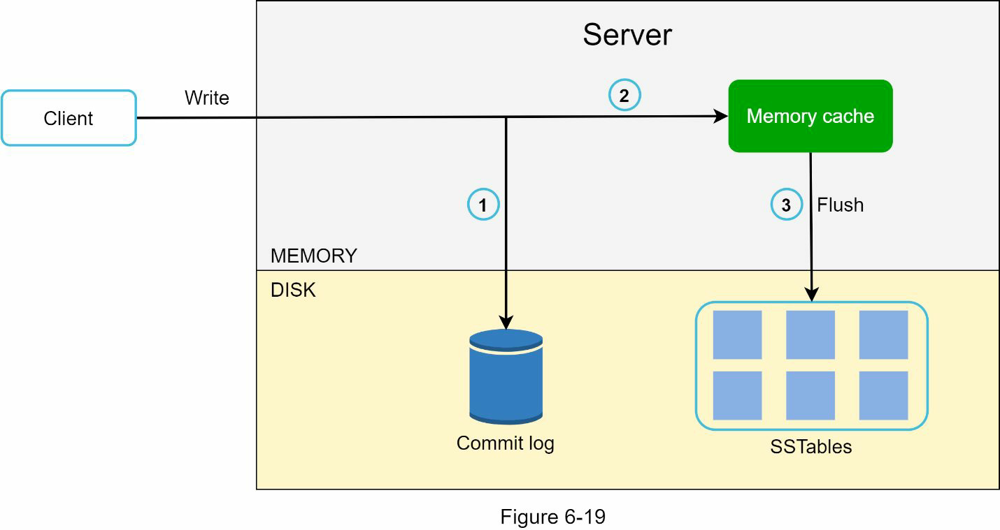
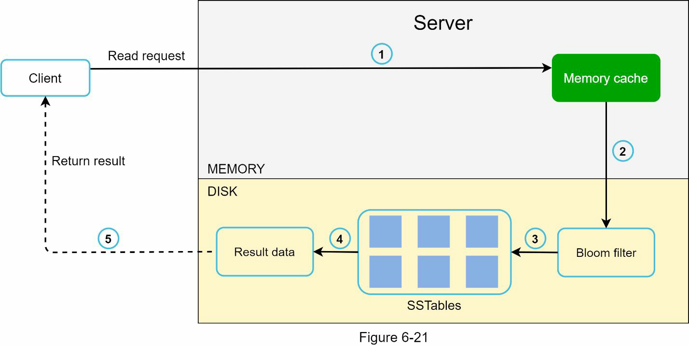
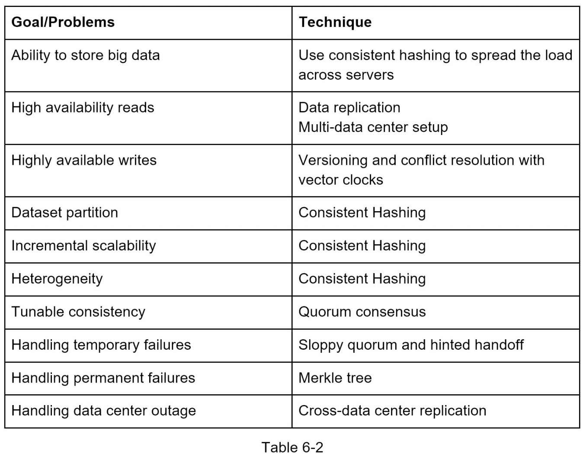

# Design a key-value store

- The scope of the design
  - The size of a key-value pair is small: less than 10 KB.
  - Ability to store big data.
  - High availability: The system responds quickly, even during failures.
  - High scalability: The system can be scaled to support large data set.
  - Automatic scaling: The addition/deletion of servers should be automatic based on traffic.
  - Tunable consistency.
  - Low latency.

## Single server key-value store

Needs some optimizations, but these are not enough
- Data compression
- Store only frequently used data in memory

## Distributed key-value store

### CAP
- Meet only two of them
  - Consistency:all clients see the same data at the same time
  - Availability: any client which requests data gets a response even if some of the nodes are down.
  - Partition tolerance: the system continues to operate despite network partitions

### Real-world distributed systems

- Partitions cannot be avoided, and when a partition occurs, we must choose between consistency and availability.

- CP system: Must block all write operations to n1 and n2 to avoid data inconsistency among these three servers, which makes the system unavailable. (Banking system)
- AP system: Keeps accepting reads, even though it might return stale data. For writes, n1 and n2 will keep accepting writes, and data will be synced to n3 when the network partition is resolved.

## System components to discuss
- Data partition
- Data replication
- Consistency
- Inconsistency resolution
- Handling failures
- System architecture diagram
- Write path
- Read path

### Data partition
- Consistent hashing is used to achieve the followings.
  - Distribute data across multiple servers evenly. 
  - Minimize data movement when nodes are added or removed

- Advantages of consistent hashng 
  - Automatic scaling
  - Heterogeneity: The number of virtual nodes for a server is proportional to the server capacity

### Data replication

- Walk clockwise from that position and choose the first N servers on the ring to store data copies

- Choose unique servers while performing clockwise walk logic

### Consistency
- Must be synchronized across replicas

- W: A write quorum of size W. For a write operation to be considered as successful, write operation must be acknowledged from W replicas.
- R: A read quorum of size R. For a read operation to be considered as successful, read operation must wait for responses from at least R replicas.

- Tuning the parameters
  - If R = 1 and W = N, the system is optimized for a fast read.
  - If W = 1 and R = N, the system is optimized for fast write.
  - If W + R > N, strong consistency is guaranteed (Usually N = 3, W = R = 2).
  - If W + R <= N, strong consistency is not guaranteed.
- Consistency models
  - Strong consistency: Any read operation returns a value corresponding to the result of the most updated write data item. A client never sees out-of-date data.
  - Weak consistency: Subsequent read operations may not see the most updated value.
  - Eventual consistency: This is a specific form of weak

### Inconsistency resolution: versioning

- Versioning and vector locks are used to solve inconsistency problems

#### Theory

- A vector clock is a [server, version] pair associated with a data item. It can be used to check if one version precedes, succeeds, or in conflict with others.
- Assume a vector clock is represented by D([S1, v1], [S2, v2], …, [Sn, vn]), where D is a data item, v1 is a version counter, and s1 is a server number, etc. If data item D is written to server Si, the system must perform one of the following tasks.
  - Increment vi if [Si, vi] exists.
  - Otherwise, create a new entry [Si, 1].

- Using vector clocks, it is easy to tell that a version X is an ancestor (i.e. no conflict) of version Y if the version counters for each participant in the vector clock of Y is greater than or equal to the ones in version X. 
- For example, the vector clock D([s0, 1], [s1, 1])] is an ancestor of D([s0, 1], [s1, 2]). Therefore, no conflict is recorded.

- Similarly, you can tell that a version X is a sibling (i.e., a conflict exists) of Y if there is any participant in Y's vector clock who has a counter that is less than its corresponding counter in X. 
- For example, the following two vector clocks indicate there is a conflict: D([s0, 1], [s1, 2]) and D([s0, 2], [s1, 1]).

#### Downsides
- Complexity to the client because it needs to implement conflict resolution logic.
- [server: version] pairs in the vector clock could grow rapidly. To fix this problem, we set a threshold for the length, and if it exceeds the limit, the oldest pairs are removed. This can lead to inefficiencies in reconciliation because the descendant relationship cannot be determined accurately.

### Handling failures

#### Failure detection

- Decentralized failure detection methods (gossip protocol)
  - Each node maintains a node membership list (member IDs and heartbeat counters)
  - Each node periodically increments its heartbeat counter.
  - Each node periodically sends heartbeats to a set of random nodes, which in turn propagate to another set of nodes
  - Once nodes receive heartbeats, membership list is updated to the latest info
  - If the heartbeat has not increased for more than predefined periods, the member is considered as offline.

#### Handling temporary failures

- Sloppy quorum => improve availability 
  - System chooses the first W healthy servers for writes and first R healthy servers for reads on the hash ring. Offline servers are ignored
  - If server is unavailable due to network or server failures, another server will process requests temporarily. 
  - When the down server is up, changes will be pushed back to achieve data consistency
    - a.k.a. hinted handoff => handles temporary failure

- Anti-entropy protocol
  - comparing each piece of data on replicas and updating each replica to the newest version

- Merkle tree
  - the amount of data needed to be synchronized is proportional to the differences between the two replicas, and not the amount of data they contain. 
  - In real-world systems, the bucket size is quite big
  - Examples
    - Block chain, distributed data base

#### Handling data center outage
- replicate data across multiple data centers

### System architecture design

- Communicate with the key-value store through simple API
- Coordinate: a node that acts as a proxy between the client and the key-value store
- Nodes are distributed on a ring using consitent hashing
- Completely decentralized so adding and moving nodes can be automatic
- Data is replicated at multiple nodes
- No single point of failure

#### Write path

1. The write request is persisted on a commit log file
2. Data is saved in the memory cache
3. Data is flushed to SSTable [9] on disk

#### Read path

1. The system first checks if data is in memory. If not, go to step 2.
2. If data is not in memory, the system checks the bloom filter.
3. The bloom filter is used to figure out which SSTables might contain the key.
4. SSTables return the result of the data set.
5. The result of the data set is returned to the client.

### Summary
