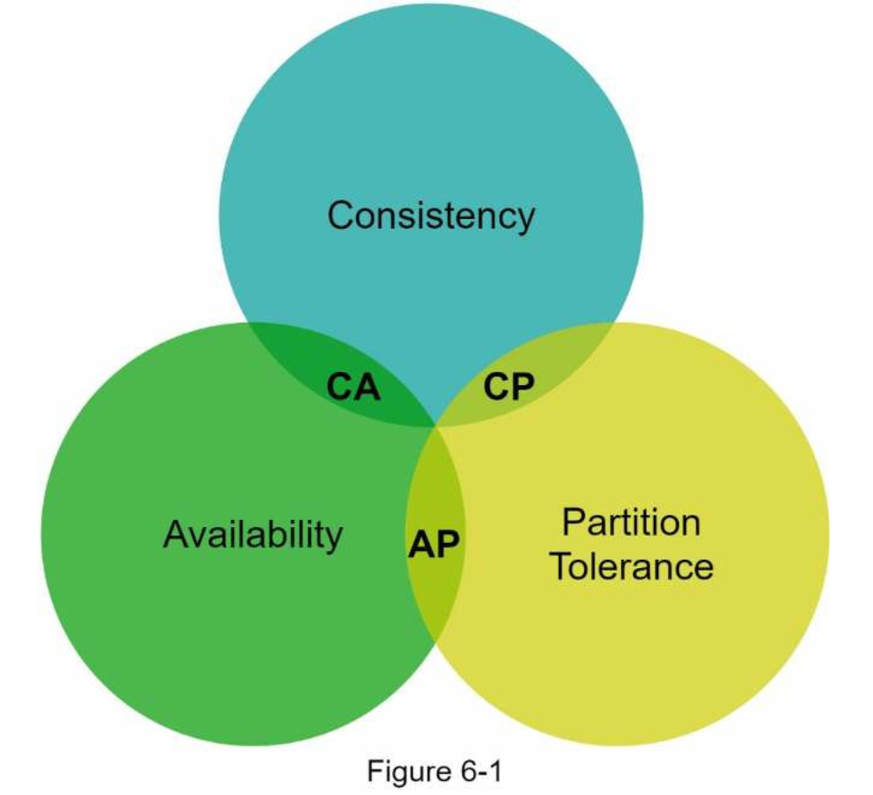
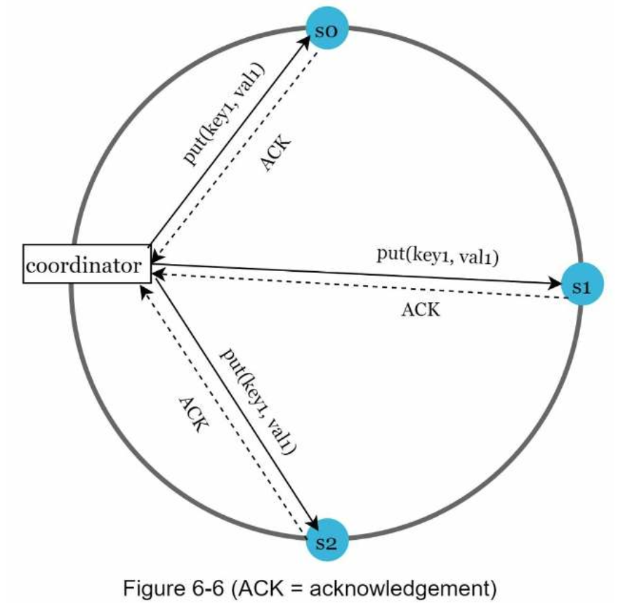
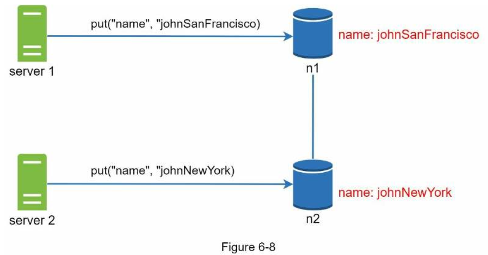
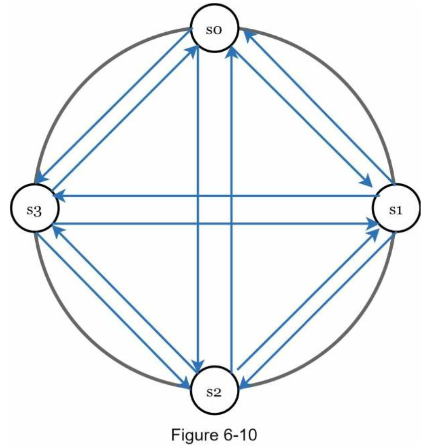
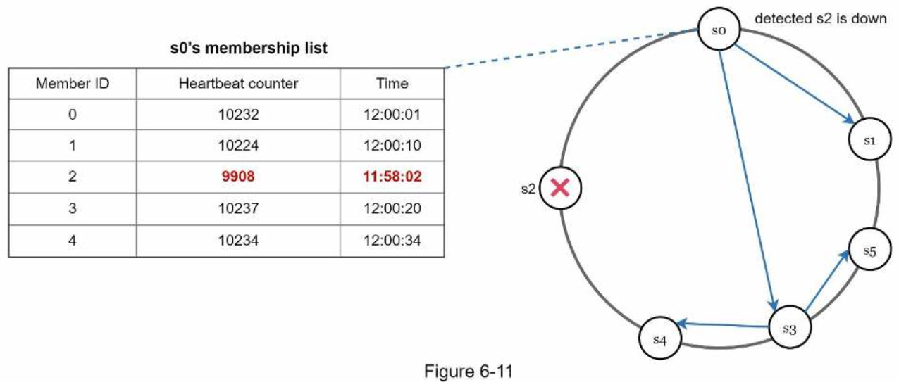
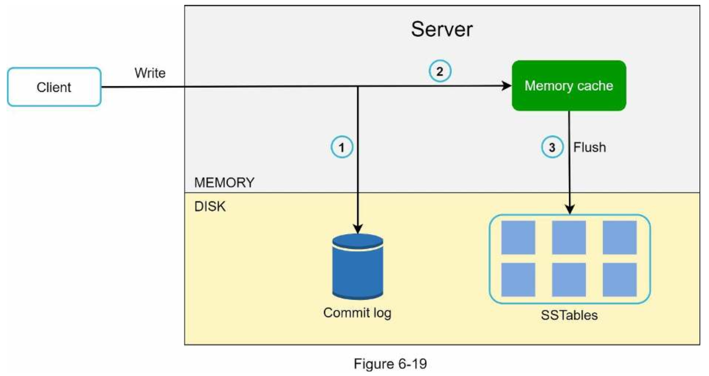
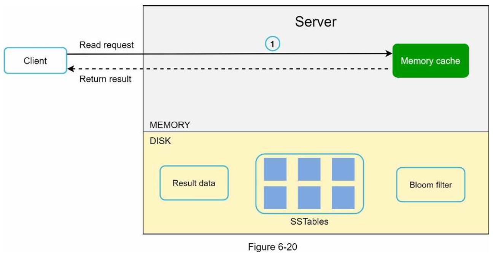
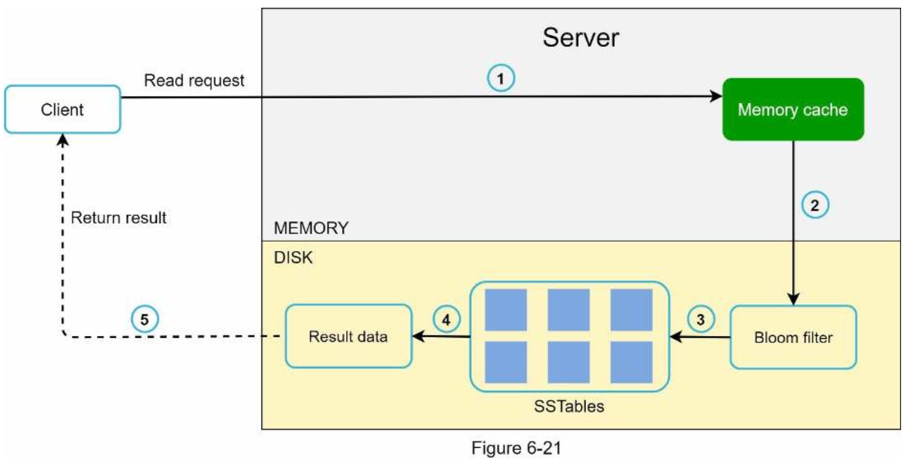
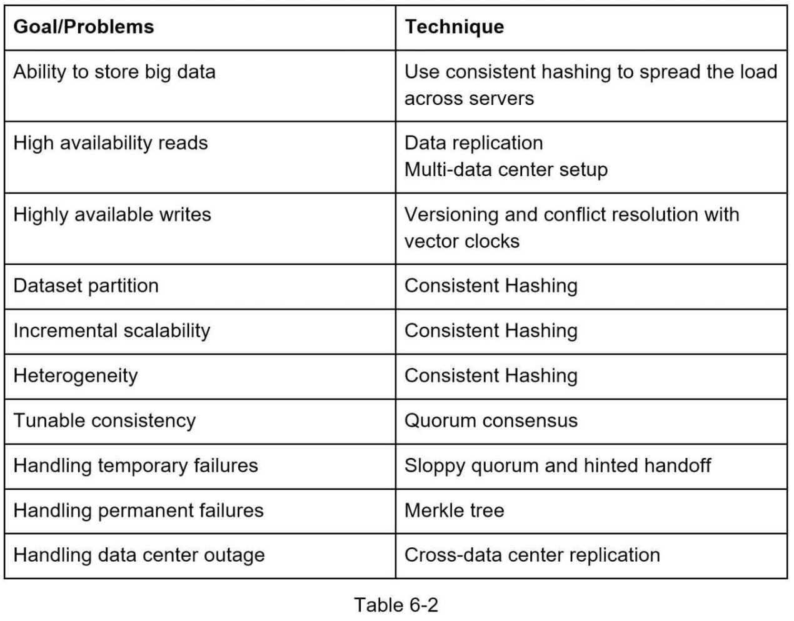

# 6. DESIGN A KEY-VALUE STORE
### Understand the problem and establish design scope
- The size of a key-value pair is small: less than 10 KB.
- Ability to store big data.
- High availability: The system responds quickly, even during failures.
- High scalability: The system can be scaled to support large data set.
- Automatic scaling: The addition/deletion of servers should be automatic based on traffic.
- Tunable consistency.
- Low latency.
------
### Single server key-value store
- Store key-value pairs in a hash table, which keeps everything in memory.
- Two optimizations:
    - Data compression
    - Store only frequently used data in memory and the rest on disk
------
### Distributed key-value store
- Distributes key- value pairs across many servers.
------
### CAP theorem
- Definitions:
    - **Consistency**: consistency means all clients see the same data at the same time no matter which node they connect to. 
    - **Availability**: availability means any client which requests data gets a response even if some of the nodes are down.
    - **Partition Tolerance**: a partition indicates a communication break between two nodes. Partition tolerance means the system continues to operate despite network partitions.

- CAP theorem states that one of the three properties must be sacrificed to support 2 of the 3 properties:
    - **CP (consistency and partition tolerance) systems**
    - **AP (availability and partition tolerance) systems**
    - **CA (consistency and availability) systems**: Since network failure is unavoidable, a distributed system must tolerate network partition. Thus, a CA system cannot exist in real- world applications.

##### Ideal situation
In the ideal world, network partition never occurs. Data written to n1 is automatically replicated to n2 and n3. Both consistency and availability are achieved.

##### Real-world distributed systems
- If data is written to n3 but not propagated to n1 and n2 yet, n1 and n2 would have stale data.
- CP system: 
    - We must block all write operations to n1 and n2 to avoid data inconsistency among these three servers, which makes the system unavailable.
    - Example: Bank systems
- AP system:
    - The system keeps accepting reads, even though it might return stale data. 
    - For writes, n1 and n2 will keep accepting writes, and data will be synced to n3 when the network partition is resolved.

Choosing the right CAP guarantees that **fit your use case** is an important step in building a distributed key-value store.

------

### System components
Core components and techniques used to build a key-value store:
- Data partition
- Data replication
- Consistency
- Inconsistency resolution
- Handling failures
- System architecture diagram
- Write path
- Read path

------

### Data partition
- Two challenges:
    - Distribute data across multiple servers evenly.
    - Minimize data movement when nodes are added or removed.
- Advantages:
    - Automatic scaling
    - Heterogeneity

------

### Data replication
- Data must be replicated asynchronously over N servers, where N is a configurable parameter.
- These N servers are chosen using the following logic: after a key is mapped to a position on the hash ring, walk clockwise from that position and choose the first N servers on the ring to store data copies.
- For better reliability, replicas are placed in distinct data centers, and data centers are connected through high-speed networks.

------

### Consistency
- Definitions:
    - **N** = The number of replicas
    - **W** = A write quorum of size W. For a write operation to be considered as successful, write operation must be acknowledged from W replicas.
    - **R** = A read quorum of size R. For a read operation to be considered as successful, read operation must wait for responses from at least R replicas.

- Some of the possible setups:
    - If R = 1 and W = N, the system is optimized for a fast read.
    - If W = 1 and R = N, the system is optimized for fast write.
    - If W + R > N, strong consistency is guaranteed (Usually N = 3, W = R = 2).
    - If W + R <= N, strong consistency is not guaranteed.

##### Consistency models
- Strong consistency: any read operation returns a value corresponding to the result of the most updated write data item. A client never sees out-of-date data.
- Weak consistency: subsequent read operations may not see the most updated value.
- Eventual consistency: this is a specific form of weak consistency. Given enough time, all updates are propagated, and all replicas are consistent. (**Recommended**)

------

### Inconsistency resolution: versioning

- The original value could be ignored because the modifications were based on it.
- To resolve this issue, **we need a versioning system** that can detect conflicts and reconcile conflicts. **A vector clock** is a common technique to solve this problem. 
- Downsides:
    - Vector clocks add complexity to the client because it needs to implement conflict resolution logic.
    - The [server: version] pairs in the vector clock could grow rapidly.
    - To fix this problem, we set a threshold for the length, and if it exceeds the limit, the oldest pairs are removed.

------

### Handling failures
As with any large system at scale, failures are not only inevitable but common. Handling failure scenarios is very important.

##### Failure detection
###### all-to-all multicasting

- all-to-all multicasting is a straightforward solution. 
- However, this is inefficient when many servers are in the system.

###### gossip protocol

- A better solution is to use decentralized failure detection methods like gossip protocol.

##### Handling temporary failures
###### Hinted handoff (Sloppy quorums)
- It is used to handle temporary failures.
- The system chooses the first W healthy servers for writes and first R healthy servers for reads on the hash ring.
- Offline servers are ignored.

###### Anti-entropy protocol
- Anti-entropy involves comparing each piece of data on replicas and updating each replica to the newest version.

###### Merkle tree
- A Merkle tree is used for inconsistency detection and minimizing the amount of data transferred.
- The amount of data needed to be synchronized is proportional to the differences between the two replicas, and not the amount of data they contain.

##### Handling data center outage
- Data center outage could happen due to power outage, network outage, natural disaster, etc.
- It is important to replicate data across multiple data centers.
- Even if a data center is completely offline, users can still access data through the other data centers.

------

### System architecture diagram
###### Main features of the architecture
- Clients communicate with the key-value store through simple APIs: get(key) and put(key,value).
- A coordinator is a node that acts as a proxy between the client and the key-value store.
- Nodes are distributed on a ring using consistent hashing.
- The system is completely decentralized so adding and moving nodes can be automatic. - Data is replicated at multiple nodes.
- There is no single point of failure as every node has the same set of responsibilities.

------

### Write path

------

### Read path

------

### Summary
