# Chapter 6: Design a Key-Value Store

- Key-value store (aka key-value db) is a non-relational db.
    - Each unique identifier is stored as a key with is associated value.
    - Data pairing: "key-value" pair.
    - Key must be unique, the value associated with the kay can be accessed through the key.
    - Keys can be hashed or plain text.
        - "last_logged_in_at"
        - 253DDEC4
    - Short keys generally work better (performance).

- The value in a key-value pair can be anything: strings, list, objects, etc.
    - The value is usually treated as an opaque object in key-value stores (i.e. DynamoDB, Memcached, Redics)
    > In computer science, an opaque data type is a data type whose concrete data structure is not defined in an interface. This enforces information hiding, since its values can only be manipulated by calling subroutines that have access to the missing information.

## Problem
- You are asked to design a key-value store that supports: 
    - put(key, value) //insert "value" associated with "key"
    - get(key) //get "value" associated with "key"

## Understand the Problem and Establish Design Scope
- No perfect design: each design acheives a specific balance regarding the tradeoffs of the read, write vs. memory usage and consistency vs availability.

- Our example:
    - The size of a key-value pair is small (< 10 KB)
    - Ability to store big data
    - High availability: the system reponds quickly, even during failures
    - High scalability: the system can be scaled to support large data set
    - Automatic scaling: the addition/deletion of servers should be automatic based on traffic
    - tunable consistency
    - low latency

## Single Server Key-Value Store
- Easy: store key-value pairs in a hash table, which keeps everything in memeory
    - Memory access is fast
    - Fitting everything in memeory may be impossible (space constraint)
    - Possible optimization:
        - Data compression
        - Store only frequently used data in memory and the rest on disk
    - Even with optimization, a single server can reach its capacity very fast. 

## Distributed Key-Value Store (aka distributed hash table)
- Distributes key-value pairs across many servers
- CAP (Consistency, Availability, Partition Tolerance) theorem very important

### CAP Theorem
- It is impossible for a distributed system to simultaneously provide more than two of these three:
    - **Consistency**: all clients see the same data at the same time no matter which node they connect to
    - **Availability**: any client which requests data gets a response even if some of the nodes are down
    - **Partition Tolerance**: the system continues to operate despite network partitions(communication break between two nodes)

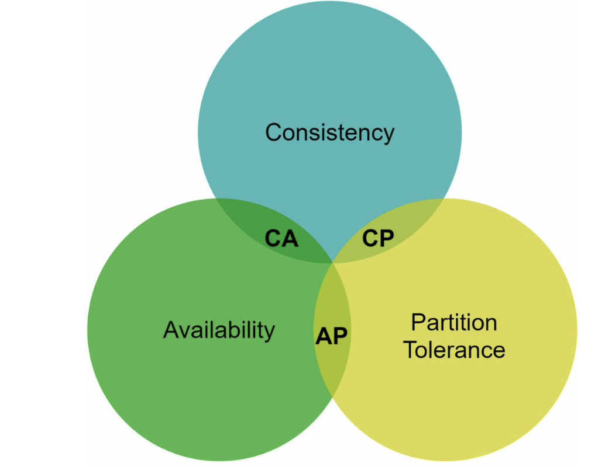

- Key-value stores are classified based on the two CAP characteristics they support:
    - **CP systems**: CP key-value store supports consistency and partition tolerance while sacrificing availability
    - **AP systems**: an AP key-value store supports availability and partition tolerance while sacrificing consistency
    - **CA systems**: a CA key-value store supports consistency and availability while sacrificing partition tolerance. However since network failure is unavoidable, a distributed system must tolerate network partition. This system cannon exist in real-world applications

### Concrete Examples
In distributed systems, data is usually replicated multiple times.
Assume data are replicated on three replica nodes as below:

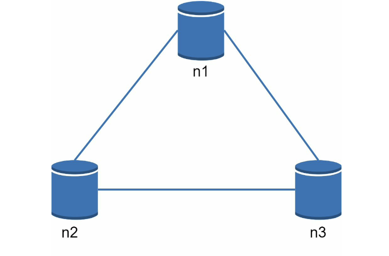

#### Ideal Situation
- Network partition never occurs. 
- Data written on n1 is automatically replicated to n2 and n3.
- Consistency and availability achieved.

#### Real-World Distributed Systems
- Partitions cannot be avoided, and when this occurs, we must choose between consistency and availability.
- Ex: n3 goes down, cannot communicate with n1 and n2. 
    - If clients write data to n1 or n2, data cannot be propagated to n3.
    - If data is written to n3, data cannot be propagated to n1 and n2 (stale data).

- If we choose consistency > availability (CP system), block all write operations to n1 and n2 to avoid data inconsistency among three servers. This makes the system unavailable.
    - i.e. Bank system (extremely high consistent requirements)

- If we choose availability > consistency (AP system), system keeps accepting reads, even though it might return stale data. n1 and n2 keep accepting writes, and data will be synced to n3 when network partition resolved.

- Choosing the right CAP guarantees that fit your use case is a very important step in building a distributed key-value store. Discuss with your interviewer and design accordingly.

### System Components
- Core components and techniques used to build a key-value store:
    - Data partition
    - Data replication
    - Consistency
    - Inconsistency resolution
    - Handling failures
    - System architecture diagram
    - Write path
    - Read path

(Content below is largely based on three popular key-value store systems: Dynamo, Cassandra, and BigTable)
### Data Partition
- For large apps, impossible to fit the complete data set in a single server. Simplest solution is to split the data into smaller partitions and store them in multiple servers.
- Two challenges:
    - Distribute data across multiple servers evenly.
    - Minimize data movement when nodes are added or removed.
- Consistent hashing is a great solution:
    - Servers are placed on a hash ring.
    - A key is hashed onto the same ring, and it is stored on the first server encountered while moving in the clockwise direction.

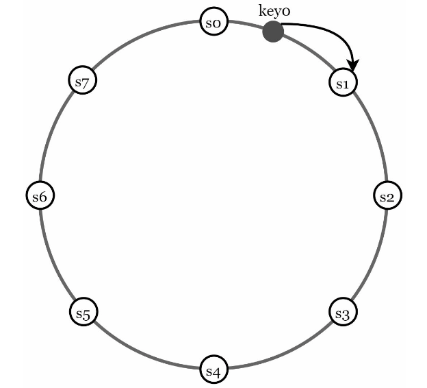

- Advantages:
    - Automatic scaling: servers could be added/removed automatically depending on the load
    - Heterogeneity: number of virtual nodes for a server is proportional to the server capacity.

### Data Replication
- To achieve high availability and reliability, data must be replicated asynchronously over N servers.
    - After a key is mapped to a position on the hash ring, walk clockwise from that position and choose the first N servers on the ring to store data copies. 
    - Example: with N=3, key0 is replicated at s1, s2, and s3
    - With virtual nodes, the first N nodes on the ring may be owned by fewer than N physical servers. Thus we only choose unique servers while performing the clockwise walk logic.
    - Nodes in the same data center often fail at the same time due to power outages, network issues, natural disasters, etc. Thus replicas are placed in distinct data centers, and data centers are connected through high-speed networks.

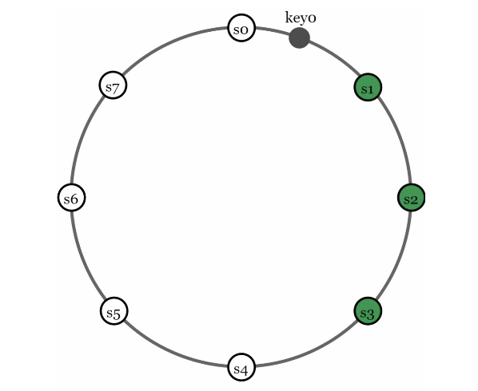

### Consistency
- Since data is replicated at multiple nodes, it must be synchronized across replicas. 
- Quorum(의사결정에 필요한 정족수) consensus can guarantee consistency for both read and write operations.

- **N**: number of replicas
- **W**: write quorom of size W. For a write operation to be considered successful, write operation must be acknowledged from W replicas.
- **R**: read quorum of size R. For a read operation to be considered successful, read operation must wait for responses from at least R replicas

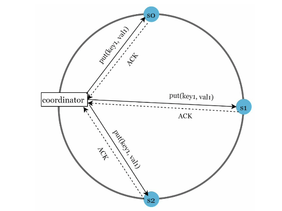

- Data is replicated at s0, s1, and s2
- If W=1, coordinator must receive at least one ack before the write operation is considered as successful
    - A coordinator acts as a proxy between the client and the nodes

- Config of W, R, and N is a typical tradeoff between latency and consistency
    - If W=1 or R=1, operation is retured quickly (coordinator waits for one response from any replica)
    - If W or R >1, system offers better consistency. But slower. 
    - If W + R > N, strong consistency because there must be at least one overlapping node that has the latest data to ensure consistency

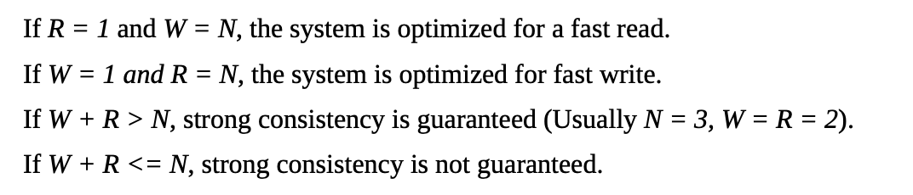

- Depending on the requirement, tune the values of W, R, N to achieve the desired level of consistency

### Consistency Models
- A consistency model defines the degree of data consistency, and a wide spectrum of possible consistency models exist:
    - Strong consistency
    - Weak consistency
    - Eventual consistency

- Strong consistency is usually achieved by forcing a replica not to accept new reads/writes until every replica has agreed on current write
    - not ideal for highly available systems (it could block new operations)

- Dynamo and Cassandra adopt eventual consistency (recommended consistency model for our key-value store)
    - From concurrent writes, eventual consistency allows inconsistent values to enter the system and force the client to read the values to reconcile

### Inconsistency Resolution: Versioning
- Replication gives high availability but causes inconsistencies among replicas
- Versioning and vector locks are used to solve inconsistency problems:
    - Versioning: treating each data modifiaction as a new immutable version of data

- How inconsistency happens:

- The original value could be ignored because the modifications were based on it
- There is no clear way to resolve the conflict of the last two versions
- We need a versioning system that can detect conflicts and reconcile conflicts
    - A vector clock is a common technique

- Vector clock: [server, version] pair associated with a data item
    - can be used to check if one version precedes, succeeds, or in conflict with others

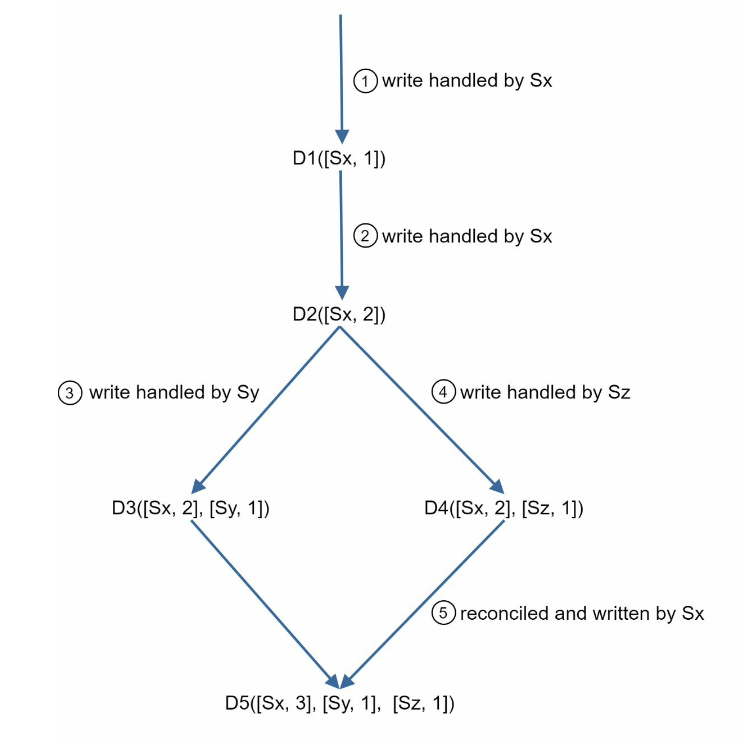

- It is easy to tell that a version X is an ancestor (i.e. no conflict) of version Y if the version counters for each participant in the vector clock of Y is >= the ones in version X
    - D([s0, 1], [s1, 1]) is an ancestor of D([s0, 1], [s1, 2])

- Downsides:
    - Vector clocks add complexity to the client because it needs to implement conflict resolution logic
    - [server,version] pairs in the vector clock could grow rapidly. 
        - To fix this, we set a threshold for the length, and if it exceeds the limit, the oldest pairs are removed
        - But ^ can lead to inefficiencies in reconciliaation (the descendant relationship cannot be determined accurately)
        - However, Amazon has not yet encountered this problem im prod

### Handling Failures
- Failures are common
- Thus handling failure scenarios is very important

#### Failure Detection
- In a distributed system, it is insufficient to believe that a server is down because another server says so. Usually, it requires at least two independent sources of information to mark a server down

- All-to-all multicasting can be a solution - inefficient when many servers are in the system

- Better solution: use decentralized failure detection methods
    - gossip protocol
- Gossip protocol:
    - Each node maintains a node membership list, which contains member IDs and heartbeat counters.
    - Each node periodically increments its heartbeat counter.
    - Each node periodically sends heartbeats to a set of random nodes, which in turn propagate to another set of nodes.
    - Once nodes receive heartbeats, membership list is updated to the latest info.
    - If the heartbeat has not increased for more than predefined periods, the member is considered as offline.

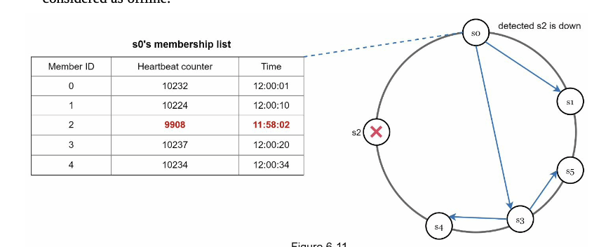

#### Handling Temporary Failures

- The system, detecting failures with the gossip protocol, employs mechanisms for availability. 
- In the strict quorum approach, read and write operations may be blocked during failures. 
- To enhance availability, the "sloppy quorum" technique is used, selecting the first W healthy servers for writes and first R healthy servers for reads, ignoring offline servers. 
- In case of unavailability, another server temporarily handles requests, and upon recovery, changes are pushed back for data consistency, known as hinted handoff. 
    - if s2 is down, s3 handles reads/writes; upon s2's return, data is handed back from s3 to s2.

#### Handling Permanent Failures
- Hinted handoff addresses temporary failures, but for permanently unavailable replicas, an anti-entropy protocol is implemented. 
- This protocol ensures synchronization among replicas by comparing and updating each piece of data to the latest version. 
- The anti-entropy process involves utilizing a Merkle tree for efficient inconsistency detection and minimizing data transfer. 
- A Merkle tree is a tree where non-leaf nodes are labeled with the hash of their child nodes' labels or values, enabling secure verification of large data structures. 

- In the context of a key space from 1 to 12, building a Merkle tree involves specific steps, with highlighted boxes indicating inconsistencies: 

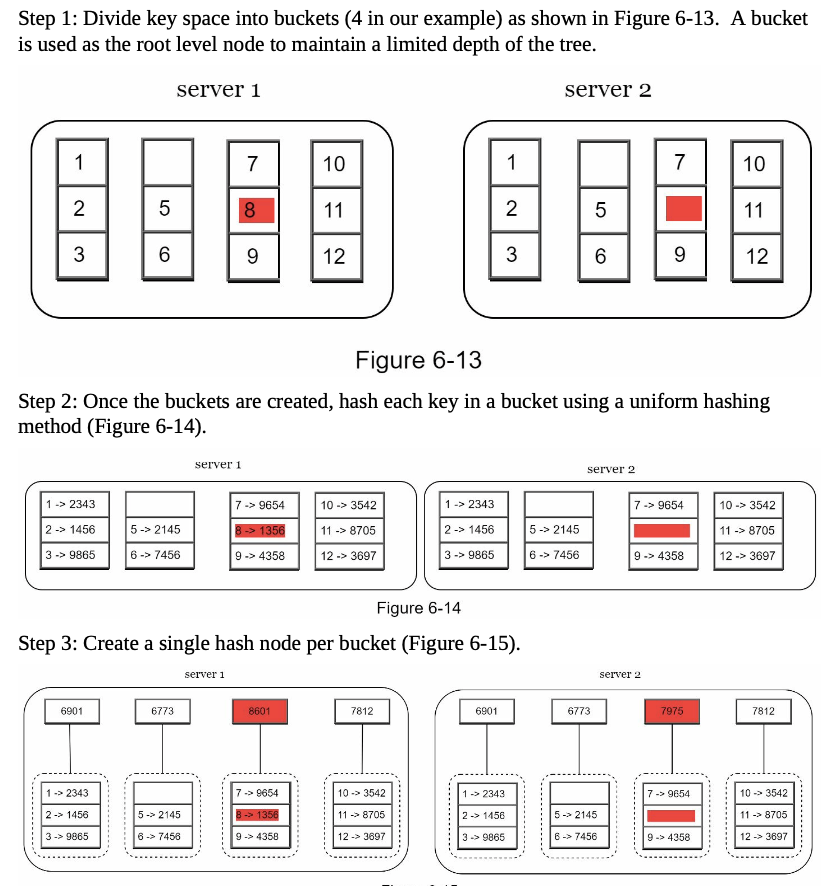

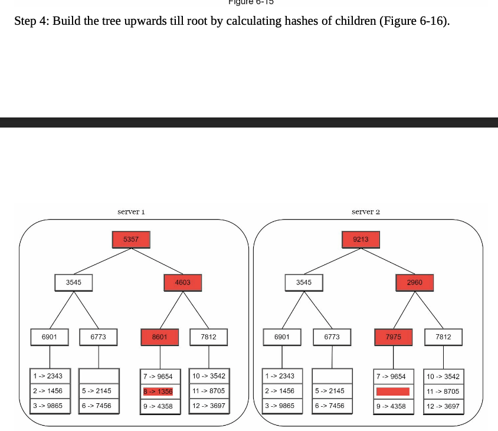

- To compare two Merkle trees, begin by comparing their root hashes. 
    - If matching, both servers have identical data; if not, compare left and right child hashes. 
- Traversing the tree reveals unsynchronized buckets, and only those need synchronization. 
- Merkle trees ensure that the data to be synchronized is proportional to differences between replicas, not their total data volume. 
- In practical systems, with large bucket sizes like one million buckets per billion keys, each bucket contains a limited number of keys (e.g., 1000 keys).

#### Handling Data Center Outage

- Due to power outage, network outage, natural disaster, etc
- It is important to replicate data across multiple data centers
    - Even if a data center is completely offline, users can still access data through the other data centers

### System Archictecture Diagram

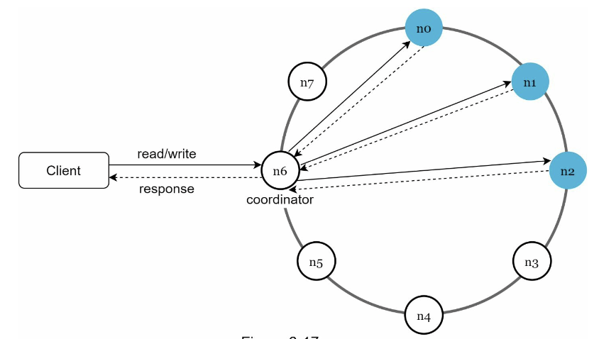

- Main features:
    - Clients communicate with the key-value store through simple APIs: get(key) and put(key, value).
    - A coordinator is a node that acts as a proxy between the client and the key-value store. 
    - Nodes are distributed on a ring using consistent hashing.
    - The system is completely decentralized so adding and moving nodes can be automatic. 
    - Data is replicated at multiple nodes.
    - There is no single point of failure as every node has the same set of responsibilities.

### Write Path
- What happens after a write request is directed to a specific node:

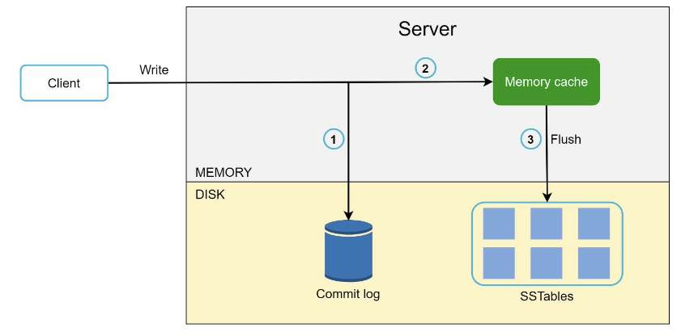

1. The wirte request is persisted on a commit log file
2. Data is saved in the memory cache
3. When the memory cache is full or reaches a predefined threshold, data is flushed to SSTable on disk

### Read Path
- After a read request is directo to a specific node, it first checks if data is in the memory cache. If yes, the data is returned to the client:

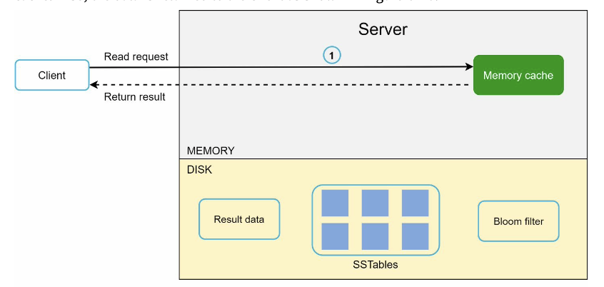

- If the data is not in memory, it will be retrieved from the disk instead. 
    - Need an efficient way to find out which SSTable contains the key
    - Bloom filter solution commonly used

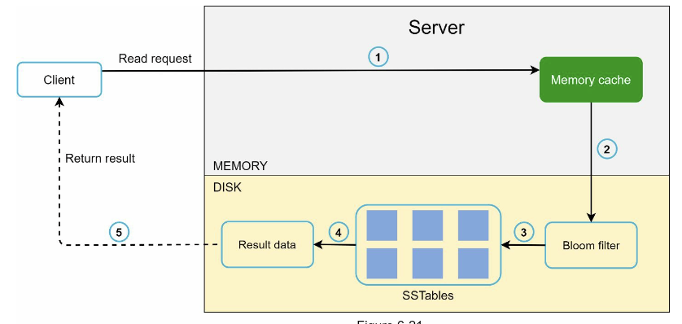

1. The system first checks if data is in memory. If not, go to step 2. 
2. If data is not in memory, the system checks the bloom filter.
3. The bloom filter is used to figure out which SSTables might contain the key. 4. SSTables return the result of the data set.
5. The result of the data set is returned to the client.

