# Ch6. Design a key-value store

### Key-value store (key-value database)

- non-relational database
- key must be unique, and the value associated with values
  - key: plain text, hashed values
  - value: strings, lists, objects, etc.
- a short key works better

Goal of this chapter: design a key-value store that supports the following operations:

- **put(key,value)** // insert “value” associated with “key”
- **get(key)** // get “value” associated with “key”

### **Understand the problem and establish design scope**

- There is no perfect design. Each design achieves a specific balance regarding the tradeoffs of
  the read, write, and memory usage. Another tradeoff has to be made was between consistency
  and availability.
- Characteristics we focus on :
  - The size of a key-value pair is small: less than 10 KB.
  - Ability to store big data.
  - High availability: The system responds quickly, even during failures.
  - High scalability: The system can be scaled to support large data set.
  - Automatic scaling: The addition/deletion of servers should be automatic based on traffic.
  - Tunable consistency.
  - Low latency.

### Single server key-value store

- Intuitive approach: store key-value pairs in a hash table, which keeps everything in memory.
  ⇒ but the space is limited.
- Two optimizations can be done
  - Data compression
  - Store only frequently used data in memory, and the rest on disk.

### Distributed key-value store

(= distributed hash table)

- distributes key-value pairs across many servers.
- **CAP** (**C**onsistency, **A**vailability, **P**artition Tolerance)

  - **Consistency**: consistency means all clients see the same data at the same time no matter
    which node they connect to.
  - **Availability:** availability means any client which requests data gets a response even if some
    of the nodes are down.
  - **Partition Tolerance:** a partition indicates a communication break between two nodes.
    Partition tolerance means the system continues to operate despite network partitions.

- **CAP theorem** states that one of the three properties must be sacrificed to support 2 of the 3
  - **CP (consistency and partition tolerance) systems**
  - **AP (availability and partition tolerance) systems**
  - **CA (consistency and availability) systems**: Since network failure is unavoidable, a
    distributed system must tolerate network partition. Thus, a CA system cannot exist in real-
    world applications.
    

https://redis.com/nosql/key-value-databases/

**Real-world distributed systems**

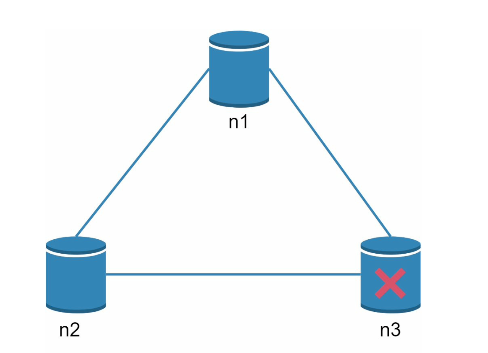

when n3 server is down,

**1) Consistency + Partition (CP system)**

- block all write operations to _n1_ and _n2_ to avoid data inconsistency among these three servers
- Bank systems that have high consistent requirements.
  - When a network partition occurs, the bank system returns an error before the inconsistency is resolved.

**2) Availability + Partition (AP system)**

- the system keeps accepting reads and return stale data. (read)
- For writes, _n1_ and _n2_ will keep accepting writes, and data will be synced to _n3_ when the network partition is resolved. (write)

## System components

8 core components and techniques used to build a key-value store

### 1) Data Partition

split the data into smaller partitions and store them in multiple servers.

- Two Challenges:
  - Distribute data across multiple servers evenly.
  - Minimize data movement when nodes are added or removed.
- Solution: **Consistent Hashing**!
  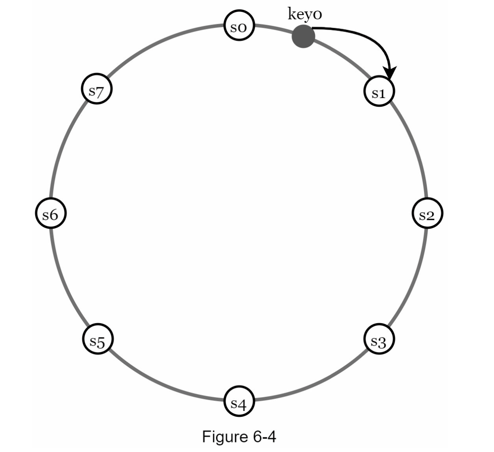

Using consistent hashing to partition data has the following advantages:

- **Automatic scaling:** servers could be added and removed automatically depending on the

load.

- **Heterogeneity:** the number of virtual nodes for a server is proportional to the server capacity.
  For example, servers with higher capacity are assigned with more virtual nodes.

### 2) Data Replication

- To achieve high availability and reliability, data must be replicated asynchronously over _N_
  servers, where _N_ is a configurable parameter.
- To achieve high availability and reliability, data must be replicated asynchronously over _N_
  servers, where _N_ is a configurable parameter.
- With virtual nodes, the first _N_ nodes on the ring may be owned by fewer than _N_ physical
  servers. To avoid this issue, we only choose unique servers while performing the clockwise
  walk logic.
- replicas are placed in distinct data centers, and data centers are connected through high-speed networks.

### 3) Consistency

Since data is replicated at multiple nodes, it must be synchronized across replicas.

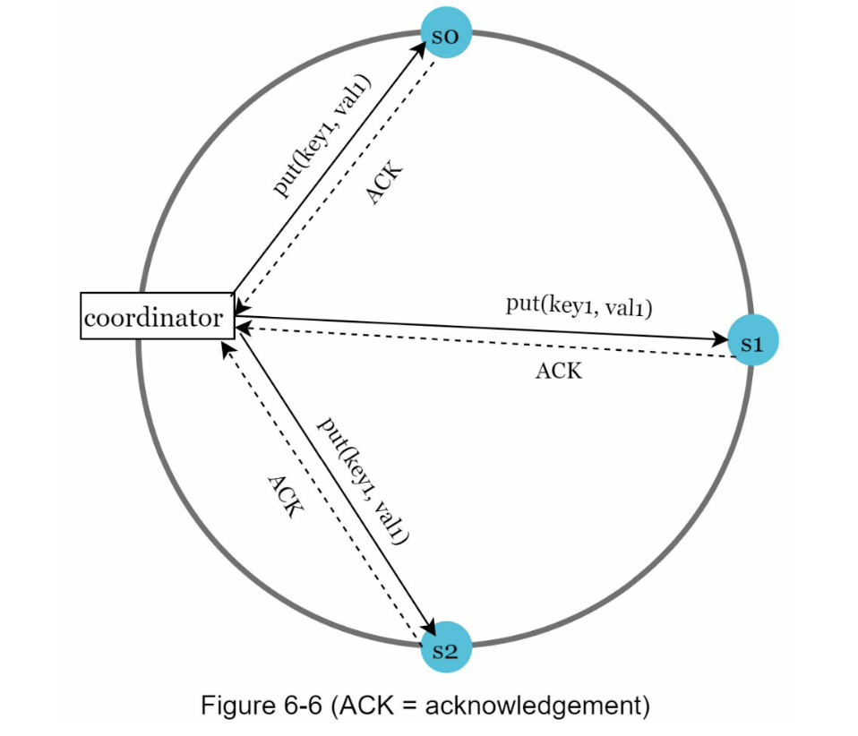

**Quorum consensus** can guarantee consistency for both read and write operations.

- **_N_** = The number of replicas
- **_W_** = A write quorum of size _W_. For a write operation to be considered as successful, write

operation must be acknowledged from _W_ replicas.

- **_R_** = A read quorum of size _R_. For a read operation to be considered as successful, read

operation must wait for responses from at least _R_ replicas.

- If _R = 1_ and _W = N_, the system is optimized for a fast read.
- If _W = 1 and R = N_, the system is optimized for fast write.
- If _W + R > N_, strong consistency is guaranteed (Usually _N = 3, W = R = 2_) ⇒ since there must be at least one overlapping node that has the latest data.

If _W + R <= N_, strong consistency is not guaranteed.

**Consistency Model**

- **Strong consistency**: any read operation returns a value corresponding to the result of the most updated write data item. A client never sees out-of-date data.
- **Weak consistency**: subsequent read operations may not see the most updated value.
- **Eventual consistency**: this is a specific form of weak consistency. Good for high availability systems. Given enough time, all updates are propagated, and all replicas are consistent. e.g.) Dynamo, Cassandra

### 4) Inconsistency resolution: versioning

Replication gives high availability but causes inconsistencies among replicas.

⇒ **Versioning** and **vector clocks** are used to solve inconsistency problems.

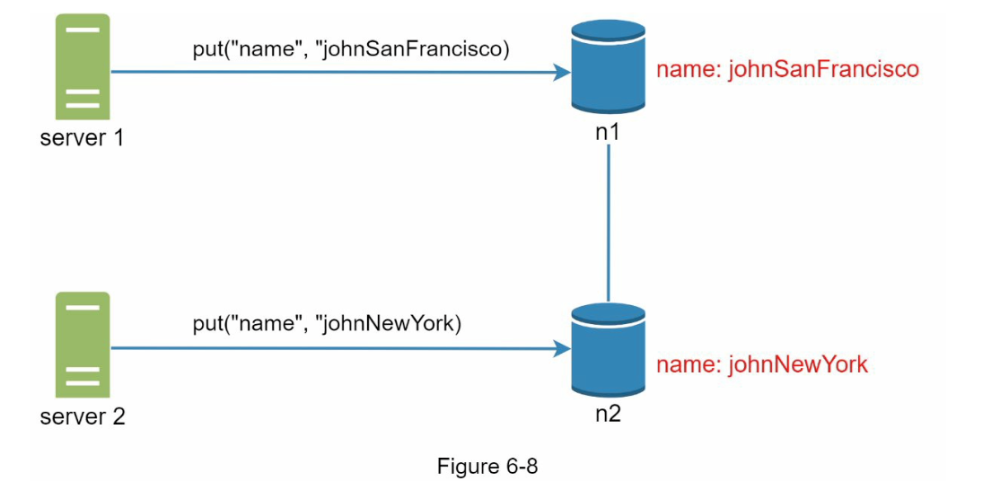

To resolve this issue, we need a versioning system that can detect conflicts and reconcile conflicts. ⇒ **Version Clock**

- A **vector clock** is a _[server, version]_ pair associated with a data item. It can be used to check
  if one version precedes, succeeds, or in conflict with others.

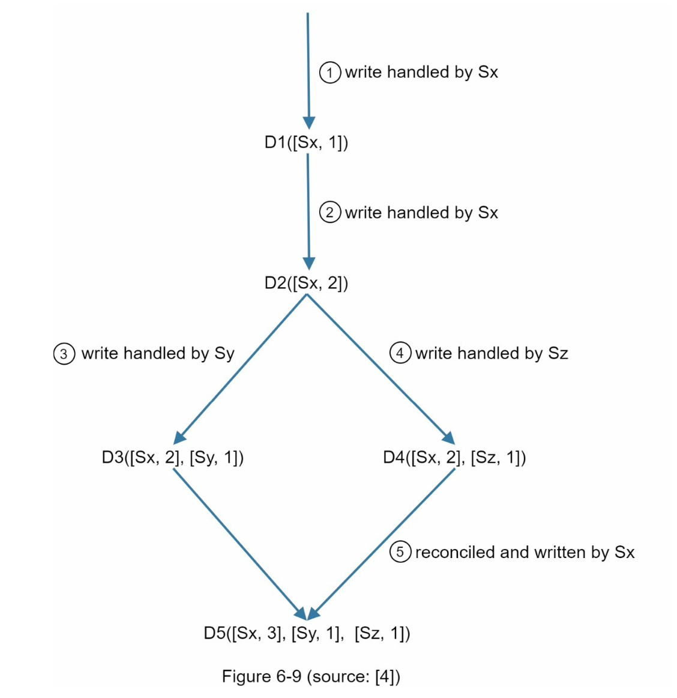

- **Pros**
  - it is easy to tell that a version _X_ is an ancestor (i.e. no conflict) of
    version _Y_ if the version counters for each participant in the vector clock of _Y_ is greater than or
    equal to the ones in version _X_.
  - you can tell that a version _X_ is a sibling (i.e., a conflict exists) of _Y_ if there is any
    participant in _Y_'s vector clock who has a counter that is less than its corresponding counter in
    _X_.
- **Cons**
  - vector clocks add complexity to the client because it needs to implement conflict resolution logic.
  - the _[server: version]_ pairs in the vector clock could grow rapidly ⇒ set a threshold for the length, remove the oldest pair if it exceeds the limit

### 5) Handling failure

**1) Failure detection**

- all-to-all multicasting
- **gossip protocol (better solution)**

  - Each node maintains a node membership list, which contains member IDs and heartbeat
    counters.
  - Each node periodically increments its heartbeat counter.
  - Each node periodically sends heartbeats to a set of random nodes, which in turn
    propagate to another set of nodes.
  - Once nodes receive heartbeats, membership list is updated to the latest info.
  - If the heartbeat has not increased for more than predefined periods, the member is
    considered as offline.
    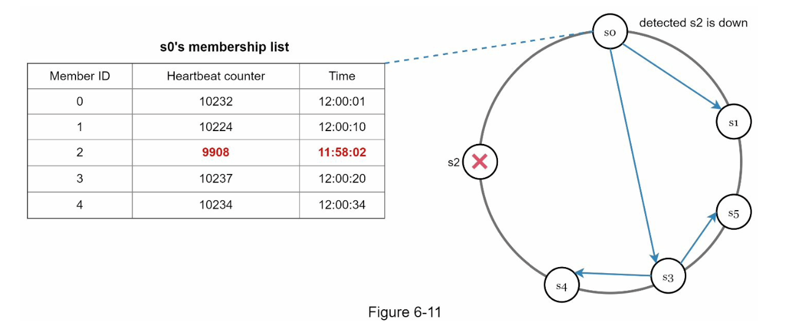
  - Node _s0_ maintains a node membership list shown on the left side.
  - Node _s0_ notices that node s2’s (member ID = 2) heartbeat counter has not increased for a
    long time.
  - Node _s0_ sends heartbeats that include _s2_’s info to a set of random nodes. Once other
    nodes confirm that _s2_’s heartbeat counter has not been updated for a long time, node _s2_ is
    marked down, and this information is propagated to other nodes.
    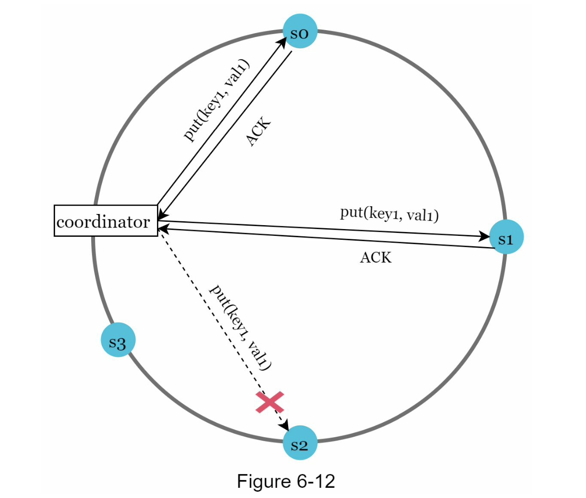
    **2) Handling temporary failures**
  - **sloppy quorum** is used to improve availability
  - Instead of enforcing the quorum requirement, the system chooses the first _W_ healthy servers for writes and first _R_ healthy servers for reads on the hash ring. Offline servers are ignored.
  - **hinted handoff:** When the down server is up, changes will be pushed back to achieve data consistency. This process is called hinted handoff.
    **3) Handling permanent failures**
  - **Anti-entropy** involves comparing each piece of data on replicas and updating each replica to the newest version. A Merkle tree is used for inconsistency detection and minimizing the amount of data transferred.

  4. **Handling data center outage**

  - it is important to replicate data across multiple data centers

  ### 6) System architecture diagram

  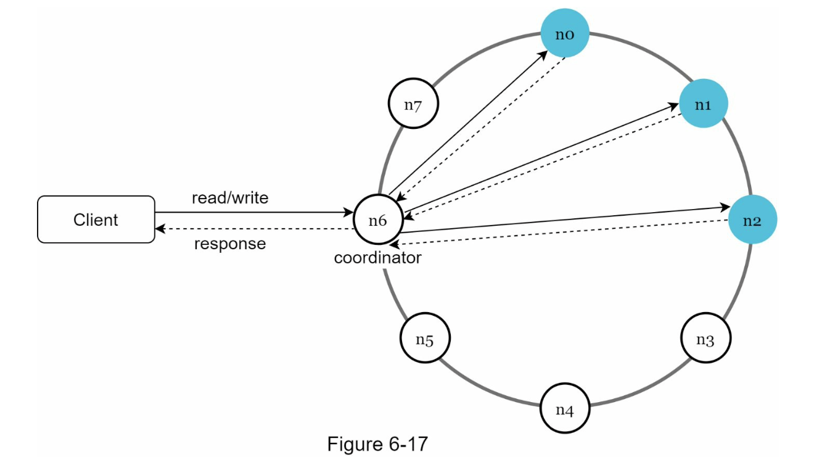
  Main features of the architecture are listed as follows:

  - Clients communicate with the key-value store through simple APIs: _get(key)_ and _put(key,_
    _value)_.
  - A coordinator is a node that acts as a proxy between the client and the key-value store.
  - Nodes are distributed on a ring using consistent hashing.
  - The system is completely decentralized so adding and moving nodes can be automatic.
  - Data is replicated at multiple nodes.
  - There is no single point of failure as every node has the same set of responsibilities.

  ### 7) Write path

  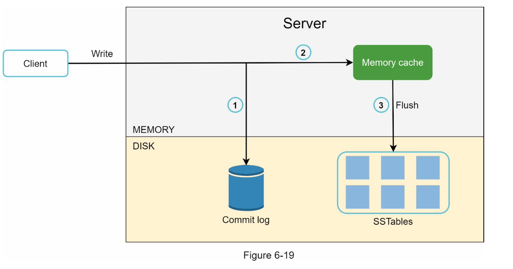

  1. The write request is persisted on a commit log file.
  2. Data is saved in the memory cache.
  3. When the memory cache is full or reaches a predefined threshold, data is flushed to SSTable [9] on disk. Note: A sorted-string table (SSTable) is a sorted list of <key, value> pairs. For readers interested in learning more about SStable, refer to the reference material [9].

  ### 8) Read path

  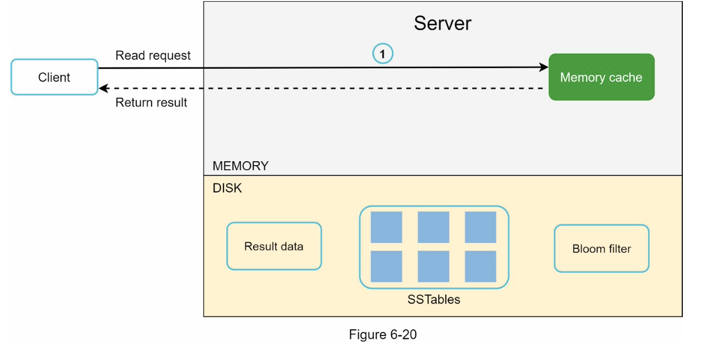
  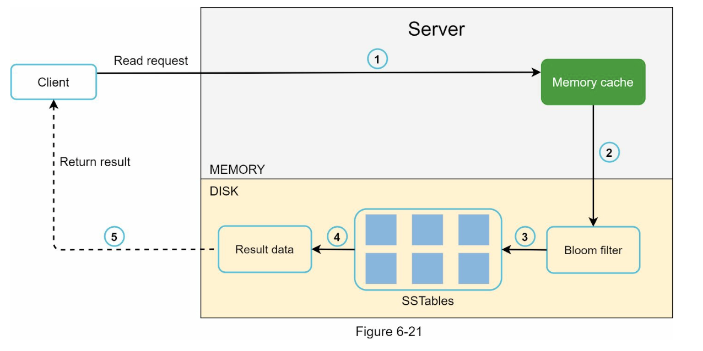

  1. The system first checks if data is in memory. If not, go to step 2.
  2. If data is not in memory, the system checks the bloom filter.

  3. The bloom filter is used to figure out which SSTables might contain the key.
  4. SSTables return the result of the data set.
  5. The result of the data set is returned to the client.
