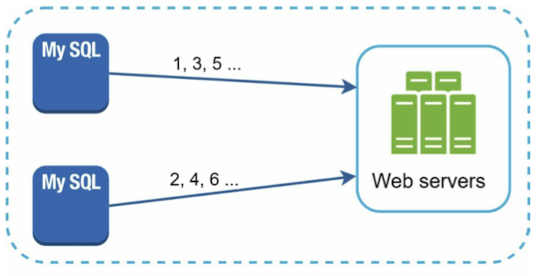
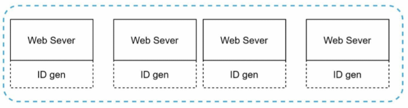
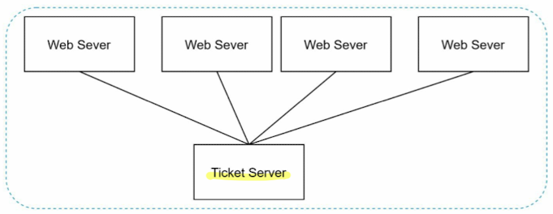
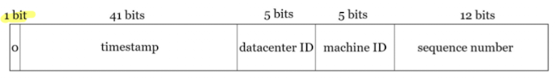

# Chapter 5. Design a unique id generator in distributed systems.

## Step 1. Understand the problem and establish design scope
- What are the characteristics of unique IDs?
- For each new record, does ID increment by 1?
- Do IDs only contain numerical values?
- What is the ID length requirements?
- What is the scale of the system?

## Step 2. Propose high-level design and get buy-in
### Multi-master replication

- This approach uses the database's auto_increment feature.
- This approache increases Id by k, where k is number of database servers in use.
- Pros:
    - This can solve scalability issues because IDs can scale with the number of database servers.
- Cons:
    - Hard to scale with multiple data centers
    - IDs do not go up with time across multiple servers.
    - It does not scale well when a server is added or removed.

### Universally unique identifier (UUID)

- UUID has a very low probability of getting collusion.
- UUID is a 128-bit number (length)
- Pros:
    - Simple
    - The system is easy to scale because each web server is responsible for generating IDs they consume. ID generator can easily scale with web servers.
- Cons:
    - IDs are 128 bits long (memory inefficient)
    - IDs do not go up with time.
    - **IDs could be non-numeric.**

### Ticket server

- It uses a centralized auto_increment feature in a single database server.
- Pros:
    - Numeric IDs.
    - It is easy to implement.
- Cons:
    - Single point of failure.
    - It only works well for small to medium-scale applications.

### Twitter snowflake approach

## Step 3. Design deep dive
### Twitter snowflake approach
- Datacenter IDs and machine IDs are chosen at the startup time. Timestamp and sequence numbers are generated when the ID generator is running.
#### Sequence number
- 12 bits, which can make 2^12 = 4,096 combinations. In theory, a machine can support a maximum of 4,096 new IDs per milliesecond.

## Step 4. Wrap up
### Additional points
- Clock synchronization depending on the system clock. 
- Section length tunning: Fewer sequence numbers but more timestamp bits are effective for low concurrency and long-term applications.
