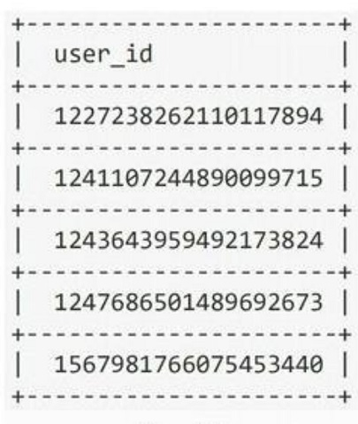
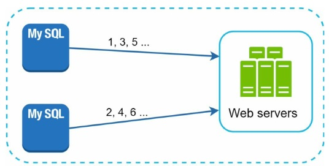
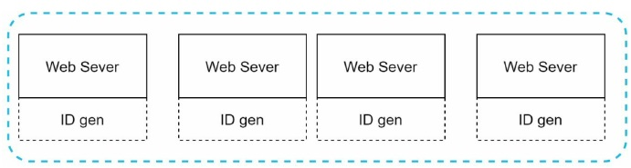
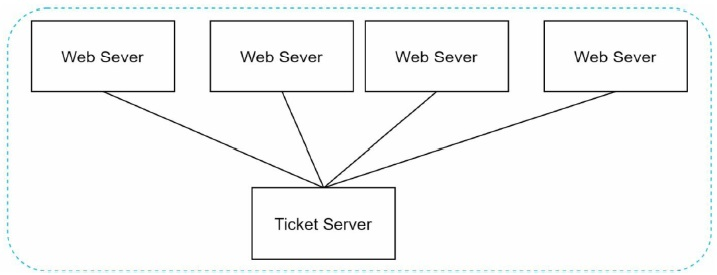
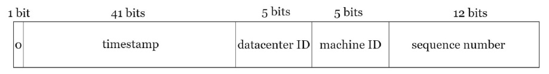
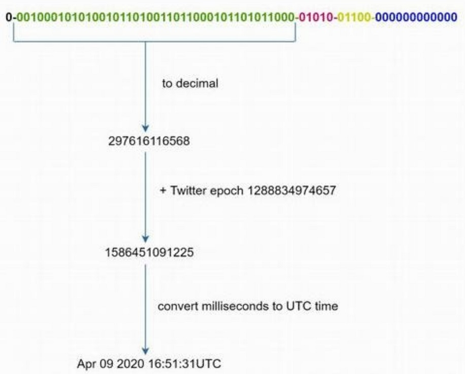

# 07. Design A Unique ID Generator In Distributed Systems

Traditional single server DB with **auto_increment** is not large enough for distributed systems.

- A few examples of unique IDs
  - 

## Step 1. Understand the problem and establish design scope

Example of candidate-interviewers' requirements:

- IDs must be unique
- IDs are numerical values only
- IDs fit into 64-bit
- IDs are ordered by date
- Ability to generate over 10,000 unique IDs per second.

## Step 2. Propose high-level design and get buy-in

The options we considered are:

- Multi-master replication
- Universally unique identifier (UUID)
- Ticket server
- Twitter snowflake approach

### 2.1. Multi-master replication

- Using DB's auto_increment feature but increase by k, where k is the number of database servers in use.
- Pros:
  - It solves some scalability issues
- Cons:
  - Hard to scale with multiple data centers
  - IDs do not go up with time across multiple servers
  - It does not scale well when a server is added or removed
- 

### 2.2. UUID ( Universally unique identifier)

- 128-bit number used ot identify information in computer systems
- 
- Each web server contains an ID generator, and a web server is responsible for generating IDs independently.
- Pros:
  - Generating UUID is simple. No coordination between servers is needed.
  - The system is easy to scale. Each web server is responsible for generating IDs they consume.
- Cons:
  - IDs are 128 bits long, but our requirement is 64 bits
  - IDs do not go up with time
  - IDs could be non-numeric

### 2.3. Ticket Server

Flicker developed ticket servers to generate distributed primary keys.

- 
- The idea is to use a centralized auto_increment feature in a single database server.
- Pros: 
  - Numeric IDs
  - It is easy to implement, and works for small to medium-scale applications
- Cons:
  - Single point of failure. Single ticket server means if the ticket server goes down.

### 2.4. Twitter snowflake approach

The only one option that fits our needs -> Twitter's unique ID generation system, **"snowflake"**.

- 
- Each section is:
  - Sign bit: 1 bit
    - It will always be 0. This is reserved for future uses.
  - Timestamp: 41 bits
    - Milliseconds since the epoch or custom epoch.
  - Datacenter IDs: 5 bits
    - It gives us 2^5 = 32 datacenters.
  - Machine ID: 5 bits
    - It gives us 2^5 = 32 machines per datacenters.
  - Sequence number: 12 bits
    - The sequence number is incremented by 1. The number is reset to 0 every millisecond.

## Step 3. Design deep dive

We settle on an approach that is based on the Twitter snowflake ID generator.

- Datacenter IDs and machine IDs are chosen at the startup time.
- Timestamp and sequence numbers are generated when the ID generators is running.

### 3.1. Timestamp

- 
- The maximum timestamp that can be represented in 41 bits is 2^41 - 1 = 2199023255551 milliseconds (ms), which gives us : ~69 years
- After 69 years, we will need to a new epoch time or adopt other techniques to migrate IDs.

### 3.2. Sequence number

- Sequence number is 12 bits, which give us 2^12 = 4096 combinations.
- In theory, a machine can support a maximum of 4096 new IDs per millisecond.

## Step 4. Wrap up

Here are a few additional talking points

- Clock synchronization
  - Network time protocol is the most popular solution to this problem.
- Section length tuning
  - For example, fewer sequence numbers but more timestamp bits are effective for low concurrency and long term application.
- High availability
  - ID generator must be highly available.

