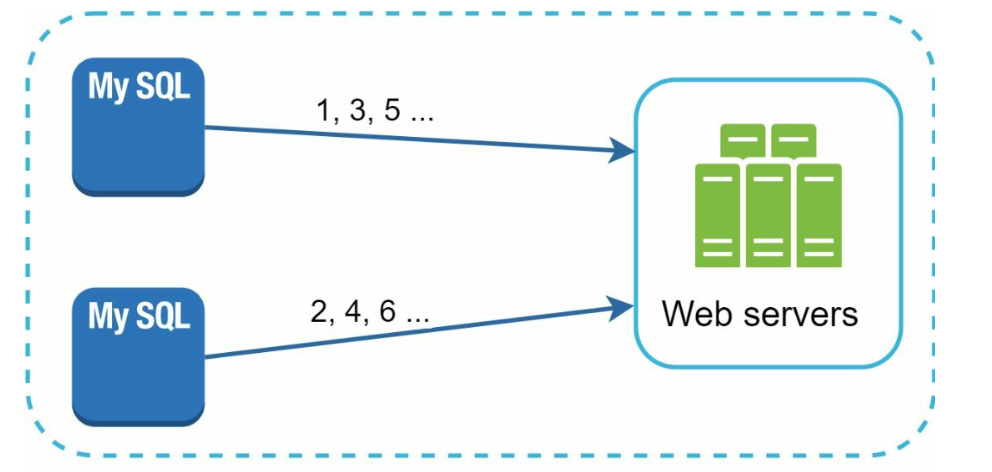
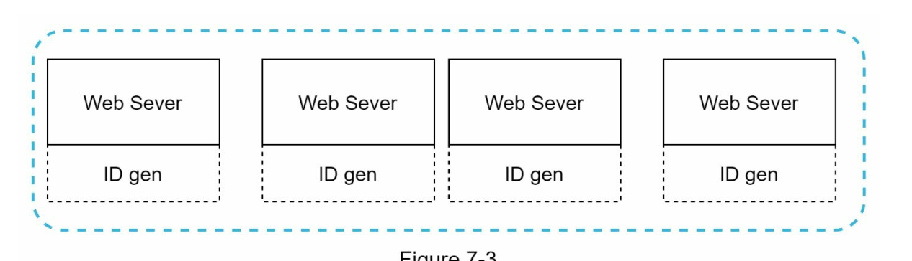
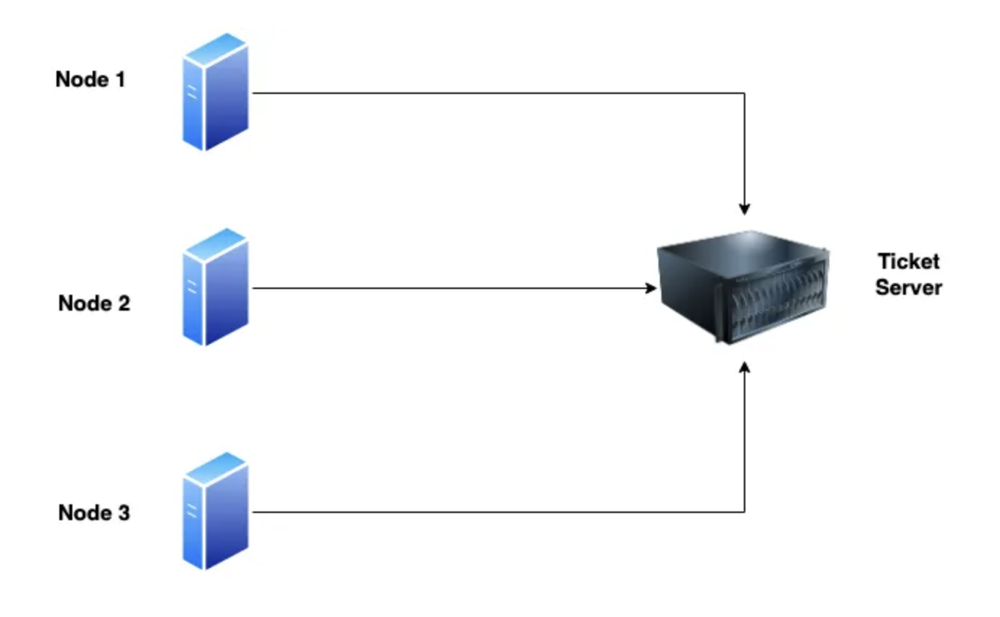
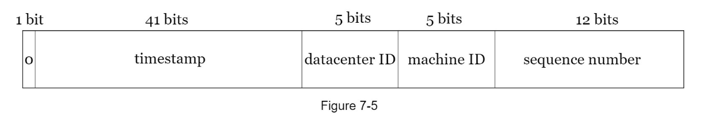

# CHAPTER 7: DESIGN A UNIQUE ID GENERATOR IN DISTRIBUTED SYSTEMS

- auto increment id in traditional database

### Auto increment

#### pros

1. simple
2. light on storage quick retrieval
3. readable

- we have both auto incremented primary key and uuid column
- auto incremented primary key is readable so use it for client and internal user communication
- uuid is generally bulkier (128 bits) faster when joining and lighter when indexing

#### cons

1. concurrency issue can happen and collisions
2. they are predictable => security breaches
3. generating unique id across all database can cause delay

## Step 1 - understand the problem and establish design scope

### Characteristics of unique ids

- unique and sortable
- only numerical values
- how it increments (1 per new record, per time, meals sortable by date)
- length requirement (64 bit, minimum value of 0 and a maximum value of (2^64)-1 )
- scale of system (generate 10,000 ids per second)

## Step 2 - Propose high-level design and get buy-in

### Multi-master replication

- use database's auto_increment feature
- instead of incrementing by 1, increment it by k (the number of DB servers in use) to solve concurrency issue
- set `auto_increment_increment` to `N`
- set different `auto_increment_offset` per DB as starting point (1,2,3,...)

#### Drawbacks

- Hard to scale with multiple data centers (because of N?)
- IDs do not go up with time across multiple servers
- Does not scale well when a server is added and removed

- Universally unique identifier (UUID)
- Ticket server
- Twitter snowflake

### UUID

"09c93e62-50b4-468d-bf8a-c07e1040bfb2"

- 36-character alphanumeric string
- 128-bit number

#### pros

- very low probability of collusion
- “after generating 1 billion UUIDs every second for approximately 100 years would the probability of creating a single duplicate reach 50%”
- because the probabiility of collusion is so low, servers do not have to coordinate to generate ids for new records

#### cons

- bulky compared to auto-incremented ids
- no relation with time
- non-numaric

### Ticket server

- centralized auto_increment in a single server
- dedicated database server that generates unique ids for mutiple databases
- can generate globally unique integers

#### pros

- numeric ID (light)
- easy to implement

#### cons

- single point of failure
- could introduce multiple ticket servers but sync issue

### Twitter snowflake approach

- divide id into different sections
- Sign bit: 1 bit 0. This is reserved for future uses
- Timestamp: 41 bits. Milliseconds since the epoch or custom epoch.
- Datacenter ID: 5 bits, which gives us 2 ^ 5 = 32 datacenters.
- Machine ID: 5 bits, which gives us 2 ^ 5 = 32 machines per datacenter.
- Sequence number: 12 bits. For every ID generated on that machine/process, the sequence number is incremented by 1. The number is reset to 0 every millisecond.

## Step 3 - Design deep dive

- Datacenter ID and Machine ID are determeined at the startup time
- Timestamp ID and sequence ID are generated when generaters are running
- Timestamp ID: grow with time and sortable by time across multiple database (maxed ad 69 years)
- Sequence number is 12bits = > 4096 new ids per miliseconds

## Step 4 - Wrap up

- Settle on snowflakes because it meets the requirement and is scalable in distribute system
- extra points:
- Clock synchronization.
- Section length tuning. For example, fewer sequence numbers but more timestamp bits are effective for low concurrency and long-term applications.
- High availability. Since an ID generator is a mission-critical system, it must be highly available.
