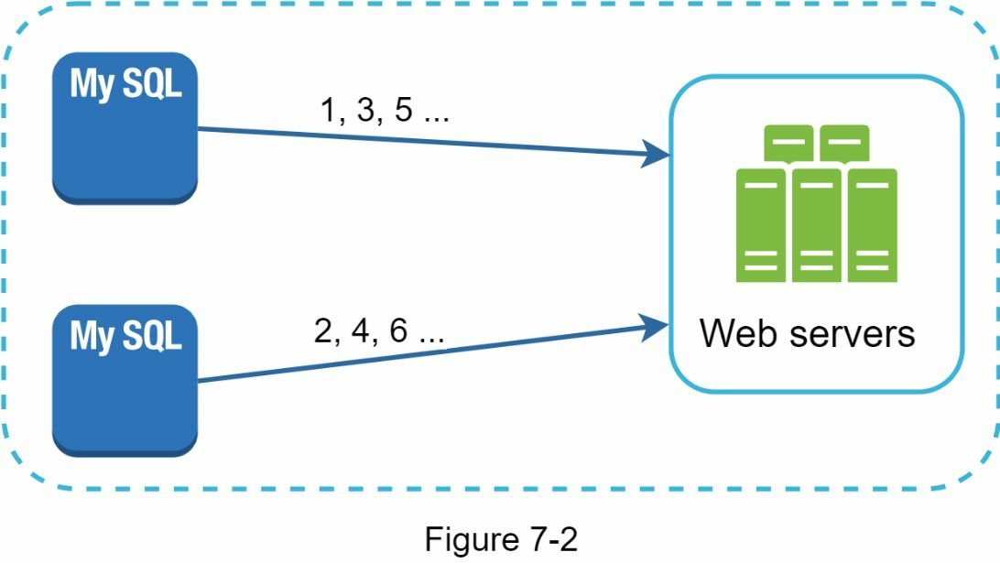
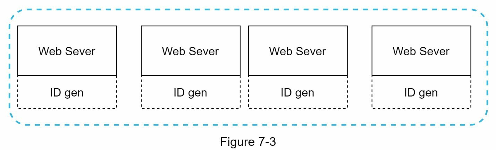
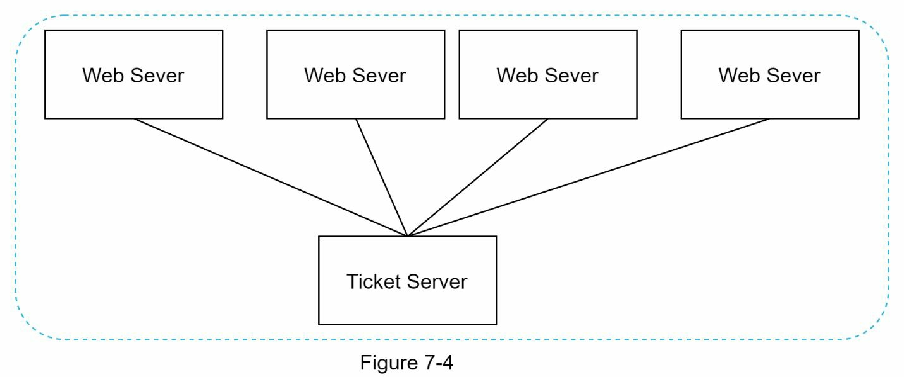
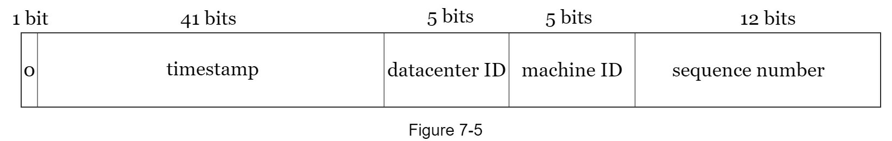
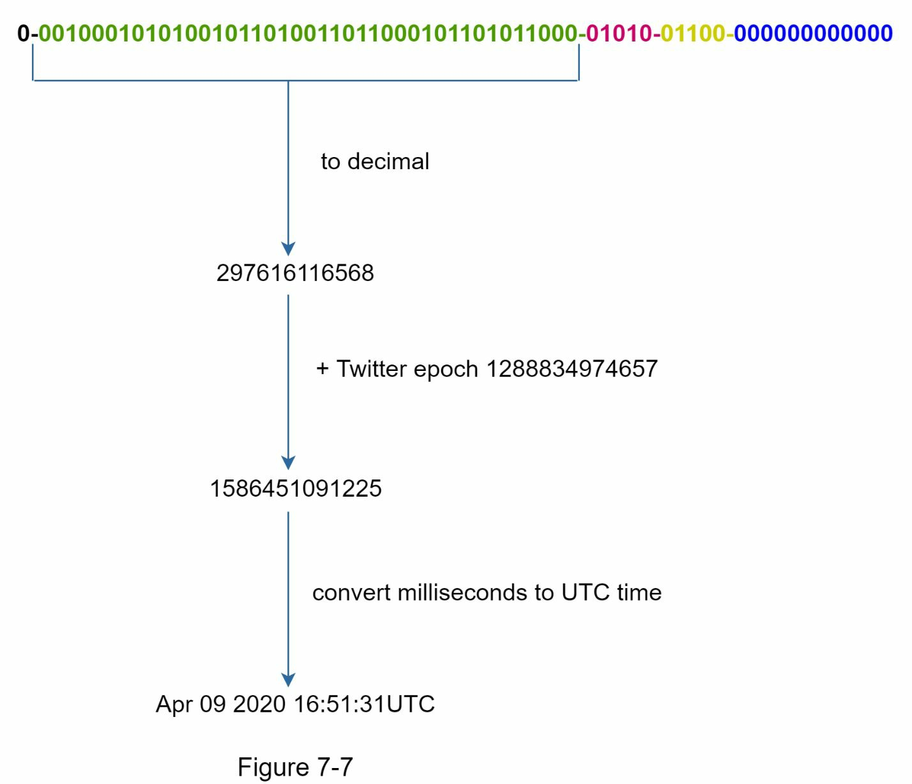

# CHAPTER 7: DESIGN A UNIQUE ID GENERATOR IN DISTRIBUTED SYSTEMS
To design a **unique ID generator** in distributed systems.Your first thought might be to use a primary key with the *auto_increment* attribute in a traditional database. However, *auto_increment* does not work in a distributed environment because a single database server is not large enough and generating unique IDs across multiple databases with minimal delay is challenging.\
Here are a few examples of unique IDs:

|     user_id                   |
|-------------------------------|
| 1227238262110117894           |
| 1241107244890099715           |
| 1243643959492173824           |
| 1247686501489692673           |
| 1567981766075453440           |

## Step 1 - Understand the problem and establish design scope

**Asking clarification questions** is the first step to tackle any system design interview question.\
Here is an example of candidate-interviewer interaction:\
**Candidate:** What are the **characteristics** of unique IDs?\
**Interviewer:** IDs must be **unique and sortable**.\
**Candidate:** For each new record, does ID **increment** by 1?\
**Interviewer:** The ID increments by time but not necessarily only increments by 1. IDs created in the evening are larger than those created in the morning on the same day.\
**Candidate:** Do IDs only contain **numerical values**?\
**Interviewer:** Yes, that is correct.\
**Candidate:** What is the ID **length requirement**?\
**Interviewer:** IDs should fit into **64-bit**.\
**Candidate:** What is the **scale** of the system?\
**Interviewer:** The system should be able to generate **10,000 IDs per second**.

It is important to understand the requirements and clarify ambiguities. For this interview question, the requirements are listed as follows:
- IDs must be unique.
- IDs are numerical values only.
- IDs fit into 64-bit.
- IDs are ordered by date.
- Ability to generate over 10,000 unique IDs per second.

## Step 2 - Propose high-level design and get buy-in

Multiple options can be used to **generate unique IDs in distributed systems**. The options we considered are:
- [Multi-master replication](#multi-master-replication)
- [Universally unique identifier (UUID)](#universally-unique-identifier-uuid)
- [Ticket server](#ticket-server)
- [Twitter snowflake approach](#twitter-snowflake-approach)

Let us look at each of them, how they work, and the pros/cons of each option.

### Multi-master replication

This approach uses the **databases’ auto_increment** feature.  **Increase next ID by `k`** (number of database servers in use) instead of increase by 1. As illustrated in Figure 7-2, if the number of server (`k`) is `2`, `next ID = previous ID (in the same server) + 2`. This solves some scalability issues because IDs can scale with the number of database servers.\
drawbacks:
- Hard to scale with multiple data centers
- IDs do not go up with time across multiple servers.
- It does not scale well when a server is added or removed.

### Universally unique identifier (UUID)
- a 128-bit number used to identify information in computer systems.
- has a very low probability of getting collusion.
- example of UUID: 09c93e62-50b4-468d-bf8a-c07e1040bfb2. 
- it can be generated independently without coordination between servers. 
- presents the UUIDs design: 

In this design, each web server contains an ID generator, and a web server is responsible for generating IDs independently.

Pros:
- Generating UUID is simple. No coordination between servers is needed so there will not be any synchronization issues.
- The system is easy to scale because each web server is responsible for generating IDs they consume. ID generator can easily scale with web servers.

Cons:
- IDs are 128 bits long, but our requirement is 64 bits.
- IDs do not go up with time.
- IDs could be non-numeric.

### Ticket server

1. Requesting a Range:

    A node (e.g., Server A) sends a request to the central ticket server asking for a block of IDs.\
    Example: "Give me a range of 100 IDs."

2. Ticket Server Responds:

    The ticket server assigns a unique range to the node.\
    Example: It might respond with the range 1001–1100 to Server A.

3. Local ID Generation:

    Server A uses this range to generate IDs locally. It starts with 1001 and increments sequentially (1002, 1003, ...) until it exhausts the range (1100).\
    If it needs more IDs, it contacts the ticket server again for a new range.

4. Other Nodes:

    When another node (e.g., Server B) requests a range, the ticket server gives it a different range, like 1101–1200.\
    This ensures no two nodes ever generate the same ID because each node operates within its own unique range.

Pros:
- Numeric IDs.
- It is easy to implement, and it works for small to medium-scale applications.

Cons:
- Single point of failure. Single ticket server means **if the ticket server goes down, all systems that depend on it will face issues***. 

To avoid a single point of failure, we can set up multiple ticket servers. However, this will introduce new challenges such as data synchronization.

### Twitter snowflake approach

 None of Approaches mentioned above meet our specific [requirements](#step-1---understand-the-problem-and-establish-design-scope).“snowflake” is inspiring and can satisfy our requirements.

Instead of generating an ID directly, we divide an ID into different sections. Figure 7-5 shows the layout of a 64-bit ID.

Each section is explained below.
- **Sign bit**: 1 bit. It will always be 0. This is reserved for future uses. It can potentially be used to distinguish between signed and unsigned numbers.
- **Timestamp**: 41 bits. Milliseconds since the epoch or custom epoch. We use Twitter
snowflake default epoch 1288834974657, equivalent to Nov 04, 2010, 01:42:54 UTC.
- **Datacenter ID**: 5 bits, which gives us 2 ^ 5 = 32 datacenters.
- **Machine ID**: 5 bits, which gives us 2 ^ 5 = 32 machines per datacenter.
- **Sequence number**: 12 bits. For every ID generated on that machine/process, the sequence
number is incremented by 1. The number is reset to 0 every millisecond.

## Step 3 - Design deep dive (Twitter snowflake ID generator)

- `Datacenter IDs` and `machine IDs` are chosen at the startup time, generally fixed once the system is up running. 
- Any changes in `datacenter IDs` and `machine IDs` require careful review since an accidental change in those values can lead to ID conflicts.
- `Timestamp` and `sequence numbers` are generated when the ID generator is running.

In summary:

- Datacenter and Machine IDs are static and prevent collisions across machines.
- Timestamp and Sequence Numbers are dynamic and ensure uniqueness and time ordering for IDs created by the same machine.

### Timestamp

The most important 41 bits make up the timestamp section. As timestamps grow with time, **IDs are sortable by time**. Figure 7-7 shows an example of how binary representation is converted to UTC. You can also convert UTC back to binary representation using a similar method.

The 41-bit timestamp allows the ID generator to work for 69 years. Starting the count from a date close to today extends how long it can run before reaching its limit. After 69 years, the system will need to reset the start date or use a different method for generating IDs.

### Sequence number

The sequence number is 12 bits, allowing up to 4,096 IDs per millisecond on the same server. It starts at 0 and increases only if multiple IDs are created within the same millisecond.

## Step 4 - Wrap up
snowflake supports all our use cases and is scalable in a distributed environment.

here are a few additional talking points:
- **Clock synchronization**. In our design, we assume ID generation servers have the same clock. This assumption might not be true when a server is running on **multiple cores** clocks on different servers (or even cores within the same server). The same challenge exists in **multi-machine** scenarios. It is important to understand the problem exists. **Network Time Protocol** is the most popular solution to this problem.
- **Section length tuning**. For example, fewer sequence numbers but more timestamp bits are effective for low concurrency and long-term applications.
  

    **For Low Concurrency (Few IDs per Millisecond):**

    - If your system doesn’t generate many IDs per millisecond (low concurrency), you can reduce the size of the sequence number (fewer bits). This will free up bits for other components.
    - You can then allocate more bits to the timestamp section, which allows for a longer time range (more years) before the timestamp runs out. This is especially useful if your application is long-term and you don't expect to generate millions of IDs per millisecond.

    **For High Concurrency (Many IDs per Millisecond):**

    - If your system needs to generate a high volume of IDs within the same millisecond, you would want to increase the number of bits for the sequence number to support more unique IDs per millisecond.
    - However, this limits the range of time (how many years the ID generator can run) because the timestamp section would have fewer bits. So, systems with high concurrency might have a shorter operational lifespan (fewer years).
  

- **High availability**. Since an ID generator is a mission-critical system, it must be highly available.
  

    - The ID generator is critical to your system’s operation, as it provides unique identifiers for various components.
    - If the generator goes down, the system may fail to create new records or processes that rely on these IDs.
    - To prevent downtime, you should design the ID generator for redundancy and fault tolerance, ensuring it remains operational even during failures or maintenance.
  
