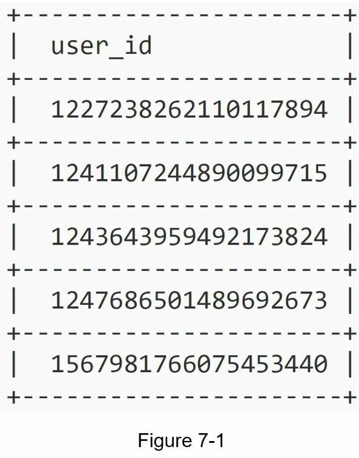
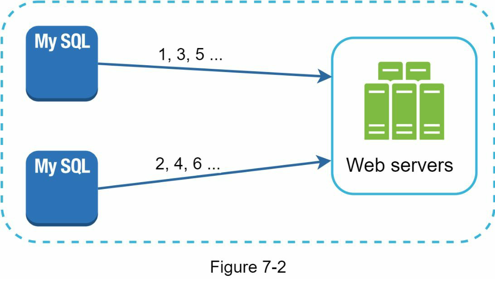
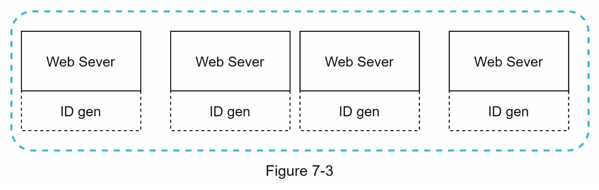
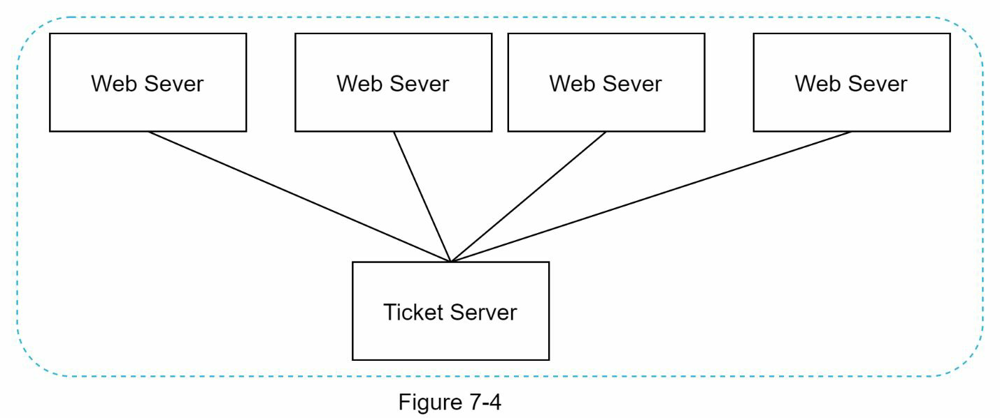
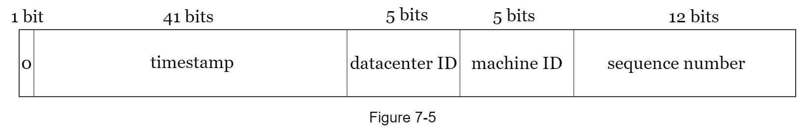
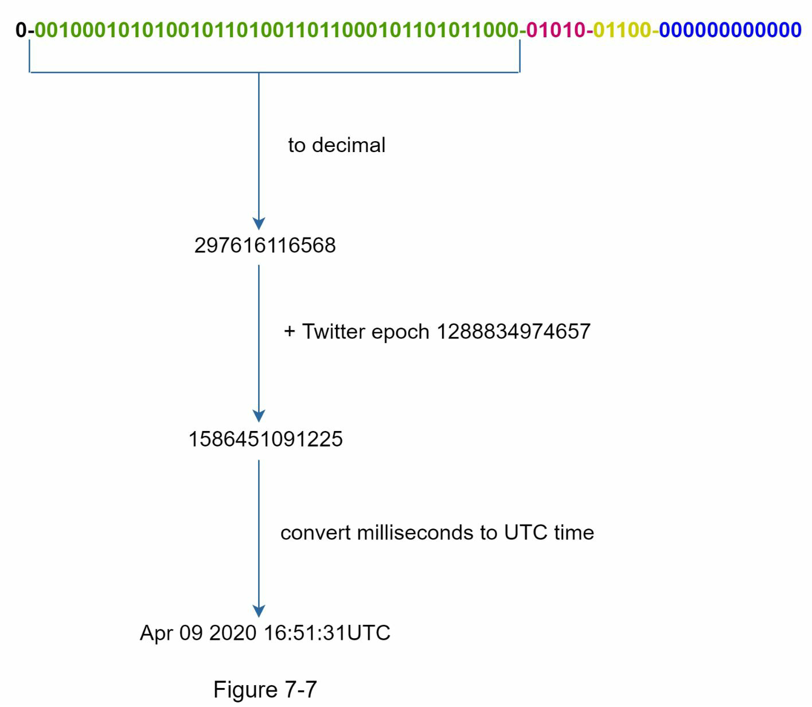

# Chapter 7: Design a unique ID generator in distributed systems
- First idea?   
  - Using a primary key with the auto-increment attributed in a traditional database
  - However, auto_increment does not work in a distributed environment
    - Single database is not large enough 
    - Generating unique IDs across multiple database with minimal delay is challenging

## Step 1 - Understand the problem and establish design scope
- Possible questions
  - What are the characteristics of unique IDs?
  - For each new record, does ID increment by 1?
  - Do IDs only contain numerical values?
  - What is the ID length requirement?
  - What is the scale of the system

- Possible Spec
  - IDs must be unique
  - IDs are numerical values only
  - IDs fit into 64-bits
  - IDs are ordered by date
  - Ability to generate over 10,000 unique IDs per seconds

## Step 2 - Propose high-level design and get buy-in
- Multiple options can be used to generate unique IDs in distributed systems
- The options we considered are
  - Multi-master replication
  - Universally unique identifier(UUID)
  - Ticket server
  - Twitter snowflake approach

### Multi-master replication

- This approach uses the databases' auto_increment feature
- Instead of increasing the next ID by 1, we increase it by k, where k is the number of database servers in use.
- Above image, the k = 2
- This solves some scalability issues because IDs can scale with the number of database servers
- Major drawbacks
  - Hard to scale with multiple data centers
  - IDs do not go up with time across multiple servers
  - It does not scale well when a server is added or removed

### UUID
- Another easy way to obtain unique IDs
- 128-bit number used to identify information in computer systems.
- Very low probability of getting collusion
- Qutoed from wikipedia: after generating 1 billition UUIDs every second for approximately 100 years would the probability of creating a single dupicate raech 50%
- Example

  - Can be generated independently without coordination between servers
  - Example : 09c93e62-50b4-468d-bf8a-c07e1040bfb2
  - Each web server contains an ID generator, and a web server is responsible for generating IDs independently

- Pros & Cons
  - Pros
    - Generating UUID is simple
    - No coordination between servers is needed so there will not be any synchronization issues
    - The system is easy to sacle
  - Cons
    - IDs are 128bit long, but our requirement is 64 bits
    - IDs do not go up with time
    - IDs could be non-numeric

### Ticket Server

- The idea is to use a centralized auto_increment feature in a single database server(ticket server)
- Pros & Cons
  - Pros
    - Numeric IDs
    - Easy to implement, and it works for small to medium-scale application
  - Cons
    - SPOF
    - If the ticket server goes down, all system depend on it will face issues
    - To avoid it(SPOF), we can set up multiple ticket server. However, this will introduce new challenges such as data synchronization

### Twitter snowflake approach
- Twitter's unique ID generation system, called "snowflake"
- Different sections of ID

  - Sign bit
    - 1 bit
    - It will always be 0. This is reserved for furture uses
  - Timestamp
    - 41 bits
    - Millisecons since the epoch or custom epoch
    - Twitter snowflake default epoch 1288834974657, equivalent to Nov 04, 2010, 01:42:54 UTC.
  - Datacenter ID
    - 5 bits
    - Which gives us 2^5 = 32 datacenters
  - Machine ID
    - 5 bits
    - Which gives us 2^5 = 32 machines per datacenter
  - Sequence number
    - 12 bits
    - For every ID generated on that machine/process, the sequence number is incrementaed by 1
    - The number is reset to 0 every millisecond

## Step 3 - Design deep dive
- In the high level design, we discussed various options to design a unique ID generator in distributed system
- We settle on an approach that is based on the Twitter snowflake ID generator

- Datacenter IDs and machine IDs are chosen at the startup time
  - Generally fixed once the system is up running
- Any changes in datacenter IDs and machine IDs require careful review since an accidental change in those values can lead to ID conflicts
- Timestamp and sequence numbers are generated when the ID generator is running

### Timestamp
- The most important 41 bits make up the timestamp section
- As timestamps grow with time, IDs are sortable by time

- How binary represnetaion is converted to UTC
- Also can convert UTC back to binary representation using a similar method
- The maximum timestamp that can be represented in 41 bits is
  - 2^41 -1 = 2199023255551 milliseconds(ms), which gives us : ~69 years
  - since 2199023255551 ms / 1000 seconds / 365 days / 24 hours/ 3600 seconds
  - This means the ID generator will work for 69 years and having a custom epoch time close to today's date delays to oeverflow time. 

### Sequence number
- 12 bits
- Gives us 2^12 = 4096 combinations
- This field is 0 unless more than one ID is generated in a milliesecond on the same server. 
- In theory, a machine can support a maximum of 4096 new IDs per millisecond.

## Step 4 - Wrap up
- Discussed different approaches to design a unique ID generator
- Addtional talking points
  - Clock synchronization between servers
    - Network Time Protocol is the most popular solution to this problem
  - Section length tuning
  - High availability
    - Mission critical system
    - Must be highly available