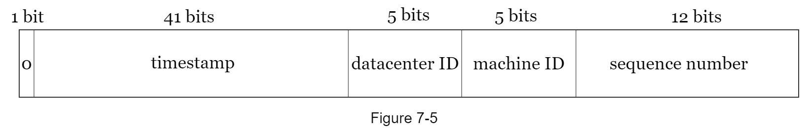
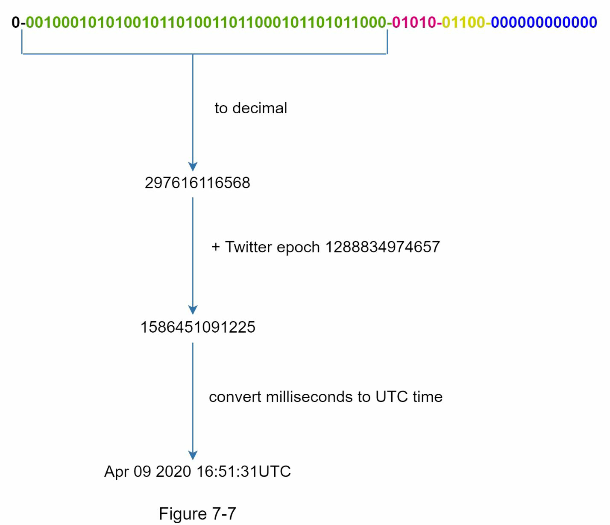

# Unique ID generator

- Auto_increment does not work in a distributed environment
  - because single database server is not large enough and generating unique IDs across multiple databases with minimal delay is challenging.

## Step 1 - Understand the problem and establish design scope

- What are the characteristics of unique IDs?
  - unique and sortable(by date)
- For each new record, does ID increment by 1?
  - The ID increments by time but not necessarily only increments by 1.
- Only contain numerical values?
  - Yes
- ID length requirement?
  - 64 bit
- Scale of the system?
  - Should generate 10,000 IDs per second.

## Step 2 - Propose high-level design and get buy-in
- Problems of increasing ID by k
  - Hard to scale with multiple data centers
  - IDs do not go up with time across multiple servers.
  - It does not scale well when a server is added or removed.
- Problems of using UUID
  - IDs are 128 bits long, but our requirement is 64 bits.
  - IDs do not go up with time.
  - IDs could be non-numeric.
- Ticket server
  - It's a centralized auto_increment feature in a single database server
  - Numeric IDs
  - Easy to implement. Works for small-medium scale
  - Single point of failure
- Twitter snowflake approach

## Step 3 - Design deep dive
- Datacenter IDs and machine IDs: fixed value
- Timestamp

- Sequence number: This field is 0 unless more than one ID is generated in a millisecond on the same
  - Support a maximum of 4096 new IDs per millisecond.

## Wrap up
- Additional topics
  - Clock sync: use NTP
  - Section length tuning: fewer sequence numbers but more timestamp bits are effective for low concurrency and long-term applications
  - High availability