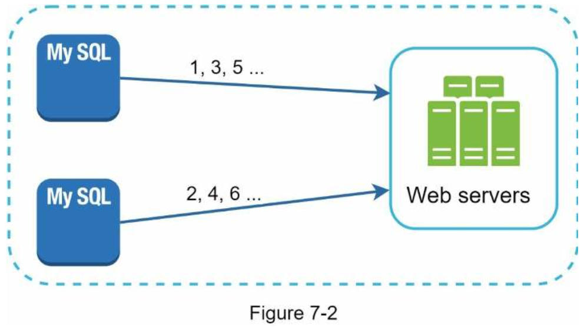
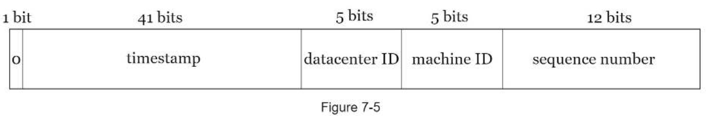
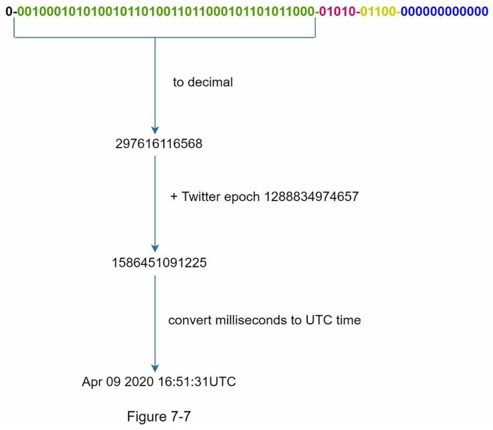

# DESIGN A UNIQUE ID GENERATOR IN DISTRIBUTED SYSTEMS
### Step 1 - Understand the problem and establish design scope
###### requirements
- IDs must be unique.
- IDs are numerical values only.
- IDs fit into 64-bit.
- IDs are ordered by date.
- Ability to generate over 10,000 unique IDs per second.

------

### Step 2 - Propose high-level design and get buy-in
##### Multi-master replication

- Drawbacks: 
    - Hard to scale with multiple data centers
    - IDs do not go up with time across multiple servers.
    - It does not scale well when a server is added or removed.

##### UUID
- UUID is a 128-bit number used to identify information in computer systems.
- UUID has a very low probability of getting collusion.
    _“after generating 1 billion UUIDs every second for approximately 100 years would the probability of creating a single duplicate reach 50%”_
- UUIDs can be generated independently without coordination between servers.
- Pros:
    - Generating UUID is simple. No coordination between servers is needed so there will not be any synchronization issues.
    - The system is easy to scale because each web server is responsible for generating IDs they consume. ID generator can easily scale with web servers.
- Cons:
    - IDs are 128 bits long, but our requirement is 64 bits.
    - IDs do not go up with time.
    - IDs could be non-numeric.

##### Ticket Server
- Flicker developed ticket servers to generate distributed primary keys.
- Pros:
    - Numeric IDs.
    - It is easy to implement, and it works for small to medium-scale applications.
- Cons:
    - Single point of failure.

##### Twitter snowflake approach

- Sign bit: 1 bit. It will always be 0. This is reserved for future uses. It can potentially be used to distinguish between signed and unsigned numbers.
- Timestamp: 41 bits. Milliseconds since the epoch or custom epoch. We use Twitter snowflake default epoch 1288834974657, equivalent to Nov 04, 2010, 01:42:54 UTC.
- Datacenter ID: 5 bits, which gives us 2 ^ 5 = 32 datacenters.
- Machine ID: 5 bits, which gives us 2 ^ 5 = 32 machines per datacenter.
- Sequence number: 12 bits. For every ID generated on that machine/process, the sequence number is incremented by 1. The number is reset to 0 every millisecond.

------

### Step 3 - Design deep dive
##### Timestamp

- The maximum timestamp that can be represented in 41 bits
- This means the ID generator will work for 69 years and having a custom epoch time close to today’s date delays the overflow time.

##### Sequence number
- Sequence number is 12 bits, which give us 2 ^ 12 = 4096 combinations.
- This field is 0 unless more than one ID is generated in a millisecond on the same server.
- A machine can support a maximum of 4096 new IDs per millisecond.

------

### Step 4 - Wrap up
- A few additional talking points:
    - Clock synchronization. Network Time Protocol is the most popular solution to this problem. 
    - Section length tuning. 
    - High availability.