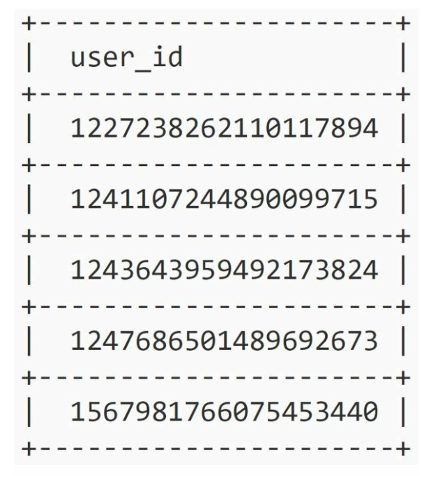
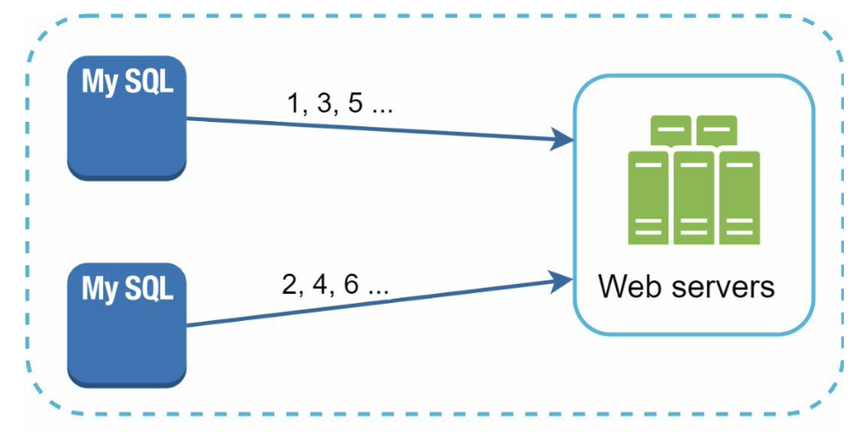
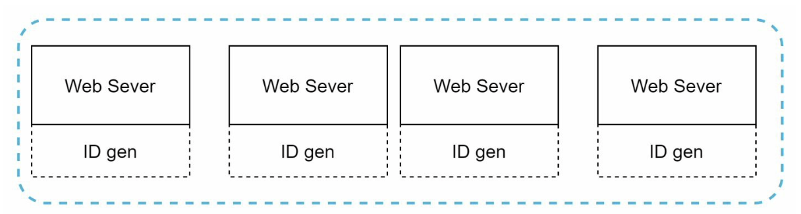
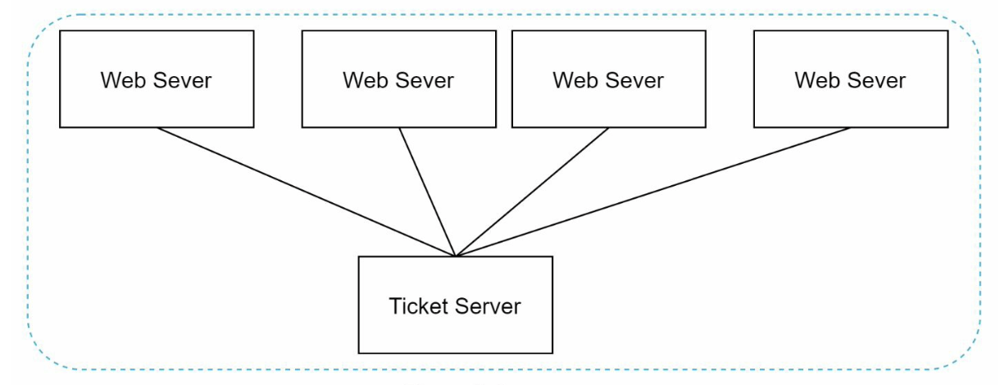
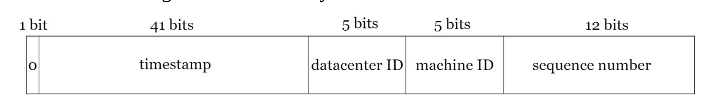
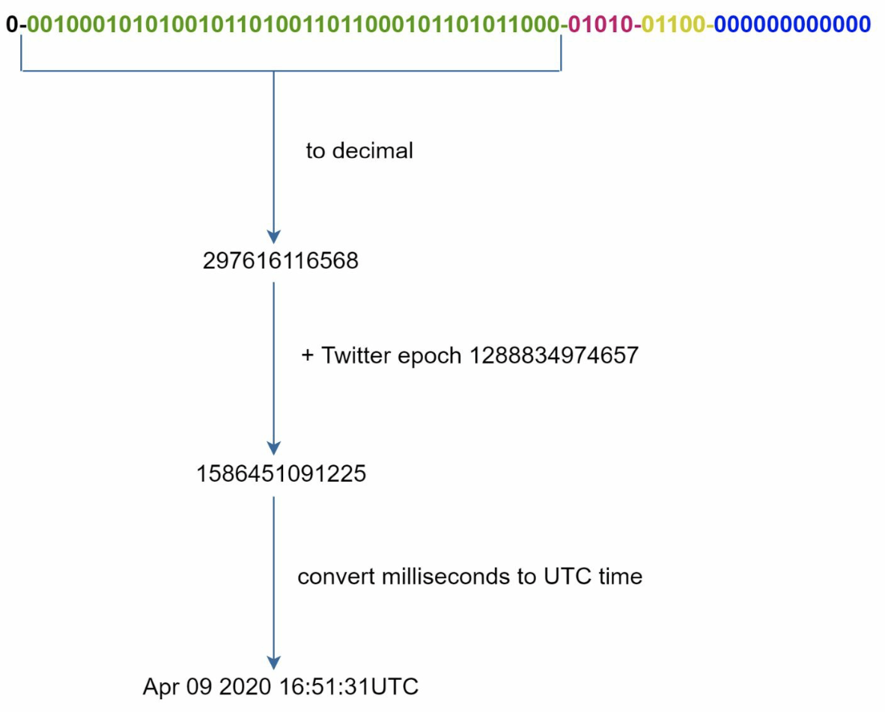

# Chapter 7: Design a Unique ID Generator in Distributed Systems

We will design a unique ID generator in distributed systems. Note: using a primary key with the *auto_increment* attribute in a traditional db won't work in a distributed environment, because a single db server is not large enough and generating unique IDs across multiple dbs with minimal delay is challenging.



## Step 1: Understand the Problem and Establish Design Scope
- Asking clarification questions is the first step to tackle any system design interview question:
    - Q: What are characteristics of unique IDs?
        - A: IDs must be unique and sortable
    - Q: For each record, does ID increment by 1?
        - A: Not necessarily. However ID incrementss by time - IDs created in the evening > IDs created in the morning on the same day
    - Q: Does IDs only contain numerical values?
        - A: Yes
    - Q: What is the ID length requirement?
        - A: IDs should fit into 64-bit
    - Q: What is the scale of the system?
        - THe system should be able to generate 10,000 IDs per second.
    
    - It is crucial to understand the requirements and clarify ambiguities.
    - In this chapter:
        - IDs must be unique
        - IDs are numerical values only
        - IDs fit into 64-bit
        - IDs are ordered by date
        - Ability to generate over 10,000 unique IDs / sec

## Step 2: Propose High-Level Design and get Buy-In
- There are multiple options to generate unique IDs in distributed systems:
    - Multi-master replication
    - UUID (Universally unique identifier)
    - Ticket server
    - Twitter snowflake approach

### Multi-master Replication

 

- Uses the dbs' *auto_increment* feature. 
    - Increase the next ID by *k* (instead of increase by 1), where k = number of servers in use.
    - Next ID to be generated = the previous ID in the same server + k
- Solves some scalability issues as IDs can scale with the number of db servers
- However, some drawbacks:
    - Hard to scale with multiple data centers
        - Due to issues related to network latency and synchronization. Coordinating unique ID generation across geographically distributed data centers can introduce complexities.

    - IDs do not go up with time across multiple servers
        - Since the approach relies on incrementing the next ID by a fixed value (k), the generated IDs may not follow a chronological order across multiple servers. This could impact scenarios where maintaining a chronological sequence is crucial, such as timestamp-based sorting or auditing.

    - It does not scale well when a server is added or removed
        - The method of incrementing the next ID by a fixed value (k) can lead to challenges when dynamically adding or removing servers from the system. Adjustments to the value of k or the redistribution of ranges may be required, introducing complexity and potential disruptions.

### UUID
- Another easy way to obtain unique IDs
- UUID: 128-bit number used to identify information in computer systems
    - i.e. 09c93e62-50b4-468d-bf8a-c07e1040bfb2
- Very low probability of getting collusion.
- Can be generated independently without coordination between servers

- Example Design:
 

- Each web server contains ID generator
- A web server is responsible for generating IDs independently

- Pros:
    - Simple. No coordination between servers, so no synchronization issues
    - The system is easy to scale (servers are independent from each other for generating IDs they consume)
- Cons:
    - IDs are 128 bits long while our requirement is 64 bits
    - IDs do not go up with time
    - IDs could be non-numeric

### Ticket Server
- Flicker (image and video hosting website) developed ticket servers to generate distributed primary keys

 

- Use a centralized *auto_increment* feature in a single db server (Ticket Server)

- In a distributed system like Flickr's, where photos may be uploaded and managed on different servers, generating globally unique IDs becomes a non-trivial task. 
- The ticket server approach helped manage this by allocating ranges of unique identifiers (tickets) to each server. The central database server then incremented the IDs within these ranges, providing a mechanism for distributed primary key generation.

- Pros:
    - Numeric IDs
    - Easy to implement, works well for small - medium scale applications
- Cons:
    - Single point of failure. If the ticket server goes down, all systems that depend on it will face issues. 
    - If we set up multiple ticket servers to avoid issue ^, there will be new challanges such as data synchronization

- None of the above approaches meet our specific requirements. So..

### Twitter Snowflake Approach
- Twitter's unique ID generation system called "snowflake"
- Divide and conquer: instead of generating and ID directly, we divide an ID into different sections

- Layout of a 64-bit ID:

 

- Sign bit: 1 bit. Value is 0 (reserved for future uses such as distinguishing between signed and unsigned numbers)
- Timestamp: 41 bits. Milliseconds since the epoch or custome epoch
    - Twitter snowflake default epoch 1288834974657 (Nov 04, 2010, 01:42:54 UTC)
- Datacenter ID: 5 bits. This gives us 2^5 = 32 datacenters
- Machine ID: 5 bits. 32 machines per data center
- Sequence number: 12 bits. For everyID generated on that machine/process, the sequence number is incremented by 1. The number is reset to 0 every millisecond.
    - However, the sequence number does not necessarily reset to 0 every millisecond. Instead, it starts at 0 for each new millisecond and increments until the maximum value that can be represented in the allotted number of bits for the sequence.

## Step 3: Deep Dive
- Once discussed various options to design a unique ID generator in distributed systems, we settle on the Twitter snowflake approach.

- Datacenter IDs and machine IDs are chosen at the startup time, generally fixed once the system is running
    - Any changes in datacenter IDs and machine IDs require careful review (an accidental change can lead to ID conflicts)
- Timestamp and sequence numbers are generated when the ID generator is running

### Timestamp
- Most important 41 bits
- As timestamps grow with time, IDs are sortable by time

- Example: how binary representation is converted to UTC (vise versa can be achieved using a similar method)

 

- Maximum timestamp that can be represented with 41 bits is 69 years
```
2 ^ 41 - 1 = 2199023255551 milliseconds (ms), which gives us: ~ 69 years =
2199023255551 ms / 1000 seconds / 365 days / 24 hours/ 3600 seconds
```

- ID generator will work for 69 years and having a custom epoch time close to today's date delays the overflow time.
- After 69 years, we need a new epoch time or adopt other techniques to migrate IDs

### Sequence Number
- 12 bits = 2 ^ 12 = 4096 combinations
- This field is 0 unless more than one ID is generated in a millisecond on the same server
    - In theory, a machine can support a maximum of 4096 new IDs per millisecond
    
## Step 4: Wrap Up
- If there is extra time at the end of the interview, some few additional talking points:
### Clock synchronization
- In our design, we assume ID generation servers have the same clock. This assumption may not be true if a server is running on multiple cores. (same challenge exists in multi-machine scenarios)
    
- Network Time Protocol is the most popular solution to this problem:
    - NTP enables devices on a network to synchronize their clocks with a reference time source. This reference time source is often a highly accurate time server, such as an atomic clock or a global positioning system (GPS) receiver.

### Section length tuning
- For example, fewer sequence numbers but more timestamp bits are effective for low concurrency and long-term applications.

### High Availability
- Since an ID generator is a mission-critical system, it must be highly available
    - Implement redundancy by having backup or standby instances of the ID generator.
    - Use load balancing to evenly distribute requests across active instances.
    - Implement robust monitoring to detect issues proactively.
    - Set up alerting systems to notify administrators of any anomalies or failures.
    


