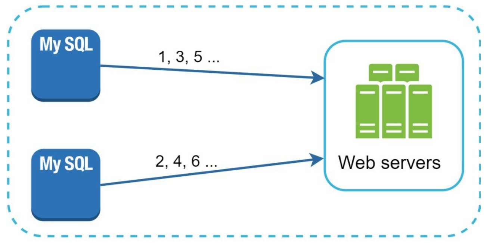
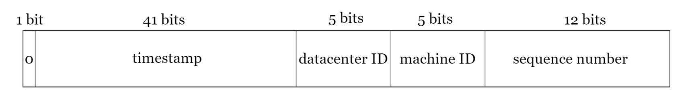

# Chapter 7. Design a unique id generator in distributed systems

### Step 1 - understand the problem and establish design scope

Given requirements:

- IDs must be unique
- IDs are numerical values only
- IDs fit into 64-bit
- IDs are ordered by date
- Ability to generate over 10,000 unique IDs per second

### Step 2 - Propose high-level design and get buy-in

Options we can consider:

- Multi-master replication
- Universally Unique identifier(UUID)
- Ticket server
- Twitter snowflake approach

#### Multi-master replication

Increment by _k_, where _k_ is the number of database servers in use.
Drawbacks:

- Hard to scale with multiple data centers
- IDs do not go up with time across multiple servers
- It does not scale well when a server is added or removed

#### UUID

A 128-bit number

**Pros:**

- Simple to generate because no coordination between servers is needed so there won't be any synchronization issues
- Easy to scale since each web server is responsible for generating IDs

**Cons:** (**current requirement specific**)

- IDs are 128 bits long, but our requirement is 64 bits
- IDs do not go up with time
- IDs could be non-numeric

#### Ticket Server

A centralized single database server provides auto_increment feature. [Ticker Servers - code.flicker.com](https://code.flickr.net/2010/02/08/ticket-servers-distributed-unique-primary-keys-on-the-cheap/)

**Pros:**

- Numeric IDs
- Easy to implement

**Cons:**

- Single point of failure. Can be improved by multiple ticket servers, but it leads to a new challenge; data synchronization

#### Twitter snowflake approach

Instead of generating ID directly, we divide an ID into different sections.

- [Snowflake ID - Wikipedia](https://en.wikipedia.org/wiki/Snowflake_ID)
- [Announcing Snowflake - X](https://blog.twitter.com/engineering/en_us/a/2010/announcing-snowflake)

The below is a layout of 64-bit ID.

- Single bit: 1 bit reserved for future uses. It will always be 0. It can potentially be used to distinguish between signed and unsigned numbers
- Timestamp: 41 bits. Milliseconds since the epoch(1, Jan 1970) or custom epoch
- Data center ID: 5 bits, which is 2^5 = 32 data centers
- Machine ID: 5 bits, which is 2^5 = 32 machines per data center
- Sequence number: 12 bits. For every ID generated on the machine/process, the sequence number is incremented by 1 and reset to 0 every millisecond

### Wrap up

few additional talking points:

- Clock synchronization
- Section length tuning
- High availability
