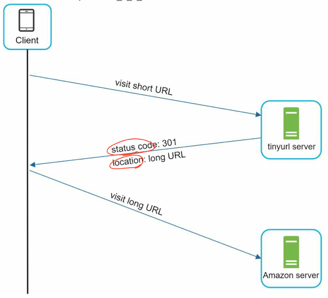
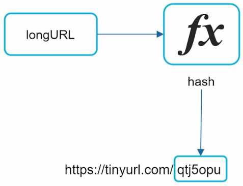
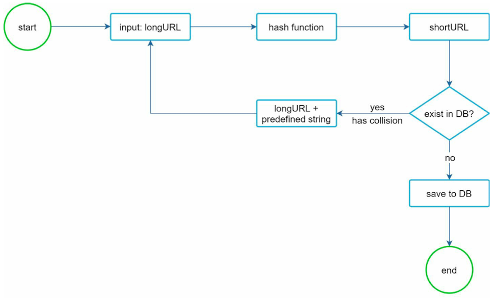
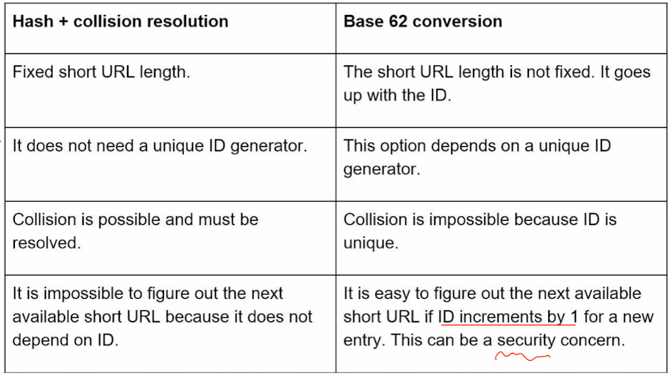
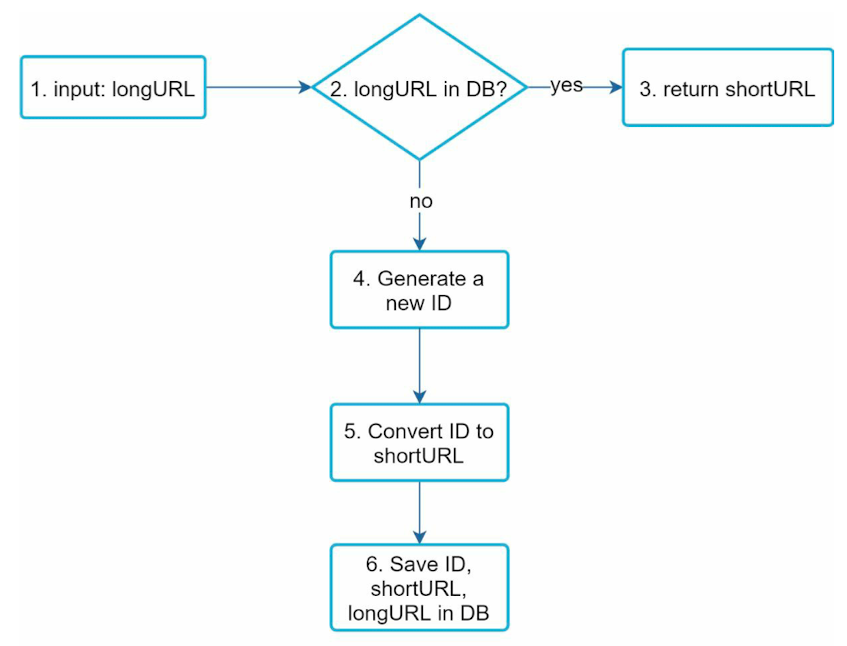
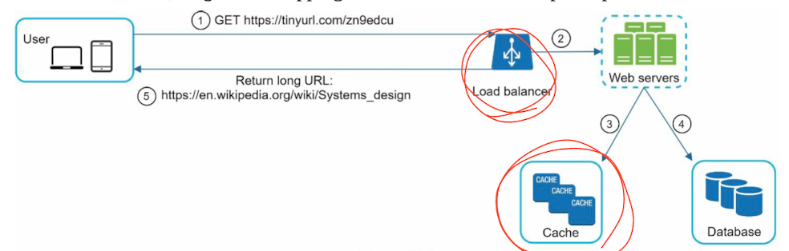

# CHAPTER 8: DESIGN A URL SHORTENER

## Step 1 - Understand the problem and establish design scope
- Can you give an example of how a URL shortener work? 
- What is the traffic volume? 
- How long is the shortened URL? 
- What characters are allowed in the shortened URL? 
- Can shortened URLs be deleted or updated? 

### Use cases
1. URL shortening: given a long URL => return a much shorter URL 
2. URL redirecting: given a shorter URL => redirect to the original URL 
3. High availability, scalability, and fault tolerance considerations

### Back of the envelope estimation
- Write operation: 100 million URLs are generated per day.
- Write operation per second: 100 million / 24 /3600 = 1160
- Read operation: Assuming ratio of read operation to write operation is 10:1, read operation per second: 1160 * 10 = 11,600
- Assuming the URL shortener service will run for 10 years, this means we must support 100 million * 365 * 10 = 365 billion records.
- Assume average URL length is 100.
- Storage requirement over 10 years: 365 billion * 100 bytes * 10 years = 365 TB 

## Step 2 - Propose high-level design and get buy-in
- API Endpoints -> Rest-style
  - POST api/v1/data/shorten
    - request parameter: {longUrl: longURLString}
    - return shortURL
  - GET api/v1/shortUrl
    - Return longURL for HTTP redirection

- URL redirecting -> HTML Status code = 301 
  - 
  - Status code 301(permanently) vs Status code 302(temporarily)
- URL shortening
  - www.tinyurl.com/{hashValue}
  - 

## Step 3 - Design deep dive 
- Hash function 
  - Hash value length 
    - [0-9, a-z, A-Z], containing 10 + 26 + 26 = 62 possible characters
    - Find the smallest n such that 62^n ≥ 365 billion -> n = 7
  - Hash + collision resolution
    - CRC32 VS MD5 VS SHA-1 VS SHA256
    - 
  - Base 62 conversion (62진법)
  - 
- URL shortening deep dive 
  - 
  - 