# Chapter 8. Design a url shortener.

## Step 1. Understand the problem and establish design scope
### Requirments
- Traffic volume: 100 million URLs are generated per day.
- Shortened URL can be a combination of numbers and characters.

### Scenario
1. URL shortening: given a long URL => return a much shorter URL
2. URL redirecting: given a shorter URL => redirect to the original URL
3. High availability, scalability, and fault tolereance considerations

### Envelope estimation
- Write operation:
    ```
    100 million per day
    ```
- Write operation per second:
    ```
    100 million / 24 / 3,600 = 1,160
    ```
- Read operation: Assuming ratio of read operation to write operation is 10:1: 
    ```
    read operation per second: 1,160 * 10 = 11,600
    ```
- Records: Assuming the URL shotener service will run for 10 years, 
    ```
    100 million * 365 * 10 (years) = 365 billion records
    ```
- Storage: Assuming average URL length is 100
    ```
    365 billion * 100 bytes = 36.5 TB
    ** Why do we need to multiply by 10 years?
    ```

## Step 2. Propose high-level design and get buy-in
### API Endpoints
1. URL shortening
    ```
    POST api/v1/data/shorten
        - request parameter: {longUrl: LongURLString}
        - return shortURL
    ```
2. URL redirecting
    ```
    GET api/v1/shortUrl
        - return longURL for HTTP redirection
    ```

### URL redirecting
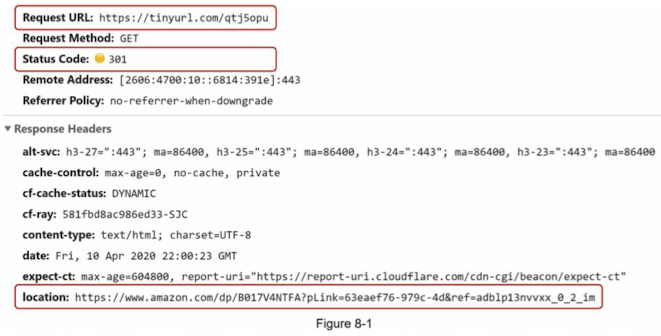
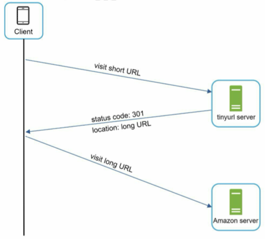

#### Implementation
- Hash table <shortURL, longURL> pairs
    - Get longURL:longURL = hashTable.get(shortURL)

#### 301 redirect vs 302 redirect
| | 301 | 302 |
| --- | --- | --- |
| Behaviour: | "Permanently" moved to the long URL | "Temporarily" moved to the long URL |
| Cache: | Yes | No |
| Advantage: | Can reduce the server load | Good for anlaytics such as counting click rate and source of the click |

### URL shortening
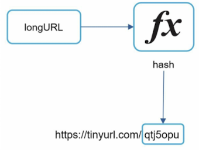
- Hash function must satisfy\
    a. Each longURL must be hashed to one hashValue.\
    b. Each hashValue can be mapped back to the longURL.

## Step 3. Design deep dive
### Data model
- Store <shortURL, longURL> mapping in a relational database.\
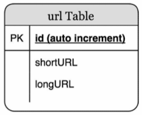

### Hash function
: Hash function is used to hash a long URL to a short URL, also known as hashValue.

#### Hash value length
- Possible characters: [0-9, a-z, A-Z], containing 10 + 26 + 26 = 62
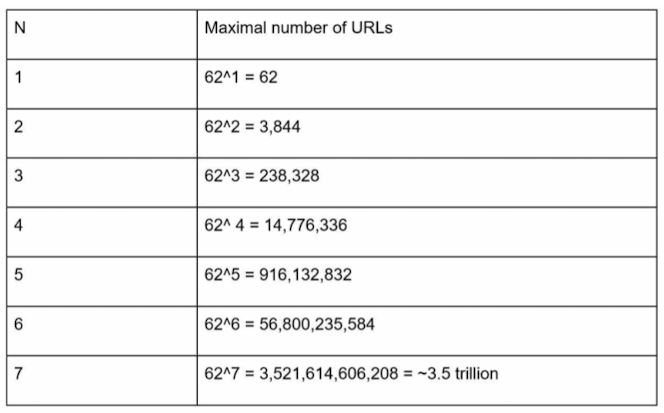
- N should be '7' to cover 365 billion URL. So, **the length of hashValue is 7**.

#### Hash collision resolution
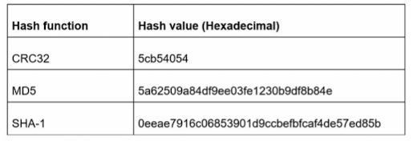
- Collect the first 7 character of a hash value.
- Hash collision
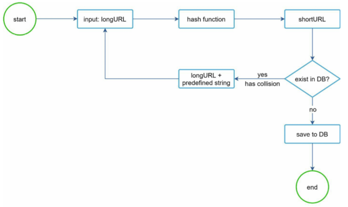
- However, this design hits the database to check if the hash value exists for every request.
- A bloom filter

#### Base 62 conversion
```
0-0, ..., 9-9, 10-a, 11-b, ..., 35-z. 36-A, ..., 61-Z
```
- 11157 (10) = 2 x 62^2 + 55 x 62^1 + 59 x 62^0 = [2,55,59] -> [2, T, X] in base 62.
- Thus
    ```
    The short URL is https://tinyurl.com/2TX
    ```

#### Hash collision resolution vs Base 62 conversion
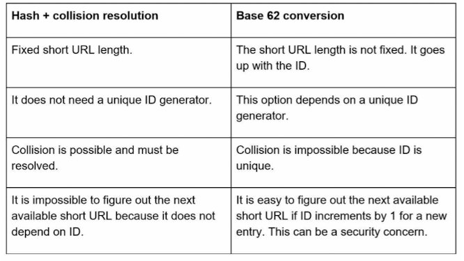

### URL shortening design
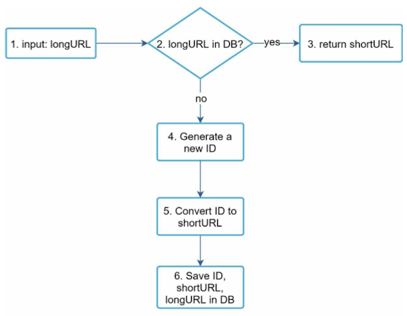
- Flow example:\
    a. LongURL: https://en.wikipedia.org/wiki/System_design\
    b. Unique ID generator returns ID: 2009215674938\
    c. Base 62 conversion return: 2009215674938 --> "zn9edcu"\
    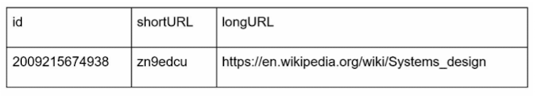

### URL redirecting design
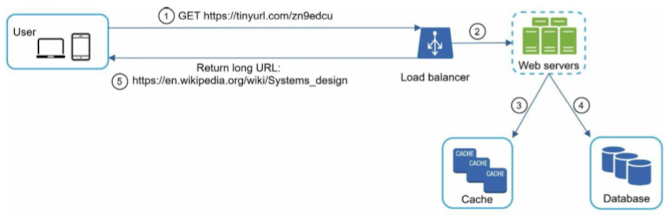
