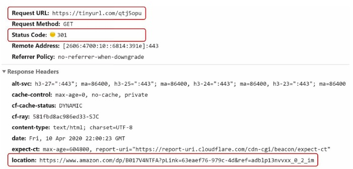
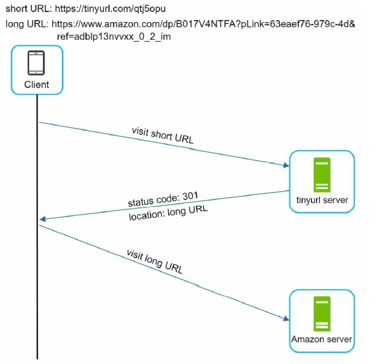
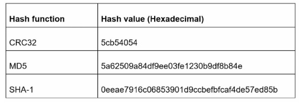
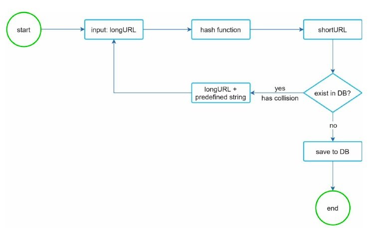
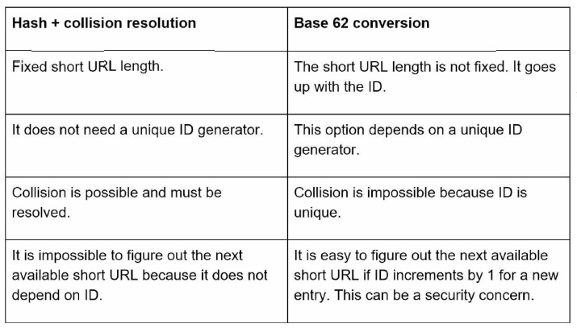
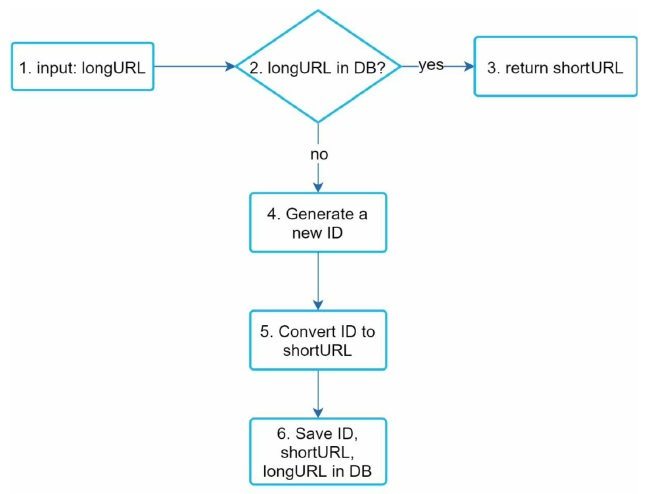
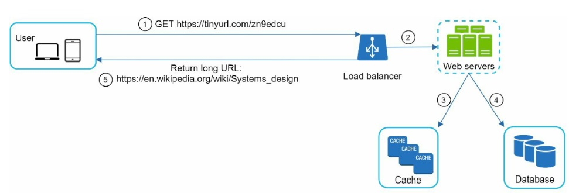

# 8. Design A URL Shortener

## Step 1. Understand the problem and establish design scope

> Candidate: Can you give an example of how a URL shortener work?
>> Interviewer: Assume URL https://www.systeminterview.com/g=chatsystem&c=loggedin&v=v3&l=long is the original URL. Your service creates an alias with shorter length:https://tinyurl.com/y7keocwj. If you click the alias, it redirects you to the original URL.
>
> Candidate: What is the traffic volume?
>> Interviewer: 100 million URLs are generated per day.
>
> Candidate: How long is the shortened URL?
>> Interviewer: As short as possible
>
> Candidate: What characters are allowed in the shortened URL?
>> Interviewer: Shortened URL can be a combination of numbers(0-9) and characters(a-z, A-Z)
>
> Candidate: Can shortened URLs be deleted or updated?
>> Interviewer: For simplicity, let us assume shortened URLs cannot be deleted or updated.

The basic use cases:

- 1. URL shortening: given a long URL => return a much shorter URL
- 2. URL redirecting given a shorter URL => redirect to the original URL
- 3. High availability, scalability, and fault tolerance considerations

Back of the envelope estimation

- Write operation: 100 million URLs are generated per day.
  - Write operation per second: 100 million/ 24/ 3600 = 1160
- Read operation
  - Assuming ratio of read operation to write operation is 10:1, read operation per second: 1160 * 10 = 11,600
- Assuming the URL shortener service will run for 10 years
  - This means we must support 100 million * 365 * 10 = 365 billion records
- Assume average URL length is 100
  - Storage requirement over 10 years: 365 billion * 100 bytes = 36.5 TB

## Step 2. Propose high-level design and get buy-in

### API Endpoints

A URL shortener primary needs two API endpoints

- 1. URL shortening
  - To create a new short URL, a client sends a POST request, which contains one parameter: the original long URL. 
  - The API looks like this:
    - **POST** api/v1/data/shorten
      - request parameter: {longUrl:longURLString}
      - return shortURL
- 2. URL redirecting
  - To redirect a short URL to the corresponding long URL, a client sends a GET request. 
  - The API looks like this:
    - **GET** api/v1/shortUrl
      - Return longURL for HTTP redirection

### URL redirecting

Once the server receives a tinyurl request, it changes the short URL to the long URL with 301 redirect. (301: permanently moved)

- 301 redirect
  - "permanently" moved to the long URL.
  - Since it is permanently redirected, the browser caches the response, and subsequent requests for the same URL will not be sent to the URL shortening service. Instead, requests are redirected to the long URL server directly.
- 302 redirect
  - "temporarily" moved to the long URL.
    - meaning that subsequent requests for the same URL will be sent to the URL shortening service first. Then, they are redirected to the long URL server.
- Pros and cons
  - If the priority is to reduce the server load
    - using 301 redirect (Only the first request of the same URL is sent to URL shortening servers)
  - If analytics is important
    - 302 redirect is better
    - It can track click rate and source of the click more easily.

The most intuitive way to implement URL redirecting is

- Use Hash tables.
  - Get longURL: longURL = hashTable.get(shortURL)
  - Once you get the longURL, perform the URL redirect.

### URL shortening

We must find a hash function fx that maps a long URL to the hashValue. It must satisfy the following requirements:

- Each longURL must be hashed to one hashValue.
- Each hashValue can be mapped back to the longURL.

## Step 3. Design deep dive

### Data model

- In the high-level design, everything is stored in a hash table.
  - However, not feasible for real-world systems as memory resources are limited and expensive.
  - A better option is to store <shortURL, longURL> mapping in a relational database.

### Hash function

It is also known as ***hashValue***.

#### Hash value length

- ***hashValue***
  - consists of characters from [0-0,a-z,A-Z] containing 10+26+26= 62 possible chars
  - find the smallest N such that 62^N >= 365 billion : N= 7

- Two types of hash functions for a URL shortener
  - **hash + collision resolution**
  - **base 62 conversion**

#### Hash + collision resolution

- Well-known hash functions
  - CRC32, MD5, or SHA-1
  - 
  - Problems
    - Even the shortest version is too long ( > 7 chars)
    - If we take first 7 chars then there will be more collisions
  - To resolve hash collisions, we can recursively append a new predefined string until no more collision is discovered
    - 
    - But it is expensive to query the database to check if a shortURL exists for every request
      - A Bloom filter can improve performance
        - A bloom filter is a space-efficient probabilistic technique.

#### Base 62 conversion

Base 62 conversion helps to convert the same number between its different number representation systems.

- It is used as there are 62 possible characters for hashValue.
  - From its name, base 62 is a way of using 62 characters for encoding.
  - The mappings are 0-0, ..., 9-9, 10-a, 11-b, ..., 35-z, 36-A, ..., 61-Z, where 'a' stands for 10, 'Z' stands for 61, etc.

#### Comparison of the two approaches

- 

### URL Shortening deep dive

Base 62 conversion is used in our design.

- The flow
  1. longURL is the input
  2. The system checks if the longURL is in the database
  3. If it is, it means the longURL was converted to shortURL before. In this case, fetch the shortURL from the database and return it to the client
  4. If not, the longURL is new. A new unique ID (primary key) Is generated by the unique ID generator.
  5. Convert the ID to shortURL with base 62 conversion.
  6. Create a new database row with the ID, shortURL, and longURL.

### URL redirecting deep dive

As there are more reads than writes, <shortURL, longURL> mapping is stored in a cache to improve performance.

- 

- The flow of URL redirecting
  1. A user clicks a short URL link.
  2. The load balancer forwards the request to web servers.
  3. If a shortURL is already in the cache, return the longURL directly.
  4. If a shortURL is not in the cache, fetch the longURL from the database. If it is not in the database, it is likely a user entered an invalid shortURL.
  5. The longURL is returned to the user.

## Step 4. Wrap up

Here are a few additional talking points

- Rate limiter
  - A potential security problem we could face is that malicious users send an overwhelmingly large number of URL shortening requests.
- Web server scaling
  - Since the web tier is stateless, it is easy to scale the web tier by adding or removing web servers.
- Database scaling
  - Database replication and sharding are common techniques.
- Analytics
  - Data is increasingly important for business success.
    - ex. how many people click on a link? When do they click the link?
- Availability, consistency, and reliability
  - These concepts are at the core of any large system's success.
  