# Chapter 9 : Design a web crawler

- robot / spider로 알려짐
    - robot : crawler는 사람의 개입 없이 자동으로 작업을 수행하는 프로그램
    - spider : 거미가 그물을 치고 그 위를 다니며 먹이를 찾듯이, 웹 크롤러는 인터넷이라는 Web을 돌아다니며 데이터를 수집함
- web crawler : 몇 개의 웹 페이지를 수집한 다음, 그 페이지들에 있는 링크를 따라 새로운 content 수집

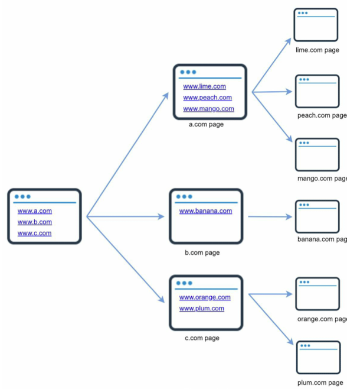
crawl process

### Crawler의 purposes

- Search engine indexing : 가장 일반적인 사용 사례, web pages를 수집하여 **search engine의 local index를 만듬**
1. 웹 크롤링 : 인터넷을 돌아다니며 웹사이트들을 방문하면서 URL, 콘텐츠, 링크 등의 정보 수집
2. 인덱싱 (수집된 데이터는 search engine의 database에 저장됨, 각 웹 페이지는 키워드, 내용, 구조 등에 따라 분류됨)
3. 검색 처리 (사용자가 검색 쿼리를 입력하면, search engine은 이 로컬 인덱스를 빠르게 검색하여 관련성 높은 결과를 찾아 사용자에게 제공)
- Web archiving : web에서 정보를 수집하여 미래 사용을 위해 데이터를 보존하는 과정

## Step 1 - Understand the problem and establish design scope

- URL shortener가 어떻게 작동하는지
- 일일 traffic 양
- 단축된 URL의 길이
- URL에 사용 가능한 문자
- URL의 삭제 및 업데이트 가능성
- Basic use cases
    - URL shortening
    - URL redirecting
    - High availability, scalability, fault tolerance considerations (장애 허용성)

### Back of the envelope estimation

- 하루에 생성되는 URL의 수 : 100 million
- Write operation per sec : 100 million / 24 / 3600 = 1160
- Read operation per sec : 1160 * 10 (read가 write의 10배라고 가정)
- 서비스의 지속 기간 : 100 million * 365 * 10(년) = 365 billion records
- 평균 URL의 길이 : 100
- 저장공간 요구사항 over 10 years : 365 billion * 100 bytes * 10 years = 365 TB

## Step 2 - Propose high-level design and get buy-in

### API Endpoints

1. URL shortening
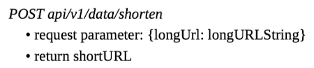
2. URL redirecting
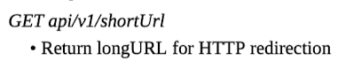

### URL redirecting
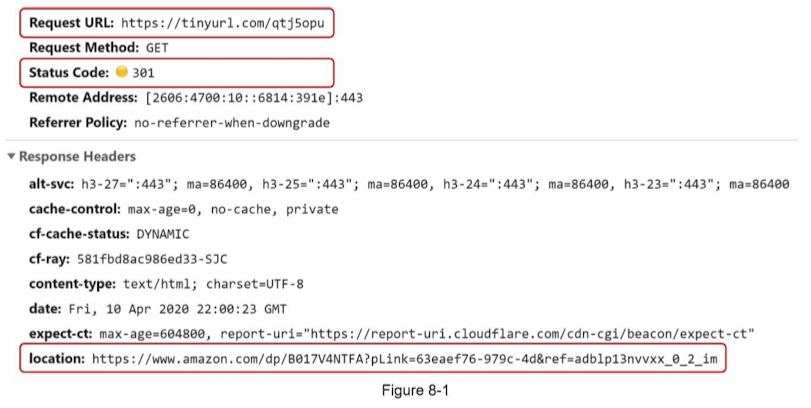
- browser에 tinyurl을 입력했을 때 서버가 301 redirect를 사용하여 짧은 URL을 원래의 긴 URL로 변경
- browser는 301을 받고 location header를 통해 원래 URL로 redirect

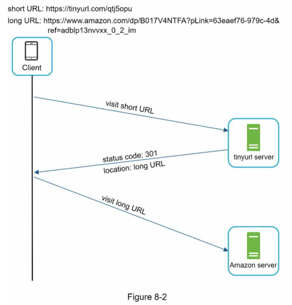

### 301 redirect

- URL이 영구적으로 이동됨
- browser는 cache하여 이후 동일한 URL에 대한 요청을 URL 단축 service가 아닌 직접적으로 긴 URL 서버로 redirect

### 302 redirect

- URL이 일시적으로 이동됨
- browser는 매 요청마다 URL 단축 service를 통해 긴 URL로 redirect

### URL shortening

- URL 단축을 위해서는 긴 URL을 hashValue로 매핑하는 hash function f(x) 필요
- 이 hashValue는 다시 원래의 긴 URL로 매핑될 수 있어야 함
- 형식 : www.tinyurl.com/{hashValue}

## Step 3 - Design deep dive

### Data model

- high-level design에서 모든 것이 hash table에 저장되는 것으로 시작하지만, 실제 시스템에는 적합 X
- <shortURL, longURL> mapping을 relational database에 저장하는 것이 더 나음
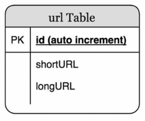

### Hash function

- 긴 URL을 짧은 URL로 hashing

#### Hash value length

- 0 ~ 9
- a ~ z
- A ~ Z

-> 62 possible characters -> 62^n >= 365 billion (smallest n?)

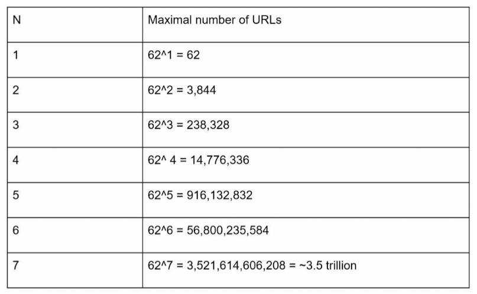

1. Hash + collision resolution

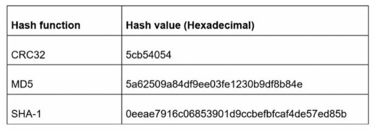

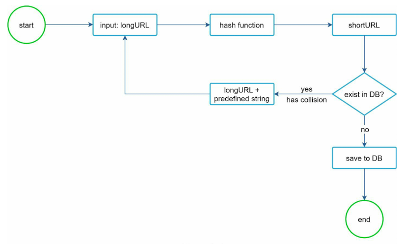

2. Base 62 conversion

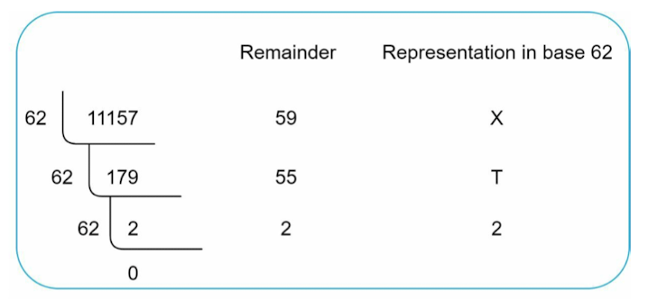

#### Comparison of the two approaches

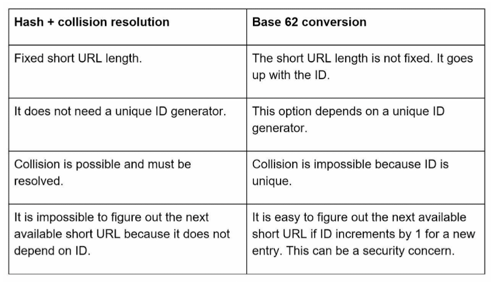

### URL shortening deep dive

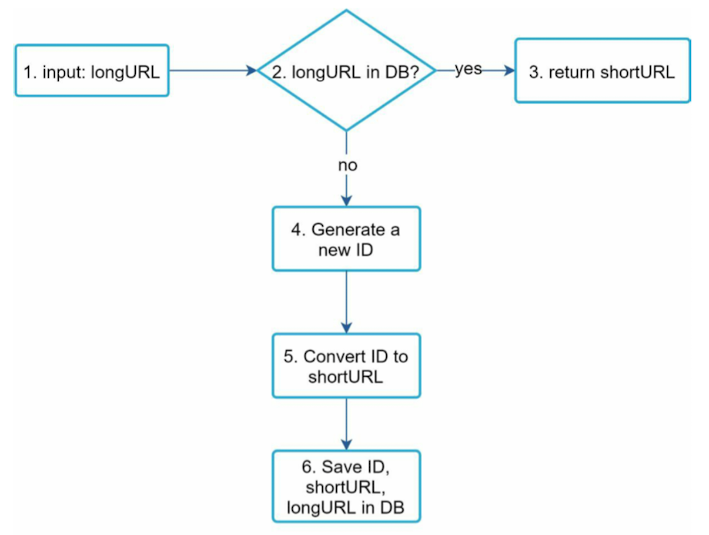

1. input : longURL
2. system이 database에서 해당 URL을 찾음
3. 있으면 database에서 shortURL fetch
4. 없으면 new unique ID를 생성
5. ID를 shortURL로 변환 (base 62 conversion)
6. new database 생성

### URL redirecting deep dive

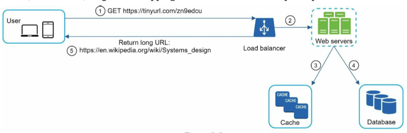

User가 short URL을 클릭 -> load balancer가 web server로 전달 -> cache에 있으면 바로 longURL 반환, 없으면 database에서 long URL을 가져와 반환

## Step 4 - Wrap up

- API design
- Data model
- Hash function
- URL shortening
- URL redirecting

### few additional talking points

- Rate limiter
- Web server scaling
- Database scaling
- Analytics
- Availability, consistency, reliability