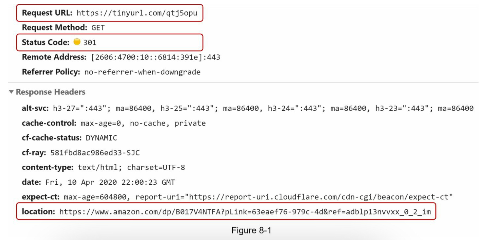
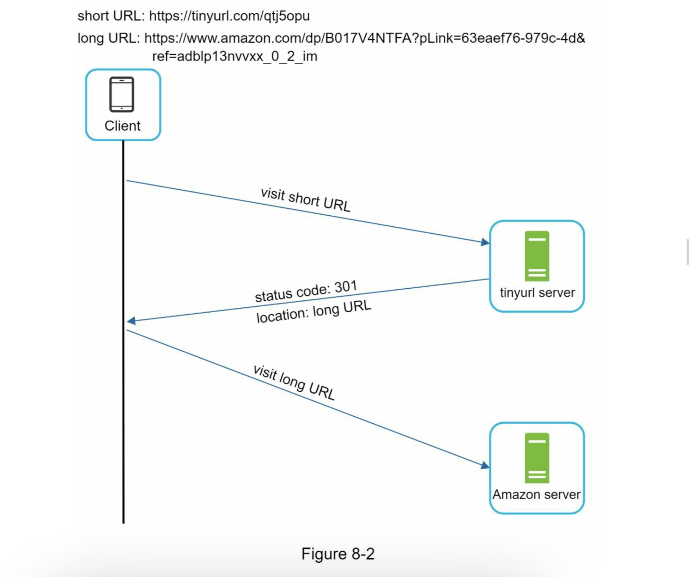
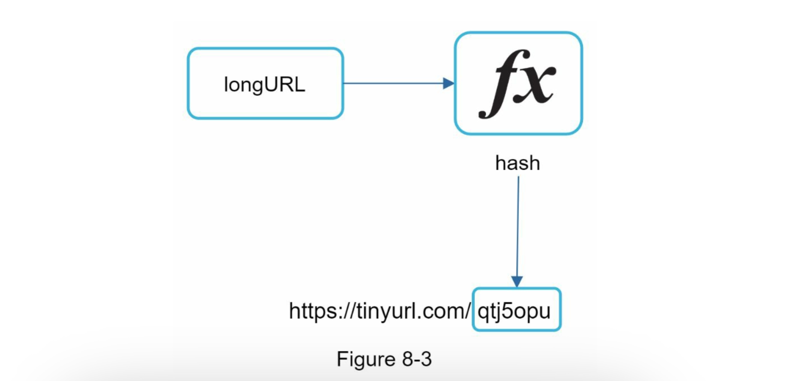
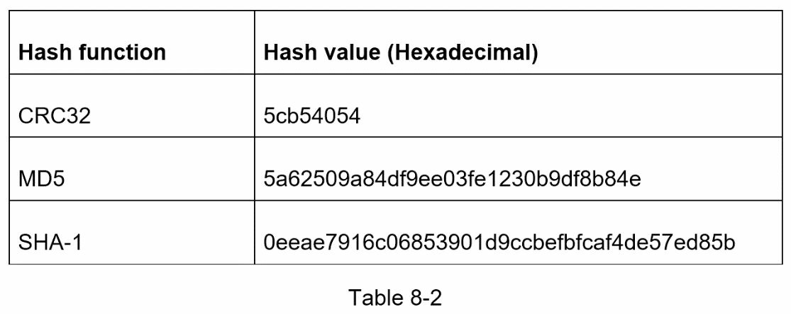
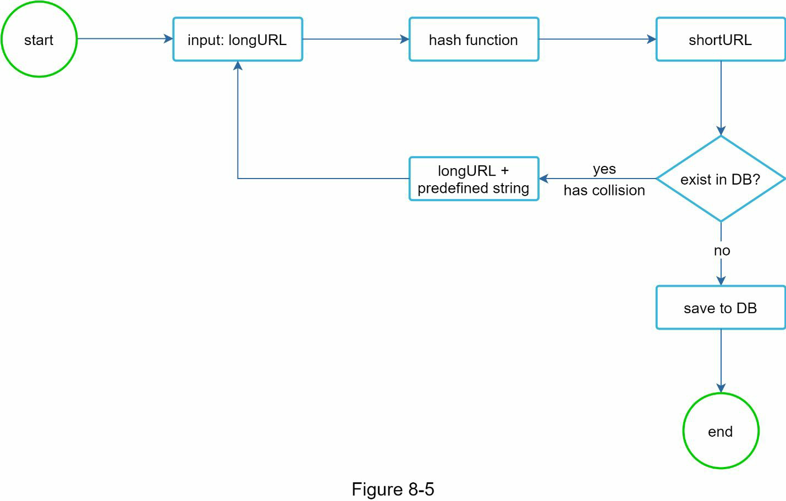
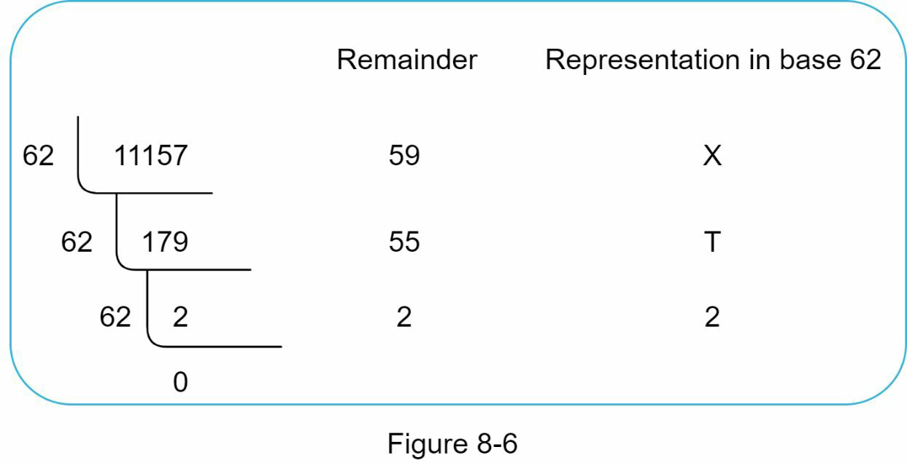
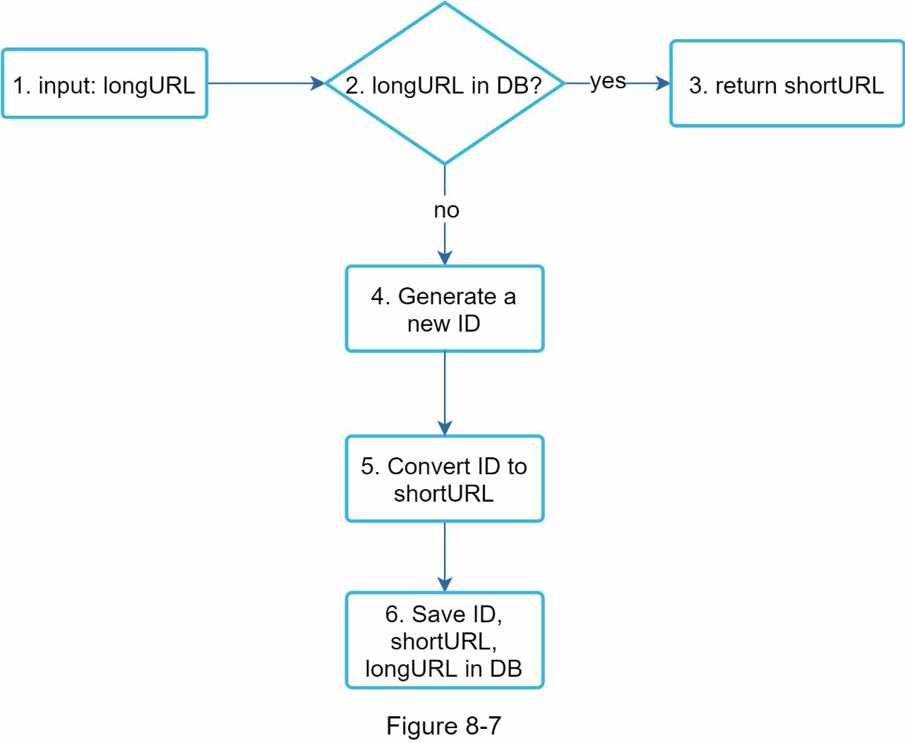
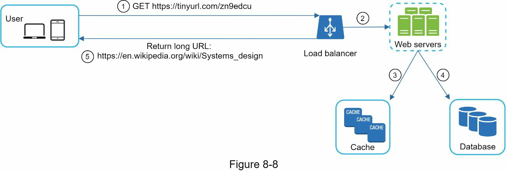

# CHAPTER 8: DESIGN A URL SHORTENER

## Step 1 - Understand the problem and establish design scope

Candidate: Can you give an example of **how a URL shortener work**?\
Interviewer: Assume URL https://www.systeminterview.com/q=chatsystem&c=loggedin&v=v3&l=long is the original URL. Your service creates an alias with shorter length: https://tinyurl.com/ y7keocwj. If you click the alias, it redirects you to the original URL.\
Candidate: What is the **traffic volume**?\
Interviewer: 100 million URLs are generated per day.
Candidate: **How long** is the shortened URL?\
Interviewer: As short as possible.\
Candidate: What characters are allowed in the shortened URL?\
Interviewer: Shortened URL can be a combination of numbers (0-9) and characters (a-z, A- Z).\
Candidate: Can shortened URLs be deleted or updated?\
Interviewer: For simplicity, let us assume shortened URLs cannot be deleted or updated.

**Basic use cases**:
1. **URL shortening**: given a long URL => return a much shorter URL
2. **URL redirecting**: given a shorter URL => redirect to the original URL 
3. **High availability, scalability, and fault tolerance considerations**

High Availability:
- URL shortener services need to be available at all times. Downtime would disrupt link redirection.
- Distributed systems, load balancing, and redundancy ensure high availability.

Scalability:
- As usage grows, the system must handle an increasing number of requests.
- Scalable architectures (e.g., cloud-based solutions) accommodate traffic spikes.

Fault Tolerance:
- Failures happen. Systems should gracefully handle errors, server crashes, or database issues.
- Replication, backups, and failover mechanisms enhance fault tolerance.

Back of the envelope estimation
- Write operation: 100 million URLs are generated per day. 
- Write operation per second: 100 million / 24 /3600 = 1160
- Read operation: Assuming ratio of read operation to write operation is 10:1, read operation per second: 1160 * 10 = 11,600
- Assuming the URL shortener service will run for 10 years, this means we must support 100 million * 365 * 10 = 365 billion records.
- Assume average URL length is 100.
- Storage requirement over 10 years: 365 billion * 100 bytes * 10 years = 365 TB

## Step 2 - Propose high-level design and get buy-in
### API Endpoints
API endpoints facilitate the communication between clients and servers. We will design the APIs REST-style.

1. To create a new short URL, a client sends a POST request, which contains one parameter: the original long URL. The API looks like this:
`POST api/v1/data/shorten`
    - request parameter: {longUrl: longURLString} 
    - return shortURL as a response
2. To redirect a short URL to the corresponding long URL, a client sends a GET request. The API looks like this:
`GET api/v1/shortUrl`
    - Return longURL for **HTTP redirection**

### URL redirecting
When you enter a tinyurl onto the browser, Once the server receives a tinyurl request, it changes the short URL to the long URL with **301 redirect**.

***301 redirect vs 302 redirect***\
**301 redirect** shows that the requested URL is **“permanently”** moved to the long URL. Since it is permanently redirected, the browser caches the response.

**302 redirect** means that the URL is **“temporarily”** moved to the long URL, meaning that subsequent requests for the same URL will be sent to the URL **shortening service first**. Then, they are redirected to the long URL server.

**Server Load and Performance**:
- 301: Since the browser caches the redirection, only the **first request** for the same URL goes to the URL shortening service. Subsequent are redirected to the long URL server directly.
- 302: Each request hits the shortener first, which can increase server load.

**Analytics**:
- 301: Doesn’t track individual clicks after the initial redirect.
- 302: Better for analytics—tracks click rates and sources.

The most intuitive way to implement URL redirecting is to use hash tables. Assuming the hash table stores <shortURL, longURL> pairs, URL redirecting can be implemented by the following:
- Retrieve the long URL from the hash table using the short URL as the key
- Once you get the longURL, perform the URL redirect.

### URL shortening
To create a short URL, we need a hash function `fx`. This function takes a long URL as input and produces a unique `hashValue`. `hashValue = fx(longURL)`

The hash function must satisfy the following requirements: 
- Each longURL must be hashed to one hashValue.
- Each hashValue can be mapped back to the longURL.

## Step 3 - Design deep dive
Up until now, we have discussed the high-level design of URL shortening and URL redirecting. In this section, we dive deep into the following: data model, hash function, URL shortening and URL redirecting.

### Data model
In the high-level design, everything is stored in a hash table. However, this approach is not feasible for real-world systems as memory resources are limited and expensive. A better option is to store <shortURL, longURL> mapping in a **relational database**. The simplified version of the table contains 3 columns: id, shortURL, longURL.

| PK | id (auto increment) |
|----|---------------------|
|    | shortURL            |
|    | longURL             |

### Hash function
Hash function is used to hash a long URL to a short URL, also known as `hashValue`.

#### Hash value length
based on the back of the envelope estimation, we want to create hash values that are long enough to handle a up to 365 billion URLs.

The `hashValue` consists of characters from [0-9, a-z, A-Z], containing 10 + 26 + 26 = 62
possible characters. To figure out the length of `hashValue`, find the smallest `n` such that *62^n
≥ 365 billion*. We need at least `n` characters in our hash value.

Start with a small value of `n` and calculate `62^n`.
Keep increasing n until we reach a value greater than or equal to 365 billion.

| N | Maximum number of URLs |
|---|------------------------|
| 1 | 62^1 = 62              |
| 2 | 62^2 = 3,844           |
| 3 | 62^3 = 238,328         |
| 4 | 62^4 = 14,776,336      |
| 5 | 62^5 = 916,132,832     |
| 6 | 62^6 = 56,800,235,584  |
| 7 | 62^7 = 3,521,614,606,208 = ~3.5 trillion 

#### Hash + collision resolution
To shorten a long URL, we should implement a hash function that hashes a long URL to a **7 character string**. A straightforward solution is to use well-known hash functions like ***CRC32***, ***MD5***, or ***SHA-1***.

As shown in Table 8-2, even the shortest hash value (from CRC32) is too long (more than 7 characters). 
First, we can collect the first 7 characters of a hash value; however, this method can lead to **hash collisions**.

*hash collisions: two or different hashes but when truncated it the first 7 characters could be same `5cb54054`, `5cb5405p`

To solve hash collisions, we can recursively append a new predefined string until no more collision is discovered.

However, It is expensive to query the database to check if a shortURL exists for every request. A technique called bloom filters can improve performance. A bloom filter is a space-efficient probabilistic technique to test if an element is a member of a set. 

#### Base 62 conversion
Base conversion helps to convert the same number between its different number representation systems. Base 62 conversion is used as there are 62 possible characters for hashValue. 

- From its name, base 62 is a way of using 62 characters for encoding. The mappings are:
0-0, ..., 9-9, 10-a, 11-b, ..., 35-z, 36-A, ..., 61-Z, where ‘a’ stands for 10, ‘Z’ stands for 61,
etc.

- 11157[10] = 2 x 622 + 55 x 621 + 59 x 620 = [2, 55, 59] -> [2, T, X] in base 62
representation. 

- Thus, the short URL is https://tinyurl.com/2TX

#### Comparison of the two approaches

| Hash & collision resolution | Base 62 Conversion |
|-----------------------------|--------------------|
| Fixed Short URL length      | The short URL length is not fixed, it goes up with the ID |
| it does not need unique ID generator | this option depends on unique ID generator |
| Collision is possible and must be solved | Collision is impossible because ID is unique |
| it is impossible to figure out the next available short URL because it does not depend on ID | it's easy to figure out the next available short URL if ID increment by 1 for a new entry. This can be security concern

## URL shortening deep dive

1. longURL is the input.
2. The system checks if the longURL is in the database.
3. If it is, it means the longURL was converted to shortURL before. In this case, fetch the
shortURL from the database and return it to the client.
4. If not, the longURL is new. A new unique ID (primary key) Is generated by the unique
ID generator.
5. Convert the ID to shortURL with base 62 conversion.
6. Create a new database row with the ID, shortURL, and longURL.

concrete example:
- Assuming the input longURL is: https://en.wikipedia.org/wiki/Systems_design
- Unique ID generator returns ID: 2009215674938.
- Convert the ID to shortURL using the base 62 conversion. ID (2009215674938) is converted to `zn9edcu`.
- Save ID, shortURL, and longURL to the database:

| id | shortURL | longURL |
|----|-----------|----------|
| 2009215674938 | zn9edcu | https://en.wikipedia.org/wiki/Systems_design |

In a highly distributed environment, implementing a unique ID generator is challenging. -> “Chapter 7: Design A Unique ID Generator in Distributed Systems”.

## URL redirecting deep dive

As there are more reads than writes, `<shortURL, longURL>` mapping is stored in a cache to improve performance.

1. A user clicks a short URL link: https://tinyurl.com/zn9edcu
2. The load balancer forwards the request to web servers.
3. If a shortURL is already in the cache, return the longURL directly.
4. If a shortURL is not in the cache, fetch the longURL from the database. If it is not in the database, it is likely a user entered an invalid shortURL.
5. The longURL is returned to the user.

## Step 4 - Wrap up
a few additional talking points.
- Rate limiter: A potential security problem we could face is that malicious users send an overwhelmingly large number of URL shortening requests. Rate limiter helps to filter out requests based on IP address or other filtering rules. -> “Chapter 4: Design a rate limiter”.
- Web server scaling: Since the web tier is stateless, it is easy to scale the web tier by adding or removing web servers.
- Database scaling: Database replication and sharding are common techniques.
- Analytics: Data is increasingly important for business success. Integrating an analytics solution to the URL shortener could help to answer important questions like how many people click on a link? When do they click the link? etc.
- Availability, consistency, and reliability. These concepts are at the core of any large system’s success. -> Chapter 1