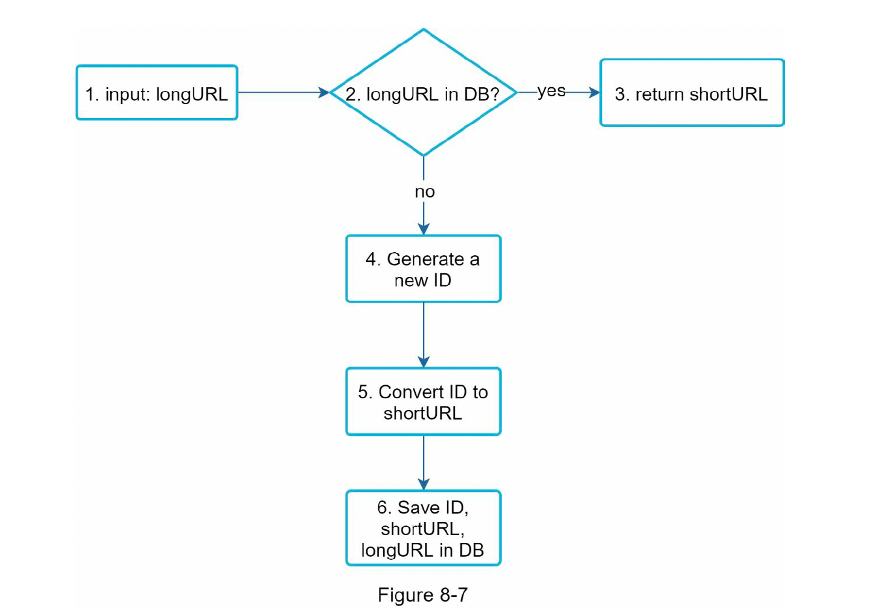

# Chapter 8 : DESIGN A URL SHORTENER

## STEP 1 - Understand the problem and establish design scope

- System design interview 는 딱히 정해진 답을 갖도록 만들어 지지 않음.
- 따라서, 성공적인 질문을 함으로써 모호함을 줄이고 requirement 를 확실하게 아는 것이 중요.

### the basic use cases:

- URL shortening: given a long URL => return a much shorter URL
- URL redirecting: given a shorter URL => redirect to the original URL
- High availability, scalability, and fault tolerance considerations

## STEP 2 - Propose high-level design and get buy-in

### API endpoint

- 2개의 Endpoint 가 필요.
- New Short URL 이 필요한 클라이언트가 URL 을 Parameter 로 넣어야 함.

### URL redirecting

- Short URL 을 받은 서버가 그 url 을 원래 url 로 바꿔서 301 response 로 location header 에 넣어 return 해 주는 로직...(복잡해 보이지만.. 음 그냥 서버에서 url 을 redirecting 해주는 거나 마찬가지다)
- 301 과 302 의 차이점에 대한 설명과 각각 쓰임
- 301은 캐시처리가 좀 되니, 서버 부하가 줄어들고
- 트래픽 분석을 제대로 하려면 302를 쓰는게 좋다

### URL shortening

- Long URL 을 해시값으로 대응시킬 해시 함수가 필요한데, 해시 함수의 요구조건이 아래와 같다.
- Each longURL must be hashed to one hashValue.
- Each hashValue can be mapped back to the longURL.

## Step 3 - Design deep dive

### Data model

- high level 디자인에서 hash table 사용했었는데, 리소스가 많이 들어 실제 시스템에서 사용하기 어려울 수 있음

### Hash function

- original URL 을 short URL 변환하는데 사용
- hashValue 는 [0-9,a-z,A-Z] 의 문자들로 구성
- hashValue 의 길이를 정하기 위해서는 ~3.5 trillion 의 minimum... 이 필요...;

### Hash + collision resolution, Base 62 conversion 를 이용해서 Hash function 구현 가능

- 두개의 차이

    

### URL shortening deep dive

    

1. longURL is the input.
2. The system checks if the longURL is in the database.
3. If it is, it means the longURL was converted to shortURL before. In this case, fetch the
   shortURL from the database and return it to the client.
4. If not, the longURL is new. A new unique ID (primary key) Is generated by the unique
   ID generator.
5. Convert the ID to shortURL with base 62 conversion.
6. Create a new database row with the ID, shortURL, and longURL.

### ID Generator

- Short URL 을 만들 때 사용할 id 생성기, unique 해야 한다.

### URL redirecting deep dive

1. A user clicks a short URL link
2. The load balancer forwards the request to web servers.
3. If a shortURL is already in the cache, return the longURL directly.
4. If a shortURL is not in the cache, fetch the longURL from the database. If it is not in the
   database, it is likely a user entered an invalid shortURL.
5. The longURL is returned to the user.

