# Chapter 8: Design a URL shortener
Designing a URL shortening service like tinyurl

## Step1 - Understand the problem and establish design scope

### Possible Questions
- Can you give an example of how a URL shortener work?
- What is the traffic volume?
- How long is the shortened URL?
- What chracters are allowed in the shortened URL?
- Can shortened URLs be deleted or updated?

### Possible assumptions
- https://www.systeminterview.com/q=abc?c=logged.... => https://tinyurl.com/y7keojw
- 100 million URLs are generated per day
- As short as possible
- Shortened URL can be a combination of numbers (0-9) and characters(a-z, A-Z)
- Cannot be deleted or updated
  
### Basic use cases
- URL shortening: given a long URL -> return a much shorter URL
- URL redirecting: given a shorter URL -> redirect to the original URL
- High availability, scalability, and fault tolerance considerations

### Back of the envelope estimation
- Write operation : 100 million URLs are generated per day
- Write operation per second: 100 milliion / 24 / 3600 = 1160
- Read operation : Assume the ratio r/w = 10:1, read operation per second = 1160 * 10 = 11600
- Assuming the URL shortener service will run for 10 years, this means we must support 100 million * 365 * 10 = 365 billion records
- Assume average URL length is 100
- Storage requirement over 10 years : 365 billion * 100 byetes * 10 years = 365 TB

## Step 2 - Propose high-level design and get buy-in
- API endpoints, URL redirecting, and URL shortening flows

### API Endpoints
- Design the APIs REST-style
- Two API endpoints
  - URL shortening
    - To create a new Short URL
    - A client sends a POST request with one parameter : the original long URL
    ```
    POST api/v1/data/shorten
    - request parameter: {longURL: longURLString}
    - return shortURL
    ```
  - URL redirecting
    - To redirect a short URL to the corresponding long URL
    - A client sends a get request 
    ```
    GET api/v1/shortURL
    - return longURL for HTTP redirection
    ```

### URL redirecting
- Workflow for tinyurl onto the browser
- The server receives a tinyurl request, it changes the short URL to the long URL with 301 redirect
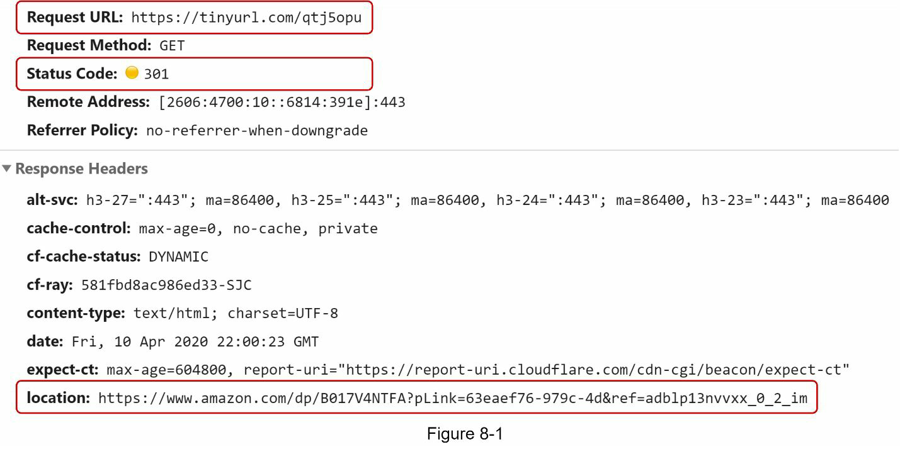

- Detailed communication between clients and servers 
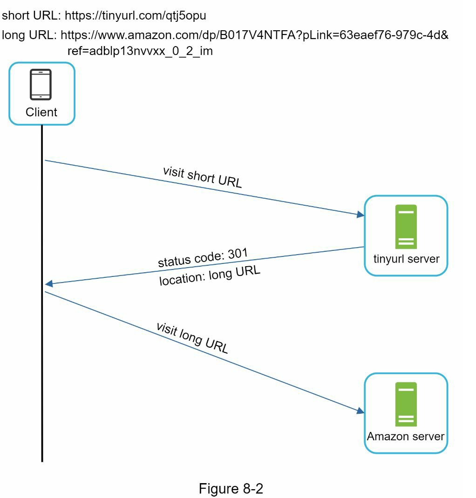

- 301 redirect vs 302 redirect
  - 301 redirect
    - The requested URL is "permanently" moved to the long URL
    - The browser caches the response, and subsequent requests for the same URL will not be sent to the URL shortening service.
    - Requests are redirected to the long server directly
    - When the priority is to reduce the server load, using 301 redirect is good option
  - 302 redirect
    - The URL is "temporarily" moved to the long URL
    - Subsequent requests for the same URL will be sent to the shortening service first.
    - If analytic is important, 302 is a better choice as it can track click rate and source of the click more easily.

### URL shortening
- The most intuitive way to implement URL redirecting is to use hash tables
- Assuming the hash table stores <shortURL, longURL> pairs.
  - Get longURL: longURL = hashTable.get(shortURL)
  - Once you get the longURL, perform the URL redirect

- Assume the short URL looks like this : www.tinyurl.com/{hashValue}
- Hash function fx that maps a long URL to the hashValue

- The fash function requirement
  - Each longURL must be hashed to one hashValue
  - Each hashValue can be mapped back to the long URL

## Step 3 - Design deep dive

### Data model
- In the high-level design, everything is stored in a hash table. 
  - Good starting point
  - But this approach is not feasible for real-world systems as memory resources are limited and expensive
  - A better option is to store <shortURL, longURL> mapping in a relational database

- Simplified version of the table contains 3 columns: id, shortURL, longURL
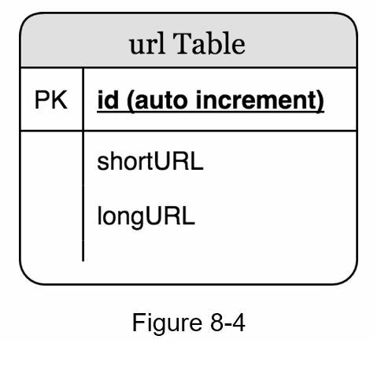

### Hash function
- Hash function is used to hash a long URL to a short URL, also known as hashValue

#### Hash Value length
- Characters from [0-9,a-z,A-Z], containing 10 + 26 + 26 = 62 possible characters
- The length of hashValue
  - If the length n, then find the samllest n such that 62^n >= 365 billion
- Table shows the length of hashValue and the corresponding maximal number of URLs it can support
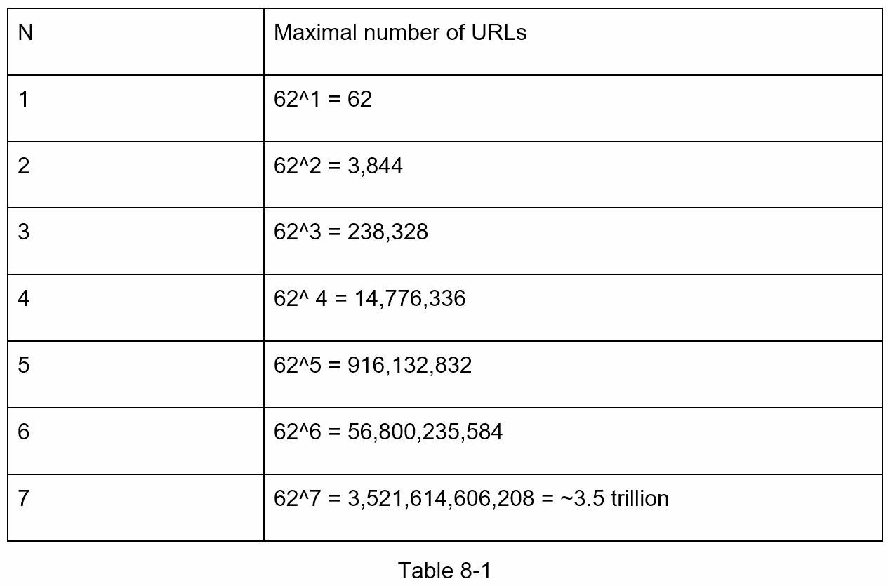
- when n = 7, 62^n = ~3.5 trillion, 3.5 trillion is more than enough to hold 365 billion URLs
- The lenght of hashValue is 7
- Two types of hash functions for a URL shortener
  - Hash + collision resolution
  - base 62 conversion

#### Hash + collision resolution
- Hash function that hashes a long URL to 7 character string
- A straightfoward solution is to use well-known hash function like CRC32, MD5 or SHA-1
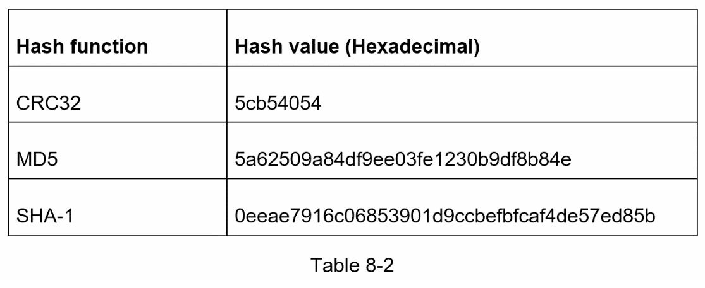
- Even the shortest hash value (from CRC32) is too long(more than 7 characters)
- How can we make it shorter?
  
##### First solution
- Collect the first 7 characters of a hash value
- This method can lead to ahsh collisions
- Resolve hash collision
  - Recursively append a new predefined string until no more collision is discovered
  - It's expensive to query the database to check if a shortURL exists for every request
  - Bloom filters can improve performance

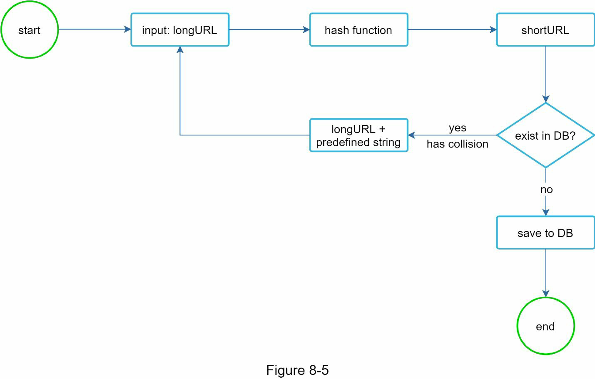

#### Base62 Conversion
- Another approach commonly used for URL shorteners
- Base conversion help to convert the same number between its different number representation system
- Base62 conversion is used as there are 62 possible characters for hashValue
- Convert 11157(10 represents) to 62 representation
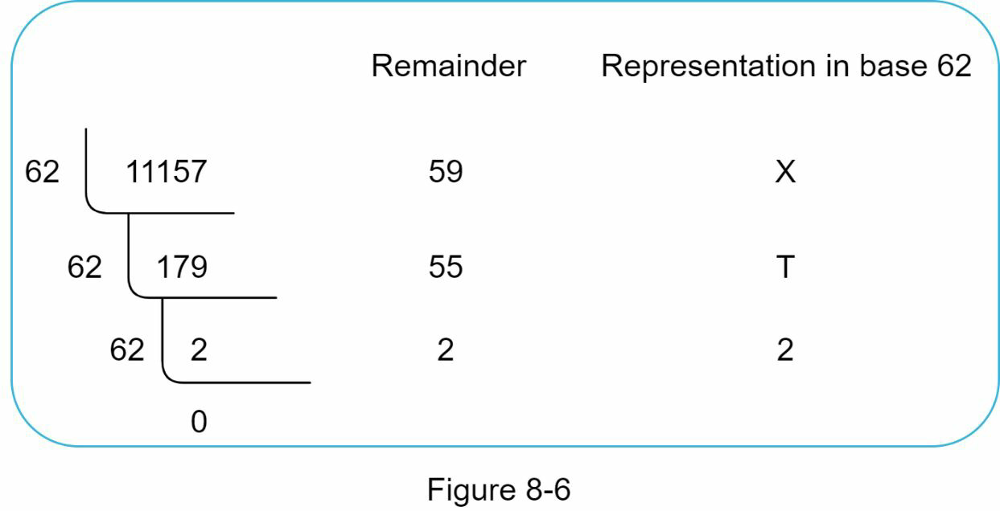
  - 62 possible characters is used for encoding
  - mapping like 0-0, ..., 9-9, 10-a, ... 35-z, 36-A, ..., 61-Z
  - 11157(10 represents) = 2 x 62^2 + 55 x 62 + 59 = [2, 55, 59] -> [2 , T, X] in base 62
  - https://tinyurl.com/2TX
#### Comparison of the two approaches
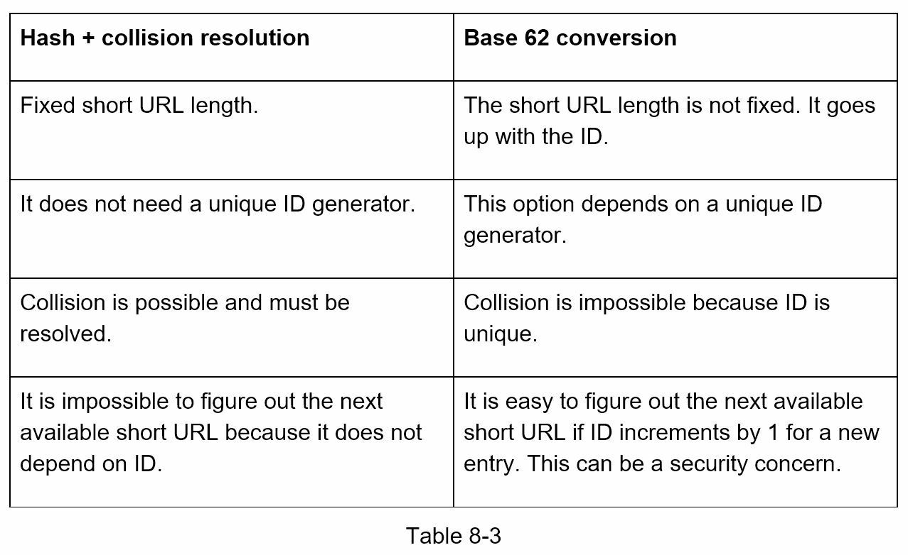

### URL shortening deep dive
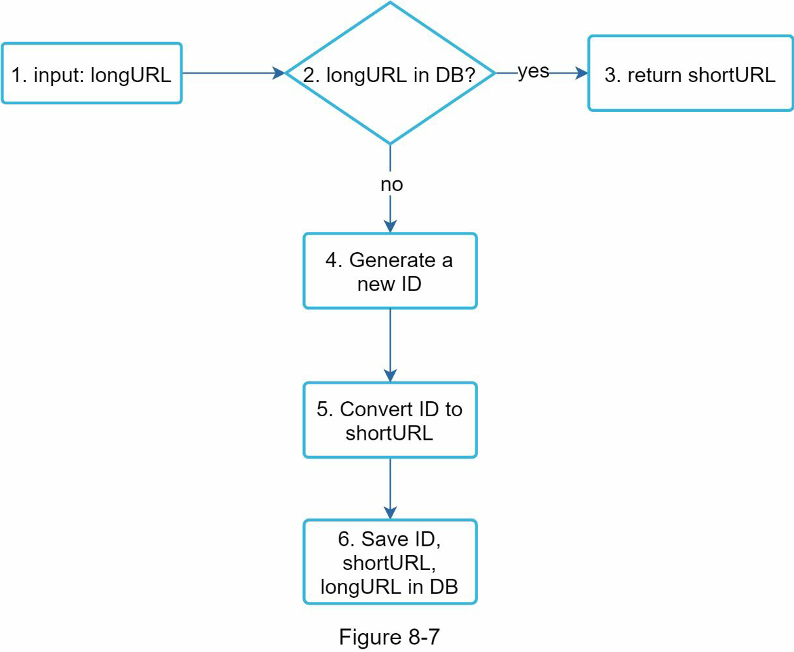
1. LongURL is the input
2. The system checks if the longURL is in the database
3. It it is, it means the longURL was converted to shortURL before. In this case, fetch the shortURL from the database and return it to the client
4. If not, the long URL is new. A new uniqueID(primary key) is generated by the unique ID generator
5. Convert the ID to shortURL with base 62 conversion
6. Create a new database row with the ID, shortURL, and longURL
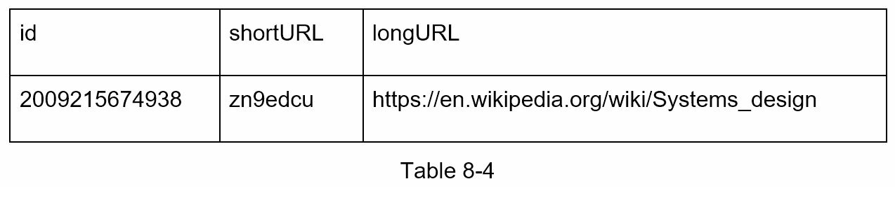

##### Distributed unique ID generator
- The primary function is to generate globally unique IDs

### URL redirecting deep dieve
- Detail design of URL redirecting
- As there are more reads than writes <shortURL, longURL> mapping is stored in a cache to improve performance
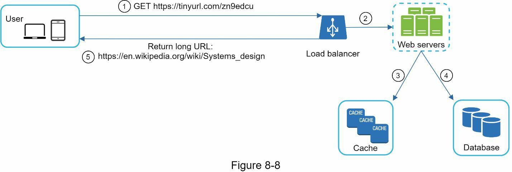
1. A user clicks a short URL
2. If a shortURL is already in the cache, return the longURL
3. If a shortURL is not in the cache, fetch it from the database. If it is not in the DB, it's likely a user entered an invalid shortURL
4. The longURL is returned to the user

## Step 4 - Wrap up
- Possible addtional talking points
  - Rate limiter
  - Web server scaling
  - Database scaling
  - Analytics
  - Availability, consistency, reliability