### CHAPTER 8: DESIGN A URL SHORTENER

#### Step 1 - Understand the problem and establish design scope
Back of the envelope estimation
- Write operation: 100 million URLs are generated per day.
- Write operation per second: 100 million / 24 /3600 = 1160
- Read operation: Assuming ratio of read operation to write operation is 10:1, read
operation per second: 1160 * 10 = 11,600
- Assuming the URL shortener service will run for 10 years, this means we must support
100 million * 365 * 10 = 365 billion records.
- Assume average URL length is 100.
- Storage requirement over 10 years: 365 billion * 100 bytes * 10 years = 365 TB

#### Step 2 - Propose high-level design and get buy-in

##### API Endpoint
1. URL shortening.
POST api/v1/data/shorten
- request parameter: {longUrl: longURLString}
-  return shortURL
2. URL redirecting.
GET api/v1/shortUrl
- Return longURL for HTTP redirection

##### URL redirecting
when you enter a tinyurl onto the browser. Once the server receives a tinyurl request, it changes the short URL to the long URL with 301 redirect.
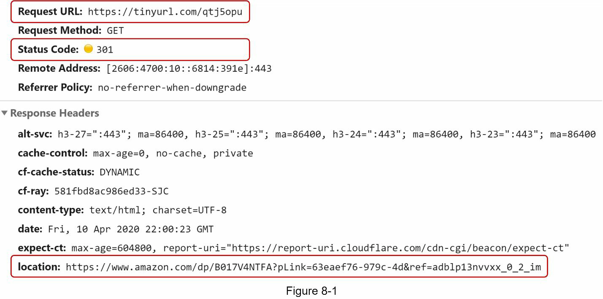
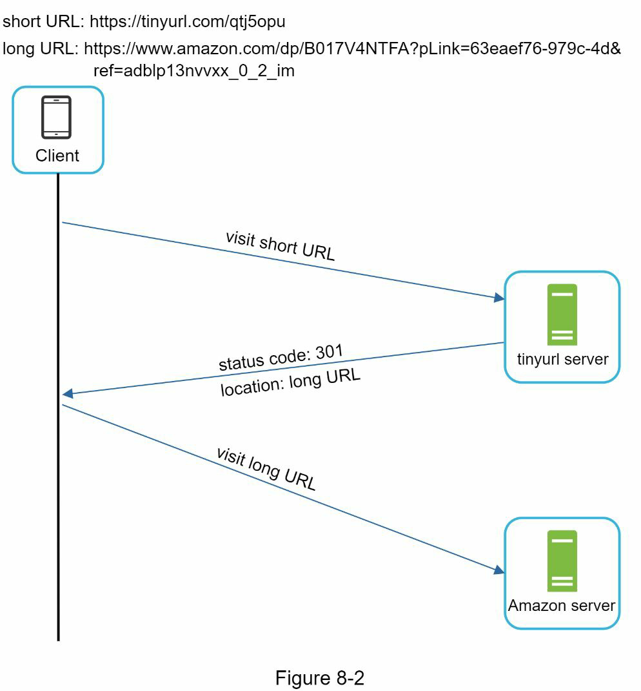
301 redirect. A 301 redirect shows that the requested URL is “permanently” moved to the long URL. -> Cashed and no longer request to URL shortening service
302 redirect. A 302 redirect means that the URL is “temporarily” moved to the long URL

hash table stores <shortURL, longURL> pairs
- Get longURL: longURL = hashTable.get(shortURL)
- Once you get the longURL, perform the URL redirect.

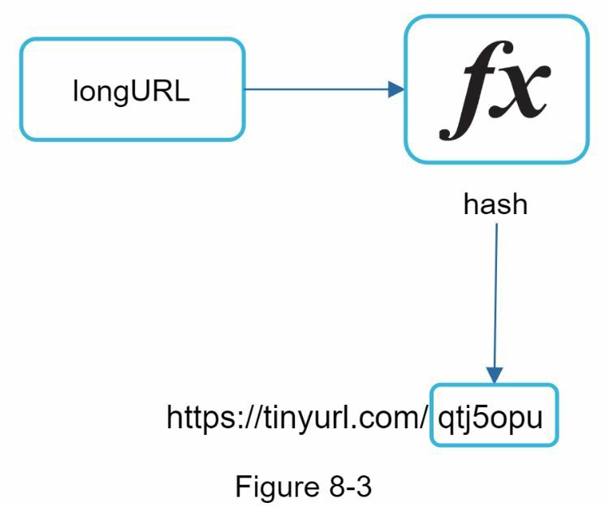
The hash function must satisfy the following requirements:
- Each longURL must be hashed to one hashValue.
- Each hashValue can be mapped back to the longURL.

#### Step 3 Design deep dive
##### Data Model
Storoing everything in a hash table is not feasible for real-world systems as memory resources are limited and expensivebe. tter option is to store <shortURL, longURL> mapping in a relational database
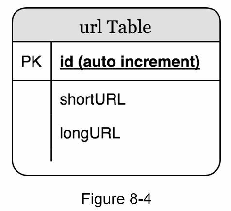

##### Hash Function
[0-9, a-z, A-Z], containing 10 + 26 + 26 = 62
possible characters. To figure out the length of hashValue, find the smallest n such that 62^n ≥ 365 billion. The system must support up to 365 billion URLs based on the back of the envelope estimation

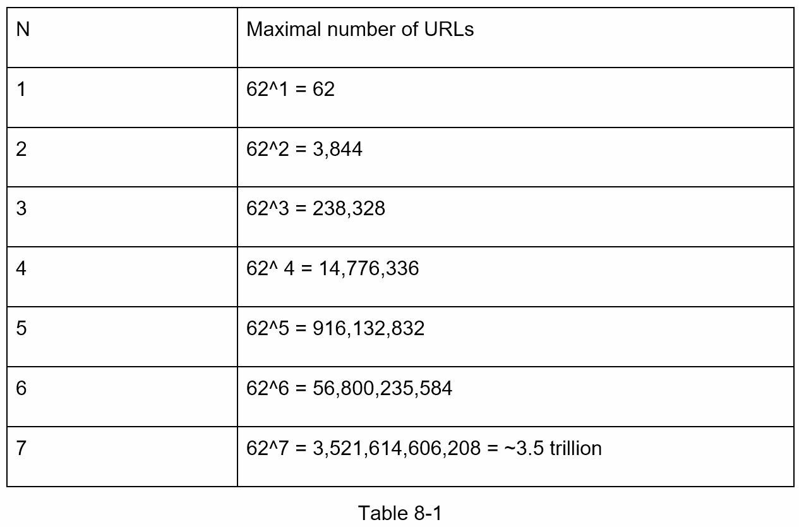

##### Hash + collision resolution
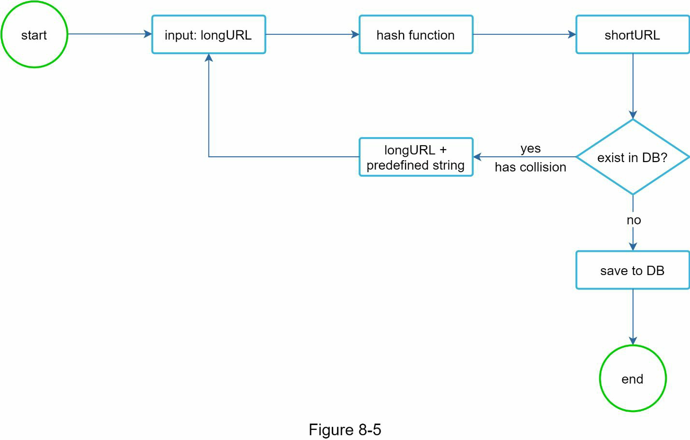
A technique called bloom filters can improve
performance. A bloom filter is a space-efficient probabilistic technique to test if an element is
a member of a set. 

##### Base 62 conversion
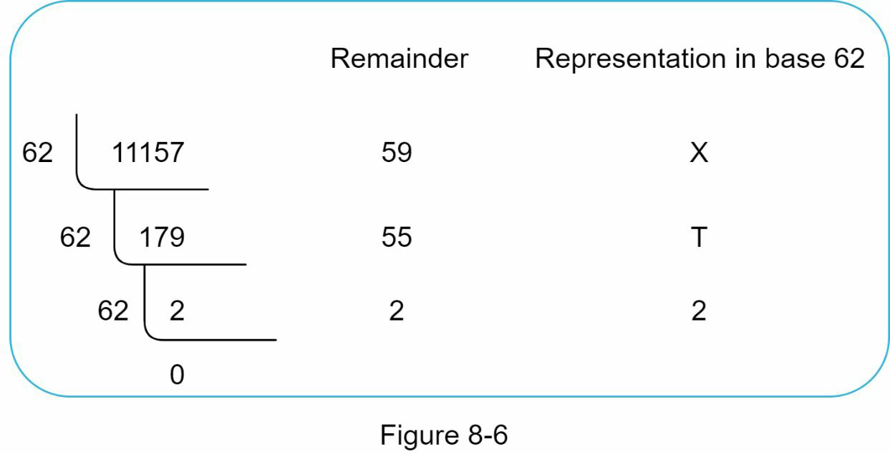

##### Comparison of the two approaches
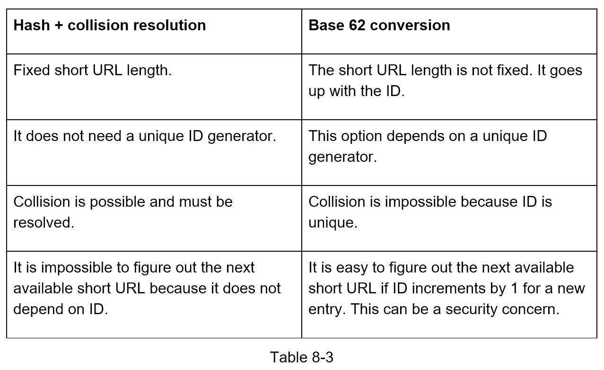

##### URL shortening deep dive
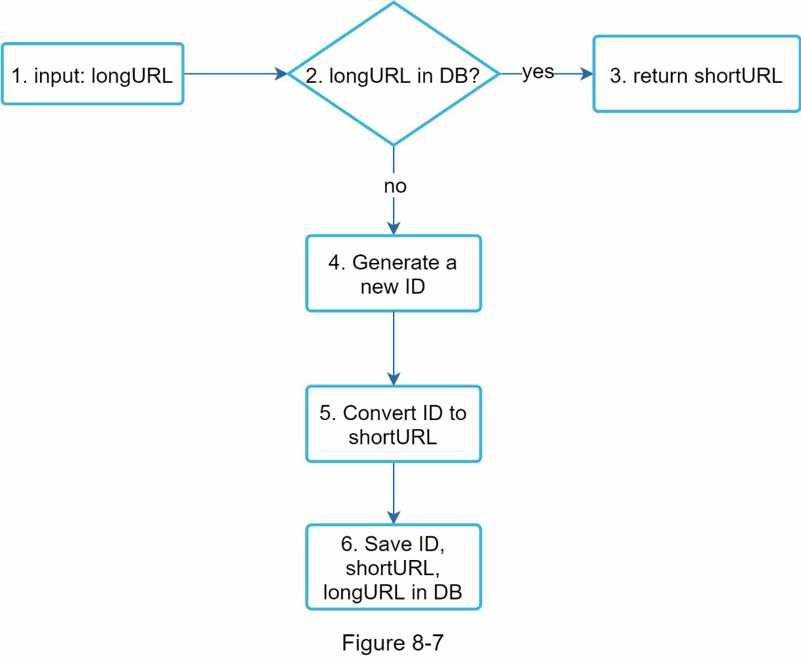
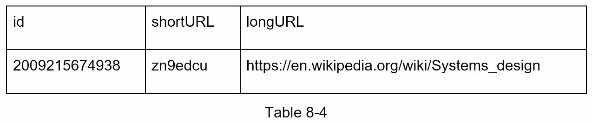

##### URL redirecting deep dive
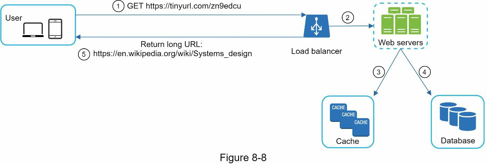
The flow of URL redirecting is summarized as follows:
1. A user clicks a short URL link: https://tinyurl.com/zn9edcu
2. The load balancer forwards the request to web servers.
3. If a shortURL is already in the cache, return the longURL directly.
4. If a shortURL is not in the cache, fetch the longURL from the database. If it is not in the
database, it is likely a user entered an invalid shortURL.
5. The longURL is returned to the user.

#### Step 4 - Wrap up
If there is extra time at the end of the interview, here are a few additional talking points.
- Rate limiter: A potential security problem we could face is that malicious users send an overwhelmingly large number of URL shortening requests. Rate limiter helps to filter out requests based on IP address or other filtering rules. If you want to refresh your memory
about rate limiting, refer to “Chapter 4: Design a rate limiter”.
- Web server scaling: Since the web tier is stateless, it is easy to scale the web tier by adding or removing web servers.
- Database scaling: Database replication and sharding are common techniques. 
- Analytics: Data is increasingly important for business success. Integrating an analytics solution to the URL shortener could help to answer important questions like how many people click on a link? When do they click the link? etc.
- Availability, consistency, and reliability. These concepts are at the core of any large system’s success. We discussed them in detail in Chapter 1, please refresh your memory on these topics.