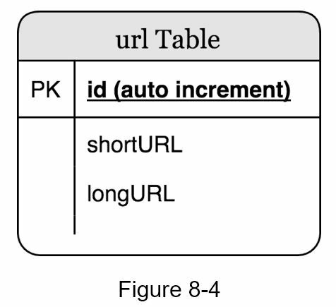
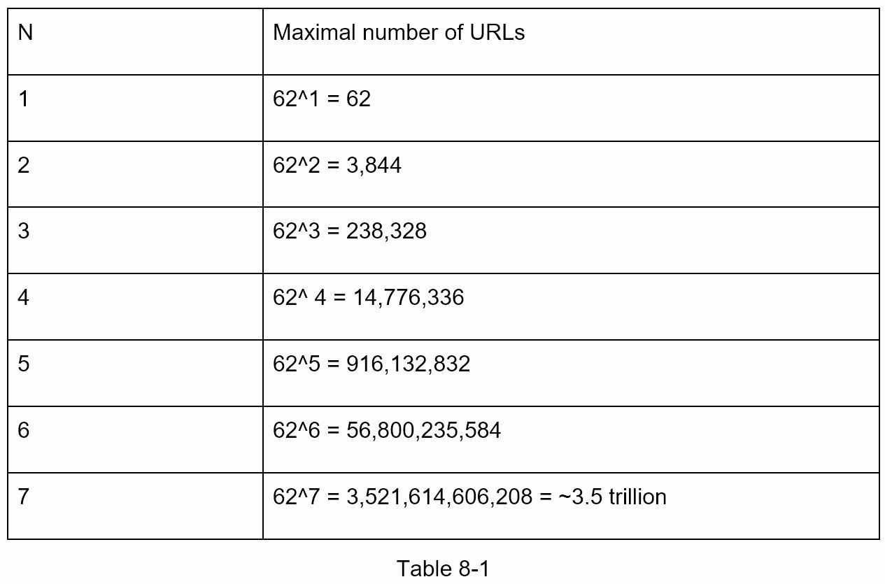
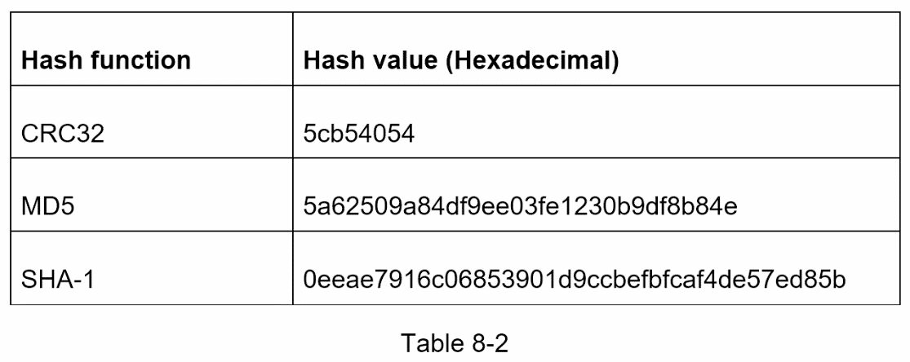
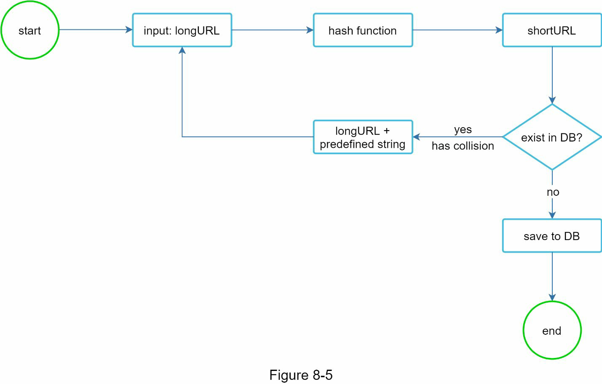
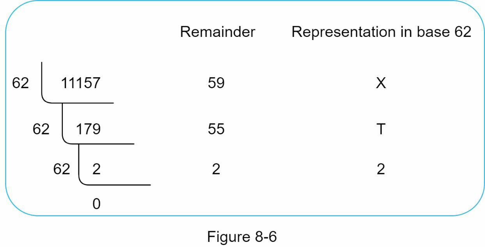
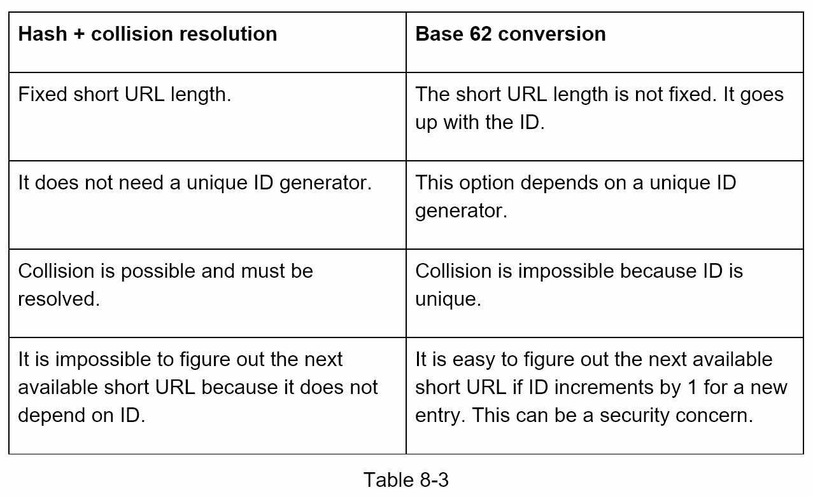
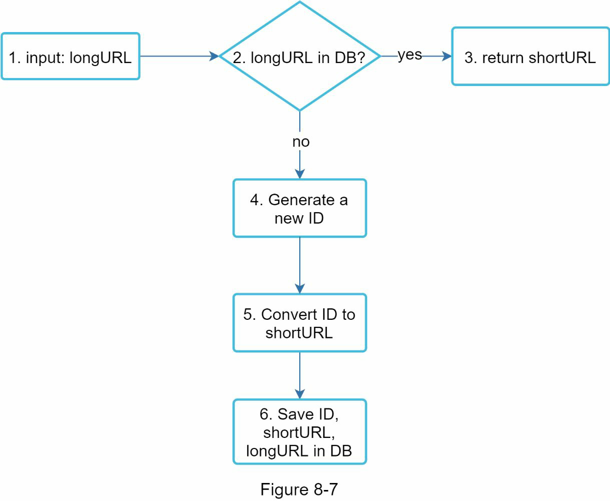
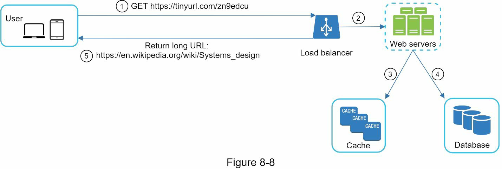

# Step 1 - Understanding the problem

- Traffic volume
  - 100 mil URLs per day
- How long is URL?
  - As short as possible
- What characters are allowed in the shortened URL?
  - combination of numbers and characters
- Can it be deleted or updated?
  - No

- Basic use cases
  1. URL shortening: given a long URL => return a much shorter URL
  2. URL redirecting: given a shorter URL => redirect to the original URL
  3. High availability, scalability, and fault tolerance considerations

## Back of the envelop estimation
- Write operation: 100 million URLs are generated per day
- Write operation per second: 100 million / 24 /3600 = 1160
- Read operation: Assuming ratio of read operation to write operation is 10:1, read operation per second: 1160 * 10 = 11,600
- Assuming the URL shortener service will run for 10 years, this means we must support 100 million * 365 * 10 = 365 billion records.
- Assume average URL length is 100.
- Storage requirement over 10 years: 365 billion * 100 bytes * 10 years = 365 TB

# Step 2 - Propose high-leve design

## API endpoints
- URL shortening.: POST api/v1/data/shorten
- URL redirecting: GET api/v1/shortUrl

## URL redirecting
- 301 VS 302 redirect
  - 301 is "permanently” => reduce server load
  - 302 is "temporarily" => improve analytics

## URL shorening
The requirements of hash function:
- Each longURL must be hashed to one hashValue.
- Each hashValue can be mapped back to the longURL.

# Step3 - Design deep dive
## Data model
- Use RDBMS. 

## Hash function

- Relationship between the length of hash value and the max number of URLs

- Hash + collision resolution

- Use bloom filter to optimize DB query to check duplicates

## Base 62 conversion

- Comparison of the two approaches(hash VS base 62)

## URL shortening deep dive

- Assuming the input longURL is: https://en.wikipedia.org/wiki/Systems_design
- Unique ID generator returns ID: 2009215674938.
- Convert the ID to shortURL using the base 62 conversion. ID (2009215674938) is
- converted to “zn9edcu”.
- Save ID, shortURL, and longURL to the database

* Refer to "Design A Unique ID Generator in Distributed Systems"

## URL redirecting deep dive

# Step 4 - Wrap up

- A few additional talking points
  - Rate limiter
  - Server scaling
  - DB scaling(replication and sharding)
  - Analytics
  - Availability, consistency, reliability
